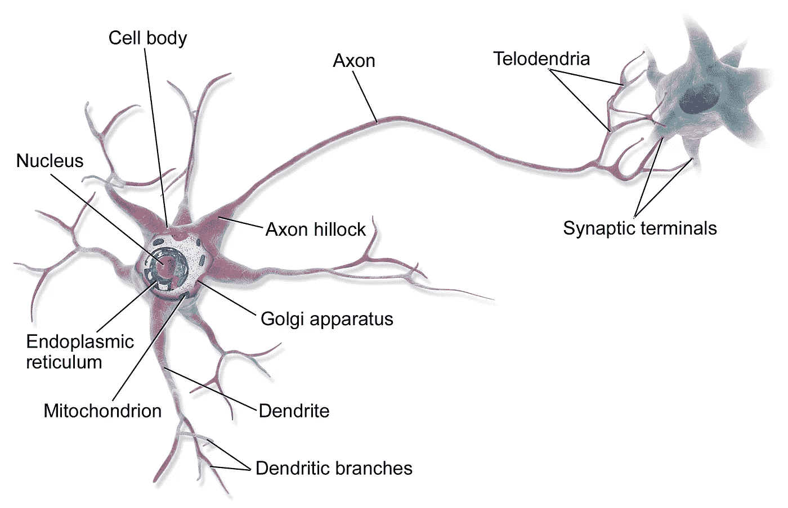
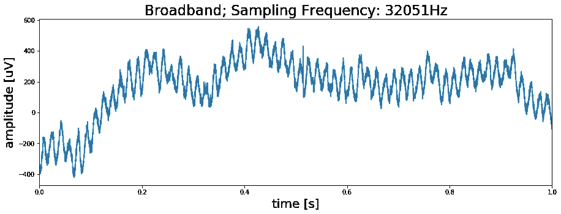
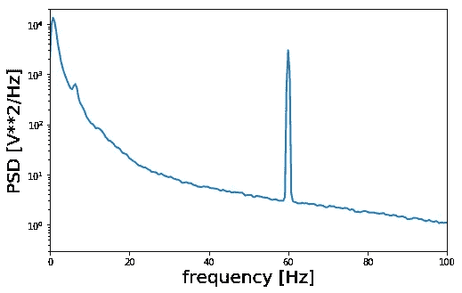
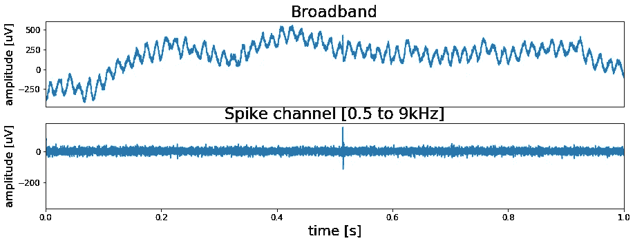
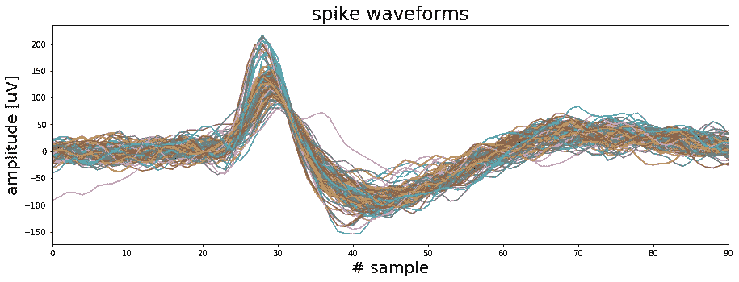

# 利用信号处理提取 Python 中的神经事件——锋电位排序

> 原文：<https://towardsdatascience.com/using-signal-processing-to-extract-neural-events-in-python-964437dc7c0?source=collection_archive---------13----------------------->


生物神经网络，如人脑，由称为神经元的特殊细胞组成。有各种类型的神经元，但它们都基于相同的概念。被称为神经递质的信号分子在突触(两个神经元之间的连接点)释放。神经递质通过与细胞膜内的离子通道相互作用来改变突触后细胞的膜电位。如果突触后细胞的去极化足够强，就会在轴突小丘产生动作电位。动作电位将沿着轴突传播，并触发神经递质释放到突触间隙中，这将影响下一个神经元的膜电位。通过这种方式，信号可以通过(整个)网络从一个细胞传递到下一个细胞，动作电位是突触释放神经递质的触发器。神经通信本质上是电化学的，知道何时以及在何种条件下产生动作电位可以对大脑的工作提供有价值的见解。



By BruceBlaus [CC BY 3.0 ([https://creativecommons.org/licenses/by/3.0](https://creativecommons.org/licenses/by/3.0))], from Wikimedia Commons

但是研究活体大脑中单个神经元的活动是一项具有挑战性的任务。没有一种非侵入性的方法可以在单细胞水平上实时监测神经活动。通常在大脑中插入一个电极来记录其附近的电活动。在这些类型的电生理记录中，动作电位表现为快速高振幅尖峰。但是由于神经元在大脑中密集分布，记录电极通常一次会从不止一个神经元上获得尖峰信号。因此，如果我们想了解单个神经元的行为，我们需要从记录中提取尖峰信号，并检查它们是由一个还是潜在的几个神经元产生的。从数据中提取尖峰并对其进行聚类被称为尖峰排序。在下文中，我们将概述从原始数据中提取单个尖峰并将它们准备用于尖峰排序的过程。

## 入门指南

所以首先我们需要数据。Matlab 有一个流行的尖峰排序算法叫做[波簇](https://www2.le.ac.uk/centres/csn/software)。在其网页的[数据部分，他们提供了一个测试数据集，我们将在这里使用。根据网页上提供的信息，该录音长约 30 分钟，来自一名癫痫患者。数据存储在。 *ncs* 文件，这是制造记录系统的公司的数据格式。因此，如果我们想将记录读入 Python，我们需要了解数据是如何存储的。关于*有详细的描述。公司*](https://www2.le.ac.uk/centres/csn/software)*[网页](https://neuralynx.com/software/NeuralynxDataFileFormats.pdf)上的 ncs* 文件格式，我们可以用它来导入文件:

```
>>> # Define data path
>>> data_file = './UCLA_data/CSC4.Ncs'>>> # Header has 16 kilobytes length
>>> header_size   = 16 * 1024>>> # Open file
>>> fid = open(data_file, 'rb')>>> # Skip header by shifting position by header size
>>> fid.seek(header_size)>>> # Read data according to Neuralynx information
>>> data_format = np.dtype([('TimeStamp', np.uint64),
>>>                         ('ChannelNumber', np.uint32),
>>>                         ('SampleFreq', np.uint32),
>>>                         ('NumValidSamples', np.uint32),
>>>                         ('Samples', np.int16, 512)])>>> raw = np.fromfile(fid, dtype=data_format)>>> # Close file
>>> fid.close()>>> # Get sampling frequency
>>> sf = raw['SampleFreq'][0]>>> # Create data vector
>>> data = raw['Samples'].ravel()
```

在上面的代码中我们可以看到*。ncs* 文件还包含一些关于录音的附加信息。最重要的是，采样频率告诉我们每秒记录了多少数据点。有了采样频率和数据中的样本数，我们现在可以创建一个时间向量，以便绘制信号随时间的变化图。下面的代码将做到这一点，并绘制信号的第一秒。

```
>>> # Determine duration of recording in seconds
>>> dur_sec = data.shape[0]/sf>>> # Create time vector
>>> time = np.linspace(0, dur_sec,data.shape[0])>>> # Plot first second of data
>>> fig, ax = plt.subplots(figsize=(15, 5))
>>> ax.plot(time[0:sf], data[0:sf])
>>> ax.set_title('Broadband; Sampling Frequency: {}Hz'.format(sf), >>>               fontsize=23)
>>> ax.set_xlim(0, time[sf])
>>> ax.set_xlabel('time [s]', fontsize=20)
>>> ax.set_ylabel('amplitude [uV]', fontsize=20)
>>> plt.show()
```



好吧，我们看到尖峰了吗？…不，我们没有。但是我们确实在数据中看到了某种有节奏的活动。那么这是一个有意义的信号吗？同样，答案是否定的。如果我们要计算第一秒数据中的峰值数量，我们最终会得到 60 个峰值，这意味着我们看到的是 60 Hz 的振荡。我们可以通过绘制信号的功率谱来进一步证实这一点，该功率谱在 60 Hz 处显示出清晰的峰值。



我们在看什么？在我们获得数据的网页上说录音来自伊扎克·弗里德在美国加州大学洛杉矶分校的实验室。美国的供电频率是 60 Hz。因此，我们看到的实际上是数据收集期间房间内电子设备发出的电噪声。

## 找到信号中的尖峰

即使数据中有 60 Hz 噪声，我们仍然可以处理它。幸运的是，动作电位是只持续 1 到 2 毫秒的快速事件。因此，我们可以在排除 60 Hz 噪声的范围内对原始宽带信号进行滤波。典型的滤波器设置为 500 至 9000 Hz，我们的 Python 实现如下所示:

```
>>> # Import libarys
>>> from scipy.signal import butter, lfilter>>> def filter_data(data, low=500, high=9000, sf, order=2):
>>>     # Determine Nyquist frequency
>>>     nyq = sf/2>>>     # Set bands
>>>     low = low/nyq
>>>     high = high/nyq>>>     # Calculate coefficients
>>>     b, a = butter(order, [low, high], btype='band')>>>     # Filter signal
>>>     filtered_data = lfilter(b, a, data)
>>>    
>>>     return filtered_data
```

用上述函数处理数据将得到信号的高频带或尖峰通道。我们的期望是，该棘波通道包含动作电位，并且不再有 60 Hz 噪声。让我们看看滤波后的尖峰通道，并将其与原始宽带信号进行比较。



正如所料，尖峰通道不再显示 60 赫兹的振荡。最重要的是，我们终于可以看到记录中的第一个尖峰。在记录开始大约 0.5 秒时，它在过滤数据中清晰可见。同样，既然我们现在看哪里，我们可以在未过滤的数据中看到它。然而，由于 60 赫兹的噪音，它更难被发现。

## 从信号中提取尖峰信号

既然我们已经将高频尖峰信号带从噪声低频带中分离出来，我们就可以提取单个尖峰信号。为此，我们将编写一个简单的函数来执行以下操作:

1.  找到信号中高于特定阈值的数据点
2.  围绕这些事件定义一个窗口，并“将它们剔除”
3.  将它们对准它们的峰值振幅

此外，我们还将定义一个上限。高于该阈值的数据点将被拒绝，因为它们可能是高频伪影。这种伪影可能是由于患者的移动而产生的，或者可能反映了电气事件，如打开或关闭房间中的灯泡。可以详细看看 [Jupyter 笔记本](https://github.com/akcarsten/akcarsten.github.io/blob/master/spike_sorting/Spike_sorting%20.ipynb)里的尖刺提取功能。这里我们只看一下用我们的函数从信号中提取的 100 个随机尖峰。



在上图中，我们可以看到数据中至少有两种类型的波形。一组尖峰具有尖锐的高振幅峰值，第二组具有较宽的初始峰值。所以这些尖峰信号很可能是由不止一个神经元产生的。因此，下一个任务是找到一种将波形分组到不同簇的方法。但是因为这不能用两三行来编码或解释，我们将在下一篇文章[中看到尖峰排序的主题。](/whos-talking-using-k-means-clustering-to-sort-neural-events-in-python-e7a8a76f316)

同时，你可以在这里查看完整的代码[，在](https://github.com/akcarsten/spike_sorting) [Twitter](https://twitter.com/ak_carsten) 上关注我或者通过 [LinkedIn](https://www.linkedin.com/in/carsten-klein/) 联系我。

这个项目的代码可以在 [Github](https://github.com/akcarsten/spike_sorting) 上找到。

[](https://github.com/akcarsten/spike_sorting) [## akcarsten/spike _ 排序

### 在 GitHub 上创建一个帐户，为 akcarsten/spike_sorting 开发做贡献。

github.com](https://github.com/akcarsten/spike_sorting)