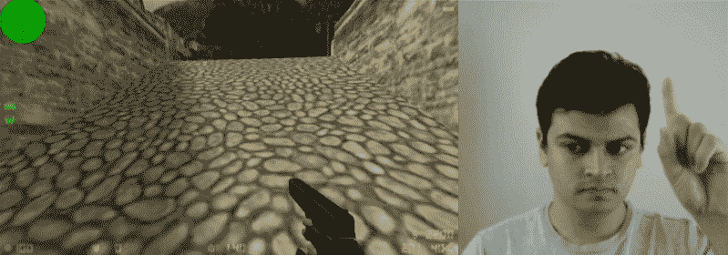
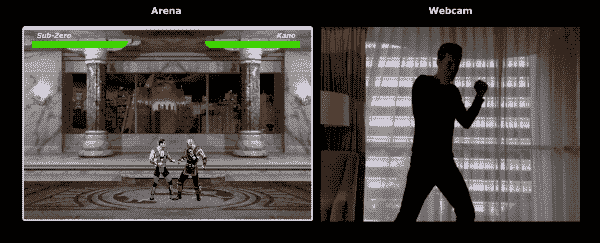
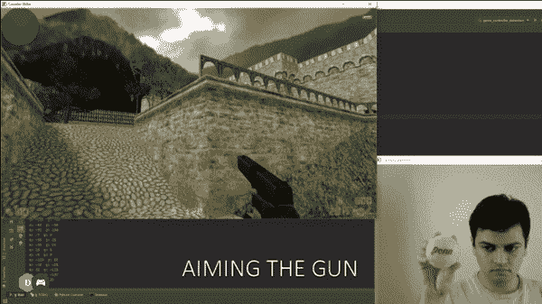
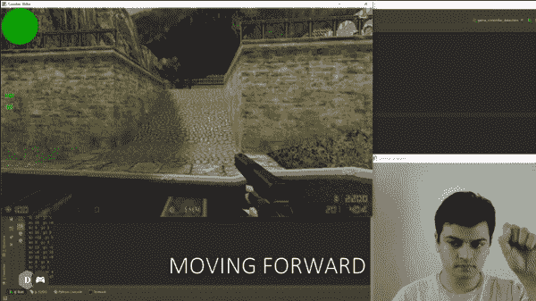
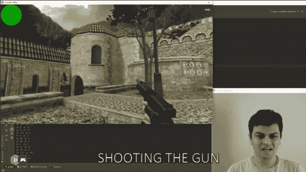
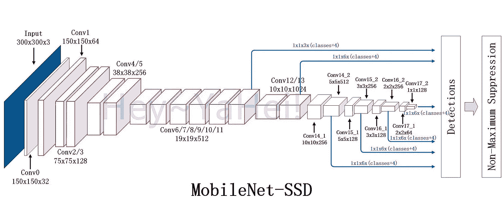

# 使用 Tensorflow 对象检测控制第一人称射击游戏

> 原文：<https://towardsdatascience.com/using-tensorflow-object-detection-to-control-first-person-shooter-games-c2c7f1daf2e9?source=collection_archive---------8----------------------->

## 在这篇文章中，我将解释我如何使用 tensorflow 的对象检测模型来玩经典的 FPS 游戏《反恐精英》。

Playing Counter Strike with my webcam recording and a Tensorflow Object Detection model.

不久前，我偶然发现了[这个非常有趣的项目](https://blog.mgechev.com/2018/10/20/transfer-learning-tensorflow-js-data-augmentation-mobile-net/)，在这个项目中，文章作者使用一个网络摄像头来玩名为真人快打的经典格斗游戏。他利用卷积神经网络和递归神经网络的组合来从他的网络摄像头记录中识别踢和打的动作。然后，他将模型的预测转化为游戏中要采取的适当行动。玩游戏的方式真的很酷！

Playing Mortal Kombat with webcam and deep learning. Original article can be found [here](https://blog.mgechev.com/2018/10/20/transfer-learning-tensorflow-js-data-augmentation-mobile-net/).

以此为灵感，我创建了一个类似的控制器界面，可以使用 Tensorflow 对象检测模型的预测来玩第一人称射击游戏。

这个项目的代码可以在我的 [Github 页面](https://github.com/ChintanTrivedi)上找到，下面也有链接。

 [## ChintanTrivedi/DeepGamingAI _ FPS

### 一款使用网络摄像头和深度学习来玩游戏的 FPS 游戏控制器——ChintanTrivedi/DeepGamingAI _ FPS

github.com](https://github.com/ChintanTrivedi/DeepGamingAI_FPS) 

该控制器设计用于处理游戏中的以下动作:-

**1。瞄准枪**

首先，为了在游戏中环视四周，我在一个网球上使用了对象检测。根据屏幕上检测到的球的位置，我们可以设置鼠标的位置，这反过来控制我们的玩家在游戏中的目标。

**2。移动播放器**

接下来，为了指示玩家在游戏中向前移动，我正在使用我的食指的检测。当手指指向上方时，玩家向前移动，再次放下手指会停止玩家的移动。

**3。射击枪**

这里支持的第三个动作是开枪。因为在瞄准和移动的时候两只手都用光了，所以我用张嘴的姿势来控制枪的射击。

## 目标检测模型

[Image Source](http://hey-yahei.cn/2018/08/08/MobileNets-SSD/index.html)

这里用于物体检测的模型[教程](https://neptune.ai/blog/how-to-train-your-own-object-detector-using-tensorflow-object-detection-api)是 MobileNet 结合[单镜头多盒检测器](https://medium.com/@smallfishbigsea/understand-ssd-and-implement-your-own-caa3232cd6ad) (SSD)进行图像定位。它被训练成各种各样的图像，比如网球、竖起的手指和张着嘴的牙齿。它设法以合理的速度运行，使得实时使用轻量级模型来控制我们的游戏成为可能。

## 模型性能

就模型的性能而言，玩游戏时手指和牙齿的检测似乎相当可靠。主要的问题是要把枪准确地瞄准我们想要的地方，因为模型运行的帧率比游戏低得多，因此鼠标的移动是跳动的，不是很平滑。此外，对朝向图像边缘的球的检测很差，使其不可靠。这个问题可以通过调整模型来解决，以可靠地检测离摄像头稍远的物体，这样我们就有足够的空间来移动网球，从而更好地控制我们的目标。

这款机型的游戏内性能结果可以在我的 [YouTube 频道](http://youtube.com/c/DeepGamingAI)上找到，下面嵌入了视频。

## 结论

我觉得只用网络摄像头而没有额外硬件来控制游戏的整体体验仍然是一个非常诱人的概念。由于深度学习模型的进步，这已经变得非常可能。这种控制机制的实际实现需要完善，以便取代玩这些游戏的更常规的方式。我可以看到这个想法的完美实现是玩 FPS 游戏的一种有趣的方式。

感谢您的阅读！如果你喜欢这篇文章，请在[媒体](https://medium.com/@chintan.t93)、 [GitHub](https://github.com/ChintanTrivedi) 上关注我，或者订阅我的 [YouTube 频道](http://youtube.com/c/DeepGamingAI)。