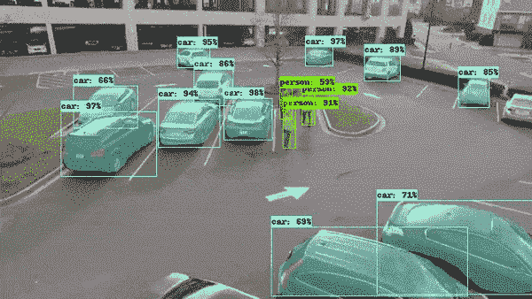
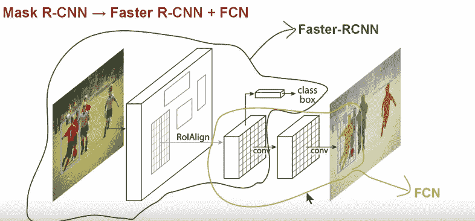
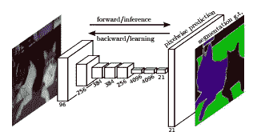
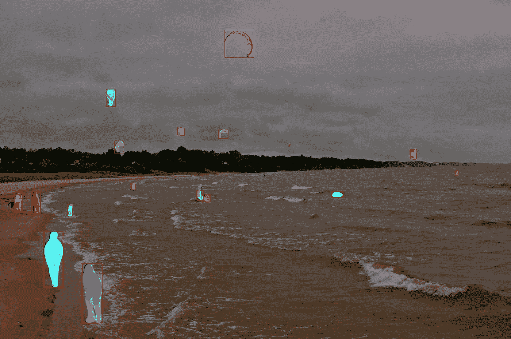

# 使用张量流对象检测进行逐像素分类

> 原文：<https://towardsdatascience.com/using-tensorflow-object-detection-to-do-pixel-wise-classification-702bf2605182?source=collection_archive---------1----------------------->

*用数据做酷事！*

过去，我使用 Tensorflow 对象检测 API 来实现对象检测，输出是图像中不同感兴趣对象周围的边界框。更多请看我的[文章](/is-google-tensorflow-object-detection-api-the-easiest-way-to-implement-image-recognition-a8bd1f500ea0)。Tensorflow 最近增加了新功能，现在我们可以扩展 API 来逐个像素地确定感兴趣对象的位置。请参见下面的示例:

Tensorflow Object Detection Mask RCNN

代码在我的 [Github](https://github.com/priya-dwivedi/Deep-Learning/blob/master/Mask_RCNN/Mask_RCNN_Videos.ipynb) 上。

**实例分割**

实例分割是对象检测的扩展，其中二进制掩码(即对象与背景)与每个边界框相关联。这允许关于框内对象范围的更细粒度的信息。

那么我们什么时候需要这种额外的粒度呢？我想到的一些例子有:

I)自动驾驶汽车——可能需要知道另一辆汽车在路上的确切位置，或者过马路的人的位置

ii)机器人系统——如果机器人知道两个部件的确切位置，那么它们将会表现得更好

有几种实现实例分割的算法，但是 Tensorflow 对象检测 API 使用的算法是 Mask RCNN。

**屏蔽 RCNN**

让我们从简单介绍一下 Mask RCNN 开始。

Mask RCNN Architecture

快速 RCNN 是一种用于目标检测的非常好的算法。更快的 R-CNN 由两个阶段组成。第一阶段，称为区域提议网络(RPN)，提议候选对象包围盒。第二阶段本质上是快速 R-CNN，使用 RoIPool 从每个候选框中提取特征，并执行分类和包围盒回归。这两个阶段所使用的特征可以被共享以用于更快的推断。

屏蔽 R-CNN 在概念上很简单:更快的 R-CNN 对每个候选对象有两个输出，一个类标签和一个边界框偏移量；为此，我们添加了第三个分支，输出对象遮罩—这是一个二进制遮罩，指示对象在边界框中的像素位置。但是额外的遮罩输出不同于类和框输出，需要提取对象的更精细的空间布局。为此，RCNN 使用下面描述的[完全卷积网络](https://people.eecs.berkeley.edu/~jonlong/long_shelhamer_fcn.pdf) k (FCN)。

Fully Convolutional Network Architecture

FCN 是一种流行的语义分割算法。该模型使用各种卷积块和最大池层，首先将图像解压缩到其原始大小的 1/32。然后，它在这个粒度级别上进行分类预测。最后，它使用采样和反卷积层来调整图像的大小到原始尺寸。

简而言之，我们可以说 Mask RCNN 将两种网络——更快的 RCNN 和 FCN——结合在一个大型架构中。模型的损失函数是进行分类、生成包围盒和生成掩模的总损失。

掩模 RCNN 有几个额外的改进，使它比 FCN 更准确。你可以在他们的论文中读到更多关于他们的信息。

## **实施**

图像测试

为了在图像上测试这个模型，你可以利用 tensorflow 网站上分享的[代码](https://github.com/tensorflow/models/blob/master/research/object_detection/object_detection_tutorial.ipynb)。我测试了他们最轻量级的型号——[mask _ rcnn _ inception _ v2 _ coco](http://download.tensorflow.org/models/object_detection/mask_rcnn_inception_v2_coco_2018_01_28.tar.gz)。下载模型升级到 tensorflow 1.5 就行了(这个很重要！).请参见下面的示例结果:

Mask RCNN on Kites Image

视频测试

对我来说，更有趣的练习是在 you tube 的样本视频上运行模型。我用 keepvid 从 you tube 下载了几个视频。我喜欢处理视频文件的图书馆电影。

主要步骤是:

*   使用 VideoFileClip 函数从视频中提取每一帧
*   fl_image 函数是一个很棒的函数，它可以获取一个图像并用修改后的图像替换它。我用这个对从视频中提取的每张图像进行物体检测
*   最后将所有修改后的剪辑图像组合成一个新的视频

你可以在我的 [Github](https://github.com/priya-dwivedi/Deep-Learning/blob/master/Mask_RCNN/Mask_RCNN_Videos.ipynb) 上找到完整的代码。

## **接下来的步骤**

关于进一步探索这个 API 的几个额外想法:

*   尝试更精确但开销大的模型，看看它们能带来多大的不同
*   使用 API 在自定义数据集上训练掩码 RCNN。这是我接下来要做的事情。

给我一个❤️，如果你喜欢这个职位:)希望你拉代码，并尝试自己。

我有自己的深度学习咨询公司，喜欢研究有趣的问题。我已经帮助许多初创公司部署了基于人工智能的创新解决方案。请到 http://deeplearninganalytics.org/的[来看看我们。](http://deeplearninganalytics.org/)

你也可以在[https://medium.com/@priya.dwivedi](https://medium.com/@priya.dwivedi)看到我的其他作品

如果你有一个我们可以合作的项目，请通过我的网站或 info@deeplearninganalytics.org 联系我

**参考文献:**

*   [口罩 RCNN 纸](https://arxiv.org/abs/1703.06870)
*   [谷歌 Tensorflow 物体检测 Github](https://github.com/tensorflow/models/tree/master/research/object_detection)
*   [COCO 数据集](http://mscoco.org/home/)
*   [了解黑白实例切分和语义切分的区别](https://stackoverflow.com/questions/33947823/what-is-semantic-segmentation-compared-to-segmentation-and-scene-labeling)
*   非常好的[解释](https://www.youtube.com/watch?v=UdZnhZrM2vQ&t=111s)屏蔽 RCNN