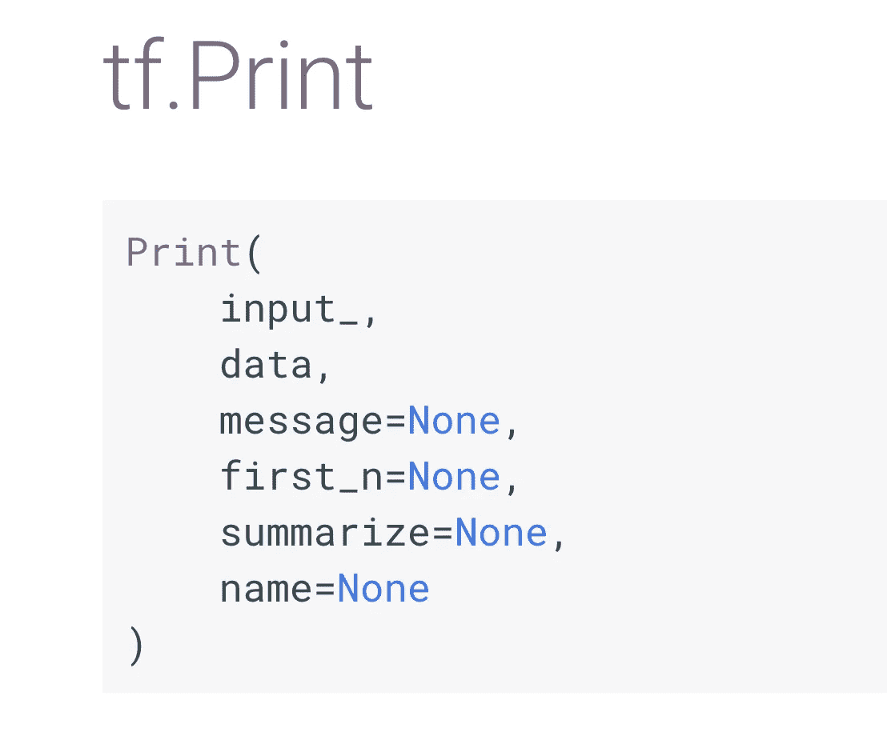
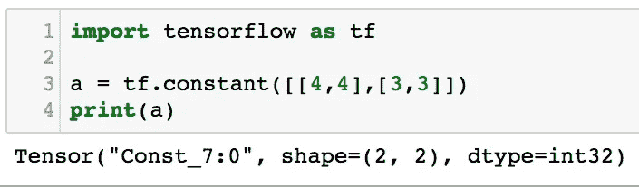
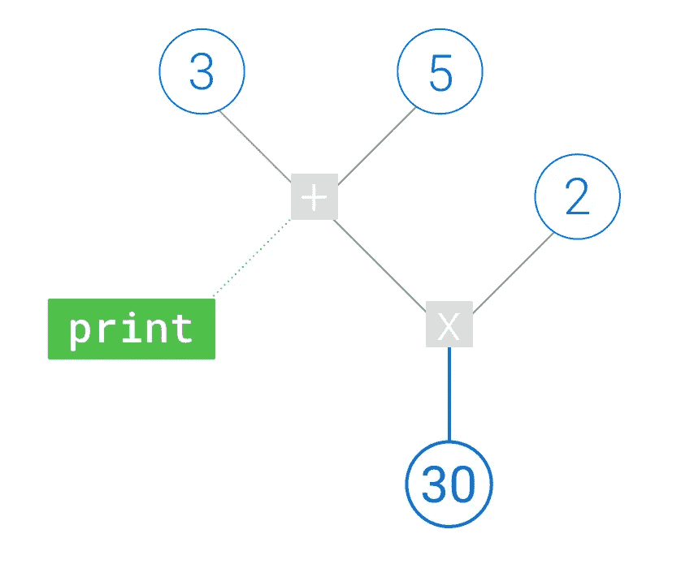
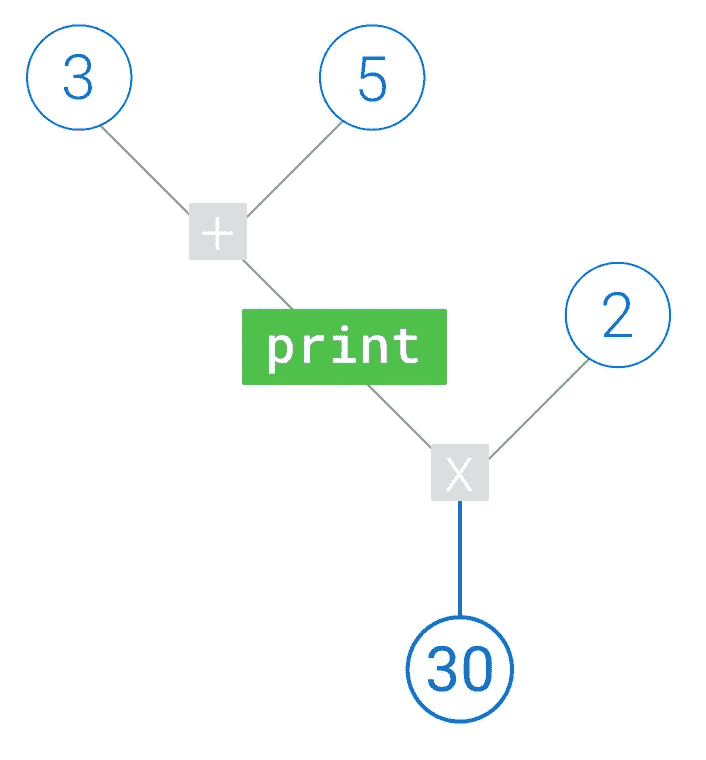
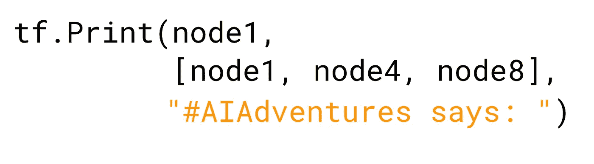
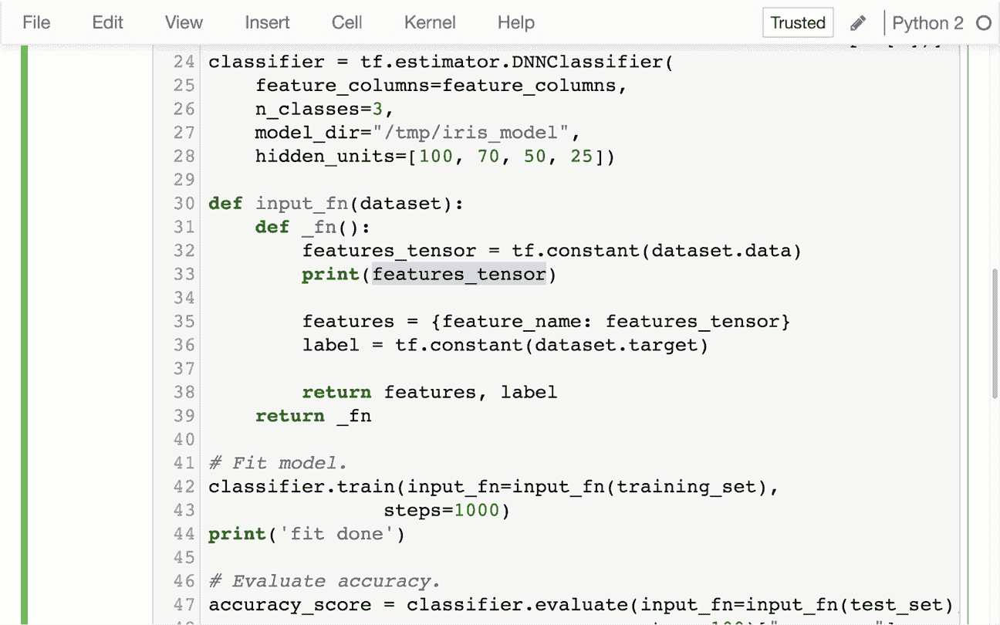
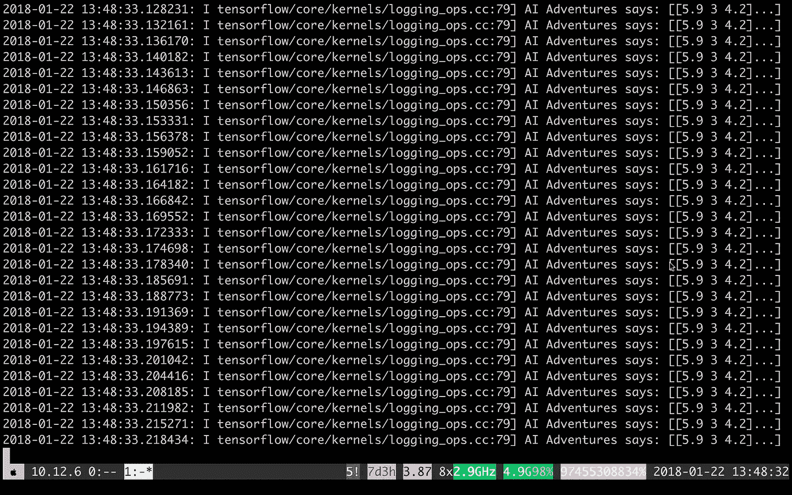

# 使用 tf。在 TensorFlow 中打印()

> 原文：<https://towardsdatascience.com/using-tf-print-in-tensorflow-aa26e1cff11e?source=collection_archive---------0----------------------->

我听说你想印一些张量。

我知道你每次都以正确的方式使用调试器，并且永远不会使用 print 语句来调试你的代码。对吗？

因为如果您这样做了，您可能会发现 TensorFlow 的`Print`语句与典型的 print 语句不太一样。

今天我将展示 TensorFlow 的打印语句是如何工作的，以及如何最大限度地利用它们，希望能帮你解决一些困惑。

# TensorFlow 打印

在编写 TensorFlow 代码时，有几种方法可以将内容打印出来。当然，还有经典的 Python 内置的`print`(或者函数`print()`，如果我们是 Python 3 的话)。然后还有 TensorFlow 的打印功能，`tf.Print`(注意大写的`P`)。

当使用 TensorFlow 时，重要的是要记住一切最终都是图形计算。这意味着如果您使用 Python 的`print`打印 TensorFlow 操作，它将简单地显示该操作的描述，因为还没有任何值通过它传递。如果已知的话，它通常还会显示该节点中预期的维度。

Hmm, where are the values? At least we have the shape and type :)

如果你想打印执行时流经图形特定部分的*值*，那么我们需要使用`tf.Print`。

## 构建您的打印节点

我们通常认为打印是我们在事情发生后添加的东西，让它运行，然后回到我们正常的运营流程。在 TensorFlow 中，只有图中需要执行*来计算输出的节点才会被执行。因此，如果您的图形中有一个“悬空”打印节点，它将不会被执行。*

那我们该怎么办？我们需要将打印调用拼接到图形本身中，就像这样:

这在代码中的体现方式是将 Print 调用作为其第一个参数传递给作为其“输入”的节点，然后将返回值`tf.Print`赋给一个变量，该变量将作为图中后面节点的输入，从而将 Print 语句串行链接到操作流中。(实际使用这个返回的节点是至关重要的，因为如果不使用，它就会悬空。)

虽然 Print 语句不做任何计算，只是向前传递张量，但它确实打印了所需的节点，这是一个副作用。

另一个有点不同于我们在 print 语句中看到的行为是，我们引入到图中的 Print 节点仅仅是设置 Print 语句何时发生，即何时到达计算图中的节点。但是，对打印的内容没有太多限制。

也就是说，它只是在图中标记您希望打印语句出现的位置，但是您可以打印图中它可以访问的任何节点。这是调用`tf.Print`的第二个参数:要打印的节点数组。通常我们只使用同一个节点作为第一个参数，也就是输入，但是如果我们愿意，我们可以在输出中包含更多的节点。

还有第三个论点，一个信息。这允许您在打印节点之前预先考虑一些字符串，因此您可以很容易地在日志中找到给定的 print 语句。

# 付诸实践

简单地说，`tf.Print`就是这样。但是你可以在哪里利用 tf 呢？在代码中打印？

经常发现自己在用 tf。在我的输入函数中打印，以调试传递到我的训练循环中的确切内容。这里仅仅使用 Python `print`是不够的，因为它只会在构造输入函数图时打印一次。

相反，我们将介绍 tf。打印对输入函数数据管道的调用。请注意，我们只是打印了作为输入传入的相同值，但是您当然也可以打印其他节点。

## 一些更多的建议

请注意，打印输出显示在我的 Jupyter 笔记本控制台的 stderr 中，**而不是**作为笔记本本身的输出。搜索打印输出时，请记住这一点！

另一个警告:如果你使用 tf。在你的输入函数中，一定要限制你传入的数据量，否则你可能会滚动一个很长的控制台窗口:)

TensorFlow 的打印语句在许多方面都不是典型的打印语句，但当您需要查看图形中流动的张量时，它可以发挥很大的作用。

感谢阅读本集[云 AI 冒险](https://goo.gl/UC5usG)。如果你喜欢这个系列，请为这篇文章鼓掌让我知道。如果你想要更多的机器学习动作，一定要关注 Medium 上的 [me 或者订阅 YouTube 频道](https://medium.com/@yufengg)来观看未来的剧集。更多剧集即将推出！

现在，看看 TensorFlow 的打印语句如何帮助您更清楚地了解您的机器学习是如何运行的！