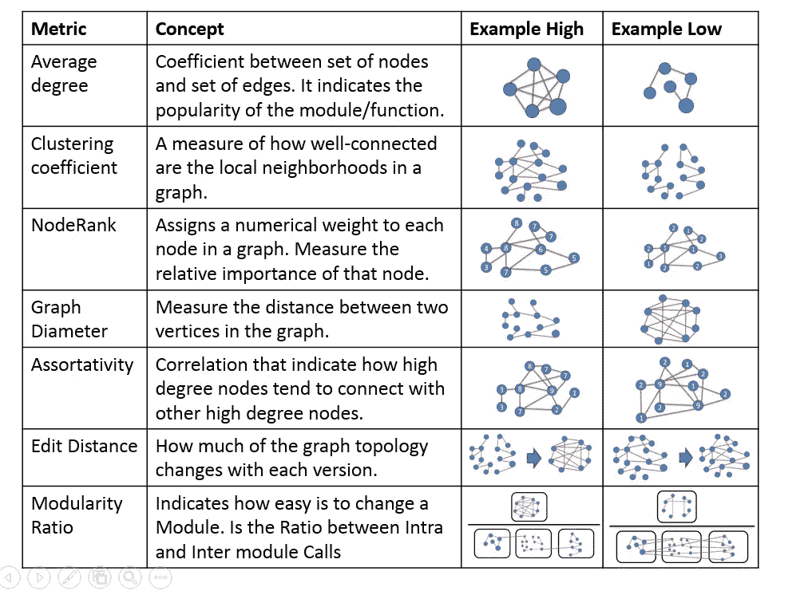
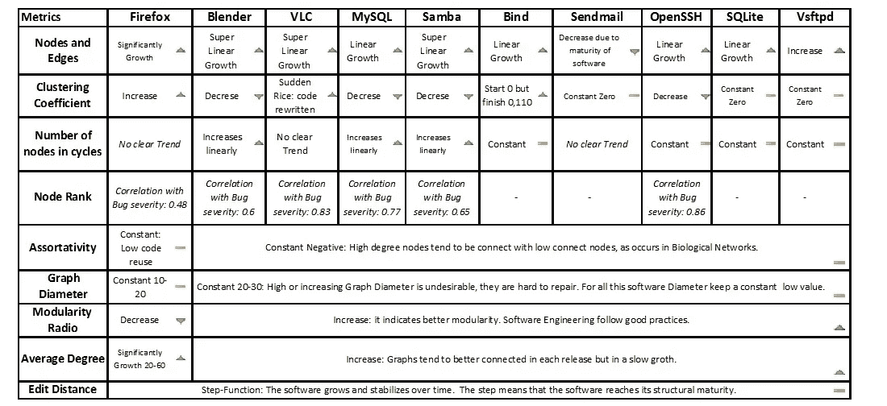

# 使用神经网络背后的度量来预测软件进化

> 原文：<https://towardsdatascience.com/using-the-proprieties-behind-the-neural-networks-zoo-for-predicting-software-evolution-eda24632966a?source=collection_archive---------9----------------------->

阿西莫夫研究所发表了这篇文章，向我们展示了下图所示的不同种类的网络。神经网络现在很热门，但以这种方式表示知识的想法来自二十世纪，当时逻辑学家有一个想法，即使用图通过构建顶点和边来形式化两个集合的映射[1]，以便对形式知识进行建模。*最早的形式被称为存在图，由哲学家查尔斯·桑德斯·皮尔士* *发明，作为符号逻辑的线性符号的替代:皮尔士对有机化学中的分子图印象深刻，认为逻辑的图形符号可以简化推理规则。皮尔斯的洞察力卓有成效，许多类型的图表今天被用来建模知识。随着人工智能的发展，语义图不仅被用来显示概念，如认知图[2]，[3]，而且被用来"*以抽象的形式捕获人类知识，以便于计算机程序对其进行处理*"[4]。经验图表结合了知识和数据，定性和定量项目。*

source: [Asimov Institute](http://www.asimovinstitute.org/)

**使用图度量预测软件演化**

在这篇文章 [5]中，他们使用图来理解软件演化，并构建促进其开发和维护的预测器。为了实现这个目标，他们创建了基于图形的模型，这些模型捕获了 11 个开源软件系统的几个图形度量。研究结果表明，这些模型可以检测结构变化，可以预测错误的严重性，减少维护工作，并改善未来的版本。这篇论文很重要，因为它是第一篇使用动态图来跟踪软件发展的论文。

他们接受源代码仓库和缺陷跟踪系统中的图模型的输入。然后，他们构建图形:他们定义图形度量(表 1)并评估每个软件的属性，接下来他们绘制图形，显示这些属性在软件的每个新版本中的演变(表 2)。最后，他们证明他们的假设，并发展预测。

**Table 1**. Graph Metrics. One example when it level of the metric is high, another when the level is low

图形构造可以从两个来源获取数据:基于代码的图形或开发者协作图形。第一个来源与软件每个版本中使用的功能和模块有关。当它只接受函数时，它是一个"*调用图*，当它接受函数及其模块时，它是一个调用"*模块协作图*。大部分实验工作都是通过“*调用图*”方法论来完成的。第二个来源是基于随着软件的发展，开发人员如何交流。如果开发者之间的联系仅依赖于解决 bug 问题，则称之为“*基于 bug 的开发者协作*”，但如果它还依赖于除 Bug 修复之外的事件，则称之为“*基于提交的开发者协作*”。实验结果显示在表 2 中，对于每个应用程序，它显示了度量如何随时间演变，以及这些变化如何影响软件工程方面。

**Table 2**. Adapted from Bhattacharya’s paper: [Graph-Based Analysis and Prediction for Software Evolution](http://www.cs.ucr.edu/~neamtiu/pubs/icse12bhattacharya.pdf)

总的来说，这个结果表明软件的进化遵循共同的规律。图度量揭示了软件发展中的重要事件，例如关键时刻，或者代码重构。他们的方法使用节点等级来识别错误的严重性。他们发现在节点等级和 bug 严重性之间有很高的相关性(0.6–0.86)，这意味着节点等级可以预测 bug 严重性，并可以识别关键功能和模块。然而，节点度并不能很好地预测 bug 的严重性。此外，当模块的模块化比率增加时，相关的维护工作也会减少。这意味着更好内聚性(模块内调用)和更低的耦合性(模块间调用)将改进软件结构。此外，基于 Bug 的开发人员协作图显示，编辑距离的增加会增加缺陷数量。这意味着合作者之间更密切的关系将提高开发人员的生产力和软件质量。

这项工作开发了一种使用图分析来揭示软件过程的关键属性的方法。这些属性在图形度量中暴露出来，揭示了软件结构和演化中的差异和相似之处。它们还捕获重要的度量来预测软件生命周期中的事件:*节点等级*可用于预测 bug 严重性，*模块比率*用于预测维护工作，*编辑距离*用于预测软件质量。

这项研究可以应用于其他复杂的系统和过程，例如供应链管理。可以在参与者和活动之间构建图表，然后可以研究图表的演变，以检测参与者做出挑战性决策的点(具有高节点排名的节点)，并帮助他们做出更好的选择。此外，通过寻求增加供应链管理图的模块化比率，可以提高供应链的生产率，通过减少编辑距离也可以提高质量。

[1] R. Diestel，*图论(数学研究生教材)*。美国纽约:施普林格出版社，2000 年。

[2] J. F. Sowa，“从概念图生成语言”， *Comput。数学。附申请*，第 9 卷，第 1 期，第 29-43 页，1983 年。

[3] W. H. Warren，D. B. Rothman，B. H. Schnapp，J. D. Ericson，《虚拟空间中的虫洞:从认知地图到认知图》，*认知*，第 166 卷，第 152–163 页，2017 年。

[4] R. J. Brachman，“概念中有什么:语义网络的结构基础”。j .曼。马赫。种马。，第 9 卷，第 2 期，第 127-152 页，1977 年。

[5] P. Bhattacharya，“基于图的软件演化分析和预测”，第 1–2 页。2012