# 使用无监督学习优化儿童 t 恤尺寸

> 原文：<https://towardsdatascience.com/using-unsupervised-learning-to-optimise-childrens-t-shirt-sizing-d919d3cbc1f6?source=collection_archive---------3----------------------->

这篇文章的所有代码和数据都可以在 [Github](https://github.com/Padam-0/cluster_t-shirt_sizing) 上找到。本分析使用了 Python 3、Numpy 1.12.0、Pandas 0.19.2、Scikit-Learn 0.18.1、matplotlib 1.4.3 和 Seaborn 0.7.1。

U 在处理低维数据时，监督学习，特别是 K-Means 并不难理解。然而，随着变量数量的增加，可能很难理解你在看什么，更不用说试图弄清楚它是否有用了。

使用儿童身体测量的大型数据集，这项探索的目的是使用无监督学习来提出三种不同的 t 恤尺寸，适合大多数儿童的小号、中号或大号。

本次研究中使用的数据集包含儿童的人体测量数据，以及一些与人口统计相关的属性。有 122 个变量的 3900 个观察值。

# 数据清理

第一步是检查数据，发现许多对象包含空值。因此，任何包含超过 2000 个空值(在本例中为零)的变量都将被删除。

```
import pandas as pddf = pd.read_csv('data.csv', index_col=0)

remove_cols = []

*for* i *in* df.columns:
    *if* 3900 - df.loc[:,i].astype(bool).sum() > 2000:
        remove_cols.append(i)

df = df.drop(remove_cols, axis = 'columns')
```

使用该标准去除了 76 个变量。

如上所述，数据集包含人体测量和人口统计数据。在这种情况下，人口统计数据被认为是没有用的，因为目的是设计 t 恤，所以 22 个人口统计变量也被删除了。

```
demographic_attributes = ['AGE IN YEARS', 'LOCATION',
       'BIRTH DATE', 'MEASUREMENT DATE', 'MEASUREMENT SET TP',
       'MEASURER NUMBER', 'COMPUTER NUMBER', 'RACE', 'GRADE LEVEL',
       'HANDEDNESS', 'NUMBER OF BROTHERS', 'NUMBER OF SISTERS', 'TWIN','BIRTH ORDER', 'MOTHERS OCCUPATION', 'FATHERS OCCUPATION',
       'MOTHERS EDUCATION', 'FATHERS EDUCATION', 'YEARS IN COMMUNITY','ANTHROPOMETER NO', 'CALIPER NO', 'GIRTH NO']

df = df.drop(demographic_attributes, axis = 'columns')
```

# 探索性数据分析

2 对聚类有很大影响的重要变量是年龄(以月为单位)和性别(1 或 2)。尚不清楚 1 号或 2 号是雄性还是雌性，但这不是分析的必要信息。对年龄范围的研究表明，年龄范围为 0 至 240 个月(20 岁)，中位数约为 128 个月(10 岁零 8 个月)。

```
print(df.loc[:,'AGE IN MONTHS'].describe())
```

显然，为所有年龄设计一个单一的 t 恤尺寸是不合适的，因此使用直立坐姿高度作为尺寸的代表，绘制了一个图表，以查看这一测量值如何随着儿童年龄的变化而变化(0 岁、1 岁、19 岁和 20 岁的儿童被删除，因为没有足够的准确性观察)。

```
shoulder_data = df[['ERECT SITTING HEIGHT', 'AGE IN MONTHS']]
shoulder_data['YEAR'] = shoulder_data['AGE IN MONTHS'].apply(*lambda* x: x//12)x = list(shoulder_data.groupby('YEAR').mean().index[1:-2])y = list(shoulder_data.groupby('YEAR').mean()['ERECT SITTING HEIGHT'][1:-2])
```

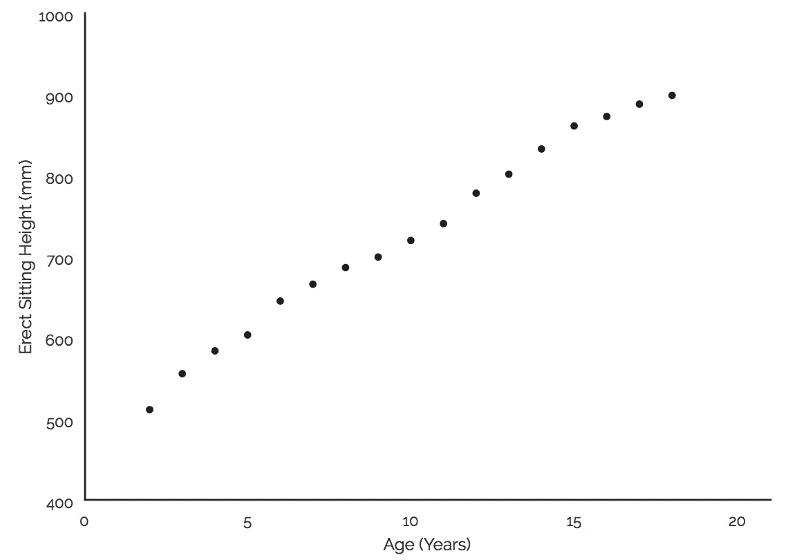

这显示了一个大致线性的增长率，在两个年龄阶段，身高有了显著的增长。6-7 岁和 12-13 岁是这两个年龄跳跃点，增长率明显增加。因此，有三个需要确定衬衫尺码的年龄区间；0 到 6，7 到 12，13 到 20。小、中、大之间也有重叠的空间，也就是说，7-12 岁的大衬衫可能与 13-20 岁的小衬衫尺寸相似。

同样有趣的是性别和体型之间的关系。第一性和第二性的每个年龄的平均坐高图表明，在 15 岁左右之前，男性和女性之间没有太大的差异，这时男性会稍微长高一些。有了这些信息，估计 1 号性别是男的，2 号性别是女的。

```
shoulder_data = df[['ERECT SITTING HEIGHT', 'AGE IN MONTHS', 'SEX']]
shoulder_data['YEAR'] = shoulder_data['AGE IN MONTHS'].apply(*lambda* x: x//12)y_1 = shoulder_data[shoulder_data['SEX'] == 1].groupby('YEAR').mean()['ERECT ' \
                        'SITTING HEIGHT'][1:-2]y_2 = shoulder_data[shoulder_data['SEX'] == 2].groupby('YEAR').mean()['ERECT ' \
                        'SITTING HEIGHT'][:-1]x = list(shoulder_data.groupby('YEAR').mean().index[1:-2])
```

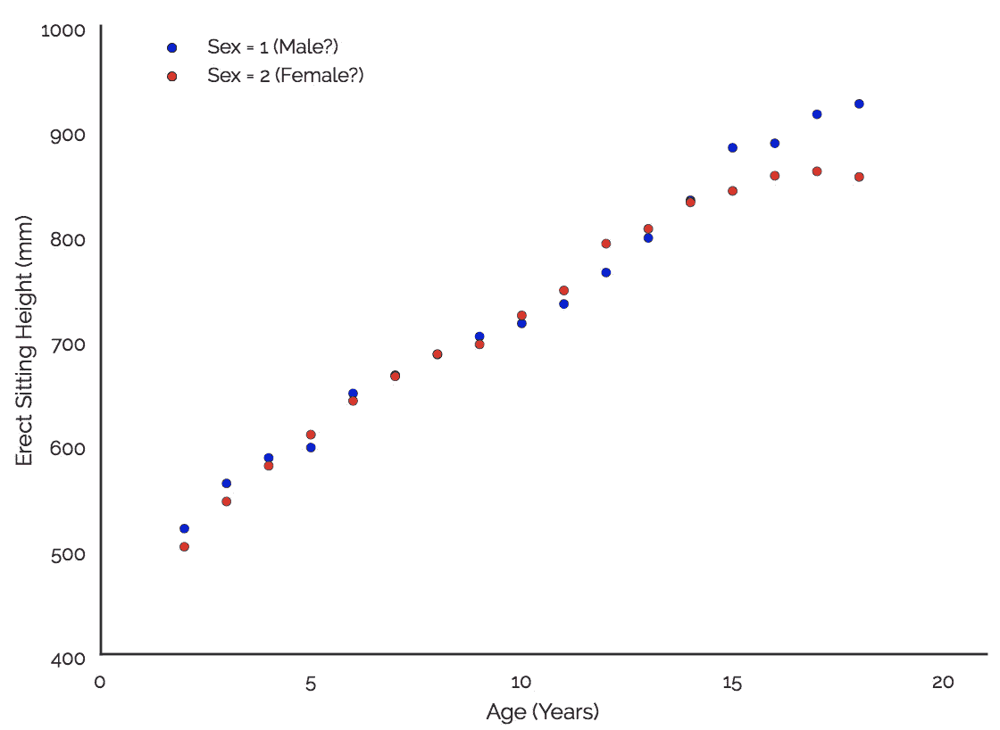

区分男性和女性的另一个有用的变量是胸围。下图显示了每个年龄的平均测量值。

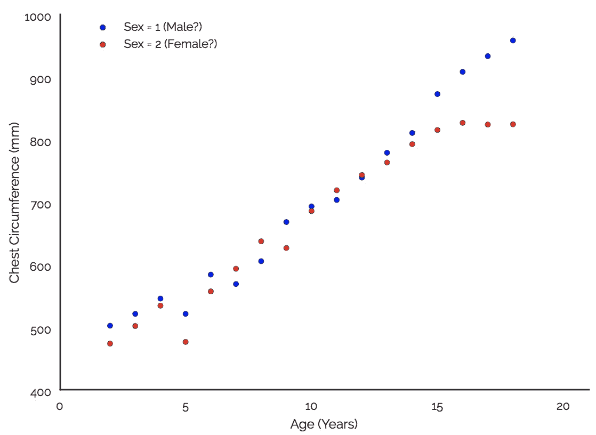

这再次表明，主要的分歧发生在 15 岁左右。因此，我认为有 12T 的球衣尺寸需要改进:

*   0-6 岁小号、中号和大号男女通用
*   年龄 7-12 岁小号、中号和大号男女通用
*   年龄 13-20 岁小、中、大男性和女性

出于这个练习的目的，我将把重点放在 7-12 岁。

这里需要注意的是，这两张图有些矛盾。在我看来，女性的胸围应该考虑到乳房的大小，这样的差异表明性别 1 是女性，而身高数据表明性别 1 是男性。我找不到这个数据的模式，所以无法解决这个问题。不管结果是什么，只要记住，无论何时我指定了男性 vs 女性，他们都可以互换。

# 无监督学习

第一步是将数据分成子集，删除值为 0 的行(本例中为 1584 行中的 59 行)，然后转换为 numpy 矩阵进行聚类:

```
import numpy as npt_shirt_columns = ['CHEST CIRCUMFERENCE', 'WAIST CIRCUMFERENCE',
                   'SHOULDER-ELBOW LENGTH', 'ERECT SITTING HEIGHT',
                   'SHOULDER BREADTH']

young = df[df['AGE IN MONTHS'] < 84].loc[:,t_shirt_columns]middle = df[(df['AGE IN MONTHS'] < 156) & (df['AGE IN MONTHS'] >= 83)].loc[:,t_shirt_columns]old_1 = df[(df.SEX == 2) & (df['AGE IN MONTHS'] >= 156)].loc[:,t_shirt_columns]old_2 = df[(df.SEX == 2) & (df['AGE IN MONTHS'] >= 156)].loc[:,t_shirt_columns]

drop_list = []
*for* i *in* range(len(middle.index)):
    *if* 0 *in* middle.ix[i,:].values:
        drop_list.append(i)

middle = middle.drop(middle.index[drop_list])

data = middle.as_matrix()
```

下一步是决定数据中有多少个聚类。我们想要三个，但我们也希望它们包含足够的观察，值得为它们创建一个特定的 t 恤尺寸。找出数据中聚类数的一种方法是使用惯性图，并寻找“弯头”。

```
import matplotlib.pyplot as pltinertias = []
ks = range(1,11)
*for* k *in* ks:
    inertias.append(KMeans(n_clusters=k).fit(data).inertia_)
plt.plot(ks, inertias, '-o')
plt.xticks(ks)
plt.show()
```

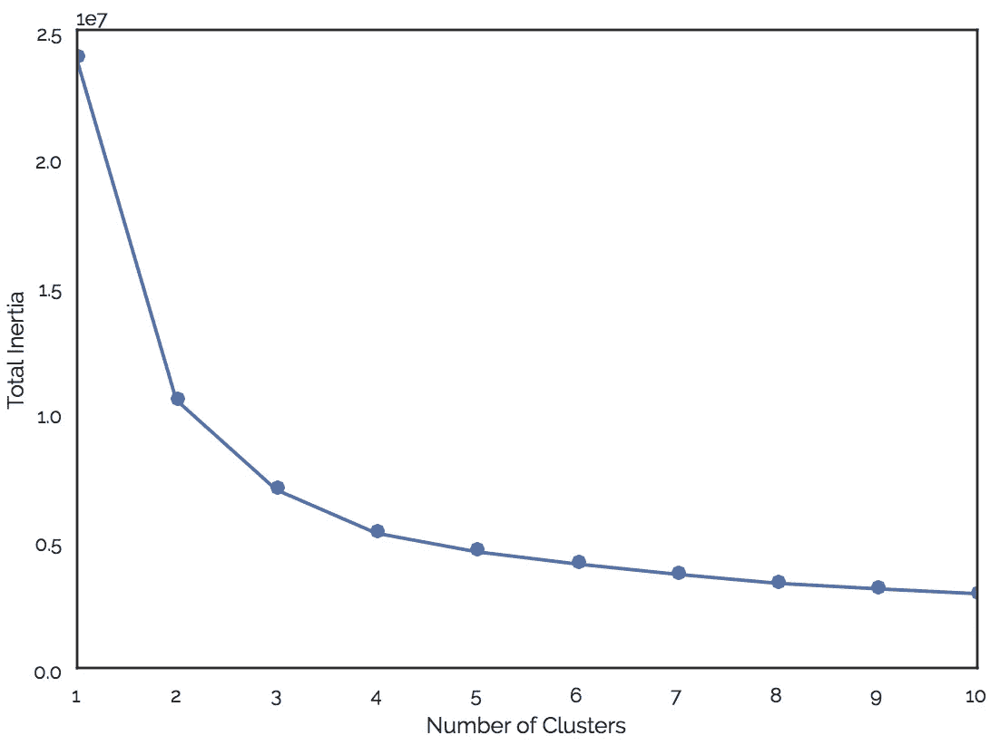

由此看来，似乎有 2 或 3 个集群。我们还可以通过查看树状图来了解聚类顺序:

```
*from* scipy.cluster.hierarchy *import* linkage, dendrogrammergers = linkage(data, method='complete')
dendrogram(mergers, leaf_rotation=90, leaf_font_size=6)
plt.show()
```

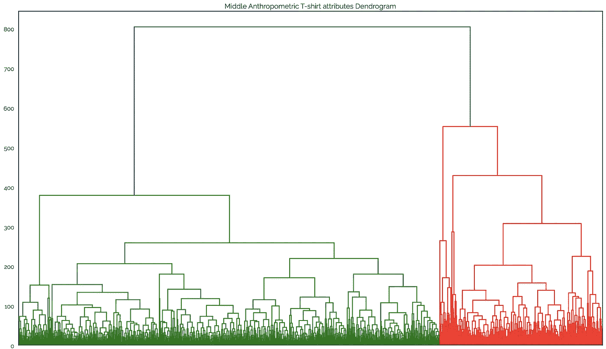

这看起来不错，有两个容易识别的集群，绿色和红色。第三个不太容易看到，但我们可以解决这个问题。这是有希望的。

为了找出聚类，是时候执行 K-Means 聚类了。我们的目标是找到代表大部分观测值的三个聚类。从`n_clusters=2`开始，我运行下面的代码，直到我有了三个大的不同的集群。这适用于 3 个集群。

```
*from* sklearn.cluster *import* KMeanskmeans = KMeans(n_clusters=3).fit(data)
samples = kmeans.predict(data)

names = middle.index

ns = pd.DataFrame({'names': names, 'cluster': samples})
clusters = ns.set_index(names).iloc[:,0]

print(clusters.value_counts())
```

打印每个集群中的实例数量显示:

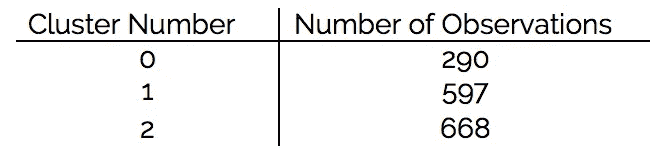

这太棒了。我们已经将所有观察结果分成了三个不同的组！现在，看看聚类中心，我们可以看到它们之间的差异:

```
print(kmeans.cluster_centers_)
```

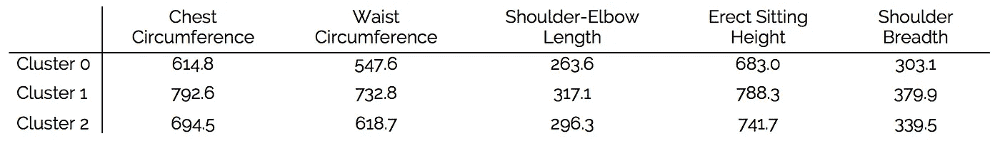

这太棒了。我们可以看到，在所有类别中，分类 0 包含最小的值，分类 1 包含最大的值，分类 2 包含中间的值。这意味着这些质心值代表了三种不同体型的中间值，应该在为 7 至 12 岁的孩子制作 t 恤时使用。

# 扩展ˌ扩张

现在，制造不同尺寸的 t 恤很烦人，所以制造商希望在尽可能多的体型上使用相同的模板。因此，我之前假设不同年龄组之间可能有小/大的重叠。让我们来验证一下这个理论。

对最年轻的年龄段做同样的处理，我们得到下面的树状图:

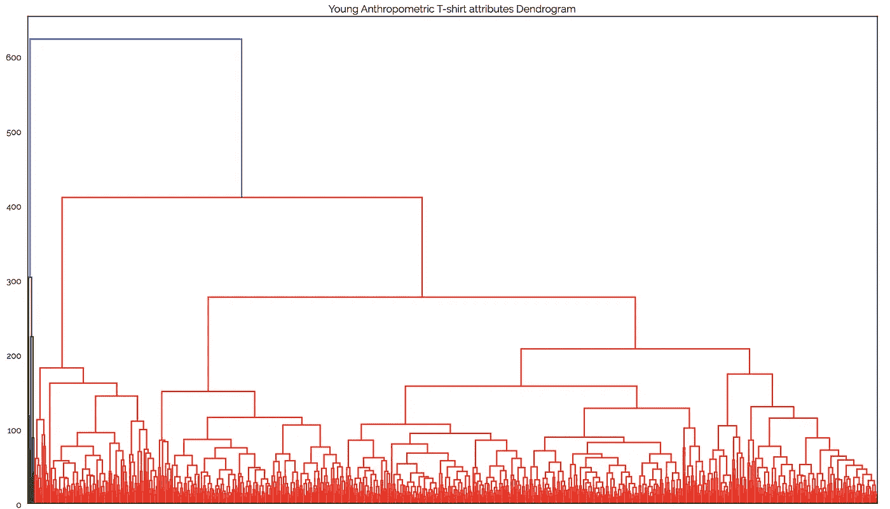

这不像上一个那样清晰，因为我们在左边有一个高度相似的聚类，但只包含少量的值。这不是很好，但也不重要。当我们使用 KMeans 进行集群时，我们将会看到它们的归属。同样，从`n_clusters=2`开始并逐渐增加该值，我们可以看到，在 4 个聚类中，大部分(95.5%)数据被聚类到 3 个良好的聚类中。

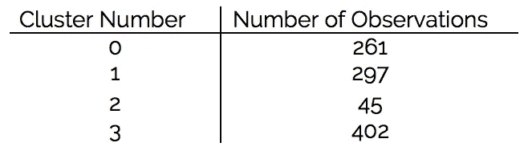

查看聚类中心(忽略聚类 2，因为它包含的观察值太少):

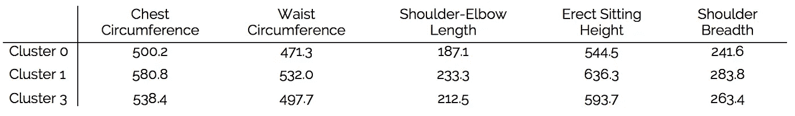

同样，我们看到有 3 种不同的大小:小型(群集 0)、中型(群集 3)和大型(群集 1)。不幸的是，这个年龄段的大码和中年组的小码似乎没有太多相似之处。

对于较大的年龄组，可以执行类似的过程，并且男性和女性的小型集群的大小如下所示:

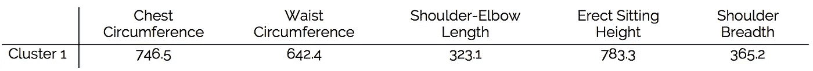

Small Sizing for Males

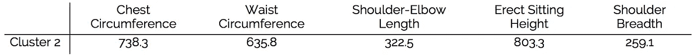

Small Sizing for Females

正如所料，男性和女性的小尺寸在一些变量上有很大不同，最明显的是肩宽。因此，最初的假设，即不同性别在 13-20 岁年龄组需要不同的尺寸，似乎是正确的。

值得注意的另一点是，13-20 岁年龄组男性的小尺寸与 6-12 岁年龄组的大尺寸不太接近，因为腰围有很大差异。这可能也在意料之中

# 结论

该分析显示了即使是简单的聚类分析也能从大型脏数据集中产生的结果。一如既往，处理错误和不相关的数据是至关重要的，垃圾输入=垃圾输出。通过一些简单的试错聚类，我们已经确定了跨 3 个年龄组的 t 恤设计的关键尺寸，并排除了多个年龄组使用同一尺寸的可能性！对于 145 行代码来说还不错！

同样，所有用于分析的代码和数据都可以在[https://github.com/Padam-0/cluster_t-shirt_sizing](https://github.com/Padam-0/cluster_t-shirt_sizing)获得

如果你喜欢这篇文章，请点击❤按钮让你的关注者知道，或者让我知道你的想法。