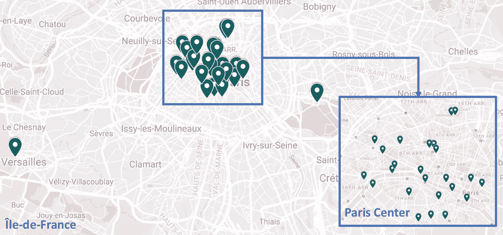
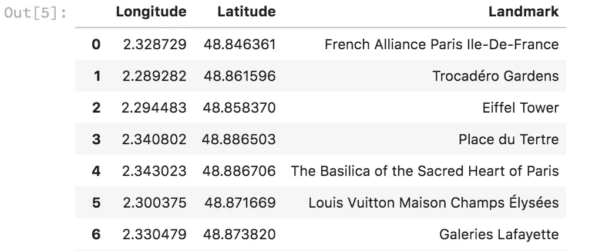
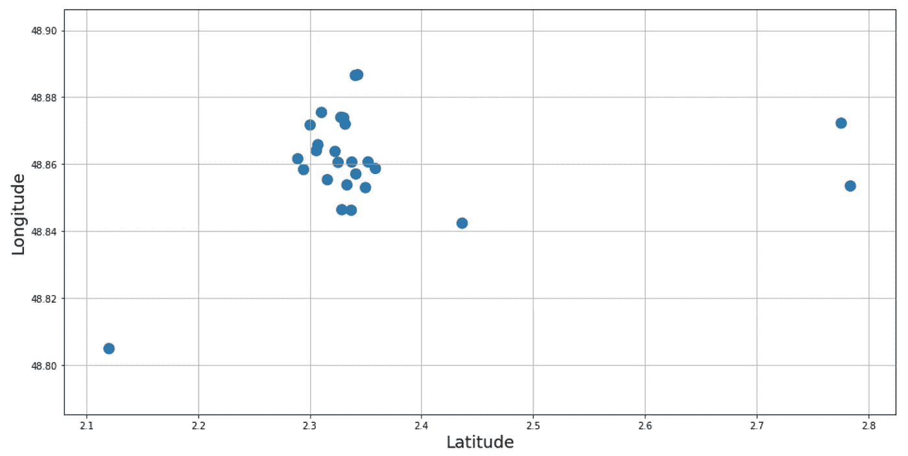
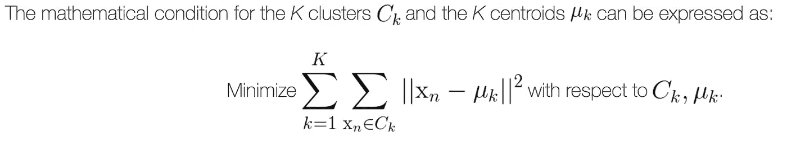
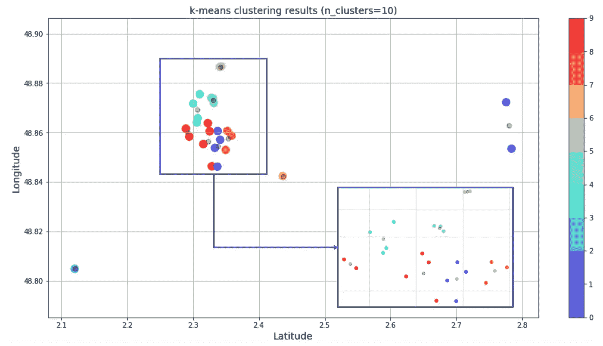
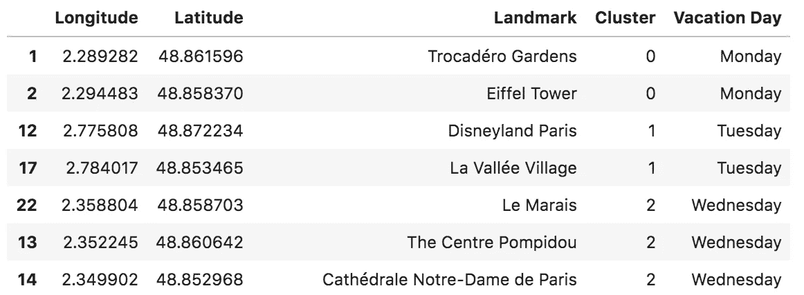
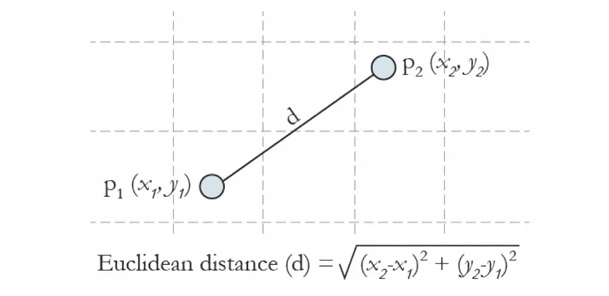
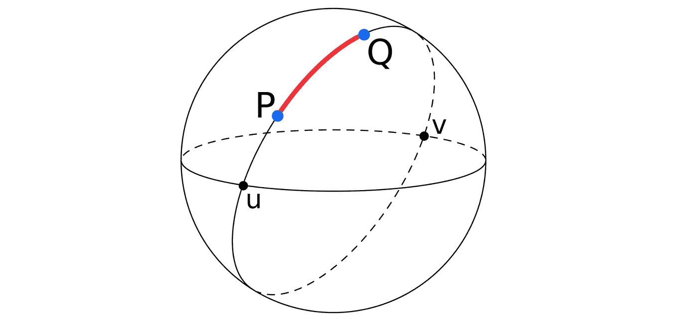
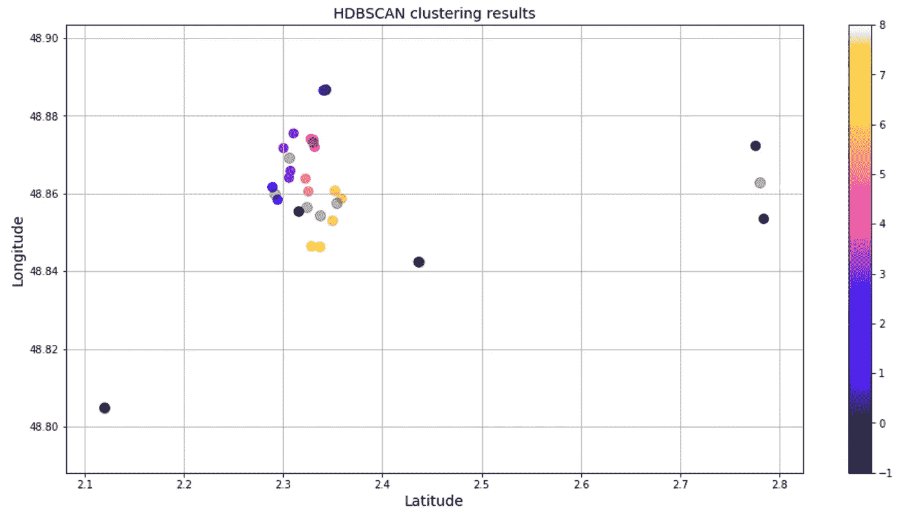
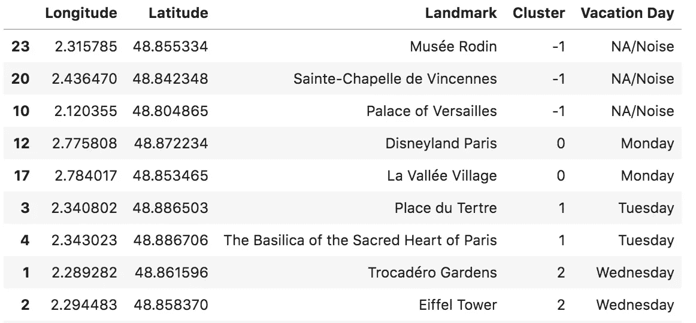

# 使用无监督学习计划去巴黎的假期:地理位置聚类

> 原文：<https://towardsdatascience.com/using-unsupervised-learning-to-plan-a-paris-vacation-geo-location-clustering-d0337b4210de?source=collection_archive---------3----------------------->

The Eiffel Tower in the City of Love but there are so many great sights in Paris — how can I help her organise her trip?

当我的朋友告诉我她计划去巴黎旅行 10 天时，我想我可以帮上忙。

> 她:“我和我的朋友正在考虑去巴黎度假。”我:“哦，听起来很有趣。也许我也可以加入。”
> 她:“对！我们计划报名参加一个法语课程，然后去购物！我们已经列出了所有我们想去的购物中心，还有…“
> 我:“啊，听起来很棒…那么你需要我什么时候开车送你去机场？”

因为我自己也去过巴黎几次，我想我可以在其他方面有所帮助，比如为旅游景点列表做贡献。在列出所有的景点之后，我创建了一个谷歌地图，每个位置都有一个图钉。

The initial Google Map with pins for sights to visit — but in what order should these sights be visited?

很明显，要想参观完巴黎所有的景点，需要做一些日程安排工作——但是她怎么能决定先看什么，按什么顺序看呢？这在我看来就像是一个 [**聚类**](https://towardsdatascience.com/tagged/clustering) 的问题，而 [**无监督学习**](https://towardsdatascience.com/tagged/unsupervised-learning) 方法可以帮助解决它。

像 [K-Means](http://scikit-learn.org/stable/modules/clustering.html#k-means) 或 [DBScan](http://scikit-learn.org/stable/modules/clustering.html#dbscan) 这样的算法可能会成功。但首先，必须准备好数据，以便于此类算法按预期执行。

## 地理位置收集和数据准备

首先，我必须以 2D 格式收集谷歌地图的地理位置(可以存储在一个 [numpy 数组](https://docs.scipy.org/doc/numpy/reference/generated/numpy.array.html)中)。将这些图钉翻译成[经度，纬度]将是完美的。

由于这是一次性的，我寻找一种快速的方法从谷歌地图中提取这些信息。这个 [StackOverflow 查询](https://stackoverflow.com/questions/2558016/how-to-extract-the-lat-lng-of-pins-in-google-maps)给了我所需要的一切。

基本上，你需要去 google.com/maps/d/kml?mid={map_id}的*下载一个*。kmz 文件。然后，手动更改*的扩展名。kmz 文件转换为*。zip 文件。提取文件，并在您选择的文本编辑器中打开*doc . KML*([sublime text](https://www.sublimetext.com/)是我个人的首选)。*

然后，你可能会决定手动 CTRL+F 来搜索<coordinates>字段，或者决定*而不是*这么懒，使用 [BeautifulSoup](https://www.crummy.com/software/BeautifulSoup/) (如下图)！</coordinates>

从 XML 文件中提取坐标后，我将坐标存储在一个数据帧中。地标总数为 26(存储在 XML 文件中的<*地标>* < / *地标>* )。

Dataframe populated with info from the XML file (first 7 rows only shown)

从存储坐标和地标/景点名称的数据帧中，我生成了一个散点图。

Google Map Pins Scatter Plot

## k 均值聚类

一般来说，无监督学习方法对于没有标签的数据集是有用的，并且当我们不一定知道结果时，我们会尝试预测。这些算法通常采取以下两种形式之一:(1)聚类算法，或(2)降维算法。

在这一节中，我们将重点关注[*k*——意为](https://en.wikipedia.org/wiki/K-means_clustering)，这是一种聚类算法。使用 *k* 均值，提供预定数量的聚类作为输入，并且算法在未标记的数据集中生成聚类。

*k* -means 生成一组 *k* 聚类质心和一个输入数组 *X* 的标签，该标签将 *X* 中的每个点分配给一个唯一的聚类。该算法将分类质心确定为属于该分类的所有点的算术平均值，并定义分类，使得数据集中的每个点与其自己的分类中心比与其他分类中心更接近。

source: [https://bit.ly/1z29ZIV](https://bit.ly/1z29ZIV)

它可以使用 [sklearn](http://scikit-learn.org/stable/modules/generated/sklearn.cluster.KMeans.html) 在 Python 中实现，如下所示:

从下面的散点图中可以看出，我生成了 10 个聚类——每个假期一个。但巴黎市中心的景点彼此靠得很近，很难区分这两个集群。由此产生的预测也被分类并存储在数据帧中。

k-means was used to generate 10 clusters (one for each day), the black dots represent cluster centers

使用由 k 生成的 10 个集群，我生成了一个数据帧，为每个集群分配一周中的某一天。这将构成一个时间表的例子。

k-means results as Vacation Days of the Week (first 3 days only shown)

现在，在这个阶段，我可以简单地交出排序后的数据帧，按层重新组织谷歌地图[图钉(即每层代表一天)，就这样——旅程完成了。](https://support.google.com/mymaps/answer/3024933?co=GENIE.Platform%3DDesktop&hl=en)

但是有些事情仍然困扰着我，那就是 *k* -means 正在根据点与点之间的欧几里得距离(即地图上两个大头针之间的直线距离)生成聚类。

但是我们知道，地球不是平的([对吗？](http://theconversation.com/how-to-reason-with-flat-earthers-it-may-not-help-though-95160))所以我想知道这种近似是否会影响正在生成的星团，特别是因为我们有相当多的地标远离巴黎市中心的高密度区域。

## 因为地球不是平的:输入 HDBSCAN

因此，我们需要一种能够处理[地理距离](https://en.wikipedia.org/wiki/Geographical_distance)的聚类方法，即地球表面两点之间最短曲线的长度。

基于 [DBScan](https://en.wikipedia.org/wiki/DBSCAN) 算法的密度函数 [HDBSCAN](http://hdbscan.readthedocs.io/en/latest/index.html) 可能对此有用。

HDBSCAN 和 DBSCAN 算法都是基于密度的空间聚类方法，它们根据距离度量和最小点数将彼此靠近的点组合在一起。它还将低密度区域中的点标记为异常值。

幸运的是，HDBSCAN 支持[哈弗线距离](https://en.wikipedia.org/wiki/Haversine_formula)(即经度/纬度距离)，这将正确计算地理位置之间的距离。关于 HDBSCAN 的更多信息，请查看这篇[博客文章](/lightning-talk-clustering-with-hdbscan-d47b83d1b03a)。

HDBSCAN 不包含在您的典型 Python 发行版中，因此您必须 *pip* 或 *conda* 安装它。我这样做了，然后运行了下面的代码。

最后得到了下面的散点图和数据图。我们看到孤立点聚集在聚类'-1 '中，这意味着它们被识别为'噪声'。

HDBSCAN generated 9 clusters and 3 data points as ‘noise’

HDBSCAN results as Vacation Days of the Week (first 3 days only shown)

不出所料，我们最终有几个点被标记为噪声。由于 HDBSCAN 聚类的最小点数是 2，像*凡尔赛宫*这样的孤立位置被归类为噪声。万森斯的圣小教堂和罗丹博物馆遭遇了相似的命运。

然而，有趣的是 HDBSCAN 识别出的集群数量为 9，比设定的假期天数少一天。我猜对于我们选择的景点/数据点的数量，10 天听起来没问题。

最终，来自 *k* 均值的结果是我们用来制定时间表的结果，因为 *k* 均值生成的聚类与 HDBSCAN 生成的聚类相似，并且包含了所有数据点。

这里介绍的聚类方法当然可以改进。一个可能的改进是为数据点增加一个权重特性。例如，权重可以表示完全参观一个特定场所所需的时间量(例如，*勒卢浮宫*很容易花一整天来欣赏)，因此这将影响具有高权重点的聚类中的数据点的总数，这将在未来的项目中进行调查。

这个迷你项目的 Jupyter 笔记本可以在这里找到。