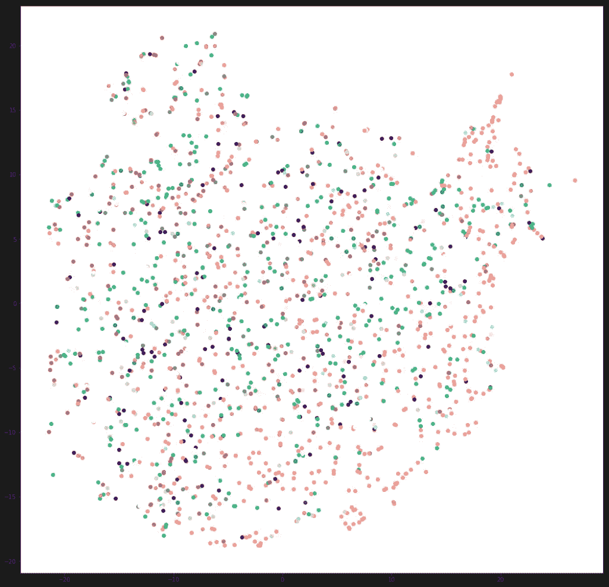
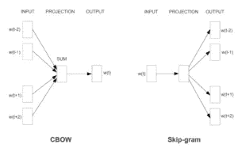
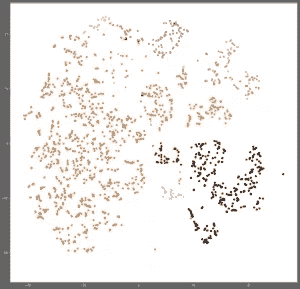

# 使用 Word2Vec 更好地嵌入分类特征

> 原文：<https://towardsdatascience.com/using-word2vec-for-better-embeddings-of-categorical-features-de75020e1233?source=collection_archive---------6----------------------->

回到 2012 年，当神经网络重新受到欢迎时，人们对训练模型而不必担心特征工程的可能性感到兴奋。事实上，大多数最早的突破是在计算机视觉领域，其中原始像素被用作网络的输入。

很快，事实证明，如果你想使用文本数据、点击流数据或几乎任何具有分类特征的数据，在某些时候你必须问自己——我如何将我的分类特征表示为我的网络可以使用的向量？

最常用的方法是嵌入图层，即向网络中添加一个额外的图层，为分类要素的每个值分配一个矢量。在训练期间，网络学习不同层的权重，包括那些嵌入。

在这篇文章中，我将展示这种方法何时会失败的例子，介绍 category2vec，这是一种使用第二个网络学习嵌入的替代方法，并将介绍在您的主网络中使用这些嵌入的不同方法。

## 那么，嵌入图层有什么问题呢？

嵌入层经过训练以适应特定的任务，即训练网络的任务。有时候这正是你想要的。但是在其他情况下，您可能希望您的嵌入捕获一些关于问题领域的直觉，从而降低过度拟合的风险。你可以把它看作是在你的模型中增加了先验知识，这有助于它进行归纳。

此外，如果您在相似的数据上有不同的任务，您可以使用来自一个任务的嵌入来改进您在另一个任务上的结果。这是深度学习工具箱中的主要技巧之一。这被称为迁移学习，预训练或多任务学习，取决于上下文。潜在的假设是，解释数据的许多未观察到的随机变量是跨任务共享的。因为嵌入试图隔离这些变量，所以它们可以被重用。

最重要的是，将嵌入作为网络的一部分来学习会增加模型的复杂性，因为这会给模型增加许多权重，这意味着您需要更多的标记数据来学习。

所以不是说嵌入层不好，而是我们可以做得更好。让我们看一个例子。

## 示例:点击预测

Taboola 的研究小组开发了算法，根据用户当前阅读的内容向他们推荐内容。我们可以把它想成一个点击预测问题:给定你的阅读历史，你点击每篇文章的概率是多少？

为了解决这个问题，我们[训练深度学习模型](http://engineering.taboola.com/deep-learning-from-prototype-to-production/)。自然地，我们从学习嵌入作为我们网络的一部分开始。

但是我们得到的很多嵌入没有意义。

## 您如何知道您的嵌入是否有意义？

最简单的方法是获取几个项目的嵌入，并查看它们的邻居。他们在你的领域里相似吗？这可能会让人精疲力尽，而且不会让你看到全局。因此，另外你可以使用 [PCA](https://en.wikipedia.org/wiki/Principal_component_analysis) 或者 [t-SNE](https://www.oreilly.com/learning/an-illustrated-introduction-to-the-t-sne-algorithm) 来减少你的向量的维数，并根据特定的特征给它们上色。

一个物品的广告主是一个强特征，我们希望相似的广告主有相似的嵌入。但这就是我们为不同广告客户嵌入的样子，用广告客户的语言来着色:

哎哟。事情显然不对劲。我的意思是，除非我们假设我们的用户是多语言天才，他们阅读一篇西班牙语文章，然后毫不费力地阅读另一篇日语文章，否则我们可能会希望我们嵌入空间中的类似广告商拥有相同语言的内容。

这使得我们的模型更难解释。人们很不安。有些人甚至失眠了。

我们能做得更好吗？

## Word2Vec

如果你听说过嵌入式，你可能听说过 [word2vec](https://www.tensorflow.org/tutorials/word2vec) 。这种方法将单词表示为高维向量，因此语义相似的单词将具有相似的向量。它有两种风格:连续单词包(CBOW)和跳过单词。CBOW 训练网络根据上下文预测单词，而 Skip-Gram 则相反，根据特定的目标单词预测上下文。

我们可以用同样的想法来提高我们的广告植入吗？是的我们..嗯，你明白了。

## 从 Word2Vec 到 Category2Vec

想法很简单:我们根据用户的点击历史来训练 word2vec。每个“句子”现在是用户点击的一组广告商，我们试图根据用户喜欢的其他广告商(“上下文”)来预测特定的广告商(“单词”)。唯一的区别是，与句子不同，顺序不一定重要。我们可以忽略这个事实，或者用每个历史的排列来增强数据集。您可以将这种方法应用于任何种类的高模态分类特征，例如，国家、城市、用户 id 等..查看更多详情[此处](https://arxiv.org/abs/1603.04259)和[此处](https://openreview.net/pdf?id=HyNxRZ9xg)。

如此简单，却又如此有效。还记得我们之前看到的混乱的嵌入可视化吗？这是它现在的样子:

好多了！所有语言相同的广告客户都聚集在一起。

现在我们有了更好的嵌入，我们能用它们做什么呢？

## 使用来自不同模型的嵌入

首先，请注意，category2vec 只是一般实践的一个示例:将任务 A 中学习到的嵌入用于任务 b。我们可以用不同的架构、不同的任务，在某些情况下，甚至是不同的数据集来替换它。这是这种方法的最大优势之一。

在我们的模型中有三种不同的方式来使用新的嵌入:

1.  使用新嵌入作为新网络的特征。例如，我们可以对用户点击的所有广告商的嵌入进行平均，以表示用户历史，并使用它来学习用户的口味。这篇文章的重点是神经网络，但实际上你可以用任何 ML 算法来做。
2.  用我们刚刚学过的嵌入初始化网络中嵌入层的权重。这就像告诉网络—这是我从其他任务中了解到的，现在为当前任务进行调整。
3.  [多任务学习](http://ruder.io/multi-task/) —取两个网络，参数共享一起训练。你可以强迫它们共享嵌入([硬共享](http://ruder.io/multi-task/index.html#hardparametersharing)，或者当它们的权重相差太大时，通过“惩罚”网络来允许它们具有稍微不同的权重([软共享](http://ruder.io/multi-task/index.html#softparametersharing))。这通常是通过调整重量之间的距离来实现的。你可能会认为这是将知识从一个任务传递到另一个任务，但也是一种正则化技术:word2vec 网络充当另一个网络的正则化器，并迫使它学习具有我们感兴趣的特征的嵌入。

## 好吧，让我们回顾一下。

有时候，我们可以简单地通过采用一些现有的方法，但把它应用到新的东西上，从而获得很好的结果。我们使用 word2vec 为广告商创建嵌入，我们的结果比使用嵌入层获得的结果更有意义。正如我们在 Taboola 中所说——有意义的嵌入=有意义的生活。

你有没有以不寻常的方式使用 word2vec？有一些关于分类特征的专业建议吗？看了一篇有趣的相关论文？我很想在评论中了解一下:)