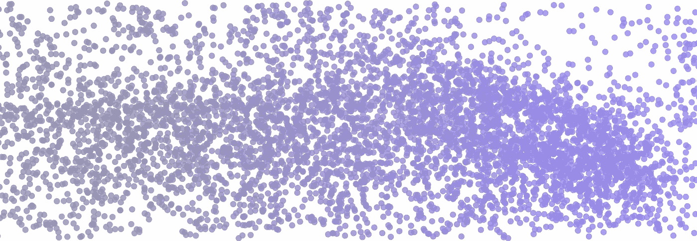
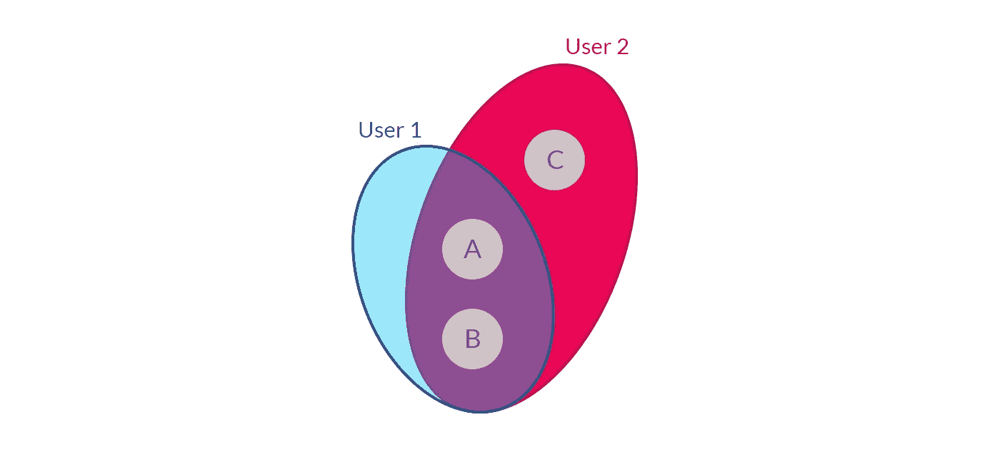
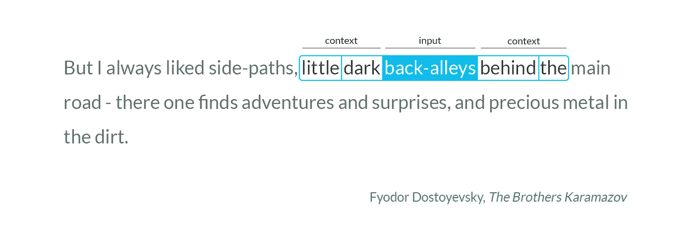
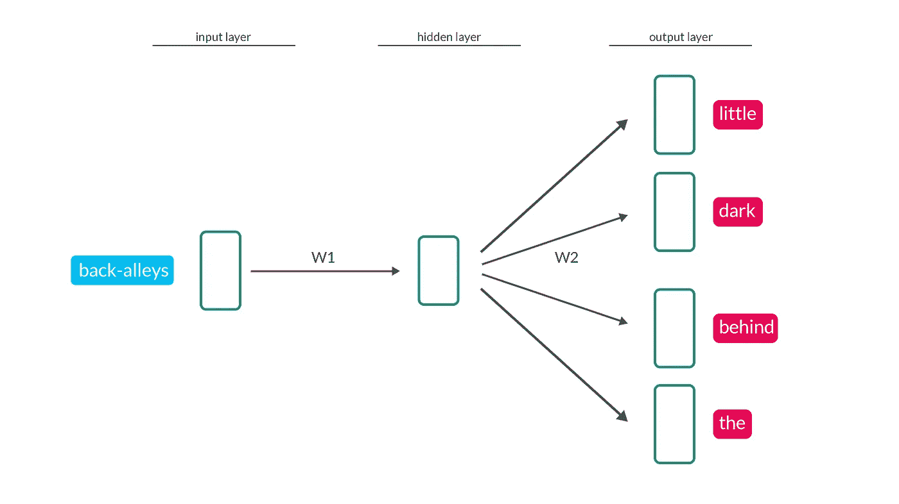
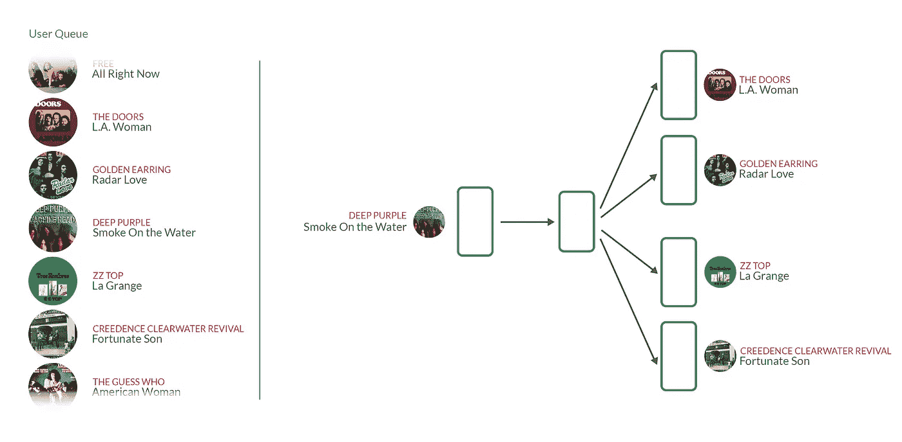
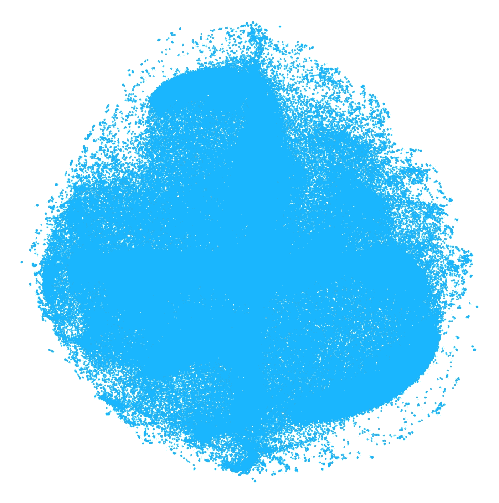
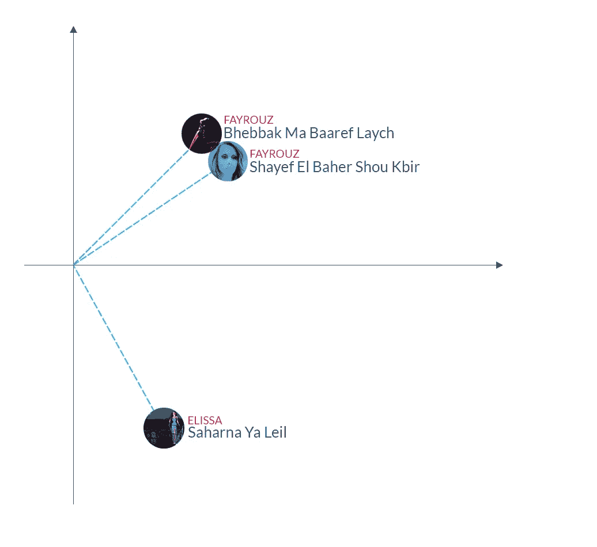

# 使用 Word2vec 进行音乐推荐

> 原文：<https://towardsdatascience.com/using-word2vec-for-music-recommendations-bb9649ac2484?source=collection_archive---------3----------------------->

## 我们如何使用神经网络将数十亿条数据流转化为更好的推荐。

Each point represents a song. The closer the points, the more similar the songs are.

流媒体服务改变了我们体验内容的方式。虽然推荐系统以前专注于向您提供您可能想要购买以供以后消费的内容，但现代流媒体平台不得不转而专注于推荐您可以并且想要立即享受的内容。由于任何内容都可以立即访问，流媒体模型使得个性化电台或推荐播放列表形式的新发现方法成为可能，其中现在的重点是生成可以很好搭配的相似歌曲序列。

现在每月有超过 7 亿首歌曲在流媒体上播放， **Anghami** 是中东和北非地区领先的音乐流媒体平台。这也意味着，所有这些数据流产生的数据量被证明是一个非常宝贵的训练集，我们可以用它来教机器学习模型更好地理解用户的口味，并改进我们的音乐推荐。

在这篇文章中，我将介绍一种神经网络方法，我们使用它从我们拥有的大量流媒体数据中提取歌曲嵌入，以及我们如何使用该模型来生成相关的推荐。

# **推荐系统**

推荐系统分为两大类:

*   **基于内容的系统**是基于我们想要推荐的商品特征的推荐系统。当谈到音乐时，这包括例如歌曲的类型或每分钟多少拍。
*   **基于协同过滤的系统**是依靠历史使用数据来推荐其他类似用户先前已经交互过的项目的系统。这些系统不理会内容本身的特征，并且将它们的推荐基于这样的原则，即拥有许多共同歌曲或艺术家的人通常会喜欢相同风格的音乐。

有了足够的数据，协同过滤系统在推荐相关项目上证明是有效的。协同过滤背后的基本思想是，如果用户 1 喜欢艺术家 A & B，而用户 2 喜欢艺术家 A B&C，那么很可能用户 1 也会对艺术家 c 感兴趣

观察所有用户的全球歌曲偏好，并应用经典的协作过滤方法，例如对用户项目评级矩阵进行矩阵分解，这为我们提供了关于歌曲组如何相关的有价值的信息。所以如果一群用户有一大套他们喜欢的共同的歌曲，我们可以推断那些是对音乐有非常相似品味的用户，他们听的歌曲彼此相似。

这些跨多个用户的全球共现因此给了我们关于歌曲如何相关的有价值的信息；然而，他们没有捕捉到的一件事是，歌曲如何能够在时间上局部地同时出现。所以他们可能会告诉我们，宋立科 A 的用户也可能会宋立科 B，但他们会在同一个播放列表或收音机里听吗？因此，我们不仅可以看到用户一生中播放的歌曲，还可以看到他们在什么环境下播放这些歌曲。或者换句话说，在同一个会话中，他们还会在之前或之后播放哪些歌曲？

所以我们感兴趣的是一个模型，它不仅能捕捉到相似的人对什么歌曲普遍感兴趣，还能捕捉到在非常相似的背景下 T2 经常一起听什么歌曲。这就是 Word2vec 的用武之地。

# **那么……什么是 Word2vec？**

Word2vec 是一类神经网络模型，最初用于学习对自然语言处理任务非常有用的单词嵌入。近年来，该技术还被应用于更一般的机器学习问题，包括产品推荐。神经网络接收大量文本，对其进行分析，并为词汇表中的每个单词生成一个代表该单词的数字向量。这些数字向量正是我们所追求的，因为正如我们将会看到的，它们编码了与单词出现的上下文相关的单词含义的重要信息。

定义了两个主要模型:连续词袋模型和跳跃式模型。在接下来的讨论中，我们将把自己限制在 **Skip-gram** 模型，因为这是我们使用的模型。

**Word2vec Skip-gram** 模型是一个具有单一隐藏层的浅层神经网络，它将一个单词作为输入，并试图预测其周围单词的上下文作为输出。让我们以下面这句话为例:

在上面的句子中，单词“back-lanches”是我们当前的输入单词，单词“little”、“dark”、“behind”和“the”是我们在给定输入单词的情况下想要预测的输出单词。我们的神经网络看起来像这样:

**W1** 和 **W2** 表示权重矩阵，用于控制我们应用于输入以获得输出的连续变换的权重。训练神经网络包括学习那些权重矩阵的值，这些值为我们提供最接近所提供的训练数据的输出。

给定一个输入单词，我们通过网络进行第一次前向传播，以获得输出单词是我们根据训练数据所期望的单词的概率。因为我们确切地知道在输出端我们期望什么样的单词，所以我们可以测量预测中的误差，并且使用反向传播通过网络传播该误差，并且通过随机梯度下降调整权重。通过这一步，我们稍微修改了 **W1** 和 **W2** 的值，因此它们可以更准确地预测给定示例输入单词时我们想要的输出单词。完成这一步后，我们将上下文窗口移到下一个单词，并再次重复上述步骤。

我们对训练集中的所有句子重复上述过程。当我们完成时，权重矩阵的值会收敛到产生最准确预测的值。

**有趣的部分来了:**如果两个不同的单词在相似的上下文中大量出现，我们预计，给定这两个单词中的任何一个作为输入，神经网络将输出非常相似的预测作为输出。我们之前提到过，权重矩阵的值控制输出端的预测，因此如果两个单词出现在相似的上下文中，我们希望这两个单词的权重矩阵值在很大程度上是相似的。

特别地，权重矩阵 **W1** 是一个具有与我们的词汇表中的单词一样多的行的矩阵，每行保存与特定单词相关联的权重。所以，既然相似的词需要输出相似的预测，那么它们在矩阵 **W1** 中的行应该是相似的。与这个矩阵中的每个单词相关联的权重是我们将要用来表示该单词的“嵌入”。

但是这和音乐推荐有什么关系呢？好吧，我们可以把用户的收听队列想象成一个句子，句子中的每个单词就是用户听过的一首歌。因此，在这些句子上训练 Word2vec 模型本质上意味着，对于用户过去听过的每首歌曲，我们使用他们之前和之后听过的歌曲来教导我们的模型，这些歌曲在某种程度上属于相同的上下文。这里有一个用歌曲代替单词的神经网络的想法:

这是与上面讨论的文本分析相同的方法，除了我们现在为每首歌曲有一个唯一的标识符，而不是文本单词。

在训练阶段结束时，我们得到的是一个模型，其中每首歌曲都由高维空间中的权重向量表示。关于这些向量有趣的是，相似的歌曲将比不相关的歌曲具有更接近的权重。

# **宋矢用例**

使用 Word2vec，我们已经将寻找出现在相似上下文中的歌曲的问题转化为捕捉这些局部共现的数学数字。我们可以将权重视为高维空间中的坐标，每首歌曲由该空间中的一个点来表示。这个空间由几十个维度定义，作为人类我们不容易想象，但我们可以使用维度缩减技术，如 **t-SNE** 将高维向量缩减为 2 维，并将其绘制在图表上:

上图中的每个点代表一首歌，点与点之间的距离越近，歌曲越相似。

这些向量可以以多种方式使用，例如，作为其他机器学习算法的输入特征，但是它们也可以单独用于查找相似的歌曲。

正如我们之前提到的，两首特定的歌曲在相似的上下文中出现的次数越多，它们的坐标就越接近。因此，给定一首特定的种子歌曲，我们可以通过取该种子歌曲和所有其他歌曲的向量之间的余弦相似性来找到 *k* 首其他相似的歌曲，同时保留具有最高余弦的前 *k* 首歌曲(其对应于最低的角度，因此最相似)。例如，黎巴嫩经典歌手 Fayrouz 的 *Shayef El Baher Shou Kbir* 和同一歌手的 *Bhebbak Ma Baaref Laych* 之间的余弦相似度为 0.98，而现代黎巴嫩流行艺术家 Elissa 的 *Shayef El Baher Shou Kbir* 和 *Saharna Ya Leil* 之间的相似度仅为-0.09。这是有道理的，因为听 Fayrouz 等经典歌曲的人不太可能在排队时将它们与 Elissa 的流行音乐交替播放。

我们可以使用歌曲向量的另一种有趣的方式是将用户的收听习惯映射到这个空间，并基于此生成推荐。既然我们现在在处理向量，我们可以用基本的算术将向量相加。让我们以听了三首歌的用户为例:基顿·汉森的《早晨的*、伦敦文法学院的《浪费我的青春的*和女儿的*青春的*。我们能做的是得到对应于这三首歌中每一首的向量，然后将它们平均在一起，找到一个与这三首歌等距的点。我们所做的基本上是将用户已经听过的歌曲列表转换成坐标向量，该坐标向量在我们的歌曲所在的相同向量空间中表示用户。现在我们有了一个定义用户的向量，我们可以使用以前使用的相同技术来查找与用户相近的相似歌曲。以下动画有助于形象化地展示生成这些建议所涉及的不同步骤:**

****

**我们发现诸如《头和心在山谷中》、狐狸乐队的*、米克诺斯的*和本·霍华德的*小事情*等歌曲都与我们的输入歌曲具有相同的独立民谣风格。请记住，我们所做的这一切不是基于对音频声学的研究，而是通过简单地查看其他人在这些特定歌曲周围听过的歌曲。**

# ****结论****

**Word2vec 允许我们用一个坐标向量精确地模拟每首歌曲，这个坐标向量捕捉了这首歌曲播放的上下文。这使得我们可以轻松地识别相似的歌曲，并使用向量算术来找到定义每个用户的向量。**

**Word2vec vectors 目前与其他音乐推荐功能模型一起用于生产，主要用于基于用户收听习惯的音乐发现。所以，下次你通过推荐发现一首好歌时，想想在你之前有成千上万的人演奏过这首歌，他们接下来还会演奏哪首你最喜欢的歌曲。**

***想成为这样有趣故事的一部分吗？* [*我们在招聘*](https://anghami.com/jobs) *！***