# 使用 XGBoost 预测献血量，而无需使用 Dataiku 编写任何代码

> 原文：<https://towardsdatascience.com/using-xgboost-to-predict-blood-donations-without-writing-any-code-using-dataiku-1d7c9af82087?source=collection_archive---------8----------------------->

我决定用一个类似 Kaggle 的比赛的数据集来测试[Data taiku 的](https://www.dataiku.com/)数据科学工作室技术，这个比赛是由一个叫做[驱动数据](https://www.drivendata.org/)的组织举办的。驱动数据主办数据科学竞赛，以解决具有社会影响的问题。

Dataiku 为清理数据、训练模型和部署模型提供了编码环境和点击式界面。

我想比较在 Jupyter 笔记本中手动编写每一步代码与使用 Dataiku 的点击界面，并尝试回答以下问题:

1.  使用点击式界面会显著提高我的工作效率吗
2.  我会得到更好的结果吗？
3.  我会被介绍到通常不属于我的标准剧目的新算法吗？

我从一个竞赛中挑选了一个超级简单的数据集来预测谁会[献血](https://www.drivendata.org/competitions/2/warm-up-predict-blood-donations/)，然后开始在大台库工作。在这篇博文中，我将概述我是如何使用 Dataiku 的，学到了什么，我的最终结果和我的结论。

# 清理数据

在大台库清理数据其实挺容易的，甚至“好玩”！而不是煞费苦心的把字符串编码成类别，整数等。在熊猫身上，大太酷是自动完成的。我喜欢这个功能。

**加载数据集:**

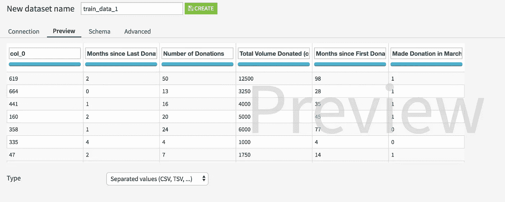

注意—不要在此界面中更改列名。如果有必要，可以稍后在脚本中完成。否则，当您加载您的测试数据时，您将不得不再次手动更改名称，否则模型将无法工作。

**快速统计和直方图:**

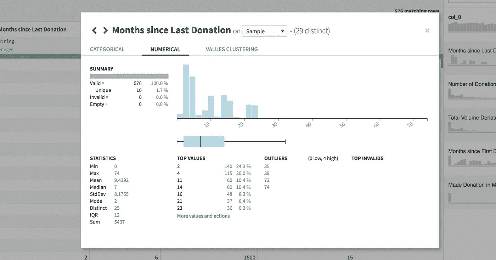

你可以很容易地点击任何功能，以获得快速统计和直方图。虽然这很酷，但不利的一面是，当信息太容易获取时，你可能会花更少的时间来真正消化它。我还发现直方图格式比使用旧的 matplotlib 更难阅读。 *(Matplotlib 是 Python 的开源数据可视化工具。)*

**基础数据准备:**

Dataiku 正确地猜到我的字符串应该被转换成整数。以下是下拉菜单中的其他快捷选项。同样，如果您打算使用具有相同原始模式的附加数据集，请不要在这里进行更改。

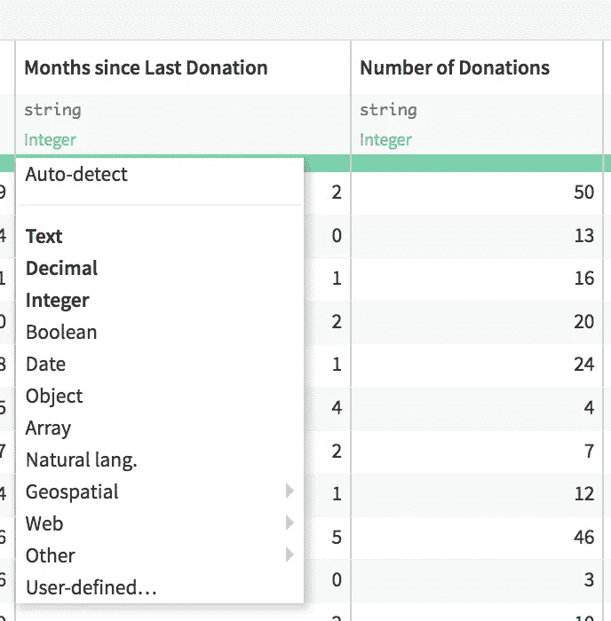

你也可以做其他漂亮的事情，比如过滤、排序、着色。这对于了解数据非常有用。

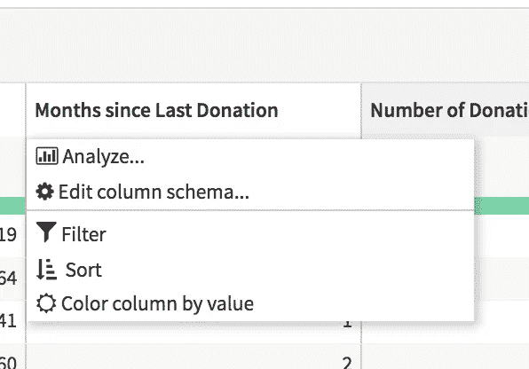

# 数据探索

是时候做一些散点图和条形图了！只是拖放。您可以存储图表、下载图表并将其发布到仪表板。这很方便，但是当然你需要花时间去学习这个软件的功能，并且熟练地使用它。

不利的一面是，如果你已经掌握了 matplotlib，对你的图表没有相同程度的控制是令人沮丧的。此外， [Seaborn](https://seaborn.pydata.org/) (另一个 python 可视化库)有一个叫做 pairplot 的漂亮函数，让你使用一行代码生成一个散点图矩阵，其中包含你的所有特征。据我所知，这里你必须一次创建一个散点图。

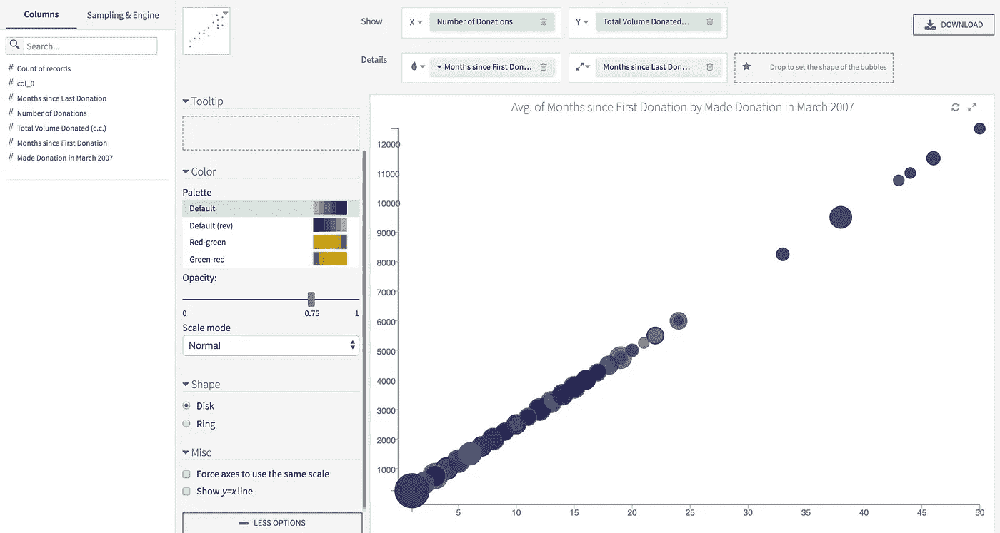

我对数据探索功能的另一个批评是，我无法像在 Jupyter Notebook 中那样系统地展示我的分析和评论。Jupyter 笔记本让你创建一个按时间顺序排列的记叙文来记录你的整个思考过程。

然后，我发现了 Dataiku 的“仪表板”功能。这种“排序”让你建立一个叙述，通过保存你的图表作为一个仪表板的瓷砖，并添加到每个瓷砖的洞察力。然而，你不能同时查看你的‘洞察力’和你的图表，我觉得这有点烦人。我也更喜欢年表，而不是瓷砖的排列，但也许我可以及时适应这个新系统。

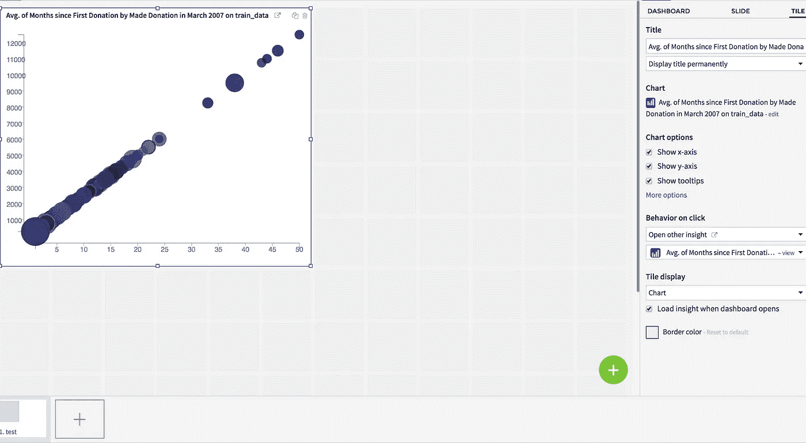

现在，Dataiku 的一个非常好的功能是，如果你对点击太不耐烦，你可以随时跳到 Jupyter 笔记本上做你的事情。

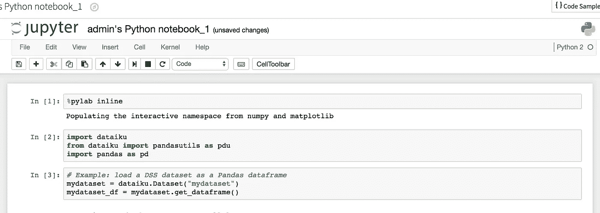

# 建模时间！

现在是时候去“实验室”做一些功能工程和建模了。你可以做一个“视觉分析”，即点击，使用空白笔记本，或使用预定义的笔记本。

这里有几个截图，让你知道有什么可用的。Dataiku 还有额外的“插件”,你可以用它来获得更多预定义的选项，比如处理 Twitter 数据。

Keep it simple — do you want to predict or cluster?

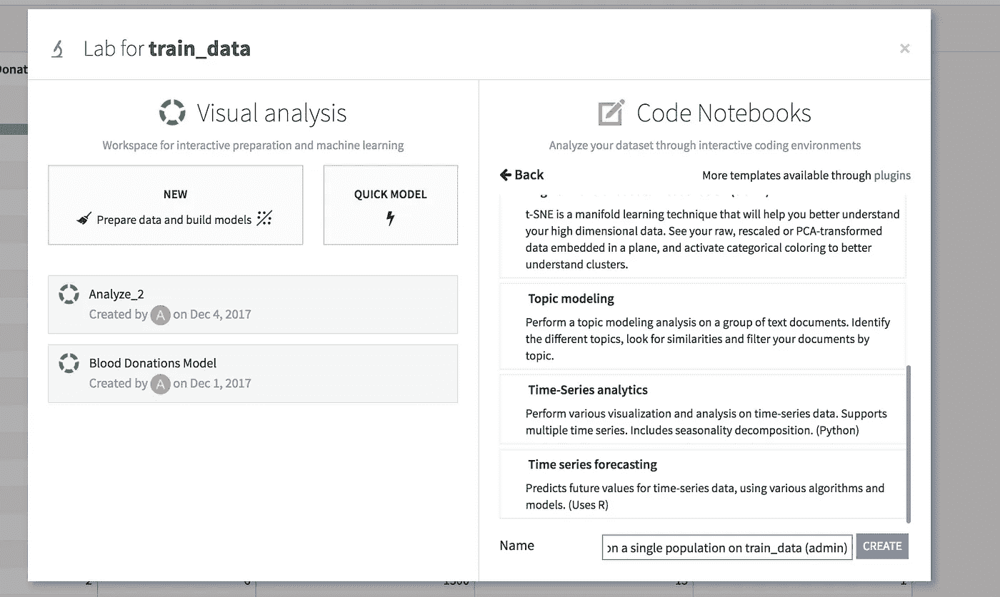

Do some topic modeling, PCA, time-series forecasting, etc. in a prebuilt note book. Or just get a blank notebook up and running.

我将向您展示我是如何使用可视化分析选项对数据建模的。

## 创建数据预处理脚本

首先，我创建了一个脚本来处理我的数据。这里，我删除了一个列，因为它与另一个列完全相关，并且我创建了一个每月捐款的新特性。

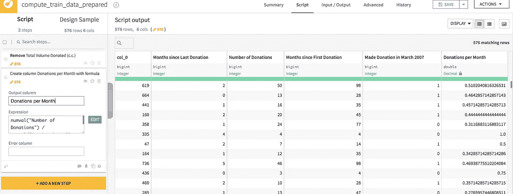

当你点击“添加新步骤”时，你会得到大量的选项。坦率地说，这些选项给了我新的想法，让我知道我可以用这些数据做些什么，这是我以前可能没有想到的。此外，这个接口减少了大量的时间，否则你可能要花在弄清楚如何编写代码来实现你伟大的特性工程思想

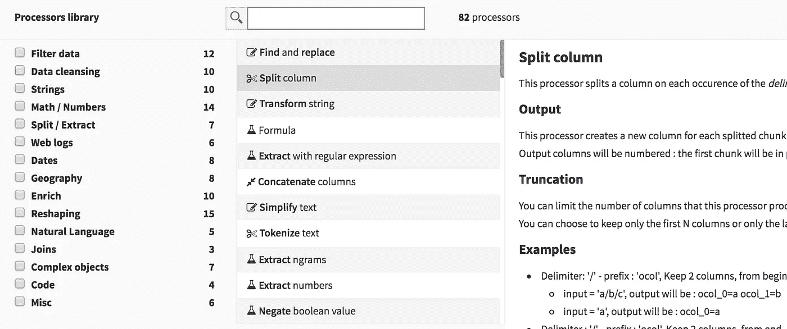

我认为，如果人工智能可以查看我的数据，并根据文献给我具体的建议，以实现更好的特征工程，那将是绝对美妙的。

一旦您完成了数据预处理，请确保将脚本部署到您的“流”中，以便它可以在您的测试数据中重用，等等。

## 运行一些模型

使用 Dataiku(我认为是所有的数据科学平台),你可以同时训练多个模型，并方便地为你总结所有的统计数据。

这里有一些截图，让你知道什么是可能的。对建模功能可以做的每一件事做一个深入的教程太多了。如果您想了解更多，Dataiku 有一个免费层，可以让您了解该产品。

玩你的功能和运行许多模型是非常容易的。优化参数的网格搜索在后台自动完成，但您也可以自己调整参数。

这里的另一个便利是不必自己下载和安装某些算法的包。例如，我在让 XGBoost 工作时遇到了很多麻烦，所以不用在这里处理安装问题就很好了。

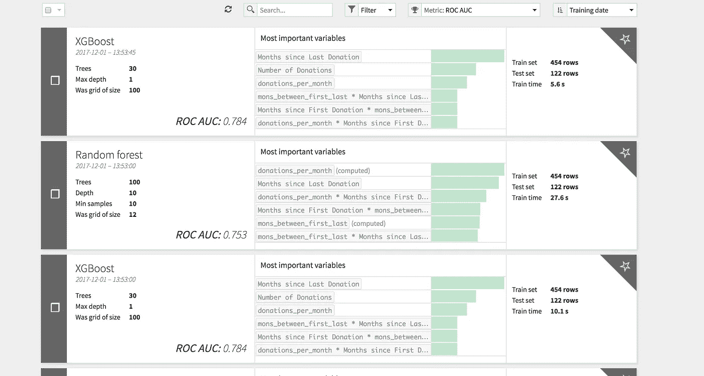

一个方便的并排比较分数！我运行的模型比这多得多，但这个截屏只显示了其中的几个。

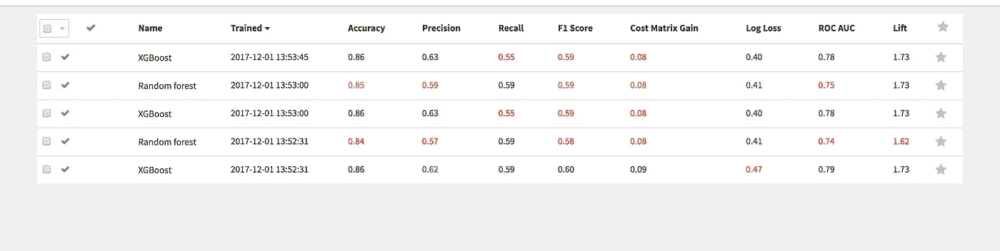

查看每个型号的功能重要性和其他详细信息。

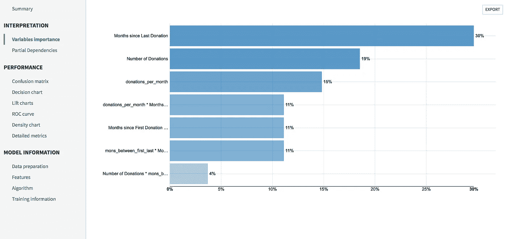

不看看自己的困惑矩阵，就不能称自己是数据科学家。

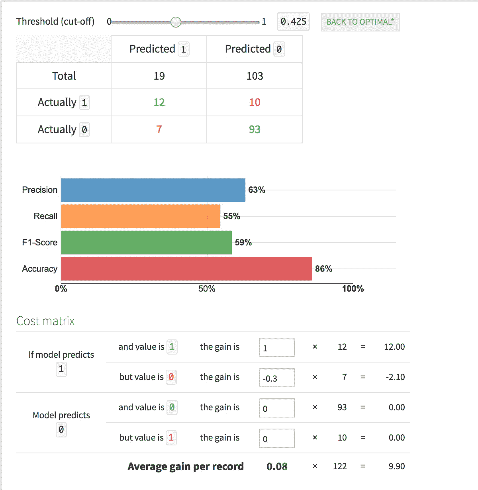

我希望我可以在彼此之上绘制多条 ROC 曲线，这样我就可以同时看到所有的模型。

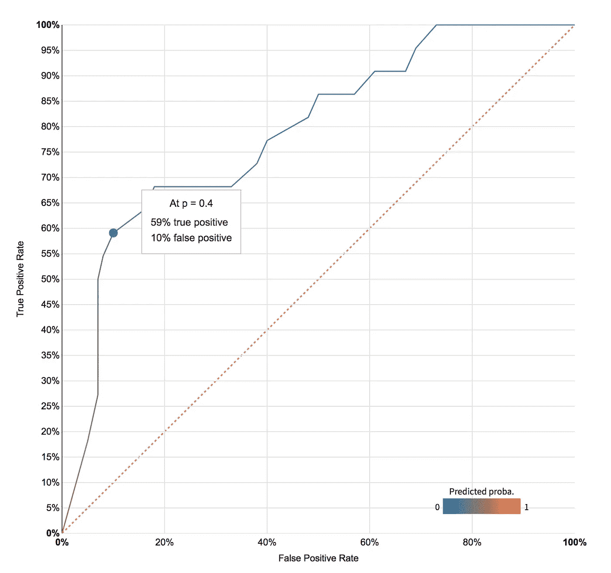

这个自动特征生成“功能”也非常棒。

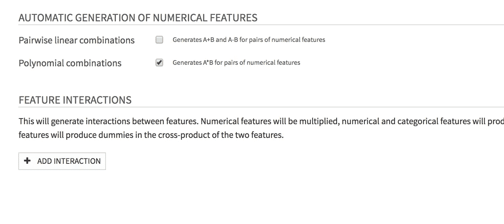

还有很多，但这些是我的亮点。同样，太容易获得所有这些信息的缺点是，你可能会跳过一些步骤，花更少的时间来真正消化正在发生的事情。有了这个界面，就很难创建一个叙述来记录你的思维过程。下一次我想我会打开一个记事本来整理我的思绪。

# 部署您的模型并对测试数据进行评分

《大台库》中有两个概念理解起来很重要，我还没有涉及到:“菜谱”和“流量”。下图中的黄色小扫帚代表了数据清理的方法(我们之前部署的脚本/步骤)。绿色图标代表模型、预测和评分。

正如你在这里看到的，我把我的训练数据，做一些数据清理，训练一个模型，然后用在测试数据上。然后，我获取测试数据，运行数据准备程序，然后进行评分。我还在测试数据的最后做了一个额外的数据准备步骤，为 DrivenData 竞赛提交做准备。

这无疑(现在仍然有点)令人困惑。但是，我认为一旦你掌握了窍门，这一切真的很有意义。

所有这一切的美妙之处在于，您可以在您的流程中使用点击和编码方法！所以，你可以两全其美。我觉得这很酷。

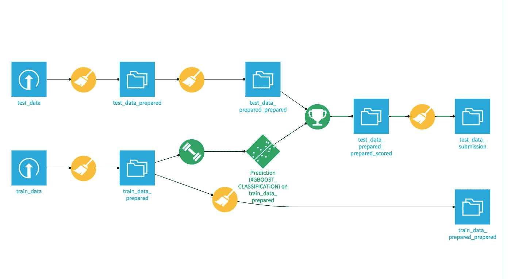

Flow

Recipes

# 附加功能

Dataiku 还具有更多功能，可用于构建 web 应用程序、自动化任务、监控、创建实时预测 API 等。

# 比赛结果

我向比赛提交了我的测试数据，得到了以下结果。

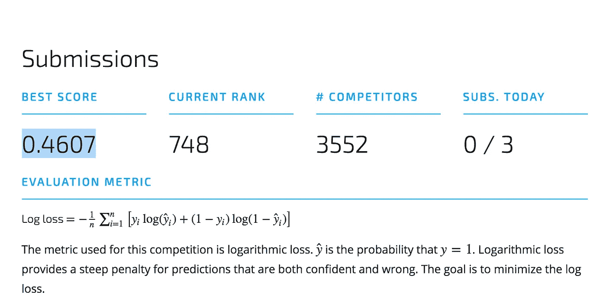

这是一位领导者的 [github repo](https://github.com/drivendataorg/blood-donations/tree/master/George) (截至 2017 年 1 月)，他使用各种算法记录了他的模型结果。作为直接比较，你可以看到他的 [XGBoost 模型的笔记本。](https://github.com/drivendataorg/blood-donations/blob/master/George/XGBoost.ipynb)他的原木损耗分数是 0.4851，而我使用大台库的原木损耗分数是 0.4607(越低越好)。

如果你想看到更多的比较，这是与各种[竞赛领导者](https://github.com/drivendataorg/blood-donations)提交的代码链接的回购。我想我可以通过尝试这些回复中的功能工程思想来大大提高我的分数。

# 结论

让我们重温一下我最初的问题。

1.  大台库让我更有生产力了吗？是啊！我认为使用 Dataiku 进行分析所花的时间比编写代码要少得多，即使有学习 Dataiku 的加速时间。
2.  大台库让我得到了比其他方式更好的结果吗？不是 100%确定，但我认为是这样，因为所有的自动优化工具在后台做的。
3.  我接触到新算法了吗？不完全是。我没有展示完整的列表，但是他们所有的预烤的都已经在我的 repetoire 里了。相比之下，我看到了一个[数据机器人](https://www.datarobot.com/)(一个竞争的数据科学平台)演示，其中有相当多我以前从未听说过的算法。

总体而言，我对数据科学“平台”有什么看法？

我认为，一旦你掌握了技术并有了一个好的工作流程，使用数据科学平台会是一个很大的优势。它允许您:

1.  多思考，少编码。
2.  更快获得结果。
3.  让非编码人员掌握领域专业知识

我很想听听其他人对数据科学平台的体验。我希望你喜欢这篇文章，如果你有任何问题，请随时联系我。