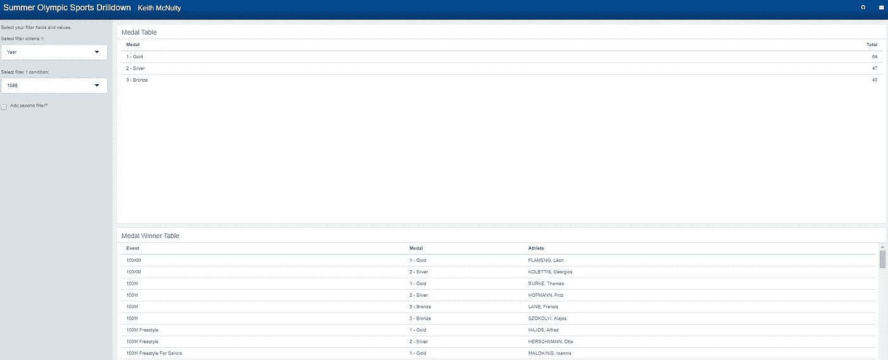

# 利用 quosures 在 R Shiny 中创建超灵活的过滤控件

> 原文：<https://towardsdatascience.com/utilizing-quosures-to-create-ultra-flexible-filtering-controls-in-r-shiny-f3e5dc461399?source=collection_archive---------5----------------------->

我构建了很多闪亮的应用程序，其中一个常见的用途是允许动态过滤底层数据，这样你就可以根据感兴趣的特定子集来调整图表或表格。

通常，我们将过滤选项硬编码到某种形式的侧边栏菜单中，并为感兴趣的字段定义输入选项列表。例如，如果我们正在过滤`mtcars`数据集，我们可能会在 UI 端提供这样的输入选项列表:

```
shiny::selectInput('cyl', "Select no of cylinders", choices = mtcars$cyl %>% unique() %>% sort())
```

然后我们可以在服务器端使用`input$cyl`过滤`mtcars`，例如:

```
df <- shiny::reactive({
   mtcars %>% dplyr::filter(cyl == input$cyl)
})
```

我一直致力于创建一个更通用的结构，它允许完全灵活的动态过滤系统(类似于 MSExcel 电子表格中的过滤)，允许用户选择他们希望过滤的任何字段，以及他们感兴趣的任何字段值。我还想对它进行设置，以便它可以通用地应用于任何数据集，只需要用户指定数据集和允许过滤的列名子集。

## 闪亮输入的参照透明度

为了做到这一点，我们必须避开非标准的评估问题。在上面的`mtcars`示例中，`cyl`与`input$cyl`的处理方式不同。`cyl`在`mtcars`的上下文中是引用透明的，但是`input$cyl`作为输入变量被传递，其值被引用。例如，如果我们选择`input$cyl = 6`，这将被解释为我们在 dplyr 中所期望的:

```
df <- mtcars %>% dplyr::filter(cyl == '6')
```

这很好，但是如果我们想选择这个列作为闪亮的输入呢？例如，您可能希望您的用户能够选择 20 或 30 个不同的列进行筛选。也许我们可以为要过滤的选定列创建一个`input$col`,为选定的值创建一个`input$val`,如下所示:

```
df <- shiny::reactive({
   mtcars %>% dplyr::filter(input$col == input$val)
})
```

嗯，不，我们不能，因为`input$col`是作为引用值传递的，并且不是引用透明的。

这就是 quosures 真正有用的地方，它可以让你抽象出你的过滤能力(以及你的分组、选择和所有其他我们喜欢的关于`dplyr`的可爱的事情)。

考虑设置以下简单函数，允许您选择要筛选的列和值:

```
filter1_by <- function(df, fcol1, fv1) {

  filter_var1 <- dplyr::quo(fcol1) df %>% filter_at(vars(!!filter_var1), all_vars(. == fv1))}
```

这个简单的小函数允许我们使用`filter_at()`将列选择(`fcol1`)与值选择(`fval1`)分开处理。`fcol1`现在被捕获为带引号的表达式及其环境，使其在引用上透明，然后我们简单地使用`!!` (bangbang)操作符去掉引号，这样`dplyr`就可以接受不带引号但在引用上透明的列名。

不用说，这可以扩展到从任意数量的列中选择任意数量的输入进行过滤。例如，允许三个过滤器的函数如下所示:

```
filter3_by <- function(df, fcol1, fv1, fcol2, fv2, fcol3, fv3) {
  filter_var1 <- dplyr::quo(fcol1)
  filter_var2 <- dplyr::quo(fcol2)
  filter_var3 <- dplyr::quo(fcol3)df %>% 
     filter_at(vars(!!filter_var1), all_vars(. == fv1)) %>% 
     filter_at(vars(!!filter_var2), all_vars(. == fv2)) %>%
     filter_at(vars(!!filter_var3), all_vars(. == fv3))
)
```

## 让我们构建一个完整的示例

让我们继续使用`mtcars`构建一个完整的例子。假设我们希望用户能够从`mtcars`中的任何可用列中选择三列进行过滤。

我们首先从`mtcars`的列名创建一个向量，我们将使用它作为我们的初始输入选择:

```
fields <- colnames(mtcars)
```

让我们设置三个函数来基于一列、两列或三列进行筛选:

```
# filter on 1 columnsfilter1_by <- function(df, fcol1, fv1) {
  filter_var1 <- dplyr::quo(fcol1)df %>% 
     filter_at(vars(!!filter_var1), all_vars(. == fv1))
)# filter on 2 columnsfilter2_by <- function(df, fcol1, fv1, fcol2, fv2) {
  filter_var1 <- dplyr::quo(fcol1)
  filter_var2 <- dplyr::quo(fcol2)df %>% 
     filter_at(vars(!!filter_var1), all_vars(. == fv1)) %>% 
     filter_at(vars(!!filter_var2), all_vars(. == fv2))
)# filter on 3 columnsfilter3_by <- function(df, fcol1, fv1, fcol2, fv2, fcol3, fv3) {
  filter_var1 <- dplyr::quo(fcol1)
  filter_var2 <- dplyr::quo(fcol2)
  filter_var3 <- dplyr::quo(fcol3)df %>% 
     filter_at(vars(!!filter_var1), all_vars(. == fv1)) %>% 
     filter_at(vars(!!filter_var2), all_vars(. == fv2)) %>%
     filter_at(vars(!!filter_var3), all_vars(. == fv3))
)
```

现在，让我们构建一个闪亮的输入结构，允许我们至少过滤一列，但最多三列，使用复选框允许用户决定他们是否需要额外的过滤器:

```
shiny::mainPanel(
  # select first filter column from fields vector 
  shiny::selectInput("filter1", "Select filter column 1:", 
                     choices = fields),
  # reference a uiOutput that will offer values for first column
  shiny::uiOutput("filter1choice"),
  # offer a checkbox to allow user to select a second filter
  shiny::checkboxInput("filter2req", "Add second filter?"),
  # set further conditional panels to appear in the same fashion
  shiny::conditionalPanel(condition = 'input.filter2req', 
                          shiny::uiOutput("filter2eval"),
                          shiny::uiOutput("filter2choice"),
                          shiny::checkboxInput("filter3req", 
                                               "Add third filter?")),
  shiny::conditionalPanel(condition = 'input.filter3req & 
                                       input.filter2req', 
                  shiny::uiOutput("filter3eval"),
                  shiny::uiOutput("filter3choice"))

)
```

现在我们需要构建`uiOutputs`,它根据所选的过滤器列进行填充，并对已经选择的内容进行响应:

```
# vector of picklist values for the first selected filter 
choicevec1 <- reactive({
    mtcars %>%  dplyr::select(input$filter1) %>% unique() %>% dplyr::arrange_(input$filter1)
})# renders the picklist for the first selected filter
output$filter1choice <- renderUI(
  selectizeInput("filter1val", "Select filter 1 condition:", choices = choicevec1(), multiple = TRUE)
)# second column chosen from all remaining fields
output$filter2eval <- renderUI({
  selectInput("filter2", "Select filter criteria 2:", choices = sort(fields[fields != input$filter1]))
})# vector of picklist values for the second selected filter
choicevec2 <- reactive({
    filter1_by(mtcars, input$filter1, input$filter1val) %>% 
                       dplyr::select(input$filter2) %>% 
                       unique() %>% 
                       dplyr::arrange_(input$filter2)
})# renders picklist for filter 2
output$filter2choice <- renderUI(
  selectizeInput("filter2val", "Select filter 2 condition:", choices = choicevec2(), multiple = TRUE)
)# third column selected from remaining fields
output$filter3eval <- renderUI({
  selectInput("filter3", "Select filter criteria 3:", choices = sort(fields[!fields %in% c(input$filter1, input$filter2)]))
})# vector of picklist values for third selected column
choicevec3 <- reactive({
    filter2_by(mtcars, input$filter1, input$filter1val, 
               input$filter2, input$filter2val) %>% 
               dplyr::select(input$filter3) %>% 
               unique() %>% 
               dplyr::arrange_(input$filter3)
})# render picklist for filter 3
output$filter3choice <- renderUI(
  selectizeInput("filter3val", "Select filter 3 condition:", choices = choicevec3(), multiple = TRUE)
)
```

所以这就是我们在 UI 端需要做的全部。

在服务器端，我们现在只需要根据选择的输入定义我们需要的过滤器:

```
filtered_mtcars <- reactive({ # case when all three filters are used
  if (input$filter3req & input$filter2req) {
    filter3_by(mtcars, input$filter1, input$filter1val, 
               input$filter2, input$filter2val,
               input$filter3, input$filter3val) 
  } else if (input$filter2req) {
  # case when two filters are used
    filter2_by(mtcars, input$filter1, input$filter1val, 
               input$filter2, input$filter2val) 
  } else {
  # case when only one filter is used   
    filter1_by(mtcars, input$filter1, input$filter1val)
  }})
```

现在你可以显示你的反应数据框`filtered_mtcars()`或者在上面进行操作。

## 在实践和进一步发展中使用这种方法

这些功能可以很容易地移植到你正在设计的任何需要这种灵活过滤的应用程序中。通过简单地编写进一步的函数`filter4_by`、`filter5_by`等，您可以轻松地扩展到更多的过滤器选择。您还可以通过使用`selectizeInput()`并将`==`替换为`filter_at()`中的`%in%`来轻松调整选项列表中的多值选择。

见[这里](https://keith-mcnulty.shinyapps.io/summer_olympics/)一个非常简单的演示应用程序，我构建了显示奥运会奖牌统计，允许多达三个过滤器。Github 的代码是[这里是](https://github.com/keithmcnulty/summer_olympics/blob/master/index.Rmd)。



你能帮助改善这一点吗？理想情况下，我们只需要一个如下所示的过滤函数，而不是编写所有这些独立的函数`filter1_by`、`filter2_by`等:

```
filter_by <- function (df, ...) {
  filter_conditions <- quos(...)
  df %>% dplyr::filter(!!!filter_conditions)
}
```

其中输入是条件列表。这些输入将需要某种调整来应对非标准的评估，但我还没有想出它们应该如何措辞。

如果你破解了就告诉我。

最初我是一名纯粹的数学家，后来我成为了一名心理计量学家和数据科学家。我热衷于将所有这些学科的严谨性应用到复杂的人的问题上。我也是一个编码极客和日本 RPG 的超级粉丝。在[*LinkedIn*](https://www.linkedin.com/in/keith-mcnulty/)*或*[*Twitter*](https://twitter.com/dr_keithmcnulty)*上找我。*