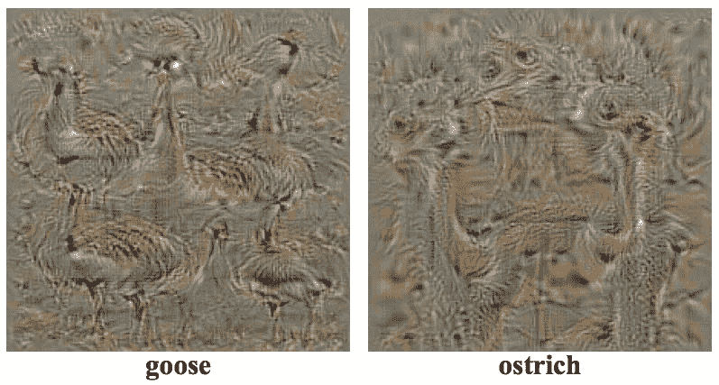
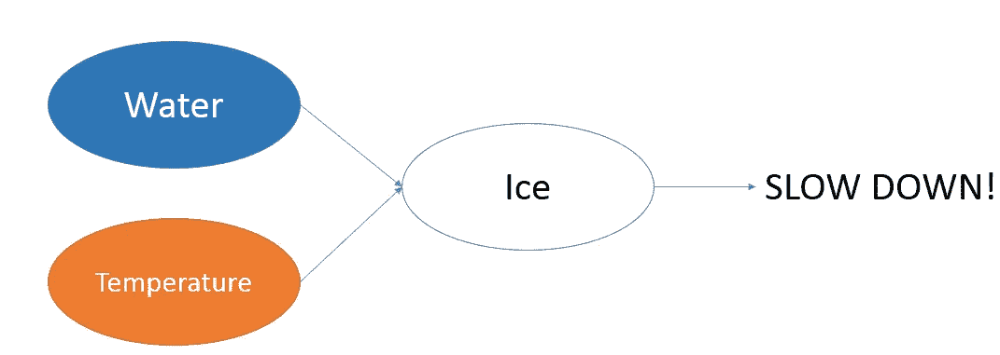

# 数据科学家和人工智能产品 UX 设计指南

> 原文：<https://towardsdatascience.com/ux-design-guide-for-data-scientists-and-ai-products-465d32d939b0?source=collection_archive---------3----------------------->

当查找 UX 人工智能产品的设计策略时，我几乎没有找到相关的资料。在我发现的少数几个中，大部分要么过于专业，要么完全专注于 web UIs 的视觉设计。我遇到的关于这个主题的最好的文章是 [Vladimir Shapiro](https://medium.com/@vshapiro24) 的“ [UX 的《人工智能:作为设计挑战的信任》](https://medium.com/sap-design/ux-for-ai-trust-as-a-design-challenge-62044e22c4ec)”和 [Dávid Pásztor](https://uxstudioteam.com/ux-blog/author/pasztord/) 的“[人工智能 UX:设计好的人工智能产品的 7 个原则](https://uxstudioteam.com/ux-blog/ai-ux/)”。意识到 UX 设计师和数据科学家之间存在着合理的知识差距，我决定尝试从数据科学家的角度来解决这些需求。因此，我的假设是读者对数据科学有一些基本的了解。对于几乎没有数据科学背景的 UX 设计师来说，我避免使用复杂的数学和编程(尽管我鼓励阅读迈克尔·加拉尼克的《如何建立数据科学组合》和我的《数据科学面试指南》。

人工智能正在接管我们日常生活的几乎每个方面。这将改变我们的行为方式以及我们对这些产品的期望。作为设计师，我们的目标是创造有用、易于理解的产品，为这个阴暗的新世界带来清晰。最重要的是，我们想用人工智能的力量让人们的生活变得更轻松、更快乐。

# 确定关键目标

甚至在我们试图设计我们的产品之前，我们需要理解我们的产品试图解决的整体商业模式。一些常见的问题是:

*   该模型试图解决什么业务问题？是分类问题还是回归问题？
*   谁是最终用户？他们是技术性的还是非技术性的？他们期望从该产品中获得什么价值？
*   数据是什么？数据是静态的还是动态的？模型是基于状态的还是无状态的？正在收集的数据的粒度和质量如何？我们如何最好地表达这些信息？对数据使用是否有监管限制，如 [PCI](https://www.pcisecuritystandards.org/) 、 [HIPAA](https://www.hhs.gov/hipaa/index.html) 或 [GDPR](https://gdpr-info.eu/) ？
*   这种模式的更大含义是什么？市场有多大？这个市场的其他参与者是谁？他们是在称赞你的产品还是直接竞争对手？转换成本是多少？需要考虑哪些关键的监管、文化、社会经济和技术趋势？

更好地了解最终产品将使我们能够更有效地满足需求。我推荐一些关于这个主题的书，如伯纳德·马尔的《智能公司:基于证据的管理成功的五个步骤》和亚历山大·奥斯特瓦尔德的《商业模式的产生:远见者、游戏改变者和挑战者手册》。

# 构建可解释的模型

虽然大多数人的目标是一个精确的模型，但是经常忘记理解模型为什么会这样做。模型的优缺点是什么？为什么它为给定的输入要素提供预测？虽然这个问题看起来微不足道，但许多行业都需要提供这个答案，作为其产品价值主张的一部分。

Model interpretation on Credit Karma, Netflix and Amazon

下面是一些真实生活中的用例，其中模型解释是最终用户所要求的:

*   为什么你的信用评分没有现在高？
*   为什么亚马逊推荐我购买某些产品？
*   为什么自动驾驶汽车即使识别了行人也要撞车？

大多数机器学习模型，如决策树和逻辑回归，本质上都是可以解释的。我们可以分析权重系数，可视化树或计算熵来预测最终预测的主要贡献(详情[此处](/study-of-decision-trees-and-ensembles-on-scikit-learn-e713a8e532b8))。虽然在过去，大多数商业问题依赖于简单的可解释的模型，但像神经网络这样的“黑箱”模型已经开始变得非常流行。这是因为神经网络以较低的成本为具有复杂决策边界的问题(例如图像和语音识别)提供了高得多的准确性。然而，与大多数传统模型相比，神经网络很难解释。对于有非技术人员的团队来说尤其如此，因为分析神经网络是一项重要的任务。

有些神经网络模型比其他模型更容易解释，例如下面的图像识别模型。

Visualizing Convolutional Neural Networks of an Image Classification Model (Source: [Simonyan et al. 2013](https://arxiv.org/abs/1312.6034))

其他时候，我们可以根据预测和输入来推断工程特征。例如，模型可能不具有道路上存在冰的特征。然而，如果道路上的水的存在和道路的表面温度被模型拾取作为输入，我们可以直观地说，冰的存在可以通过特征工程由隐藏层导出。[特斯拉的自动驾驶仪导致了致命事故](https://www.wired.com/story/tesla-autopilot-self-driving-crash-california/)，这只是为什么我们在自动驾驶汽车领域需要可解释的人工智能的一个例子。

Example of how Neural Networks create higher-order features in their hidden layers on self-driving vehicles

有关可解释模型的更多信息，请查看 [Lars Hulstaer](https://towardsdatascience.com/@lars.hulstaert) 的“[解释机器学习模型](/interpretability-in-machine-learning-70c30694a05f)”。

模型解释并不总是需要数学。定性地观察输入及其相应的输出通常可以提供有价值的见解。下面是一个[智能安全摄像头](https://www.youtube.com/watch?v=20H-7QOaPFs)误将一名窃贼识别为正在自拍的人，仅仅因为他像拿自拍杆一样拿着吧台。

Source: [Mark West — Building a Smart Security Camera with Raspberry Pi Zero, Node.js and The Cloud](https://www.youtube.com/watch?v=20H-7QOaPFs)

# 处理边缘案例

AI 可以生成内容，并采取以前没有人想到的行动。对于这种不可预测的情况，我们必须花更多的时间来测试产品，并找到怪异、有趣、甚至令人不安的不愉快的边缘情况。一个例子是对聊天机器人ٍbelow.的曲解

Chatbot fails due to unexpected user commands

广泛的实地测试有助于最大限度地减少这些错误。在生产模型上收集清晰的日志有助于在出现意外问题时进行调试。有关测试和 DevOps 相关主题的更多信息，请阅读我的“ [DevOps for Data Scientists:驯服独角兽](/devops-for-data-scientists-taming-the-unicorn-6410843990de)”。

从最终用户的角度来看，清楚地传达产品的功能可以帮助他们理解这些意外情况。例如，在许多情况下，模型必须在精确度和召回率之间进行权衡。

*   *优化召回*意味着机器学习产品将使用它找到的所有正确答案，即使它显示一些错误的答案。假设我们构建了一个可以识别猫图片的 AI。如果我们优化召回，算法将列出所有的猫，但狗也会出现在结果中。
*   *为精确而优化*意味着机器学习算法将只使用明显正确的答案，但它会错过一些边缘阳性的情况(看起来有点像狗的猫？).它只会显示猫，但会漏掉一些猫。它不会找到所有的正确答案，只会找到明确的案例。

当我们在人工智能 UX 上工作时，我们帮助开发者决定优化什么。提供关于人类反应和人类优先事项的有意义的见解可以证明是人工智能项目中设计师最重要的工作。

# 管理期望

虽然相信一个给定的模型可以解决世界上的任何场景是很有诱惑力的，但了解局限性并向最终用户坦诚这些局限性是很重要的。在她的演讲“[我们不了解的信任](https://www.ted.com/talks/onora_o_neill_what_we_don_t_understand_about_trust)”中，英国哲学家[奥诺拉·奥尼尔](https://en.wikipedia.org/wiki/Onora_O%27Neill)指出了信任的三个组成部分:*能力*、*诚实*和*可靠性*。坦诚向客户表明，我们有足够的能力、诚实和可靠来维持成功业务所需的长期关系。否则，当产品不能交付时，满足过高的期望和失去信任就更加困难了。

金融产品就是很好的例子。根据政府规定，您的信用评分可能只考虑价值超过 2000 美元的资产。因此，在计算您的分数时，任何低于 2000 美元的资产都不会被模型考虑在内。网络安全产品也是如此。如果该模型每天或每周收集数据，就不能指望它监控 DDoS 攻击。

At 1.3 seconds before impact, Uber’s car decided emergency braking was necessary — but didn’t have the ability to do that on its own. The yellow bands show distance in meters, and the purple indicates the car’s path. (Source: [National Transport Safety Board](https://www.ntsb.gov/Pages/default.aspx))

最近的[优步自动驾驶车祸](https://www.wired.com/story/uber-self-driving-crash-arizona-ntsb-report/)更是如此:

> 报告称，在撞击前大约一秒钟，“自动驾驶系统确定需要紧急制动来减轻碰撞。”然而，优步不允许其系统自行进行紧急制动。优步依靠其人类操作员来观察道路并在出现问题时进行控制，而不是冒着“车辆行为不稳定”的风险，如急刹车或转弯以避开塑料袋。

一个自然的反应是自行车上的摄像头没有拍摄到。然而，摄像头确实识别出了行人，但系统选择不停车。这是因为该模型不是为完全取代驾驶员而设计的。

# 提供反馈机会

好的 UX 设计的目标是交付最终用户满意的产品。为了确保你的用户得到他们想要的，给他们机会对人工智能内容给出反馈。这可以包括电影的评级系统或让银行知道他们的信用卡交易不是欺诈性的。下面是 Google Now 的一个例子。

Google Now asking for feedback on the Recommendation System’ s predictions

请记住，用户反馈也可以作为模型的训练数据。如果我们向机器学习算法提供更多数据，人工智能产品的用户体验会越来越好。

# 最终外卖

归根结底，人工智能的设计是为了解决一个问题，让生活变得更简单。在开发一个成功的产品时，必须始终以人为中心的设计为核心。没有解决客户需求是主要行业破产并被更好的服务提供商取代的原因。理解客户的需求是前进的关键。

如果你有想法或评论，欢迎订阅我的博客，在[推特](https://twitter.com/ssnazrul1)上关注我。