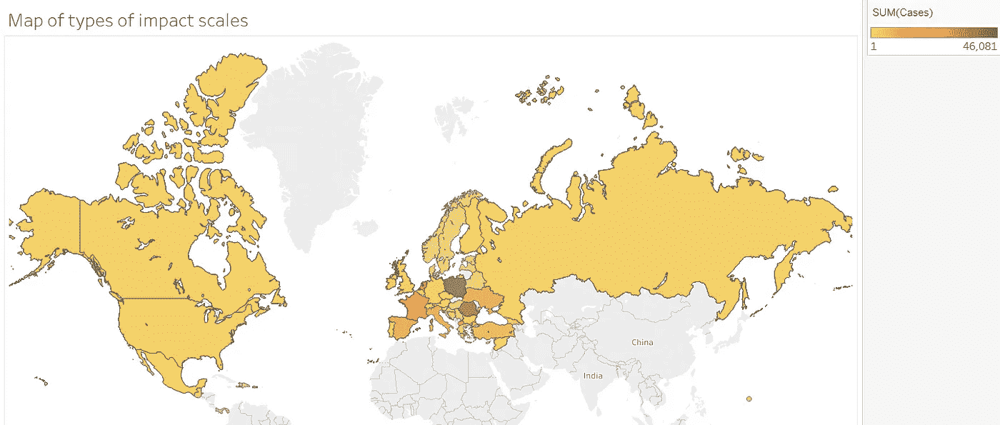
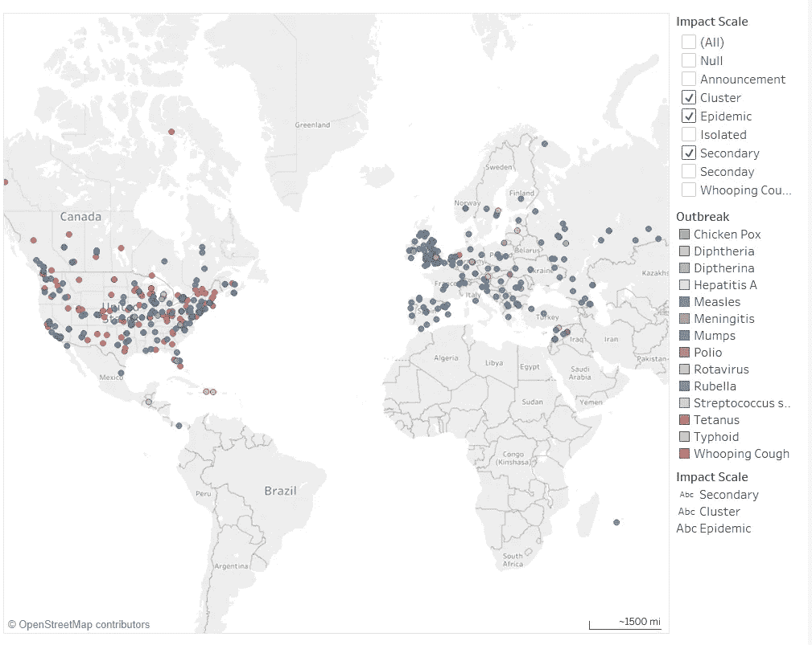
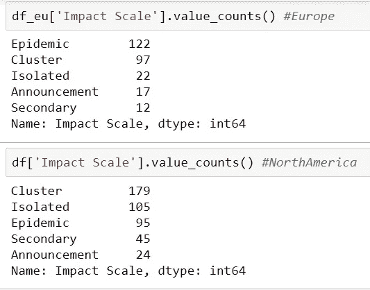
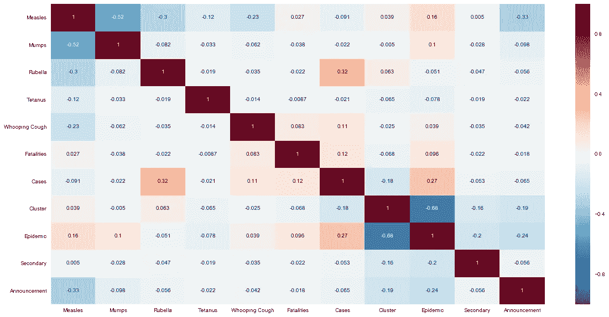
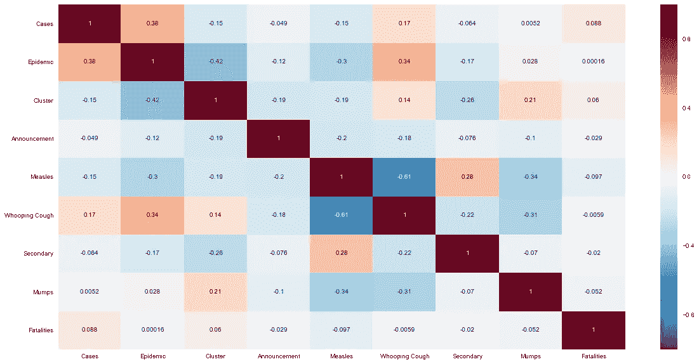

# 疫苗和数据科学是未来吗？

> 原文：<https://towardsdatascience.com/vaccines-and-data-science-a-future-503d00716e4e?source=collection_archive---------8----------------------->

Made in Tableau

这个博客有双重目的。首先是给出我的项目是什么，它的目的的一个总体想法。二是更深入的讨论我的 EDA(探索性数据分析)的技术方面。所有的 EDA 都是使用 Anaconda 和 Tableau 完成的。

《英国医学杂志》已经并将继续认为疫苗是人类历史上最伟大的医学进步之一。有了疫苗，我们已经从人群中根除了天花甚至麻疹(短期内)。然而，随着越来越多的被误导的演员、政治家和家长参与进来，他们主张取消儿童疫苗接种，声称疫苗会导致自闭症；近年来，罗马尼亚的麻疹病例激增，爆发了约 3400 起病例，17 人死亡。后者已被一项系统综述无数次否定。2012 年发表在 Cochrane Collaboration 上的一项研究(5 项随机对照试验、1 项对照试验、27 项队列研究、17 项病例对照研究、5 项时间序列试验、1 项病例交叉试验、2 项生态学研究和 6 项自身对照病例系列研究)显示，没有证据表明 MMR 疫苗和自闭症之间存在关系。

As HealthCare Triage(由 Carroll 博士主持的关注健康领域的 Youtube 频道)讨论了各种研究疫苗和自闭症之间关系的研究，以及这些研究如何在让父母给孩子接种疫苗方面不起作用。

作为一名具有生物化学背景的数据科学家和一名在医学领域有着深厚投资的人。我开始研究是否有任何我可以公开使用的数据集来观察第一世界国家可预防疾病的趋势。经过搜索，我找到了一张地图，上面汇集了世界各地可预防疾病的爆发，甚至是对医疗服务提供者的袭击。这张地图是由外交关系委员会编制的。

 [## 地图:疫苗可预防的疫情

### 外交关系委员会的全球健康项目自 2008 年以来一直在跟踪新闻报道，以产生一个…

www.cfr.org](https://www.cfr.org/interactives/GH_Vaccine_Map/#introduction) 

在查看了数据和数据清理(主要涉及重命名数据帧中的行和列)之后。我决定忽略的数据是暴力，因为它不符合我接种疫苗和预防疾病的最初目标，并且影响了我的死亡率。我将公告作为变量之一，以观察它是否对任何疾病有任何影响。公告显示，在这两个地区与所有疾病呈负相关。我将北美和欧洲划分为两个独立的数据框架，因为它们有不同的人口和地理类型。这将影响数据相关性和统计。以及了解两个地区之间的差异。

Outbreaks in North America and European Nations using Tableau

## 总结:

欧洲的平均死亡人数为 226，456 例，占 20.29%，北美的平均死亡人数为 93，810 例，占 14.70%。当我们深入研究影响规模等变量时，我们发现地区是影响事件发生数量的一个重要因素。

了解每个区域的影响范围对于每个区域的行为非常重要。这种流行病更糟糕，因为它涉及到疾病病例数量的增加。其次是聚集性，是疾病病例的集合，但在时间和地点上是紧密分组的。继发性感染是指小于群集或大小相同但感染不局限于一个地方的病例。欧洲比北美有更多的流行病，这与地理和国家边界如何影响疾病的传播有关。

群体免疫是我们接种疫苗的主要原因之一，因为它们可以保护那些由于免疫系统受损而无法接种疫苗的人，或者他们太年轻而无法接种疫苗的人，例如新生儿。R0(R 0)> 1 的疾病成为疫情或流行病的可能性更高。麻疹的 R0(R 零)= 18，因此，如果一个人患有这种疾病，它会将麻疹传播给平均 18 个人。因此，MMR 疫苗(麻疹、腮腺炎、风疹)需要达到 92-95%的群体免疫。旨在实现这种群体免疫的疫苗接种计划至关重要。

# 变量的相关性

Europe Correlation Heatmap

North America Correlation Heatmap

在两张热图中都可以看到一些有趣的相关性。

*   麻疹与其他疾病呈负相关，甚至与风疹和腮腺炎也呈负相关，而这两种疾病都是用同一种疫苗治疗的
*   这两个地区的公告与病例和死亡呈负相关
*   麻疹与北美的继发性麻疹和欧洲的流行性麻疹相关性最强
*   在北美，百日咳与流行病有较高的相关性，在欧洲，百日咳与死亡有相关性

最后，这个项目有很多有趣的变量相关性。这需要进一步调查。

## 未完待续…

我在这个项目中的下一个目标是拟合一个模型，并尝试回答以下问题:

*   我们能改进疫苗接种计划吗？
*   我们能预测小热点吗？
*   我们应该针对特定的城市进行疫苗接种吗？

如果你想知道这个项目是如何完成的，以及我接下来还有哪些医疗保健项目，你可以关注我这里的[哈维尔·冈萨雷斯-Compte](https://medium.com/u/6f5f0f213219?source=post_page-----503d00716e4e--------------------------------) 或者查看我的 [Github](https://github.com/jegonzalez) ！随便打个招呼吧！

1.  *征服无法治愈的疾病。BMJ 2007；334 补充 1: s19。可用:*[*www.bmj.com/cgi/data/334/suppl_1/DC2/1*](http://www.bmj.com/cgi/data/334/suppl_1/DC2/1)
2.  随着麻疹在欧洲激增，官员们准备迎接艰难的一年。可用:[*http://www . NPR . org/sections/goatsandsoda/2017/04/07/522867040/as-麻疹-浪涌-在欧洲-官员-支撑-为一个粗糙的年*](http://www.npr.org/sections/goatsandsoda/2017/04/07/522867040/as-measles-surges-in-europe-officials-brace-for-a-rough-year)
3.  *德米切利 V，里韦蒂 A，德巴利尼 MG，迪皮特兰托尼 c .*[*https://www.ncbi.nlm.nih.gov/pubmed/22336803*](https://www.ncbi.nlm.nih.gov/pubmed/22336803)