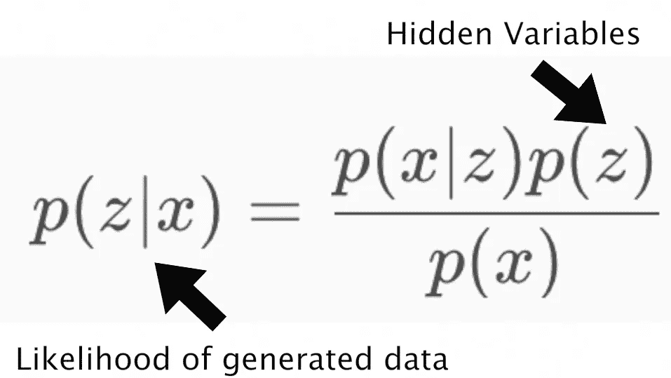
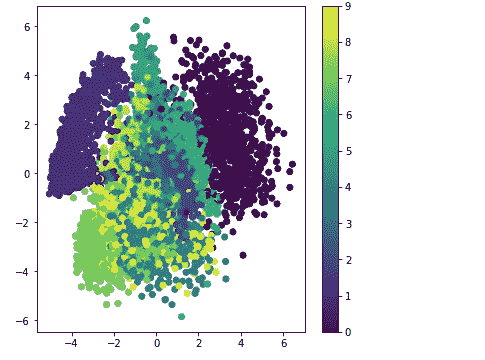
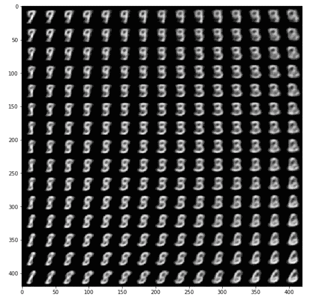

# 可变自动编码器

> 原文：<https://towardsdatascience.com/variational-auto-encoders-fc701b9fc569?source=collection_archive---------2----------------------->

当我们遇到没有标签的数据会怎样？大多数深度学习技术需要干净标签的数据，但这有多现实？其核心是，这种技术本质上是说，如果你有一组输入和它们各自的目标标签，你可以尝试和学习一个特定标签对于一个特定目标的概率。当然，所以美化图像映射？在这篇文章中，我将探索变分自动编码器，以更深入地探索未标记数据的世界。该模型将在对没有标签的图像集合进行训练之后生成独特的图像。

自动编码器顺序地将输入数据解构造成隐藏的表示，并使用这些表示来顺序地重建与其原始数据相似的输出。从本质上讲，数据压缩是特定于数据的，这意味着它只能压缩与其接受训练的数据相似的数据。众所周知，自动编码器也是有损耗的，因此解压缩后的输出与原始输入相比会有所下降。那么，如果它们导致质量下降，为什么它们有用呢？好问题是，它们对数据去噪非常有用，我们训练自动编码器从其自身的损坏版本中重建输入，以便它可以消除类似的损坏数据。

在这篇文章中，我通过他的 youtube 频道使用我的主要男人，Siraj 的支持，并潜入变分自动编码器(VAE)。

让我们从贝叶斯推断说起。阅读这篇文章的每个人可能都知道深度学习及其在逼近复杂函数时的有用性，然而，贝叶斯推理提供了一个推理不确定性的独特框架。在其中，所有的不确定性都用概率来表示。如果你想一想，这是有意义的，在任何给定的时间都存在支持或反对我们已经知道的东西的证据，这些证据可以用来创造一个新的概率。进一步延伸，当我们学习新的东西时，我们必须考虑到我们已经知道的东西，并加入新的证据来创造新的概率。贝叶斯理论基本上从数学上描述了这个想法。

VAE 是这些思想的产物。从贝叶斯的角度来看，我们可以将 VAE 的输入、隐藏表示和重构输出视为有向图形模型中的概率随机变量。假设它包含某些数据的特定概率模型 x 和潜在/隐藏变量 z。我们可以将模型的联合概率写出如下:



Joint Probability of a Model

给定一个由模型产生的角色，我们不知道潜在变量的什么设置产生了这个角色，我们的模型本质上是随机的！

现在，让我们打开深度学习镜头，VAE 由 3 个主要部分组成:

*   编码器
*   解码器
*   损失函数

给定一些输入 x，假设我们有一个 28 乘 28 的手写数字图像，它有 784 个维度，其中每个像素是一维的。现在，这将编码成一个潜在的/隐藏的表示空间，这将比 784 少得多。我们现在可以对高斯概率密度进行采样，以获得表示的噪声值。

酷毙了。让我们用代码来写吧！(我已经在这篇文章的末尾链接了完整的代码)

首先，我们导入库并找到我们的超参数。

```
import numpy as np
import matplotlib.pyplot as plt
from scipy.stats import norm
from keras.layers import Input, Dense, Lambda
from keras.models import Model
from keras import backend as K
from keras import objectives
from keras.datasets import mnist# Hyperparameters
batch_size = 100
original_dim = 784
latent_dim = 2
intermediate_dim = 256
nb_epoch = 10
epsilon_std = 1.0
```

接下来，我们初始化我们的编码器网络。这个网络的工作是将输入映射到我们隐藏的分布参数。我们获取输入，并通过 ReLU(压缩维度的经典非线性)的密集全连接层发送。接下来，我们将输入数据转换成隐藏空间中的两个参数。我们使用密集、完全连接的层来预定义大小——z 均值和 z 对数西格玛。

```
#encoder
x = Input(batch_shape = (batch_size, original_dim))
h = Dense(intermediate_dim, activation = ‘relu’)(x)
z_mean = Dense(latent_dim)(h)
z_log_var = Dense(latent_dim)(h)print(z_mean)
print(z_log_var)
```

解码器将“z”作为其输入，并将参数输出到数据的概率分布。让我们假设每个像素是 1 或 0(黑或白)，现在我们可以使用伯努利分布，因为它将成功定义为一个二进制值来表示单个像素。因此，解码器将获得一个数字的潜在/隐藏表示作为其输入，并且它输出 784 个伯努利参数，每个像素一个，因此本质上是 0 和 1 之间的 784 个值。

我们将使用 z_mean 和 z_log_var，通过定义采样函数，从隐藏/潜在正态分布中随机采样新的相似点。下面代码块中的ε是一个随机正规张量。

```
def sampling(args):
 z_mean, z_log_var = args
 epsilon = K.random_normal(shape=(batch_size, latent_dim), mean=0.)
 return z_mean + K.exp(z_log_var / 2) * epsilon

# note that “output_shape” isn’t necessary with the TensorFlow backend
z = Lambda(sampling, output_shape=(latent_dim,))([z_mean, z_log_var])#latent hidden state
print(z)
```

一旦我们得到 z，我们可以把它输入到我们的解码器，解码器会把这些潜在空间点映射回原始输入数据。因此，为了构建一个解码器，我们首先用两个完全连接的层和它们各自的激活函数来初始化它。因为数据是从一个小的维度提取到一个更大的维度，所以在重建过程中会丢失一些数据。

```
#decoder
# we instantiate these layers separately so as to reuse them later
decoder_h = Dense(intermediate_dim, activation=’relu’)
decoder_mean = Dense(original_dim, activation=’sigmoid’)
h_decoded = decoder_h(z)
x_decoded_mean = decoder_mean(h_decoded)print(x_decoded_mean)
```

酷，但是一些多少钱？所以我们将建立损失函数来精确测量。下面的第一项测量重建损失。如果解码器输出在重建数据方面表现不佳，此时将考虑损失方面的成本。下一个术语是正则化，这意味着它尽可能保持每个数字的表示形式多样化。举个例子，如果两个不同的人写出数字 3，结果可能看起来非常不同，因为，当然，不同的人写的不同。这可不好，正则来救援！我们惩罚不良行为(像这里的例子)，并确保类似的表现是紧密联系在一起的。我们的总损失函数被定义为我们的重建项和 KL 散度正则化项之和。

```
#loss
def vae_loss(x, x_decoded_mean):
 xent_loss = original_dim * objectives.binary_crossentropy(x, x_decoded_mean)
 kl_loss = — 0.5 * K.sum(1 + z_log_var — K.square(z_mean) — K.exp(z_log_var), axis=-1)
 return xent_loss + kl_lossvae = Model(x, x_decoded_mean)
vae.compile(optimizer=’rmsprop’, loss=vae_loss)
```

现在是训练部分，我们通常使用梯度下降来训练该模型，以优化编码器和解码器参数的损失。但是我们如何对随机变量的参数求导呢？

事实证明，我们已经将随机性融入了我们的模型本身。现在，梯度下降通常期望对于一组固定的参数，给定的输入总是返回相同的输出。在我们的例子中，随机性的唯一来源是输入。那么我们如何解决这个问题呢？我们参数化！我们将对样本进行参数化，以使随机性与参数无关。

我们将定义一个确定性地依赖于参数的函数，因此我们可以通过引入一个随机变量将随机性注入到模型中。编码器将生成均值向量和标准差向量，而不是生成实值向量。我们对包含 z 的函数求关于其分布参数的导数。我们已经将模型的优化器定义为 rmsprop，将损失函数定义为 vae_loss。

我们通过导入 MNIST 数据集并根据给定的历元数和批量大小将它们输入到我们的模型中来开始下面的训练。

```
# train the VAE on MNIST digits
(x_train, y_train), (x_test, y_test) = mnist.load_data()x_train = x_train.astype(‘float32’) / 255.
x_test = x_test.astype(‘float32’) / 255.
x_train = x_train.reshape((len(x_train), np.prod(x_train.shape[1:])))
x_test = x_test.reshape((len(x_test), np.prod(x_test.shape[1:])))vae.fit(x_train, x_train,
 shuffle=True,
 nb_epoch=nb_epoch,
 batch_size=batch_size,
 validation_data=(x_test, x_test),verbose=1)
```

下面我们在一个 2D 平面上画出了邻近区域。每个彩色的簇代表一个数字表示，紧密的簇实质上是结构相似的数字。

```
# build a model to project inputs on the latent space
encoder = Model(x, z_mean)# display a 2D plot of the digit classes in the latent space
x_test_encoded = encoder.predict(x_test, batch_size=batch_size)
plt.figure(figsize=(6, 6))
plt.scatter(x_test_encoded[:, 0], x_test_encoded[:, 1], c=y_test)
plt.colorbar()
plt.show()
```



Digit Representation

表示这一点的另一种方式是通过扫描潜在平面、以规则的间隔对潜在点进行采样并为这些点中的每一个生成相应的数字，如下所示:

```
# build a digit generator that can sample from the learned distribution
decoder_input = Input(shape=(latent_dim,))
_h_decoded = decoder_h(decoder_input)
_x_decoded_mean = decoder_mean(_h_decoded)
generator = Model(decoder_input, _x_decoded_mean)# display a 2D manifold of the digits
n = 15 # figure with 15x15 digits
digit_size = 28
figure = np.zeros((digit_size * n, digit_size * n))
# linearly spaced coordinates on the unit square were transformed through the inverse CDF (ppf) of the Gaussian
# to produce values of the latent variables z, since the prior of the latent space is Gaussian
grid_x = norm.ppf(np.linspace(0.05, 0.95, n))
grid_y = norm.ppf(np.linspace(0.05, 0.95, n))for i, yi in enumerate(grid_x):
 for j, xi in enumerate(grid_y):
 z_sample = np.array([[xi, yi]])
 x_decoded = generator.predict(z_sample)
 digit = x_decoded[0].reshape(digit_size, digit_size)
 figure[i * digit_size: (i + 1) * digit_size,
 j * digit_size: (j + 1) * digit_size] = digitplt.figure(figsize=(10, 10))
plt.imshow(figure, cmap=’Greys_r’)
plt.show()
```



Generated Digits

这在一定程度上让你大吃一惊！

因此，在这个练习的本质上，有三个要点:

*   变分编码器允许我们通过执行无监督学习来生成数据
*   VAEs =贝叶斯推理+深度学习
*   重新参数化允许我们通过网络反向传播，通过使随机性独立于允许我们导出梯度的参数。

在机器学习的宇宙中，这是一个非常迷人的世界，我希望我能够通过这篇文章给你带来一些价值！