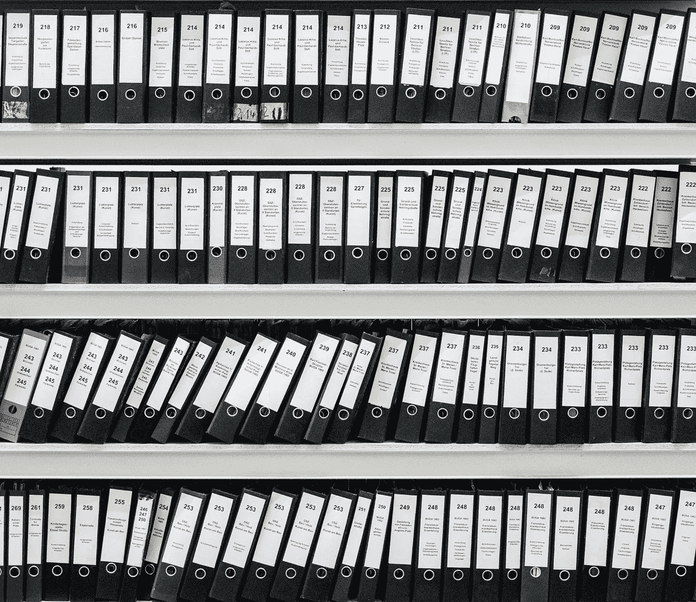
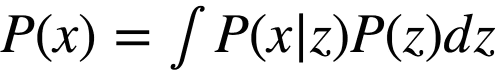
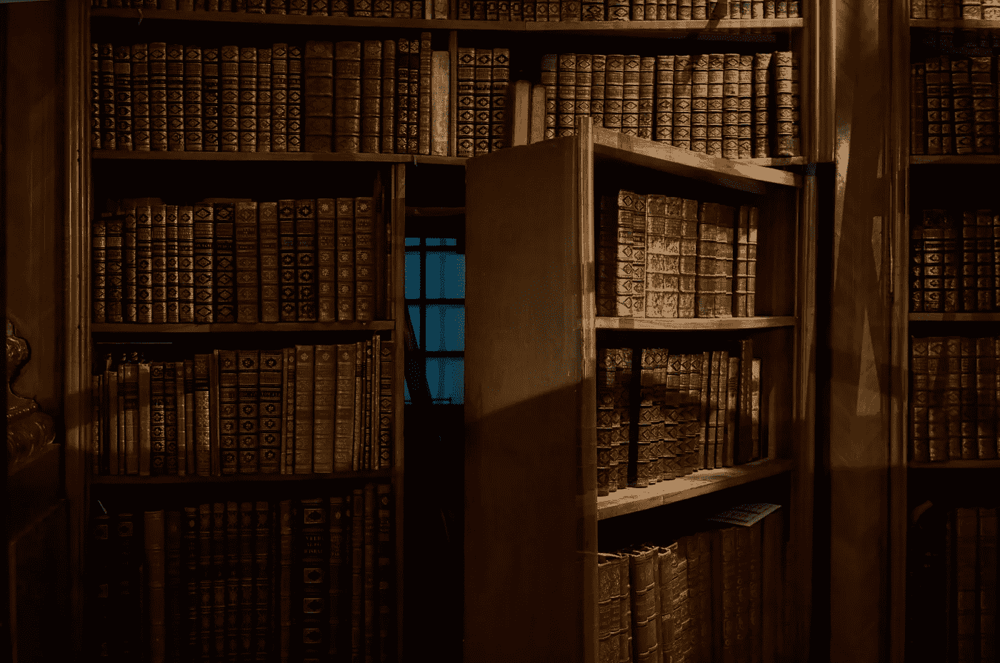
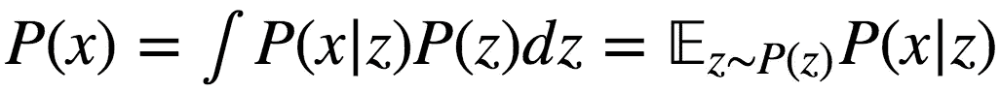
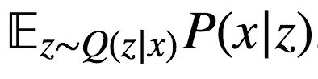
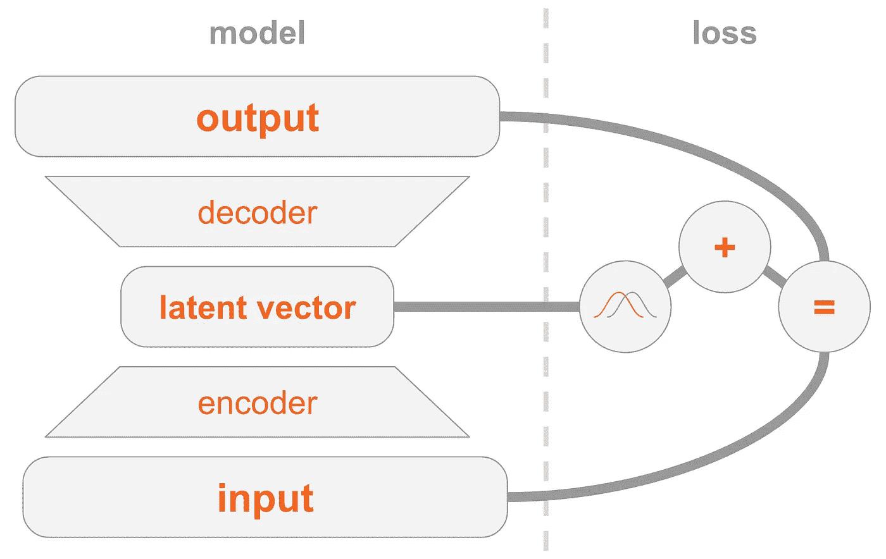

# 解释了各种自动编码器

> 原文：<https://towardsdatascience.com/variational-autoencoders-explained-6f9456ee030c?source=collection_archive---------7----------------------->

想知道变分自动编码器(VAE)模型是如何工作的吗？你想知道 VAE 是如何能够生成与它所训练的数据集相似的新样本的吗？

读完这篇文章后，你将对 VAE 的内部运作有一个理论上的理解，并且能够自己实现它。

在未来的一篇文章中，我将为你提供一个在手写数字图像数据集上训练的 VAE 的工作代码，我们将有一些生成新数字的乐趣！

# 生成模型

VAE 是一个生成模型，它估计训练数据的概率密度函数(PDF)。如果这样的模型是在看起来自然的图像上训练的，它应该给狮子的图像分配高概率值。另一方面，随机乱码的图像应该被赋予低概率值。

VAE 模型还可以从学习过的 PDF 中抽取样本，这是最酷的部分，因为它能够生成看起来与原始数据集相似的新样本！

我将使用 [MNIST](https://en.wikipedia.org/wiki/MNIST_database) 手写数字数据集来解释 VAE。模型的输入是 2828 维空间(ℝ[28∙28]).)中的图像如果输入看起来像一个数字，模型应该估计一个高概率值。

# 对图像建模的挑战

像素之间的相互作用带来了巨大的挑战。如果像素是彼此独立的，我们将需要独立地学习每个像素的 PDF，这很容易。采样本来也是轻而易举的——我们只是独立地对每个像素进行采样。

在数字图像中，像素之间有明显的相关性。如果你看一个图像的左半部分，看到一个 4 的开始，你会非常惊讶地看到右半部分是一个 0 的结束。但是为什么呢？…

# 潜在空间

你知道一个数字的每个图像应该包含一个单独的数字。ℝ[28∙28 的输入]并不明确包含该信息。但是它一定存在于某个地方…某个地方的*就是潜在空间。*

The latent space. Photo by Samuel Zeller on Unsplash

你可以把潜在空间想象成ℝ[k 】,其中每个矢量都包含绘制一幅图像所需的 k 条基本信息。假设第一维包含由数字表示的数字。第二维可以是宽度。第三——角度。诸如此类。

我们可以把生成图像的过程想象成一个两步过程。首先，这个人有意识或无意识地决定他要画的数字的所有属性。接下来，这些决定转化为笔触。

VAE 试图对这一过程进行建模:给定一幅图像 *x* ，我们想要找到至少一个能够描述它的潜在向量——一个包含生成 *x* 的指令的向量。使用全概率的[定律公式化它，我们得到](https://en.wikipedia.org/wiki/Law_of_total_probability)

让我们给这个等式注入一些直觉:

*   积分意味着我们应该在整个潜在空间中寻找候选者。
*   对于每一个候选 *z* ，我们问自己:是否可以使用 *z* 的指令生成 *x* ？ *P(x|z)* 够大吗？例如，如果 *z* 对数字为 7 的信息进行编码，则 8 的图像是不可能的。然而，1 的图像可能是可能的，因为 1 和 7 看起来相似。
*   我们找到一个好的 *z* ？很好！但是等一下…这有可能吗？ *P(z)* 够大吗？让我们考虑一个颠倒的 7 的给定图像。描述相似外观 7 的潜在向量将是完美匹配，其中角度维度被设置为 180 度。然而，那个 *z* 不太可能，因为通常数字不会以 180 度角绘制。

VAE 的训练目标是最大化 *P(x)* 。我们将使用多元高斯𝓝 *(f(z)，𝜎I)*对 *P(x|z)* 建模。

*f(z)* 将使用神经网络建模。 *𝜎* 是一个将单位矩阵 *I* 相乘的超参数。

你应该记住 *f* 是我们在使用训练好的模型生成新图像时要用到的。强加高斯分布仅用于训练目的。如果我们使用 Dirac delta 函数(即 *x = f(z)* 确定性)，我们将无法使用梯度下降来训练模型！

# 潜在空间的奇迹

潜在空间方法有两个大问题:

1.  每个维度包含哪些信息？一些维度可能与抽象的信息有关，例如风格。即使解释所有维度很容易，我们也不想给数据集分配标签。这种方法无法扩展到新的数据集。
2.  潜在空间可能是纠缠的，即维度可能是相关的。例如，一个手指画得非常快，可能会导致有角度的和更细的笔触。指定这些依赖关系很难。

# 深度学习拯救世界

事实证明，每个分布都可以通过对标准多元高斯函数应用足够复杂的函数来生成。

因此，我们将选择 *P(z)* 作为标准多元高斯。由神经网络建模的 *f* 因此可以分为两个阶段:

1.  第一层将高斯映射到潜在空间的真实分布。我们无法解释维度，但这并不重要。
2.  然后，后面的层将从潜在空间映射到 *P(x|z)* 。

# 那么我们该如何训练这只野兽呢？

*P(x)* 的公式很难处理，所以我们将使用蒙特卡罗方法来近似它:

1.  样本{ *zᵢ* } (i = 1…n)来自先前的 *P(z)* 。
2.  近似使用*p(x)*≈*(1/n)∙∑p(x|zᵢ)*。

太好了！因此，我们只需对一些 z 进行采样，然后让反向传播派对开始！

不幸的是，由于 *x* 具有高维数，因此需要许多样本来获得合理的近似。我的意思是，如果你对 z 进行采样，你最终得到一个看起来和 x 有关的图像的可能性有多大？顺便说一下，这解释了为什么 *P(x|z)* 必须为任何可能的图像分配正概率值，否则模型将无法学习:采样的 *z* 将产生几乎肯定不同于 *x* 的图像，如果概率为 0，梯度将不会传播。

那么，我们如何解决这个烂摊子呢？

# 我们走捷径吧！

Photo by Stefan Steinbauer on Unsplash

大多数被取样的 z 对 P(x)没有任何贡献——它们太差了。如果我们能提前知道从哪里取样就好了…

我们可以引入 *Q(z|x)* 。 *Q* 将被训练为向可能已经生成 *x* 的 *z* 给出高概率值。现在，我们可以使用来自 *Q* 的更少样本来计算蒙特卡罗估计。

不幸的是，新的问题出现了！而不是最大化

我们将最大化以下内容

这两者之间有什么关系？

# 变分推理

变分推理是一个自成一帖的话题，这里就不细说了。我要说的是，这两者确实通过这个等式联系在一起:

*KL* 是[kull back–lei bler 散度](https://en.wikipedia.org/wiki/Kullback%E2%80%93Leibler_divergence)，它直观地衡量两个分布有多相似。

一会儿你会看到我们如何最大化等式的右边。这样，左侧也将被最大化:

*   *P(x)* 将被最大化。
*   从 *P(z|x)* 到 *Q(z|x)* 有多远——我们不知道的*真实*后验——将被最小化。

等式右边背后的直觉是我们有一个张力:

1.  一方面，我们希望最大化从 *z ~ Q* 解码 *x* 的效果。
2.  另一方面，我们希望*Q(z | x)*(*编码器*)类似于先前的 *P(z)* (多元高斯)。人们可以把这个术语看作是正则化。

给定正确的分布选择，最小化 KL 散度是容易的。我们将把 *Q(z|x)* 建模为神经网络，其输出是多元高斯的参数:

*   一个平均值 *μ_Q*
*   对角协方差矩阵*σ_ Q*

KL 散度然后变得解析可解，这对我们(和梯度)是很好的。

*解码器*部分有点棘手。天真的是，我们会用蒙特卡罗来解决这个棘手的问题。但是从 *Q* 对 *z* 进行采样不会允许梯度通过 *Q* 传播，因为采样不是可微分的操作。这是有问题的，因为输出*σ_ Q*和 *μ_Q* 的层的权重不会被更新。

# 重新参数化的技巧

我们可以用无参数随机变量的确定性参数化变换来代替 *Q* :

1.  来自标准(无参数)高斯的样本。
2.  将样本乘以*σ_ Q*的平方根。
3.  将 *μ_Q* 加到结果上。

结果将具有等于 *Q* 的分布。现在采样操作将从标准高斯。因此，梯度将能够通过*σ_ Q*和 *μ_Q* 传播，因为现在这些是确定性路径。

结果呢？该模型将能够学习如何调整 *Q* 的参数:它将集中于能够产生 *x* 的好的 *z* 。

# 将这些点连接起来

VAE 模式可能很难理解。我们在这里讨论了很多材料，可能会让人不知所措。

因此，让我总结一下实施 VAE 需要掌握的所有步骤。

左侧是模型定义:

1.  输入图像通过编码器网络。
2.  编码器输出分布参数 *Q(z|x)* 。
3.  从 *Q(z|x)* 中采样潜在向量 *z* 。如果编码器学会做好它的工作，大多数机会是 *z* 将包含描述 *x* 的信息。
4.  解码器将 *z* 解码成图像。

右边是损失:

1.  重构误差:输出应该类似于输入。
2.  *Q(z|x)* 应该类似于先验(多元标准高斯)。

为了生成新的图像，可以直接从先验分布中采样一个潜在向量，并将其解码成图像。

在下一篇文章中，我会给你提供一个 VAE 的工作代码。此外，我将向您展示如何使用一个巧妙的技巧来调节潜在向量，以便您可以决定要为哪个数字生成图像。敬请期待:)

## 笔记

这篇文章是基于我的直觉和以下来源:

*   [变分推理和深度学习:一种新的综合](https://pure.uva.nl/ws/files/17891313/Thesis.pdf)
*   [变型自动编码器教程](https://arxiv.org/abs/1606.05908)

这个帖子最初是我在[www.anotherdatum.com](http://anotherdatum.com)发的。