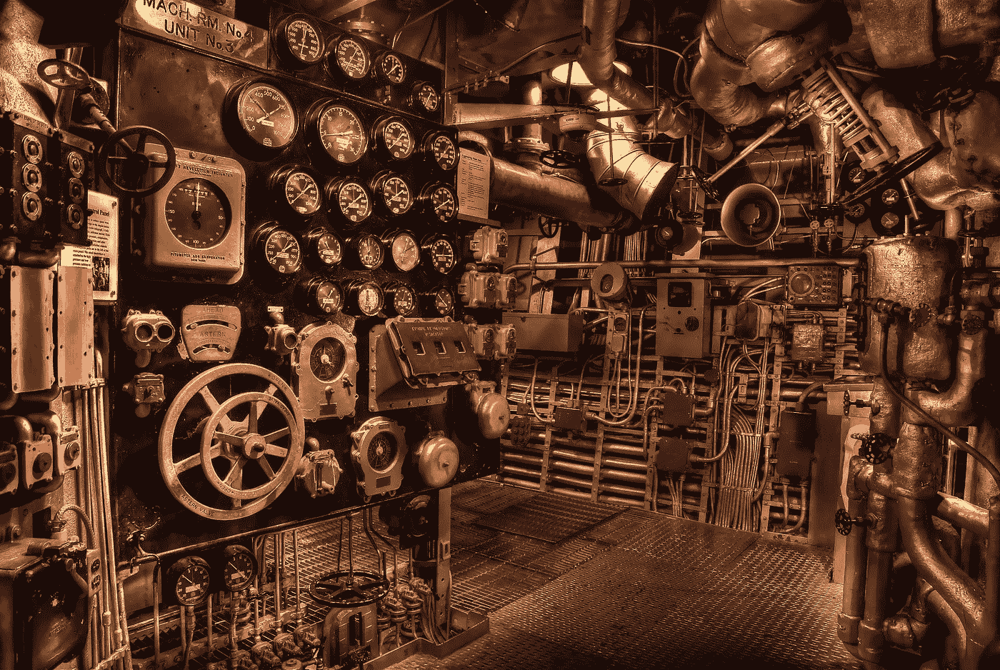
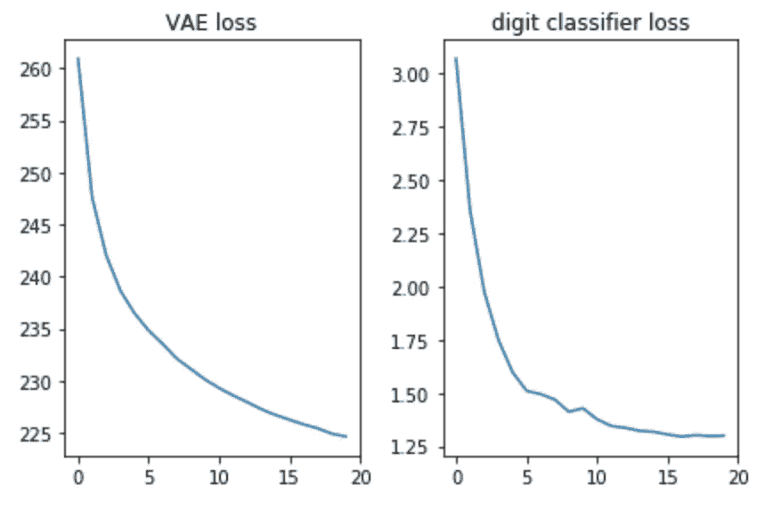
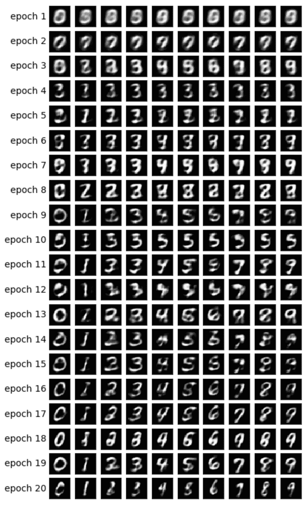

# 变型自动编码器详细解释

> 原文：<https://towardsdatascience.com/variational-autoencoders-explained-in-detail-d585327c660a?source=collection_archive---------2----------------------->

在本系列的前一篇文章中，我介绍了变分自动编码器(VAE)框架，并解释了其背后的理论。

在这篇文章中，我将更详细地解释 VAE，或者换句话说，我将提供一些代码:)

读完这篇文章后，你会理解实现 VAE 所需的技术细节。

作为奖励，我将向您展示如何通过对一些潜在向量的维度施加特殊作用，该模型可以根据手指类型生成图像。

该模型将在[MNIST](https://en.wikipedia.org/wiki/MNIST_database)——手写数字数据集上进行训练。输入是ℝ[28∙28].的图像

接下来，我们将定义将要使用的超参数。

随意使用不同的值来感受模型是如何被影响的。笔记本可以在这里找到[。](https://github.com/yoel-zeldes/yoel-zeldes.github.io/blob/source/content/vae2/vae2.ipynb)

# 模型

该模型由三个子网络组成:

1.  给定 *x* (图像)，将其编码成潜在空间上的分布——在前一篇文章中称为*Q*(*z*|*x*)。
2.  给定 *z* 在潜空间(一个图像的代码表示)，解码成它所表示的图像——在上一篇文章中称为 *f* ( *z* )。
3.  给定 *x* ，通过将其映射到大小为 10 的层来对其数字进行分类，其中第 I 个值包含第 I 个数字的概率。

前两个子网络是普通的 VAE 框架。

第三个用作[辅助任务](http://ruder.io/multi-task/index.html)，它将执行一些潜在维度来编码图像中的数字。让我解释一下动机:在上一篇文章中，我解释过我们不在乎潜在空间的每个维度包含什么信息。该模型可以学习编码它认为对其任务有价值的任何信息。因为我们熟悉数据集，所以我们知道数字类型应该很重要。我们希望通过向模型提供这些信息来帮助它。此外，我们将使用这些信息生成以手指类型为条件的图像，我将在后面解释。

给定数字类型，我们将使用一种热编码对其进行编码，即大小为 10 的向量。这 10 个数字将被连接成潜在向量，因此当将该向量解码成图像时，该模型将利用数字信息。

有两种方法为模型提供一个热编码向量:

1.  将其作为输入添加到模型中。
2.  将它添加为标签，这样模型将必须自己预测它:我们将添加另一个预测大小为 10 的向量的子网络，其中损失是与预期的一个热向量的交叉熵。

我们将采用第二种选择。为什么？在测试时，我们可以以两种方式使用这个模型:

1.  提供图像作为输入，并推断潜在向量。
2.  提供潜在向量作为输入，并生成图像。

因为我们也想支持第一个选项，所以我们不能为模型提供数字作为输入，因为我们在测试时不会知道它。因此，模型必须学会预测它。

既然我们已经了解了组成模型的所有子网，我们就可以对它们进行编码了。编码器和解码器背后的数学细节可以在之前的文章中找到。

# 培养

我们将使用 [SGD](https://en.wikipedia.org/wiki/Stochastic_gradient_descent) 训练模型来优化两种损失——VAE 损失和分类损失。

在每个时期结束时，我们将对潜在向量进行采样，并将它们解码成图像，这样我们就可以直观地看到模型的生成能力如何随着时期的推移而提高。取样方法如下:

1.  根据我们想要生成图像的数字，确定性地设置用于数字分类的维度。例如，如果我们想要生成数字 2 的图像，这些尺寸将被设置为[0010000000]。
2.  根据先验——多元高斯随机抽取其他维度的样本。我们将把这些采样值用于我们在给定时期生成的所有不同数字。通过这种方式，我们可以对其他维度的编码有一种感觉，例如笔画风格。

步骤 1 背后的直觉是，在收敛之后，模型应该能够使用这些维度对输入图像中的数字进行分类。另一方面，这些维度也用于解码步骤以生成图像。这意味着解码器子网络了解到当这些维度具有对应于数字 2 的值时，它应该生成该数字的图像。因此，如果我们手动设置这些维度来包含数字 2 的信息，我们将得到该数字的生成图像。

让我们验证一下这两种损失看起来都不错，也就是说——在减少:

此外，让我们绘制生成的图像，看看模型是否真的能够生成数字图像:

# 最后的想法

很高兴看到使用一个简单的前馈网络(没有花哨的卷积)，我们能够在仅仅 20 个时期后生成好看的图像。该模型很快学会了使用特殊的数字维度——在第 9 纪元，我们已经看到了我们试图生成的数字序列。

每个纪元对其他维度使用不同的随机值，因此我们可以看到不同纪元之间的风格如何不同，而每个纪元内部的风格是相似的——至少对于某些纪元而言是如此。例如，与时段 20 相比，在时段 18，所有的数字都更粗。

我邀请你打开[这个笔记本](https://github.com/yoel-zeldes/yoel-zeldes.github.io/blob/source/content/vae2/vae2.ipynb)和 VAE 一起玩耍。例如，超参数值对生成的图像有很大影响。玩得开心:)

*原文由我在***发表。**