# 协同过滤的各种实现

> 原文：<https://towardsdatascience.com/various-implementations-of-collaborative-filtering-100385c6dfe0?source=collection_archive---------0----------------------->

利用协同过滤构建推荐系统的不同方法比较

我们看到推荐系统在我们周围到处都在使用。这些系统正在个性化我们的网络体验，告诉我们买什么**(亚马逊)*****【网飞】****【脸书】*****【Spotify】**等等。这些推荐系统利用我们的购物/观看/收听模式，并根据我们的行为模式预测我们未来可能喜欢的东西。推荐系统最基本的模型是**协同过滤模型**，它基于这样一种假设，即人们喜欢与他们喜欢的其他事物相似的事物，以及被具有相似品味的其他人喜欢的事物。**

**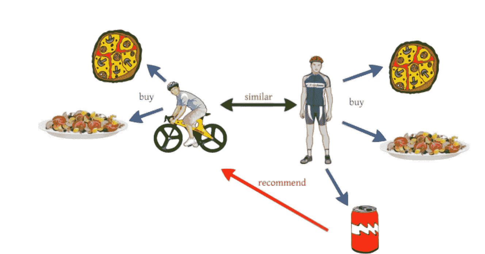**

****Figure 1:** Example of collaborative filtering. *Reference:* [*here*](https://d4datascience.wordpress.com/category/predictive-analytics/)**

****建立有针对性的推荐模型很容易，那么为什么不为自己的客户建立一个呢？我写这篇文章是为了让你更容易理解。**本帖大部分内容灵感来源于 **fast.ai 深度学习 part 1 v2 课程。****

**这里是笔记本的[链接，它实现了下面讨论的技术。](https://github.com/groverpr/Machine-Learning/blob/master/notebooks/02_Collaborative_Filtering.ipynb)**

# **介绍**

**在这篇文章中，我讨论并比较了不同的协同过滤算法来预测电影的用户评分。为了进行比较，我使用了 [MovieLens 数据](http://files.grouplens.org/datasets/movielens/ml-latest-small.zip)，它有来自 671 个独立用户对 9066 部独立电影的 100004 个评分。读者可以将这篇文章视为一站式资源，了解如何在 python 上进行协同过滤，并在自己的数据集上测试不同的技术。 *(我也根据我的分析提供了我自己关于使用哪种技术的建议)。***

**在进一步阅读之前，我希望您对协同过滤及其在推荐系统中的应用有基本的了解。如果没有，我强烈推荐你浏览下面的博客，这些博客是 USF 大学的一个学生写的:Shikhar Gupta**

****博客:**协同过滤和嵌入— [第一部分](https://medium.com/@shik1470/collaborative-filtering-and-embeddings-part-1-63b00b9739ce)和[第二部分](https://medium.com/@shik1470/collaborative-filtering-and-embeddings-part-2-919da17ecefb)**

# **职位布局**

*   ****协同过滤技术的类型
    基于记忆的
    基于模型的** *矩阵分解
    *聚类
    ***** 深度学习**
*   ****Python 实现
    惊喜包
    fast . ai 库****
*   ****比较和结论****

# ****协同过滤技术的类型****

**关于协同过滤(CF)已经做了很多研究，最流行的方法是基于**低维因子模型**(基于模型的矩阵分解。这些我会详细讨论)。CF 技术大致分为两种类型:**

**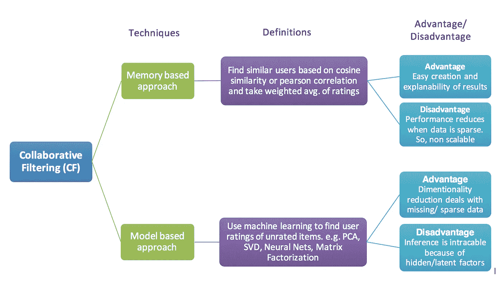**

****Figure 2:** Types of collaborative filtering approaches. *Reference:* [*Wikipedia*](https://en.wikipedia.org/wiki/Collaborative_filtering)**

**假设我们想向我们的产品用户推荐一件新商品(例如，向网飞的订户推荐一部电影，或者向亚马逊的在线买家推荐一件衣服)*。为此，我们可以使用下面讨论的许多技术中的一种。***

## ****1。基于记忆的方法:****

**Agnes Johannsdottir 在她的[博客](https://cambridgespark.com/content/tutorials/implementing-your-own-recommender-systems-in-Python/index.html)中引用**

> *****基于记忆的协同过滤*** *方法可以分为两个主要部分:* *用户-项目过滤和项目-项目过滤。一个* ***用户项目过滤*** *取一个特定的用户，基于评分的相似性找到与该用户相似的用户，并推荐那些相似用户喜欢的项目。相比之下，* ***物品-物品过滤*** *会取一个物品，找到喜欢过那个物品的用户，再找到那些用户或者类似用户也喜欢过的其他物品。它接受项目并输出其他项目作为推荐。***
> 
> ***物品-物品协同过滤:“喜欢这个物品的用户也喜欢……”
> 用户-物品协同过滤:“和你相似的用户也喜欢……”***

**基于记忆的方法与基于模型的技术*(等等，将在下一段讨论)*的关键区别在于，我们没有使用梯度下降(或任何其他优化算法)来学习任何参数。最近的用户或项目仅通过使用**余弦相似度或皮尔逊相关系数**来计算，它们仅基于算术运算。
**编辑:**如上一段所述，不使用参数化机器学习方法的技术被归类为基于记忆的技术。因此，**像 KNN** 这样的非参数 ML 方法也应该属于基于记忆的方法。当我最初写这篇博客的时候，我用的是基于模型的方法，这是不对的。**

**引用于[这篇](http://blog.ethanrosenthal.com/2015/11/02/intro-to-collaborative-filtering/)博客**

> ***一个常见的距离度量是* ***余弦相似度*** *。如果将评级矩阵中给定用户(项目)的行(列)视为一个向量，则可以从几何角度考虑该指标。对于基于用户的协同过滤，两个用户的相似性被度量为两个用户的向量* *之间的角度的* ***余弦。对于用户 u 和 u’，余弦相似度为:*****

**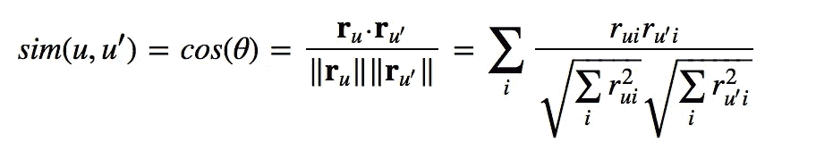**

**我们可以通过取来自所有其他用户(u)的电影 1 评级的加权和来预测用户 u 对电影 1 的评级，其中加权是每个用户和用户 u 之间的相似性数**

**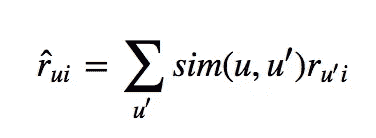**

**我们还应该通过 u’(其他用户的)评级总数来标准化评级。**

**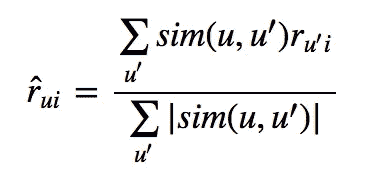**

****关于基于记忆的方法的最后一句话:**由于不涉及训练或优化，这是一种易于使用的方法。但是当我们有稀疏的数据时，它的性能会下降，这阻碍了这种方法对于大多数现实世界问题的可伸缩性。**

**如果您有兴趣尝试这种方法，下面是展示 python 一步一步实现这种方法的精彩文章的链接。
*(我没有在这里讨论实现，因为我个人会使用可扩展的基于模型的方法)***

> *****链接 1:****[*用 Python 实现自己的推荐系统*](https://cambridgespark.com/content/tutorials/implementing-your-own-recommender-systems-in-Python/index.html)***链接 2:****[*推荐系统简介:协同过滤*](http://blog.ethanrosenthal.com/2015/11/02/intro-to-collaborative-filtering/)****

## *****2。基于模型的方法*****

***在这种方法中，使用机器学习算法来开发 CF 模型，以预测用户对未评级项目的评级。根据我的理解，这种方法中的算法可以进一步细分为 3 个子类型。***

***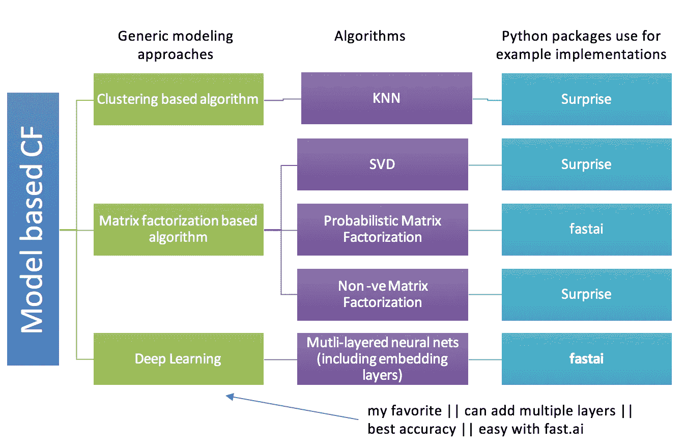***

*****Figure 3\.** Types of model based collaborative filtering approaches***

*****编辑:**组**名称**基于上图的“基于聚类的算法**有误。它没有生成集群。我们只是在 KNN 找到 k 个最接近的训练例子。“**非参数方法**”是更好的术语。*****

## *****上述算法的简要说明:*****

*   *****矩阵分解(MF):** 这种模型背后的思想是，用户的态度或偏好可以由少量的隐藏因素来决定。我们可以称这些因素为**嵌入。*****

> ******矩阵分解可以转化为一个带有损失函数和约束的优化问题。*** *现在，约束是基于我们模型的属性来选择的。例如，对于非负矩阵分解，我们希望结果矩阵中有非负元素。****

***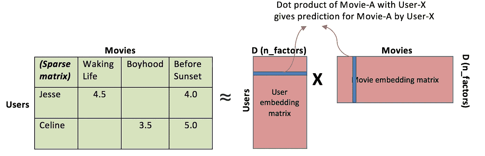***

*****Figure 4.** Visualization of matrix factorization***

*****嵌入:
直观上，我们可以把嵌入理解为物品和用户的低维隐藏因素**。例如，假设我们有 5 维**(即上图**中的 D 或 n _ factors = 5**)**项目和用户的嵌入(随机选择# 5)。那么对于 user-X & movie-A，我们可以说这 5 个数字**可能**代表关于电影的 5 个不同特征，比如****【I】****movie-A 有多科幻****【ii)****电影****【iii】****有多新同样，用户嵌入矩阵中的 5 个数字可能表示，****(I)****user-X 有多喜欢科幻电影****(ii)****user-X 有多喜欢最近的电影……等等。*在上图中，user-X 和 movie-A 矩阵的点积数值越大，意味着 movie-A 是 user-X 的好推荐。****

***(我并不是说这些数字实际上代表了这样的信息。我们实际上不知道这些因素意味着什么。这只是建立一种直觉)***

***在 USF 大学的另一位同学 Kerem Turgutlu 的这篇博文中，可以了解更多关于嵌入的知识。
**链接:**结构化深度学习***

***矩阵分解可以通过各种方法完成，并且有一些研究论文。在下一节中，将介绍正交分解(SVD)或概率分解(PMF)或非负分解(NMF)的 python 实现。***

*   *****非参数方法(KNN):** 这个想法和基于记忆的推荐系统是一样的。在基于内存的算法中，我们使用用户和/或项目之间的相似性，并将它们用作**权重**来预测用户和项目的评分。不同之处在于，这种方法中的相似性是基于无监督学习模型计算的，而不是基于皮尔逊相关或余弦相似性。在这种方法中，我们还将相似用户的数量限制为 **k** ，这使得系统更具可扩展性。***
*   *****神经网络/深度学习:**有大量关于使用矩阵分解或相似矩阵的协同过滤的研究材料。但是缺乏在线材料来学习如何使用深度学习模型进行协同过滤。**这是我在 fast.ai 深度学习 part 1 v2 中学到的东西。*****

***下面是解释当我们使用神经网络解决这个问题时会发生什么的可视化。***

***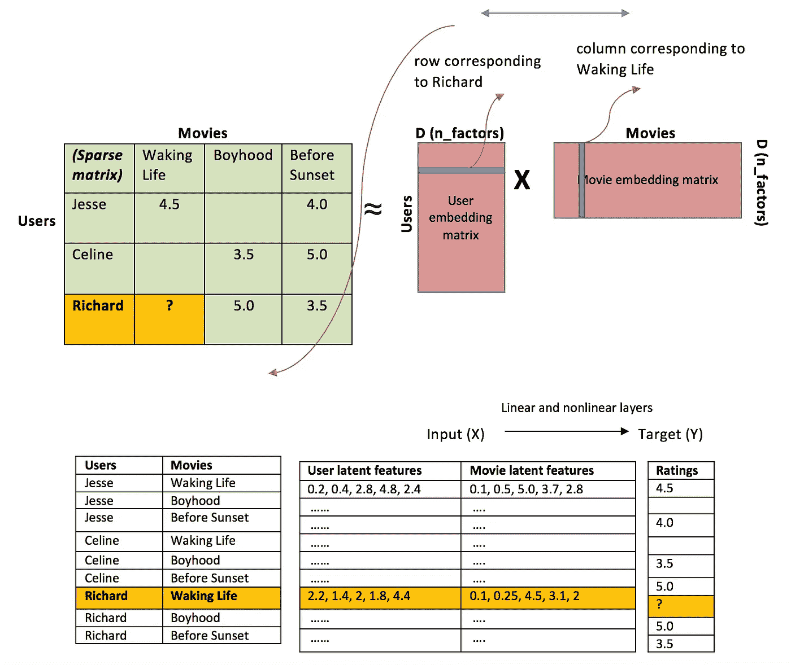***

*****Figure 5.** Matrix factorization and embeddings for neural net***

***我们可以把这看作是矩阵分解方法的扩展。对于 SVD 或 PCA，我们将原始稀疏矩阵分解成 2 个低秩正交矩阵的乘积。对于神经网络实现，我们不需要它们是正交的，我们希望我们的模型学习嵌入矩阵本身的值。对于特定的电影-用户组合，从嵌入矩阵中查找**用户潜在特征**和**电影潜在特征**。这些是进一步线性和非线性图层的输入值。我们可以将此输入传递给多个 **relu、线性或 sigmoid 层**并通过任何优化算法(Adam、SGD 等)学习相应的权重。).***

***___________________________________________________________________***

# *****Python 实现*****

*****Github 回购链接:** [此处](https://github.com/groverpr/Machine-Learning/blob/master/notebooks/02_Collaborative_Filtering.ipynb)***

***让我们看看上面讨论的**算法的 python 实现。我研究了 2 个不同的 python 包，它们提供了各种算法供选择。*****

## *****(一)** [**惊喜套餐**](http://surprise.readthedocs.io/en/stable/getting_started.html) **:*****

***这个软件包是专门开发来使基于协同过滤的推荐变得容易的。它有各种 CF 算法的默认实现。***

> ******第一步:*** *下载 MovieLens 数据并在熊猫 df*[*http://files . group lens . org/datasets/movie lens/ml-latest-small . zip*](http://files.grouplens.org/datasets/movielens/ml-latest-small.zip)中读取***
> 
> ******第二步:*** *安装惊喜包通过* `pip install scikit-surprise.` *加载数据到* `*Dataset class*`***

*****Code chunk 1\.** Surprise dataloader***

> ******第三步:*** *现在在数据准备后实现任何 MF 算法都是运行 1 行代码那么简单。下面是奇异值分解(SVD)和非负矩阵分解(NMF)的代码和输出。该代码也可用于 KNN，只需更改以下代码中的* `*algo = KNNBasic()*` *。(请查看维基百科上*[*SVD*](https://en.wikipedia.org/wiki/Singular-value_decomposition)*和*[*NMF*](https://en.wikipedia.org/wiki/Non-negative_matrix_factorization)*)****

*****Code chunk 2\.** SVD and NMF using Surprise***

***验证奇异值分解和 NMF 的 RMSE 分数***

***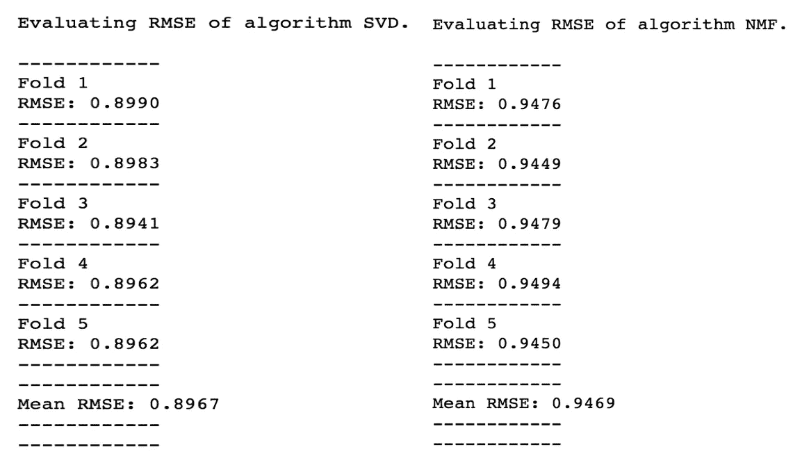***

*****Figure 6.** RMSE scores of SVD and NMF using Surprise***

*****最佳 RMSE = 0.8967 (SVD)，对应的均方误差为 0.804*****

## *****(b)** [**fast.ai 库**](https://github.com/fastai/fastai) **:*****

***fast.ai 是一个庞大的 python 库，它使具有基本编码技能的人可以轻松进行机器学习和深度学习。***

## *****浅薄的学问*****

***下面是为 CF 实现**概率矩阵分解**的 5 行代码。该实现利用了这样一个事实，即 2 个分解的矩阵只是嵌入矩阵，可以通过在神经网络中添加嵌入层来建模(我们可以称之为**浅层学习**)。***

*****Code chunk 3\.** Collaborative filtering using fast.ai (based on concept of PMF)***

***培训结果:***

***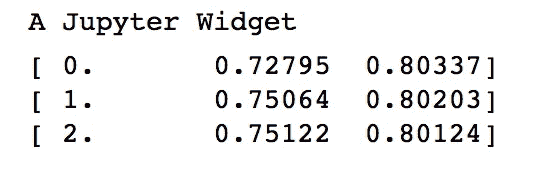***

*****Figure 7\.** Left: Training MSE, Right: Validation MSE. Rows: Epochs***

***从 PMF 的 fast.ai 实现获得的最佳验证 MSE 是 0.801，这接近于我们从 SVD 获得的结果。***

## *****深度学习*****

***我们可以向我们的神经网络添加更多的线性和非线性层，使其成为深度神经网络模型。***

***使用 fast.ai 制作用于协同过滤的深度神经网络的步骤***

> ******第一步:*** *加载数据到 PyTorch 数据加载器。fast.ai 库建立在 PyTorch 之上。如果你想为特定格式的数据定制数据集类，在这里* *学习* [*。*](http://pytorch.org/tutorials/beginner/data_loading_tutorial.html#dataset-class)***

***我用了 fast.ai 的`ColumnarModelData.from_data_frame`函数加载数据集。您还可以定义自己的数据加载器函数。 **X** 具有关于**用户 Id、电影 Id 和时间戳**的数据，而 **Y** 仅具有关于**收视率(目标变量)的数据。*****

*****Code chunk 4\.** Data-loader (fast.ai function)***

> ******步骤 2:*** *定义自定义神经网络类(语法特定于 PyTorch，但相同的逻辑也可用于 Keras)。****

***我们必须创建两个函数。**__init__()，**该类的构造函数为和 **forward()，**该函数向前传递。***

*****Code chunk 5\.** Neural net on PyTorch***

***关于**层**的更多信息，这些层已经在正向通道中使用:***

*   ***`dropout`该层将删除具有给定概率参数的激活。激活有 p1，p2 概率变为 0。这样做是为了减少过度拟合。***
*   ***`embedding`该层为对应于唯一用户和唯一电影的嵌入创建查找表。该层中的值通过反向传播来更新。***
*   ***`linear`加偏的线性矩阵乘法。***
*   ***`relu`使用非线性图层。***
*   ***`sigmoid`用于限制来自训练数据的预测评级 b/w 最小值和最大值。***

> ******第三步:*** *模型拟合和预测。****

*****Code chunk 6\.** Training deep neural net (fast.ai functions)***

*****结果:*****

***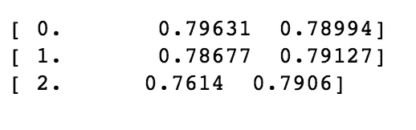***

*****Figure 8\.** Left: Training MSE, Right: Validation MSE. Rows: Epochs***

*****最佳验证 MSE = 0.7906。这是上面讨论的所有模型中最好的。*****

# *****比较和结论*****

***下面是从 MovieLens 100k 数据的不同方法获得的 MSE 图。***

***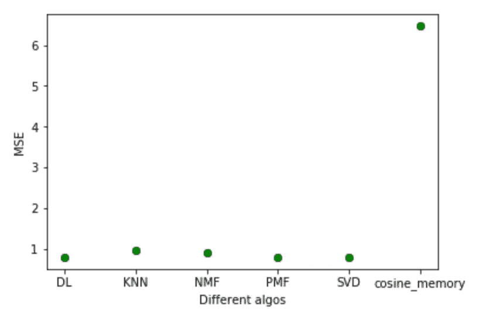***

*****Figure 9\.** Comparison of MSE scores using different CF methods***

***神经网络(DL)和奇异值分解给出了最好的结果。与其他 MF 算法不同，神经网络实现也将在不经常使用的不平衡数据上表现良好。***

***为你的产品/服务建立客户目标推荐系统是很有用的。最简单和研究充分的方法是协同过滤。我写这篇文章的目的是，读者可以在一个地方找到所有有用的资料，以及实现，而不是浏览技术研究论文和花费几个小时来学习协同过滤。***

# *****参考资料和其他有用资源:*****

1.  ***[**我的 GitHub 回购链接与 python 实现**](https://github.com/groverpr/Machine-Learning/blob/master/notebooks/02_Collaborative_Filtering.ipynb)***
2.  ***[**推荐系统**](http://www.cs.carleton.edu/cs_comps/0607/recommend/recommender/itembased.html)***
3.  ***[**协同过滤使用 Fast.ai**](https://github.com/fastai/fastai/blob/master/courses/dl1/lesson5-movielens.ipynb)***
4.  ***[**惊喜:用于推荐系统的 Python scikit**](http://surprise.readthedocs.io/en/stable/getting_started.html#basic-usage)***
5.  *****协同过滤和嵌入—第一部分和第二部分** 【https://medium.com/@shik1470/63b00b9739ce】T21
    https://medium.com/@shik1470/919da17ecefb***
6.  ***[**Python 中的协同过滤和矩阵分解教程**](https://lazyprogrammer.me/tutorial-on-collaborative-filtering-and-matrix-factorization-in-python/)***
7.  *****研究论文** [http://www . science direct . com/science/article/pii/s 1877050915007462](http://www.sciencedirect.com/science/article/pii/S1877050915007462)
    [https://www.cs.toronto.edu/~amnih/papers/pmf.pdf](https://www.cs.toronto.edu/~amnih/papers/pmf.pdf)***