# 评估机器学习模型性能的各种方法

> 原文：<https://towardsdatascience.com/various-ways-to-evaluate-a-machine-learning-models-performance-230449055f15?source=collection_archive---------1----------------------->

## 因为找准了还不够。

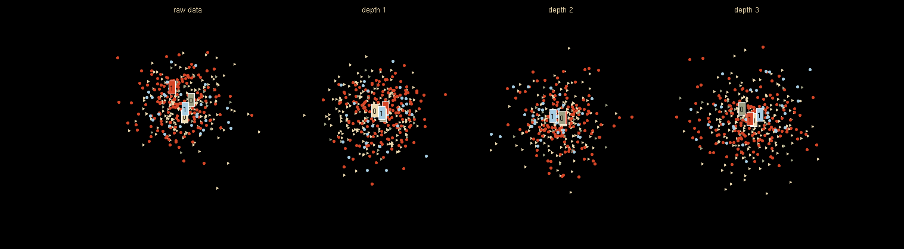

在这篇博客中，我们将讨论检查我们的机器学习或深度学习模型的性能的各种方法，以及为什么要使用其中一种来代替另一种。我们将讨论以下术语:

1.  混淆矩阵
2.  准确(性)
3.  精确
4.  回忆
5.  特征
6.  F1 分数
7.  精确回忆或 PR 曲线
8.  **ROC** ( **R** 接收者 **O** 操作者 **C** 特征)曲线
9.  PR 对 ROC 曲线。

为了简单起见，我们将主要讨论二进制分类问题，比如说我们必须找到一张图片是猫还是狗。或者患者患有癌症(阳性)或被发现健康(阴性)。需要明确的一些常见术语有:

**真阳性(TP)** :预测阳性和实际阳性。

**假阳性(FP)** :预测为阳性，实际为阴性。

**真否定(TN)** :预测否定，实际否定。

**假阴性(FN)** :预测阴性，实际阳性。

所以让我们开始吧！

# **混淆矩阵**

它只是上述参数的一个矩阵形式的表示。更好的可视化总是好的:)

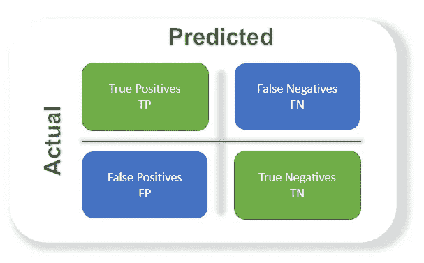

# **精度**

判断一个模型最常用的指标，实际上并不是一个明确的性能指标。当阶级不平衡时，情况会变得更糟。

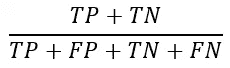

以癌症检测模型为例。实际上患癌症的几率非常低。假设 100 个病人中，90 个没有患癌症，剩下的 10 个实际上患了癌症。我们不想错过一个患有癌症但未被发现的患者(假阴性)。检测每个人是否患有癌症的准确率高达 90%。这个模型在这里什么也没做，只是给出了所有 100 个预测中没有癌症。

我们当然需要更好的选择。

# **精度**

阳性实例占 ***总预测阳性*** 实例的百分比。这里的分母是从整个给定数据集得到的正的模型预测。把它当成是找出'*模型说对了有多少是对的'。*

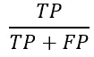

# **召回/灵敏度/真阳性率**

阳性实例占 ***总实际阳性*** 实例的百分比。因此，分母( *TP + FN)* 这里是数据集中存在的阳性实例的*实际*数量。把它当作找出'*当显示正确的时候，模型错过了多少额外的正确的。*

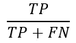

# **特异性**

***中的负实例占总实际负*** 实例的百分比。因此，分母( *TN + FP)* 这里是数据集中存在的否定实例的实际*数量。它类似于回忆，但转移是在否定的情况下。*比如找出有多少健康的患者没有患癌症，并被告知他们没有患癌症*。这是一种衡量等级的方法。*

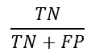

# **F1 得分**

它是精度和召回率的调和平均值。这需要两者的贡献，所以 F1 分数越高越好。请注意，由于分子中的乘积，如果一个值变低，最终的 F1 分数会显著下降。因此，如果正面预测实际上是正面的(精确度)，并且没有错过正面而预测它们是负面的(回忆)，那么模型在 F1 分数中表现良好。

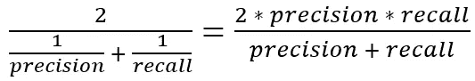

一个缺点是，精确度和召回率同等重要，根据我们的应用，我们可能需要一个比另一个高，F1 分数可能不是它的精确度量。因此，加权 F1 分数或查看 PR 或 ROC 曲线会有所帮助。

# **PR 曲线**

*是各种阈值下的精度和召回率之间的曲线。*在下图中，我们有 6 个预测值，显示了它们在不同阈值下各自的精度-召回曲线。图的右上部分是我们获得高精度和召回率的理想空间。基于我们的应用，我们可以选择预测值和阈值。PR AUC 就是曲线下的面积。其数值越高越好。

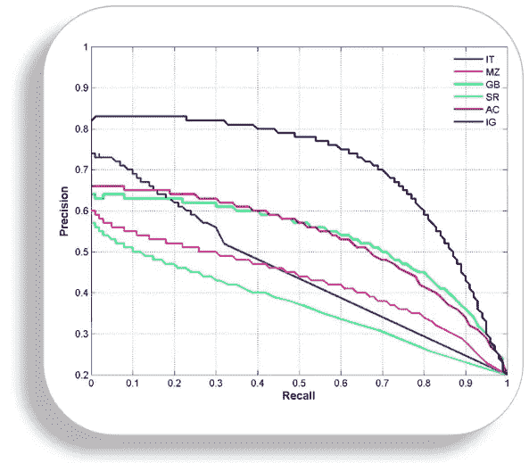

[image link](https://github.com/MenuPolis/MLT/wiki/PR-Curve)

# **ROC 曲线**

ROC 代表接收机工作特性，该图是针对不同阈值的 TPR 和 FPR 绘制的。随着 TPR 增加，FPR 也增加。正如您在第一张图中看到的，我们有四个类别，我们希望阈值使我们更接近左上角。在给定的数据集上比较不同的预测值(这里是 3 个)也变得很容易，如图 2 所示，可以根据手边的应用选择阈值。ROC AUC 就是曲线下的面积，它的数值越高越好。

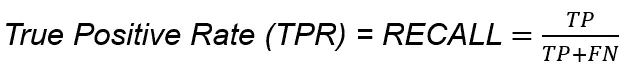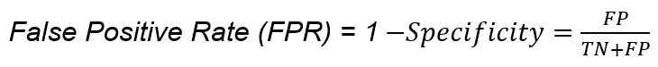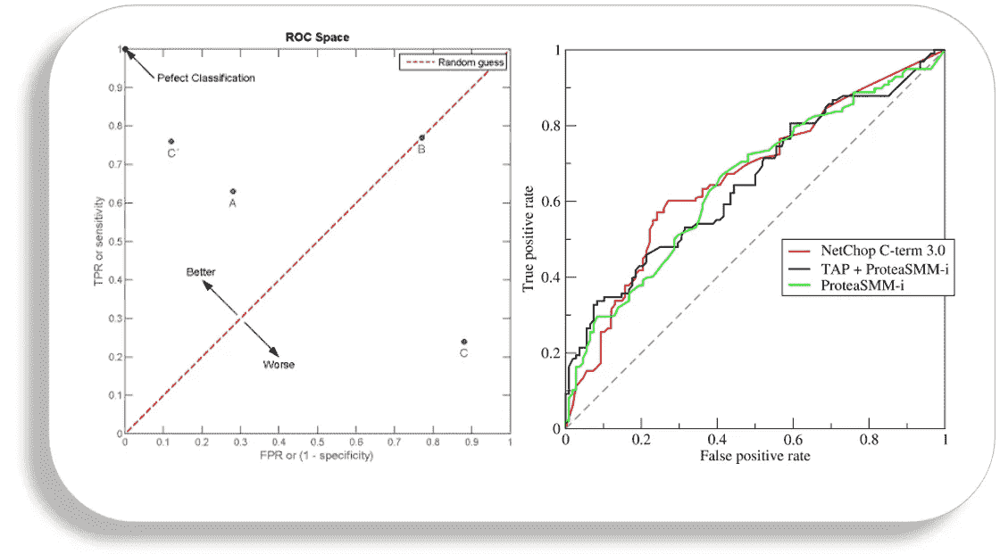

[wiki link](https://en.wikipedia.org/wiki/Receiver_operating_characteristic)

# PR 对 ROC 曲线

这两个指标被广泛用于判断一个模型的性能。

***用 PR 还是 ROC 哪个？***

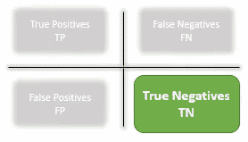

答案在于真正的否定。

**由于精确召回方程中没有 TN，它们在不平衡类中很有用**。在阶级不平衡的情况下，当消极的阶级占多数时。该度量标准没有太多地考虑占多数的否定类别的大量真实否定，从而对不平衡提供了更好的抵抗力。当阳性类别的检测非常重要时，这是很重要的。

我喜欢检测癌症患者，这有很高的不平衡，因为在所有被诊断的患者中很少有人患有癌症。我们当然不希望漏掉一个未被发现的癌症患者(回忆)，并确保被发现的人患有癌症(精确)。

由于考虑到 TN 或 ROC 方程中的负类，当这两类对我们都重要时，这是有用的。像猫狗的探测。真实否定的重要性确保了两个类都被赋予了重要性，就像 CNN 模型在确定图像是猫还是狗时的输出一样。

# 结论

要使用的评估标准在很大程度上取决于手头的任务。很长一段时间，准确性是我使用的唯一衡量标准，这确实是一个模糊的选项。我希望这篇博客对你有用。那都是我这边的。随时建议改正和改进。