# 机器学习中的矢量化实现

> 原文：<https://towardsdatascience.com/vectorization-implementation-in-machine-learning-ca652920c55d?source=collection_archive---------3----------------------->


# 介绍

在机器学习领域，高级玩家需要编写自己的成本函数或优化算法来实现更定制的模型，而不仅仅是使用现有的机器学习库。为了充分利用当今计算机的计算能力，算法实现的现有技术是对所有计算进行矢量化。这允许您实现并行计算，例如充分利用 GPU 的处理器。本文介绍了机器学习矢量化的实现。本帖使用的所有代码都可以在我的 [github](https://github.com/liuy14/vectorization) 中找到。

# 先决条件:Numpy 数组

我们将在 numpy array 的矢量化过程中使用的最重要的工具。注意，我们不使用 numpy 矩阵，因为 numpy 矩阵是严格的二维矩阵。实际上，numpy 矩阵是 numpy 数组的子集。因此，为了方便起见，我们总是使用 numpy 数组。这里回顾一下 numpy 数组算法，以便更好地理解后面的内容。下面是如何**定义 numpy 数组**:

```
# import numpy
import numpy as np# define two numpy arrays
a = np.array([[1,2],[3,4]])
b = np.array([[1,1],[1,1]])print(a)
>>> array([[1, 2],
           [3, 4]])
print(b)
>>> array([[1, 1],
           [1, 1]])
```

## Numpy 数组加法

```
# addition
print(a + b)>>> array([[2, 3],
           [4, 5]])
```

## Numpy 数组减法

```
# substraction
print(a - b)>>> array([[0, 1],
           [2, 3]])
```

## Numpy 数组乘法

注意，如果直接使用' * '乘法，这不同于称为点积矩阵乘法。两个数组之间的' * '操作只是将相同位置的元素相乘。

```
# multiplication: 
print(a * b)>>> array([[1, 2],
          [3, 4]])
```

## Numpy 数组点积

我们使用 numpy 的点函数来实现矩阵乘法。一个如此方便的方法是通过使用**“@”符号**，它以完全相同的方式工作。

```
# matrix multiplication
print(np.dot(a,b))>>> array([[1, 2],
          [3, 4]])# matrix product alternative
print(a@b)>>> array([[3, 3],
          [7, 7]])
```

## Numpy 数组维数

这里我们展示了两个例子，展示了 dimension 如何在 numpy 数组中工作。请注意，在第一种情况下，它是一个一行三列的数组，而在第二种情况下，它是一个三行一列的数组。

```
# numpy array with one row
a =  np.array([1,2,3])
print(a.shape)>>> (3,)# numpy array with three rows
b = np.array([[1],[2],[3]])
print(b.shape)>>> (3, 1)
```

## Numpy 数组索引和切片

对于 2D numpy 数组，当我们在表示为 A 的数组中切片一个元素时，我们可以使用 A[i，j],其中 I 是行索引，j 是列索引。如果想选择一整行 I，使用 A[i，:]，类似地对于选择一整列 j 使用 A[:，j]。

```
# Define an 3x3 2d array
a = np.array([[1,2,3],[4,5,6],[7,8,9]])
print(a)>>> array([[1, 2, 3],
          [4, 5, 6],
          [7, 8, 9]])# select first element in the array
print(a[0,0])>>> 1# select first row of the array
print(a[0,:])>>> array([1, 2, 3])# select second coulumn of the array
print(a[:,1])>>> array([2, 5, 8])
```

# 先决条件:线性回归成本函数

在这一节中，我们将回顾线性回归的一些概念及其数学表达式。由于我们需要使用这些公式来实现梯度下降算法，在下一节，看看如何实现矢量化。

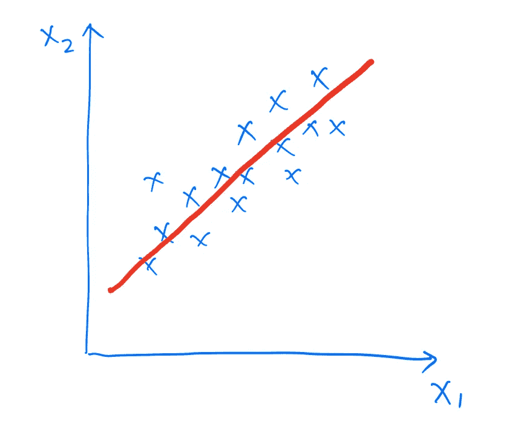

线性回归的假设定义为:

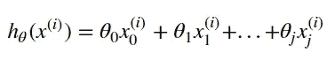

线性回归的成本函数定义为:

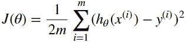

成本函数对每个θ的导数定义为:


在梯度下降的每次迭代中，我们使用以下等式更新所有θ:

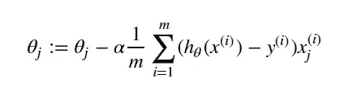

# 资料组

我们使用的数据集是来自 [UCI 机器学习资源库](https://archive.ics.uci.edu/ml/machine-learning-databases/housing/)的“波士顿住宅”。它使用了房屋面积大小、建造年份等特征。来预测波士顿地区的房价。数据如下所示:

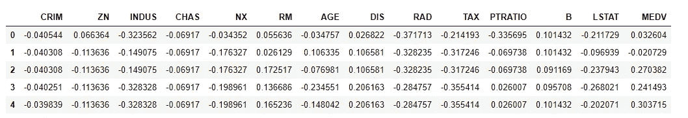

我们的数据集有 506 个条目，我们将其表示为条目数 m。特征数 n=14，包括我们初始化为全 1 的截取特征。见下文:

```
# Insert X0 Column
Xd = df.drop(columns=['MEDV'])
Xd.insert(0, 'X0', 1)
Xd.head()
```

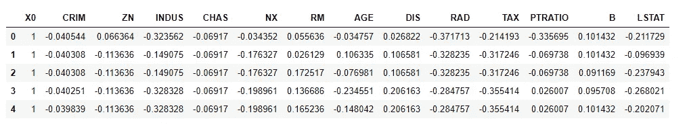

```
# numpy array format
X = Xd.values
y = df.MEDV.values# sample size
m = len(df.index)
print(m)>>> 506# number of features
n = X.shape[1]
print(n)>>> 14
```

# 对于循环垂直向量化

在本节中，我们通过对线性回归应用梯度下降算法，对 for 循环和矢量化方法进行逐步比较。我们在线性回归部分比较了每个公式实现的运行时间。

我们将所有 thetas 初始化为 1:

```
# Initialize theta
theta = np.ones(n)print(theta)
>>> array([1., 1., 1., 1., 1., 1., 1., 1., 1., 1., 1., 1., 1., 1.])
```

## 假设实现:For 循环

为了实现线性回归的假设功能，如果我们使用 for 循环，可以使用下面的代码来实现:

```
# hypothesis for the first sample
hypo = 0
for j in range(n):
    hypo += theta[j]*X[0,j]
```

为了获得每个样本的假设，我们需要一个列表来存储它，并需要另一个 for 循环来迭代所有样本:

```
%%time
# hypothesis for all the samples
all_hypo = []
for i in range(m):
    hypo_i = 0
    for j in range(n):
        hypo_i += theta[j]*X[i,j]
    all_hypo.append(hypo_i)>>> Wall time: 4 ms
```

我们可以看到运行时间是 4 ms，这并不太疯狂，因为这个实现足够简单，数据集也很小。

结果显示为:

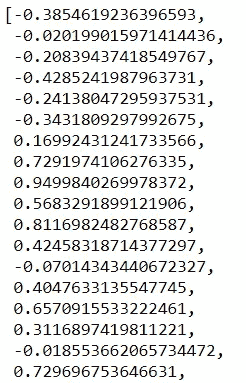

## 假设实现:矢量化

每个样本的假设可以使用以下公式进行矢量化:

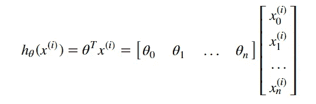

为了实现将所有样本作为一个列表的假设，我们使用下面的数组点积:

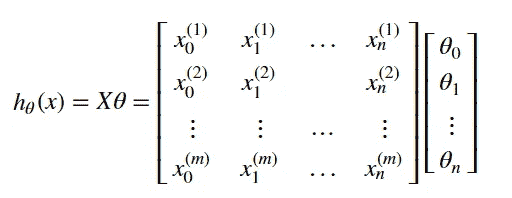

代码实现非常简单明了:

```
%%time
# matrix format
hypo = X@theta>>> Wall time: 0 ns
```

我们可以发现，它只需要很少的时间来计算，甚至可以不显示。计算结果如下所示。与 for 循环结果相比，我们可以看到我们获得了完全相同的结果。

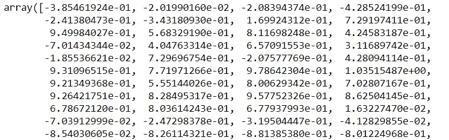

## 成本函数实施:For 循环

基于我们从假设中获得的结果，我们需要另一个循环来迭代所有样本以计算成本函数。

```
%%time
# cost function
cost = 0
for i in range(m):
    hypo_i = 0
    for j in range(n):
        hypo_i += theta[j]*X[i,j]
    cost_i = (hypo_i - y[i])**2
    cost += cost_i
cost = (1/(2*m))*cost>>> Wall time: 4 ms
```

运行时间为 4 ms，结果显示如下:

```
print(cost)>>> 1.399752908228425
```

## 成本函数实现:矢量化

基于假设的矢量化，我们可以很容易地将成本函数矢量化为:

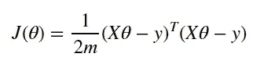

代码实现仍然非常简洁:

```
%%time
# cost function
cost = (1/(2*m))*np.transpose((X@theta - y))@(X@theta - y)>>> Wall time: 0 ns
```

同样，这种矢量化计算是即时的。计算结果与 for 循环结果相同:

```
print(cost)>>> 1.3997529082284244
```

## 派生实现:For 循环

计算成本函数对指定θ的导数，编码如下:

```
dev_sum = 0
for i in range(m):
    hypo_i = 0
    for j in range(n):
        hypo_i += theta[j]*X[i,j]
    dev_i = (hypo_i - y[i])*X[i,k]
    dev_sum += dev_i
dev_sum = (1/m)*dev_sum
```

为了计算所有θ的导数并输出一个列表，我们需要另一个 for 循环迭代所有列:

```
%%time
# derivation
dev_list = []
for k in range(n):
    dev_sum = 0
    for i in range(m):
        hypo_i = 0
        for j in range(n):
            hypo_i += theta[j]*X[i,j]
        dev_i = (hypo_i - y[i])*X[i,k]
        dev_sum += dev_i
    dev_sum = (1/m)*dev_sum

    dev_list.append(dev_sum)>>> Wall time: 47 ms
```

运行时间为 47 ms，随着循环的增多，for 循环和矢量化的时间成本差异开始变得显著。

for 循环的推导结果是:

```
print(dev_list)>>> [0.9999999999999983,
 0.07814620360307895,
 -0.11042922261438312,
 0.2620302340552936,
 0.05504439083525137,
 0.23892542562534522,
 -0.06454255823702795,
 0.2611634394125097,
 -0.1453677181065729,
 0.43106386997897883,
 0.38303455280215737,
 0.16591512402899725,
 -0.09920797306076046,
 0.1835280968258358]
```

## 派生实现:矢量化

关于每个θ的成本函数的推导可以矢量化为:


成本函数对所有θ的推导可矢量化为:

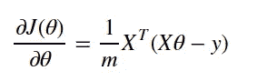

代码实现仍然非常简洁:

```
%%time
dev = (1/m)*np.transpose(X)@(X@theta - y)>>> Wall time: 999 µs
```

直接比较是 999μs vs . s . 47 ms，以下是矢量化计算结果:

```
print(dev)array([ 1\.        ,  0.0781462 , -0.11042922,  0.26203023,  0.05504439, 0.23892543, -0.06454256,  0.26116344, -0.14536772,  0.43106387, 0.38303455,  0.16591512, -0.09920797,  0.1835281 ])
```

两种方法的结果也是一样的。

# 将一切放在一起:优化

在本节中，我们使用我们之前开发的所有实现，并编写一个梯度下降迭代来比较这两种方法。

## 梯度下降:用于循环

为了获得下降优化结果，我们将迭代次数设置为 10 万次。为了实现梯度下降算法，我们需要嵌套四个 for 循环。学习率被设置为 0.0005，θ被初始化为全 1。代码如下所示:

```
%%time
a = 0.0005
theta = np.ones(n)cost_list = []for itr in range(100000):

    dev_list = []
    for k in range(n):
        dev_sum = 0
        for i in range(m):
            hypo_i = 0
            for j in range(n):
                hypo_i += theta[j]*X[i,j]
            dev_i = (hypo_i - y[i])*X[i,k]
            dev_sum += dev_i
        dev_sum = (1/m)*dev_sumdev_list.append(dev_sum)

    theta = theta - a*np.array(dev_list)

    cost_val = cost_loop(theta)

    cost_list.append(cost_val)>>> Wall time: 1h 15min 58s
```

总运行时间为 1 小时 15 分钟。以下是我们获得的最小成本。我们还提供了一个曲线图，显示了成本函数相对于迭代的变化。

```
print(cost_val)>>> 0.017663350184258856
```

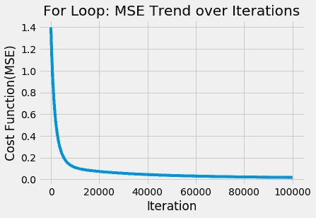

## 梯度下降:矢量化

矢量化梯度下降的实现非常干净优雅。

```
%%time
a = 0.0005
theta = np.ones(n)cost_list = []for i in range(100000):

    theta = theta - a*(1/m)*np.transpose(X)@(X@theta - y)

    cost_val = cost(theta)
    cost_list.append(cost_val)>>> Wall time: 1.75 s
```

矢量化方法具有如下最小成本函数值。同样，提供了关于迭代的成本变化:

```
print(cost_val)>>> 0.017663350184258835
```

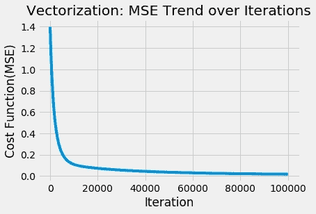

我们可以看到两种方法的最小成本值几乎完全相同。但是使用矢量化的算法实现时间为 1.75 秒，而使用 for 循环的算法实现时间为 1 小时 15 分钟。

# 结论

这里有一个图，显示了实现相同算法并使用完全相同的学习速率和初始θ值的两种方法的运行时间差异。这两种方法达到了同样的精度。然而，矢量化方法花费了 1.75 秒，而 for 循环花费了 4558 秒。矢量化方法比 for 循环方法快 2600 倍。

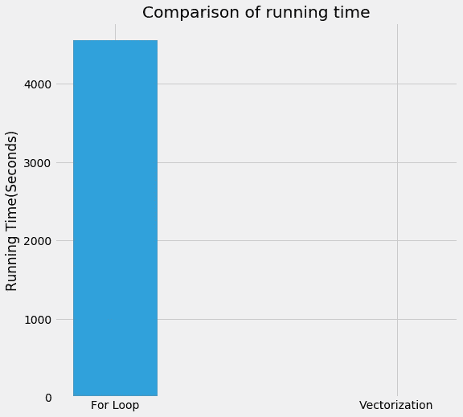

矢量化方法的时间复杂度为 O(s)，其中 s 为迭代次数。相比之下，for 循环方法的时间复杂度为 O(s*n*m*n)，其中 s 是迭代次数，m 是数据集样本数，n 是数据集特征数。在这种情况下，我们的数据集足够小，m=506，n=14，但是我们观察到时间复杂度的巨大差异。为大数据成像，这种差异会有多大。由于 noway 的计算机和 GPU 是由成千上万个“核心”组成的，我们甚至可以有多个 GPU 或使用一个计算机集群，我们需要充分利用这些计算能力。方法是通过并行计算实现你的算法。因此，在我们的机器学习算法中使用矢量化是提升算法并节省大量训练时间的关键。矢量化是我们需要考虑的一个很好的方法，值得花时间去研究。