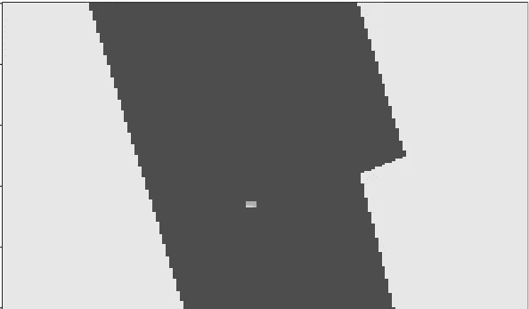
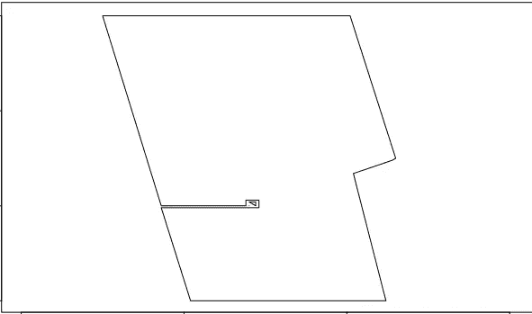
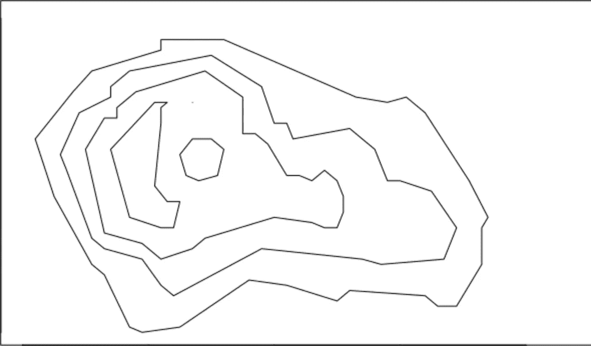

# 栅格向多边形的矢量化

> 原文：<https://towardsdatascience.com/vectorization-of-raster-to-polygons-dc56acc3aa5f?source=collection_archive---------10----------------------->

## 如果有免费的库，我绝不会开始写任何矢量化代码。

然而，最近我作为技术负责人参与了一个与几何和光栅矢量化相关的有趣项目。我需要计算各种形状的复杂投影。我从一个“干净”的数学解决方案开始，很快以大量与多边形三角剖分相关的计算结束——O(log n！).我花了一周的时间才发现自己真的遇到了麻烦——在真实的场景中，这个过程只持续了几分钟。然后，我决定将我们的目光转向离散化(正如在开始时声明的那样)，我做了这项工作，并得到了矩阵形式的结果。那天是星期五，结果需要在下周一公布。但是以向量的形式。

我在 **R** 包中搜索光栅矢量化，发现[T5包，因为函数 rasterToPolygons 看起来不错，我们认为它可能为多边形产生了太多的点。因为没有必要的 R 包，所以我需要创建自己的。嗯，仍然有半个周末，我们做了一些 C++编码，并创建了这个函数，它一步就完成了工作。](http://cran.r-project.org/package=raster)

这是带有飞地和不允许飞地的选项的初始位图，结果如下:



来自火山数据集的示例:

```
library(fasteraster); 
library(datasets); 
inp = volcano; res = raster2vector(volcano, 120, 200, 20); image(inp, col = rev(grey.colors(100)), useRaster = TRUE)
plot(0, type = "l", xlim = c(0, nrow(inp)), ylim = c(0, ncol(inp))) a = lapply(res, function(x) lines(rbind(x, x[1,])))
```

生产:



你可以在这里找到源码包:[faster raster _ 1 . 0 . 4 . tar](http://mindcraft.ai/wp-content/uploads/2018/05/fasteraster_1.0.4.tar.gz)和 Linux 64 二进制:[faster raster _ 1 . 0 . 4 _ R _ x86 _ 64-PC-Linux-GNU . tar](http://mindcraft.ai/wp-content/uploads/2018/05/fasteraster_1.0.4_R_x86_64-pc-linux-gnu.tar.gz)新鲜版本权自克兰:[https://cran.r-project.org/package=fasteraster](https://cran.r-project.org/package=fasteraster)

## 附言（同 postscript）；警官（police sergeant）

对于个人问题，请在 Linkedin 或脸书联系我，有时我会在那里发布一些关于人工智能的简短新闻和想法。如果你在人工智能方面有需求，或者你需要建立一个数据科学咨询团队，请联系我