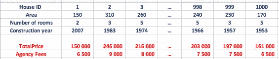
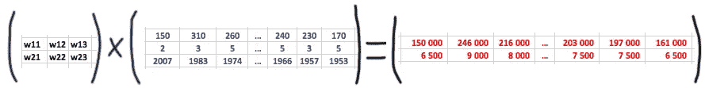
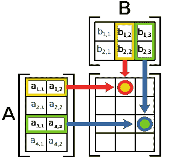
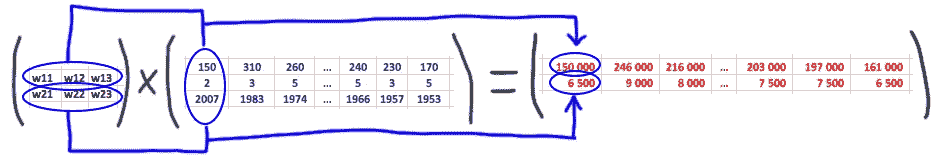
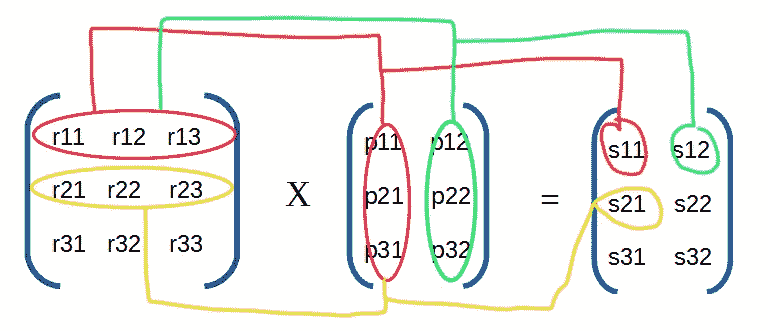
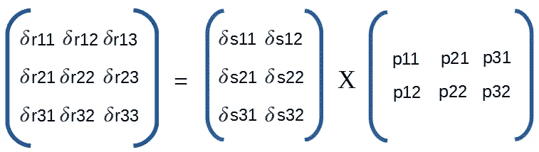
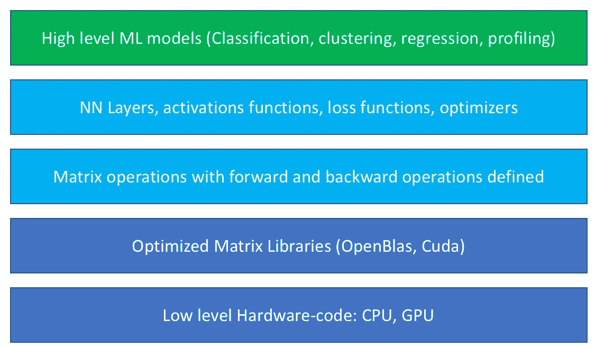

# 反向传播的矢量化实现

> 原文：<https://towardsdatascience.com/vectorized-implementation-of-back-propagation-c4ce1d3eb684?source=collection_archive---------8----------------------->


在[之前的帖子](https://medium.com/datathings/neural-networks-and-backpropagation-explained-in-a-simple-way-f540a3611f5e)中，我们解释了反向传播背后的基本原理以及神经网络是如何工作的。在本帖中，我们将解释如何利用优化的数学库来加速学习过程。

> “向量化”(简化)是重写一个循环的过程，这样它不是处理数组的单个元素 N 次，而是同时处理数组的几个或所有的元素**。**

让我们从一个数据集的例子开始，这个数据集在一个特定的城市出售了 1000 套房子。对于每栋房子，我们有 5 个信息:它的面积，房间数量，建造年份，支付的价格和代理费。目标是训练一个模型，根据前 3 个特征预测价格和代理费。



Dataset example

让我们考虑一个简单的线性前馈模型，具有 6 个权重(W11，W12，W13，W21，W22，W23)，其中:

*   价格= W11。面积+ W12。NbRooms + W13。年
*   费用= W21。面积+ W22。NbRooms + W23。年

[正如前面更详细解释的那样](https://medium.com/datathings/neural-networks-and-backpropagation-explained-in-a-simple-way-f540a3611f5e)，机器学习的目标是找到这 6 个权重的哪个值最符合最接近数据集真实输出的模型输出。我们从随机初始化权重开始。然后，我们向前传播以计算预测价格和代理费。通过将结果与来自数据集的真实价格和费用进行比较，我们可以获得误差的梯度，以便稍后反向传播，并相应地更新权重。

一个简单的实现如下所示:

[https://gist . github . com/Assad/EC 33987 c 6273293 af 2f 648572 fa 85 a3d](https://gist.github.com/assaad/ec33987c6273293af2f648572fa85a3d)

然而，数据集上的这种顺序 for 循环太慢，并且没有利用 CPU 和 GPU 中的现代并行性。

为了获得高性能，我们需要将数据集转换成矩阵表示。如果我们采用基于列的表示，来自数据集的每个输入都被复制到矩阵中的一列。

*   我们的权重矩阵将是一个 2 行 x 3 列的矩阵。
*   我们的输入矩阵将是一个 3 行 x 1000 列的矩阵。
*   我们的输出矩阵将是一个 2 行 x 1000 列的矩阵。

我们正在寻求解决的线性模型可以用以下基于矩阵的形式表示:



Matrix or a vectorized-form of: Weights x Inputs = Outputs

这种表示起作用的原因是因为这正是矩阵乘法的运行方式:



Matrix multiplication



Matrix-multiplication: a row i of the first matrix is multiplied by a column j of the second matrix to calculate the value of the cell (i , j) of the output

有了矢量化实现，以前需要 1000 次迭代的 for 循环现在只需很少的高性能矢量化运算即可完成，如下所示:

```
Predictions = Matrix.Multiply(Weights, Inputs)
Error = Matrix.Substract(Predictions, Outputs)
```

在大数据集上，使用 GPU(有些有 1000 个内核)，我们可以期待在**数千倍的加速！**在 CPU 上，有很多实现高性能矩阵运算的高级数学库，比如 [openBLAS](https://www.openblas.net/) 。

向量化前向传播简单明了，它遵循模型定义。挑战在于误差反向传播的矢量化。

*   有了数字，如果我们通过一个函数 **f** 传递一个数字 **x** 得到**y = f(x)****f**的导数**f’**给我们 y 的**变化率，当 **x 变化**。**
*   对于矩阵，我们需要使用 [**雅可比矩阵**](https://en.wikipedia.org/wiki/Jacobian_matrix_and_determinant) ，这是一个由关于输入矩阵的不同元素的偏导数组成的矩阵。

背后的理由是**固定输入矩阵**中的所有元素**，除了一个元素**，其中我们向其添加一个小增量 **𝛿** ，并查看输出矩阵中的哪些元素受到影响，影响到哪个比率，并将它们相加在一起。我们对输入矩阵的所有元素都这样做，我们在输入端得到它的梯度矩阵。因此它具有相同的形状(行数和列数)。



考虑下面的矩阵运算。RxP=S，(以及计算输出 S 的前 3 个元素的前 3 个等式)

等式 1: s11 = r11.p11 + r12.p21 + r13.p31(红色输出)

等式 2: s12 = r11.p12 + r12.p22 + r13.p32(绿色输出)

等式 3: s21 = r21.p11 + r22.p21 + r23.p31(黄色输出)

假设我们在输出 **S** 处已经有了梯度矩阵**δS**，我们想将其反向传播到输入 **R** (分别为 **P** )以计算**δR**(分别为。**δP**)。由于 **r11** 只参与 **s11** 和 **s12** 的计算(红绿不黄)，我们可以预计只有 **𝛿s11** 和 **𝛿s12** 反向传播到 **𝛿r11** 。

*   为了找到 **𝛿s11** 的反向传播的速率，我们相对于 **r11** 对等式 1 进行部分求导(并认为其他一切为常数)，我们得到 **p11** 的速率(另一种解释方式:在 **r11** 中的小变化，将被 **s11** 中的 **p11** 因子放大)。
*   通过对 **𝛿s12** 和等式 2 做同样的事情，我们得到 **p12** 的速率。
*   如果我们试图将 **𝛿s13** 反向传播到 **r11** ，并且相对于 **r11** 推导等式 3，我们得到 0，因为等式 3 根本不依赖于 **r11。**另一种理解方式:如果我们有一个错误或 s21，在 r11 上无法做任何事情来减少这个错误。由于 r11 不参与 s21 的计算！这同样适用于 **S 矩阵**的所有其他元素(s21、s22、s31、s32)。
*   最后，加起来，我们得到 **𝛿r11=𝛿s11.p11 + 𝛿s12.p12**

通过对矩阵 R 的所有元素做同样的处理，我们得到如下结果:

*   **𝛿r11=𝛿s11.p11 + 𝛿s12.p12**
*   **𝛿r12=𝛿s11.p21 + 𝛿s12.p22**
*   **𝛿r13=𝛿s11.p31 + 𝛿s12.p32**
*   **𝛿r21=𝛿s21.p11 + 𝛿s22.p12**
*   **𝛿r22=𝛿s21.p21 + 𝛿s22.p22**
*   **𝛿r23=𝛿s21.p31 + 𝛿s22.p32**
*   **𝛿r31=𝛿s31.p11 + 𝛿s32.p12**
*   **𝛿r32=𝛿s31.p21 + 𝛿s32.p22**
*   **𝛿r33=𝛿s31.p31 + 𝛿s32.p32**

如果我们仔细观察该模式，我们会发现我们可以将其转化为矢量化矩阵乘法，如下所示:

```
**ΔR = ΔS x Transpose(P)**
```



类似地，如果我们按照相同的过程反向传播到 P，我们得到下面的等式:

```
**ΔP = Transpose(R) x ΔS**
```

每个神经网络层由几个数学运算组成。如果我们设法在向前和向后传递中用矩阵运算来定义每个数学运算，我们在学习中得到最大加速。

在第一步中，每个矩阵 **M** 必须被一个伴随矩阵**δM**增加，以在返回的路上保持其梯度。

第二步，每个矩阵运算都必须定义自己的向前和向后运算。例如:

在创建了这个数学运算的矢量化库之后，我们可以使用这个库来链接运算，并创建层、激活函数、损失函数、优化器。反向传播将被自动定义为每层中使用的数学函数的回调栈(或计算图)。这就是 [Tensorflow](https://www.tensorflow.org/) 在一定程度上的工作原理。

我们可以将完整的机器学习过程视为一堆抽象的**:**



An abstraction of machine learning library stack

*原载于 2018 年 6 月 1 日*[*【medium.com】*](https://medium.com/datathings/vectorized-implementation-of-back-propagation-1011884df84)*。*