# 矢量让你看到 3D 眼镜看不到的东西？

> 原文：<https://towardsdatascience.com/vectors-let-you-see-what-3d-glasses-cant-e1385d9ef879?source=collection_archive---------5----------------------->

警告:我假设你知道矢量是什么。如果没有，请在评论区告诉我，我会尽力另发一篇帖子。原因是，你要么知道向量，要么不知道。句号。因此，至少 500 字的解释是必须的，根据我的资格是一个单独的职位。

在之前一篇关于降维的文章中，我谈到了降维将如何帮助我们快速得出一些结论。我也提到过，我们将在后面的文章中讨论数学，现在我们来谈谈向量！是的，向量在降维方面很有用:)。事实证明，线性代数在研究像 PCA、SVD 等机器学习技术时非常有用。如果您对这些术语不熟悉，可以将线性代数视为删除不需要的数据、压缩图像、检测图像边缘等的有用工具。我打算很快就这些话题进行写作，并承诺让它们变得更简单。

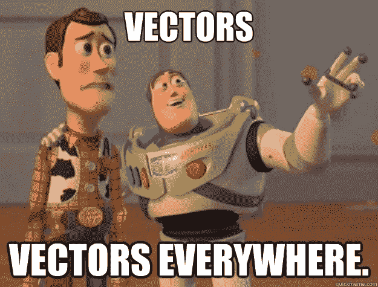

如果你没有看过我之前的帖子，你可以查看这里的。虽然这不是理解这篇文章的先决条件，但在着色之前，你会先画一个草图。有些人喜欢直接着色！；)

让我们先熟悉一些术语，如跨度、线性组合等。

你可以在下面看到一个向量的跨度。在我们的例子中，两个向量(v⃗和 w⃗)的“跨度”只不过是 v⃗和 w⃗的线性组合的表示，也就是说，你将 v⃗和 w⃗组合起来，得到一个合成向量 x⃗.

I know that’s confusing!

因此，简单地说，跨越就是将按比例缩放的向量相加，产生一个覆盖高维空间的合成向量。看下面的 gif 图片来理解我的意思。

缩放矢量？？只是乘以标量，结果向量要么压缩要么拉伸！

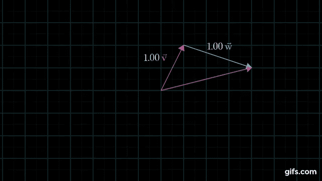

因此，矢量 v⃗在大小为“a”的方向上移动，而另一个矢量 w⃗在与 v⃗正交的另一个方向上作用，大小为“b”。所以，通过改变大小，你可以看到这两个向量可以覆盖几乎所有的空间！这也叫向量空间。这些标量在特定的方向上拉伸或挤压矢量。

看下面的 gif 图片，看看整个矢量空间被缩放矢量覆盖的结果。请记住，这里我们有两个维度。想象一架飞机在 3D 情况下被覆盖。我不知道你如何形象化(几何)4D 等等；).然而，事实证明这些向量可以帮助我们处理几何学限制的更高维度。我们将在后面的文章中看到这是如何发生的。

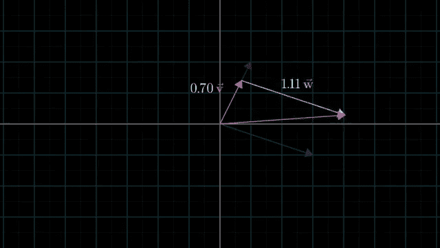

这就是多个向量的线性组合是如何容易地被想出来的。

一个例子应该让我们清楚地记住这一点。我们试图说，上面的‘a’和‘b’的任何组合都会把我们带到向量 av⃗ + bw⃗.

比方说，

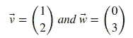

使用 v⃗和 w⃗的线性组合的最终向量是 x⃗，其中

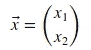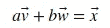

向量的值会是什么样子，

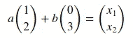

上述等式意味着，

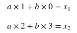

这是一个两个未知数的线性系统，我们有两个方程，因此我们可以得到一个解，即我们可以找到 a 和 b。花一些时间来计算这些值(提示:这很容易！).

上述方程的解是，

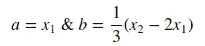

现在，让我们说，你想找到得到矢量 x⃗=[0 ^ 6]的线性组合是什么？

答案很简单，方程式是，

因此，代入上述值后，最终方程将为:

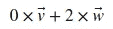

现在，这可能看起来没有什么魔力，因为我故意举了一个简单的例子，你可以试着做一些难的，你仍然可以得到答案！

我们可以把这个想法扩展到任何维度，我把它作为家庭作业留给你们。但是，让我给你一点提示，看看这个等式在 3D 的情况下会是什么样子。

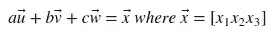

让我们来看一个向量的 3D 演示。为了直观地理解，红色向量在 x、y、z 方向上分别移动了 5 个单位、8 个单位、3 个单位。

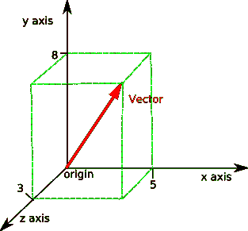

a=5, b=8, c=3 in the x, y, z axis respectively.

我希望这能让事情变得简单，并帮助你思考更高的维度！

这就是这篇文章的内容。尽管对这些方程大谈特谈，我还是要证明这些向量在机器学习中的用处。我们将在随后的帖子中涉及更多关于向量的主题，并最终将所有的点连接起来，以显示线性代数对于机器学习是多么有用！

下次见，机器学习快乐！:)