# 车辆检测和距离估计

> 原文：<https://towardsdatascience.com/vehicle-detection-and-distance-estimation-7acde48256e1?source=collection_archive---------0----------------------->

**Udacity SDCND**

开车时，要做两件非常重要的事情:a)保持在你的车道上 b)避开其他车辆。为此，我们需要知道车道在哪里，其他车在哪里。自动驾驶汽车也是如此，因此 Udacity 的家伙们决定，自动驾驶汽车 Nannodegree 的最后两个项目。在我以前的帖子中，我已经谈到了如何[找到车道线](https://medium.com/@ajsmilutin/advanced-lane-finding-5d0be4072514#.z93k3wkzl)，并使其对光线变化和噪声具有鲁棒性。这篇文章解决了在图像上找到车辆并估计它离我们的车的距离的问题。

该项目的目标/步骤如下:

*   提取用于分类的特征
*   构建和训练分类器
*   滑动车窗，在图像上识别汽车
*   过滤掉假阳性
*   计算距离
*   在视频上运行管道

*这里用到了《高级寻巷》中的一些部分，所以如果你对更深入的描述感兴趣，你可以在这里***阅读我之前的帖子。**

**所有的代码和训练数据都可以在* [*这个 Github 库*](https://github.com/ajsmilutin/CarND-Vehicle-Detection) 中找到*

# *汽车分类器*

*我们需要做的第一件事是创建一个分类器来区分汽车和非汽车。为此需要数据集，我已经使用了 Udacity 提供的数据集。(下载:[车辆](https://s3.amazonaws.com/udacity-sdc/Vehicle_Tracking/vehicles.zip)、[非车辆](https://s3.amazonaws.com/udacity-sdc/Vehicle_Tracking/non-vehicles.zip))。该数据集是 KITTI vision 基准套件和 GTI 车辆图像数据库的组合。GTI 汽车图像分为远、左、右、中近。汽车和非汽车的例子如下:*

*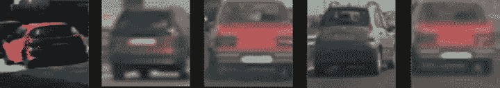*

*Car images from left to right: 1)KITTI, 2)GTI Far 3)GTI Near 4)GTI Left 5)GTI Right*

*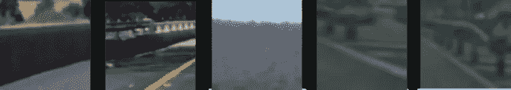*

*Non-car images*

*要建立一个分类器，首先必须识别特征。将要使用的特征是直方图、全图像和 HOG-s 的混合。*

# *提取特征*

## *彩色空间*

*在颜色编码的意义上，颜色空间与图像的表示有关。有些编码更适合一种用途，但不适合其他用途。例如，从硬件的角度来看，RBG 很好，因为它是如何捕捉和显示像素的( [Bayer filter](https://en.wikipedia.org/wiki/Bayer_filter) 就是一个很好的例子)，但它没有捕捉人类感知颜色的方式，而这对于分类任务很重要。对于汽车分类的任务，我确信没有一个规定的颜色空间是最好的。所以只能通过试错来选择。我所做的是，我已经建立了分类器，基于 HOG、颜色直方图和完整图像，然后改变颜色空间，直到我在测试集上获得最佳分类结果。也许我是从上到下描述问题，但是颜色空间对于解释和可视化特征是非常重要的。经过一番试用，我发现 [LUV](https://en.wikipedia.org/wiki/CIELUV) 色彩空间效果最好。它具有发光分量 L，以及两个( *u* 和 *v* )色度分量。该颜色空间始终给出更好的分类结果。*

## *作为特征的子采样和归一化图像*

*第一个也是最简单的特征是二次抽样图像。再次，通过尝试和检查分类结果，二次抽样图像的大小被选择为 20×20。此外，图像是伽玛标准化。这是在观看 YouTube*解释猪的视频时产生的想法。据说，对图像求平方根可以使其标准化，并获得均匀的亮度，从而减少阴影的影响。我试了一下，它在分类上有了微小的改进。因为这是一个非常简单的操作，所以它保留在我的代码中，因为它提供了额外的健壮性。在归一化和二次采样之后，图像被整形为矢量而不是矩阵。原始图像归一化转换成 LUV 的有:**

**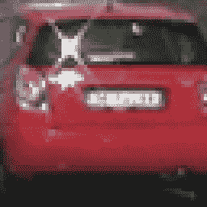****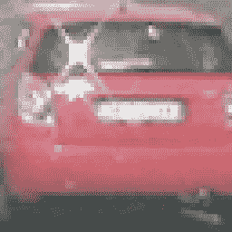****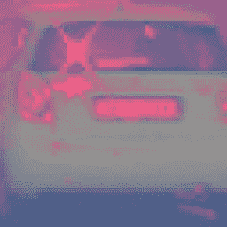

Car images from left to right: 1) Original 2) Normalized 3) LUV color space** 

## **颜色直方图**

**第二组特征是颜色直方图。最初，我试图只使用发光通道 *L* 的直方图。汽车可以有不同的颜色，所以省略色度通道对我来说是一个自然的选择。经过一些测试后，我发现包括所有三个颜色通道的直方图提高了几个百分点的测试精度，这可以产生很大的差异。基于测试精度选择直方图中的仓数量，128 个仓产生最佳结果。以下是之前显示的图像的直方图示例:**

**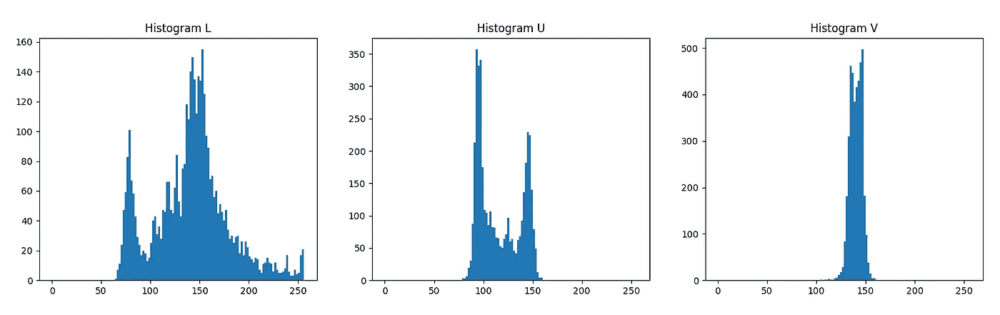**

**Histograms of all three channels**

## **猪**

**最后，但可能是最重要的特征是梯度方向直方图——HOG。围绕 HOG 的主要思想是基于使用一些边缘检测器计算的每个像素的方向来计算直方图。边缘上的像素比边缘上的像素对直方图的贡献大得多。图像被分成多个单元，并且对于每个单元，方向被分箱。所以猪基本上显示了每个细胞的主导方向。你可以在这个 [*YouTube*](https://www.youtube.com/watch?v=7S5qXET179I) 视频中找到关于这头猪的详细信息。计算凸起的图像大小为 64x64。每个单元的像素数量是 8，而每个块的单元数量是 1。方向的数量是 12。HOG 是在归一化图像的所有三个通道上计算的。我对这些参数进行了大量测试，最终发现这是最佳选择。我在选择时考虑的是以这种方式生成的特征的数量以及在测试集上获得的准确性。当使用这组参数时，每个通道总共创建了 768 个特征。如果每个块的单元数增加到 2，则每个通道的特征数会增加到 2352。当每块使用 2 个单元时，分类精度的提高并不显著，所以我选择每块使用 1 个单元。此外，我还尝试了增加每个单元的像素数，在这种情况下，大量信息会丢失，精度会下降，而降低每个单元的像素数会增加特征的数量。每个通道的图像可视化 HOG 为:**

****

**HOG of a car**

**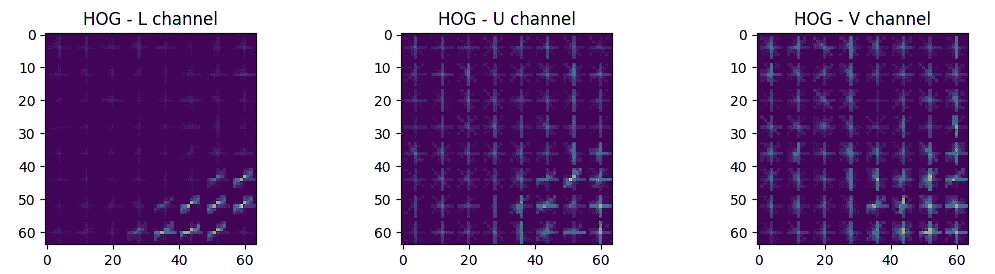**

**HOG of a non-car**

## **训练分类器**

**使用的分类器是*线性支持向量分类器*。数据集是通过遍历车辆和非车辆的图像并计算这些图像的特征而获得的。接下来要做的是缩放特征，这对任何机器学习算法都非常重要。之后，数据集被分成训练集和测试集，其中测试集占所有数据的 10%。使用 *C=1e-4* 训练分类器，其中该特征是基于训练和测试集的精度选择的。如果两个精度之间的差异很大，则训练过拟合数据，因此降低了 *C* 。当测试精度较低但与训练精度相同时，出现了欠拟合，因此增加了 *C* 的值。在测试集上获得的最终准确度为 **99.55%** 。训练完成后，分类器和定标器被酸洗并保存，以便在处理来自摄像机的图像时可以重复使用。**

# **在图像/视频上寻找汽车**

**在图像和视频中寻找汽车的管道非常相似。事实上，在视频中寻找汽车遵循的是在静态图像中寻找汽车的相同流程，只是增加了一些功能。为此，将首先描述单个图像的流水线。**

# **滑动窗户**

**首先要做的是在屏幕上滑动窗口，并尝试识别在定义的分类器上产生正面命中的区域。将要滑动的窗口总是大小为 64x64，重叠 75%。在某些情况下，汽车可能大于 64x64 像素，因此为了涵盖这些情况，整个图像被缩小。结果，在原始图像和 5 个缩小的图像上搜索汽车，选择这些图像使得原始图像上的汽车的尺寸为 80×80、96×96、112×112、128×128 和 160×160。对于每个缩小的图像，只计算一次 HOG，如果有汽车，则在测试每个窗户时使用 HOG 的子区域。滑动窗口后，为每个窗口计算的整批特征被分类。这是一个原始图像的例子，2 个搜索汽车的区域和检测到汽车的区域:**

**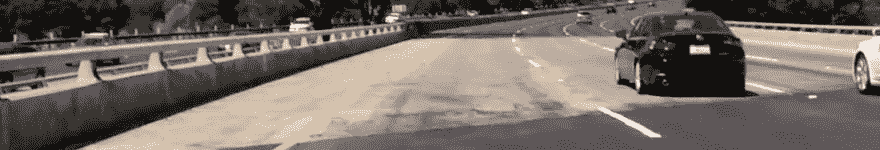****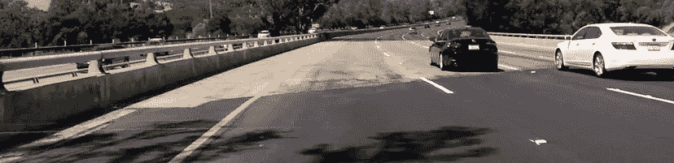**

**Search region for cars of dimension from left: 1) 64x64, 2) 160x160 pixels. The dimension of the car is calculated with respect to original image**

**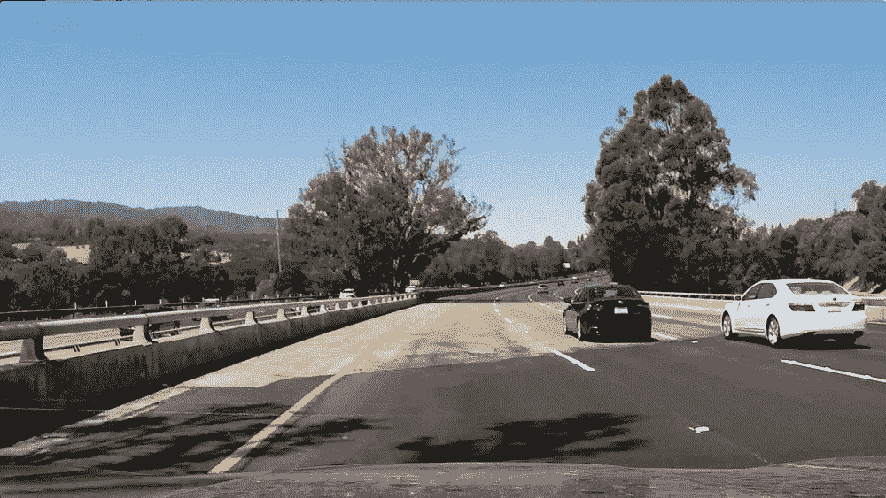****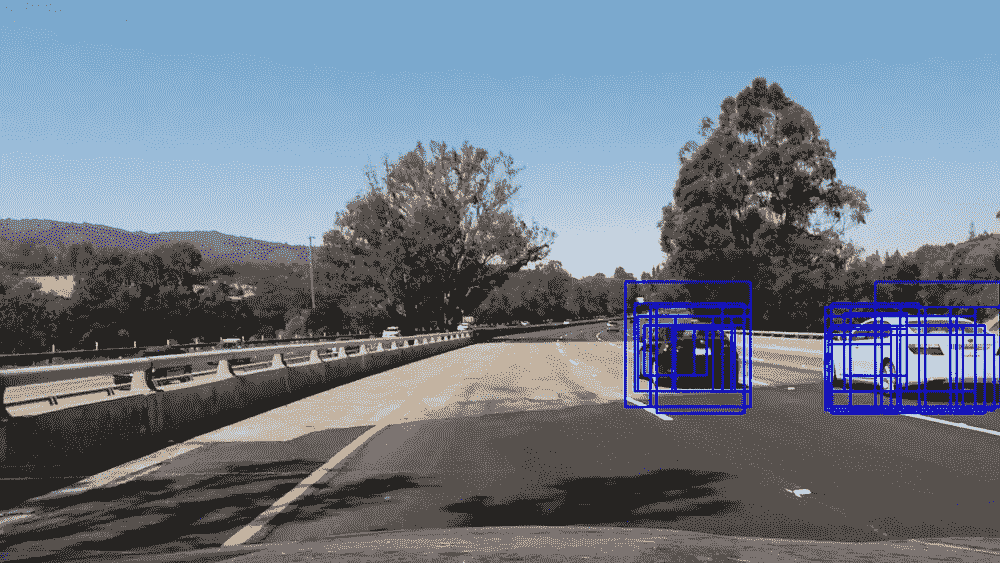**

**Images from left: 1) Original image 2)image with detected cars**

# **计算热图和识别汽车**

**由于对同一辆汽车有多次检测，所以必须以某种方式对车窗进行分组。在这种情况下，将使用热图。热图中的每个像素包含包含该像素的已识别汽车的窗口数量。热图中像素的值越高，它越有可能是汽车的一部分。热图的阈值为 1，这消除了任何可能的错误汽车检测。之后，连接的组件被标记，边界框被计算。生成的图像是:**

**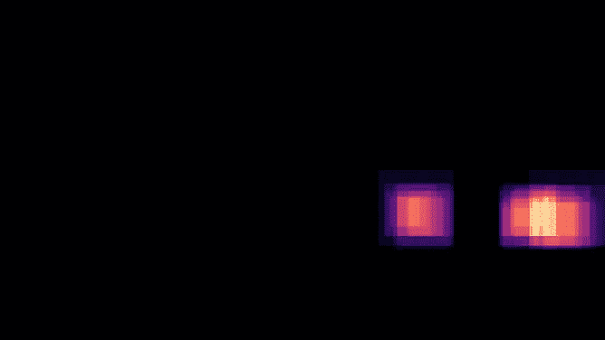****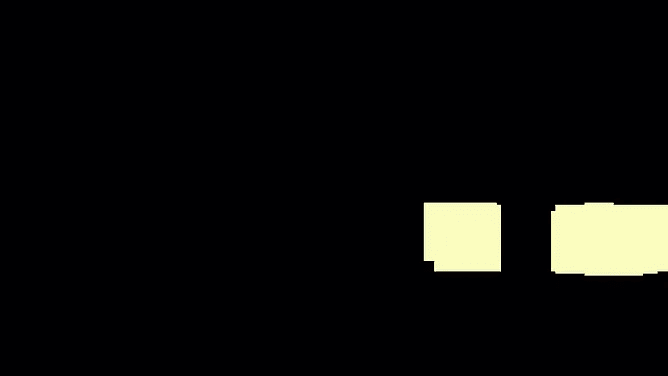****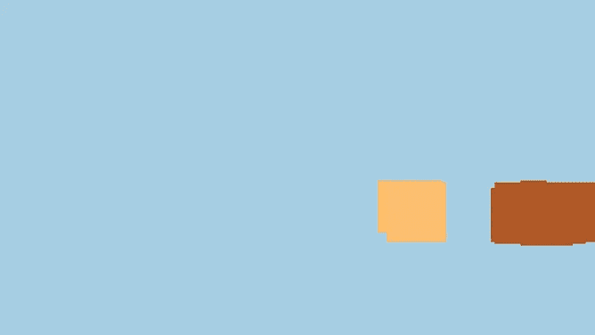**

**Images from left 1)Heatmap 2)Thresholded 3) Heatmap Labels**

# **道路拆除**

**这样做的原因是，我们想估计我们前面多远是确定的汽车。在我们之前的[项目](https://github.com/ajsmilutin/CarND-Advanced-Lane-Lines/blob/master/README.md)中，我们发现了透视变换，它将路面映射到图像上，使我们能够测量距离。透视变换假设被变换的物体是平面的，所以为了精确地测量距离，我们需要一个在路面上的点。使用边界框下边缘的中点来测量距离。移除路面，以便对被识别汽车的后轮进行测量。为此，找到边界框的最后 8 行的中间颜色。超过 20%的点远离中间颜色的从底部开始的第一条线被认为是边界框的新的底部边缘。在下图中，颜色为“远”的点用紫色表示。**

**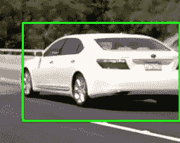****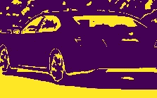****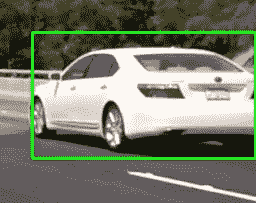

Images from left 1)Original 2)Points near in color 3)Cropped** 

# **估计距离**

**在检测到的车辆周围的矩形被绘制之前，车道线被识别。另外，我们会试着估计离车的距离。一旦我们获得了边界框及其底边的中点，使用透视变换，我们就可以从[高级车道寻找项目](https://github.com/ajsmilutin/CarND-Advanced-Lane-Lines/blob/master/README.md)中计算出它在扭曲图像上的位置。我们不需要扭曲整个图像，而只需要重新计算扭曲图像上的单个位置。在该图像上，像素位置和以米为单位的距离之间存在直接的相关性，因此计算出的中点位置和图像底部之间的距离乘以每个像素的米数就代表了我们的汽车和我们检测到的汽车之间的距离。通过观察帧与帧之间的距离变化，我们可以计算汽车的相对速度，将两帧之间的差异乘以每秒帧数和 3.6，将其转换为每小时公里数，而不是每秒米数。检测到汽车的图像和测量距离的扭曲图像是:**

**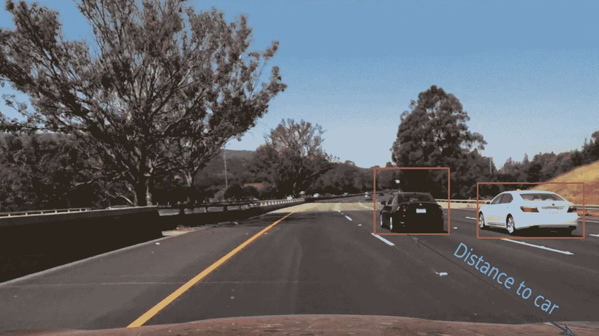****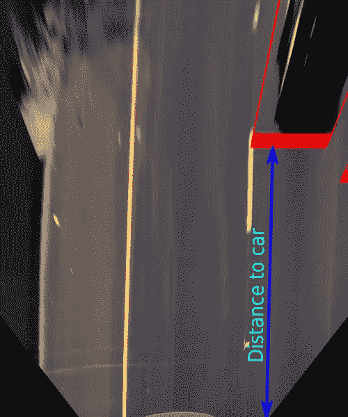**

**Images from the left 1) Detected cars 2) Warped image**

***关于透视变换的更多信息，请阅读* [*我之前的帖子*](https://medium.com/@ajsmilutin/advanced-lane-finding-5d0be4072514#.4co3v4k8r) *。***

**最后一步就是在一张图片上画出所有的东西。最终结果如下所示:**

**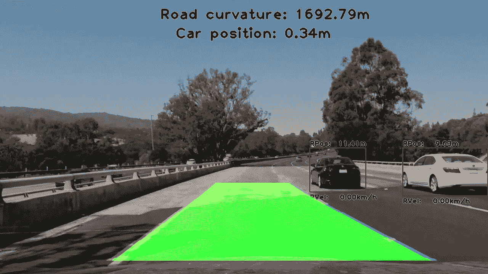**

**Final result**

# **在视频中寻找汽车**

**对于视频，管道遵循应用于单个图像的基本管道。此外，由于时间维度，应用了一些额外的过滤。以下是所做的工作:**

1.  **当计算热图时，使用所有已经检测到的汽车的边界框。这些边界框被认为是汽车已经在该地点被识别。这有助于避免已经识别的汽车闪烁和松动。**
2.  **边界框是最后 21 帧的平均值**
3.  **如果在连续 5 帧中没有发现汽车，则它已经消失。新车，需要在 5 个连续的帧中被发现，才能被绘制并被认为是现有的。**

**管道在提供的视频上运行，效果很好。不会出现错误检测或无法识别现有车辆的情况。视频结果是:**

# **讨论**

**所描述的管道对所提供的视频非常有效，但需要在变化的照明条件下对更多的视频进行彻底的测试。我发现有趣的是，在项目视频中有一部分，两辆车被归类为一辆。第一辆车部分遮挡了第二辆车，但它仍被归类为一辆车。车没有消失，只是被遮挡了。必须找到关于这个问题的更强有力的程序。**

**计算到汽车的距离工作得很好，甚至比我预期的还要好。然而，当道路表面的颜色改变时，仍然存在一些问题，从识别的边界框的底部移除道路给出了错误的读数。此外，速度是相当跳动的，所以它也必须被过滤，但即使在这种形式下，它也可以给出检测到的汽车是否正在接近或远离我们的信息。**

**最后一点就是这个程序非常耗时。平均每次迭代大约需要 1.4 秒(Ubuntu 16.06，2 个英特尔酷睿 i7–4510 u CPU @ 2.00 GHz，8GB DDR3)来检测汽车和车道。它远不是实时的，因此它可以在真正的自动驾驶汽车中使用。通过分析，我注意到大约 50%的时间用于计算直方图。这段代码需要优化，可能需要用 C/C++重写。**