# 车辆检测和跟踪

> 原文：<https://towardsdatascience.com/vehicle-detection-and-tracking-44b851d70508?source=collection_archive---------0----------------------->

> [“只要有摄像头，你绝对可以成为超人”](https://youtu.be/zIwLWfaAg-8?t=14m48s)。埃隆·马斯克在 TED 演讲。

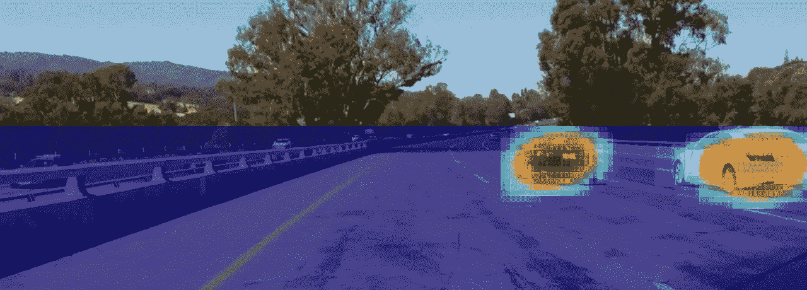

这是 Udacity 的自动驾驶汽车工程师纳米学位项目 第一学期的期末项目 [**。源代码和更详细的技术文章可以在 GitHub**](https://www.udacity.com/drive)**[](https://github.com/antevis/CarND-Project5-Vehicle_Detection_and_Tracking)**上找到****

## ****目标****

*****编写一个软件管道，从汽车上的前置摄像头识别视频中的车辆。*****

**在我的实现中，我使用了深度学习方法来进行图像识别。具体来说，我利用卷积神经网络(CNN)的非凡能力来识别图像。**

**然而，手头的任务不仅仅是检测车辆的存在，而是指出它的位置。事实证明，CNN 也适用于这类问题。在 [**CS231n 课程**](http://cs231n.github.io/) 中有一个专门针对本地化的 [**讲座**](https://youtu.be/wFG_JMQ6_Sk?list=PLLvH2FwAQhnpj1WEB-jHmPuUeQ8mX-XXG) ，我在我的解决方案中采用的原则基本上反映了该讲座中讨论的区域提议的思想，并在诸如[**fast R-CNN**](https://arxiv.org/abs/1506.01497)等架构中实现。**

**主要思想是，由于存在二进制分类问题(车辆/非车辆)，模型可以以这样的方式构建，即它将具有小训练样本的输入大小(例如，64×64)和在顶部的 1×1 的单特征卷积层，其输出可以用作分类的概率值。**

**训练了这种类型的模型后，输入的宽度和高度维度可以任意扩展，将输出层的维度从 1x1 转换为纵横比近似匹配新的大输入的**地图**。**

**本质上，这在某种程度上相当于:**

1.  **将新的大输入图像切割成模型初始输入尺寸的正方形(例如，64×64)**
2.  **在每一个方块中探测目标**
3.  **将得到的检测结果拼接回去，将与源输入中的相应正方形相同的顺序保存到一个**图**中，其边的纵横比近似匹配新的大输入图像的纵横比。**

**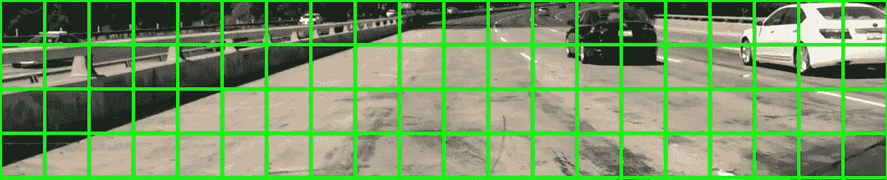**

**Consider each of these squares to be processed individually by its own dedicated CNN, producing a 4x20 detection map**

## **数据**

**Udacity 为学生提供了训练分类器的强大资源。 [**车辆**](https://s3.amazonaws.com/udacity-sdc/Vehicle_Tracking/vehicles.zip) 和 [**非车辆**](https://s3.amazonaws.com/udacity-sdc/Vehicle_Tracking/non-vehicles.zip) 已使用[**KITTI vision benchmark suite**](http://www.cvlibs.net/datasets/kitti/)的样本进行训练。**

**最终的模型在检测项目视频中的白色雷克萨斯时遇到了困难，所以我用大约 200 个样本增加了数据集。此外，我使用了与 [**项目 2 中相同的随机图像增强技术对交通标志进行分类**](https://github.com/antevis/CarND-Project2-Traffic-signs-classifier) ，从项目视频中产生了大约 1500 幅车辆图像。用于训练、验证和测试的车辆图像总数约为 7500 张。显然，每个样本都被水平翻转过，使数据集膨胀了 2 倍。结果，我有大约 15000 个数据点。**

**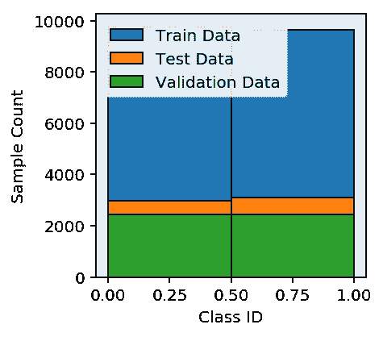**

**Class IDs are vehicles and non-vehicles**

**增加了相同数量的非车辆图像作为反面例子。**

**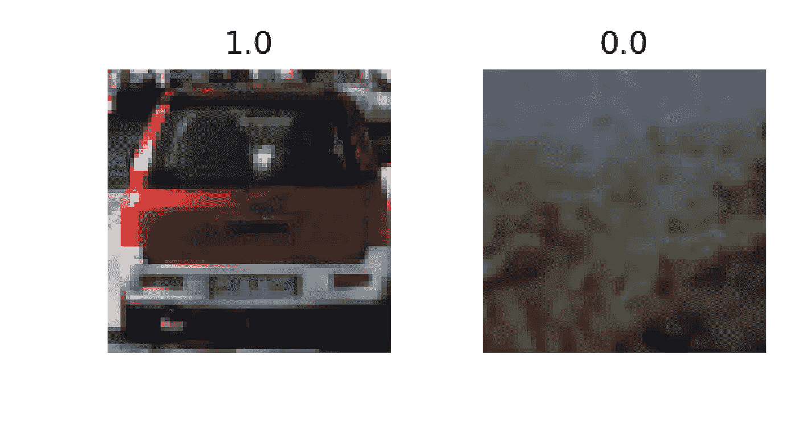**

**Typical vehicle and non-vehicle samples with their corresponding labels**

## **模型**

**我从[Max Ritter](https://github.com/maxritter/SDC-Vehicle-Lane-Detection)**的实现中借用了构建网络顶部的技术，他显然采用了相同的方法。****

****已经测试了许多具有不同复杂性的模型架构，以获得最终的模型。****

****我开始从 [**VGG16**](http://www.robots.ox.ac.uk/%7Evgg/research/very_deep/) 架构转移学习，权重在 [**ImageNet**](http://www.image-net.org/) 上训练。VGG 是一个伟大的和经过充分测试的架构，ImageNet weights 显然认为它应该对车辆的功能有所了解。我添加了我的顶级*单特征二元分类器*并对模型进行了微调。正如所料，它产生了相当高的测试精度，大约为 **99，5%** 。VGG 的另一面是它相当复杂，使得预测的计算量很大。****

****然后，我测试了一些不同层数和形状的定制 CNN 配置，逐步降低复杂性并评估测试精度，最终得到了只有大约 **28，000 个可训练参数**的模型，测试精度仍然约为 **99.4%** :****

```
**Epoch 5/5
607/607 [==============================] - 48s - loss: 0.0063 - acc: 0.9923 - val_loss: 0.0073 - val_acc: 0.9926

Evaluating accuracy on test set.
test accuracy:  [0.0065823850340600764, 0.99373970345963758]**
```

****将模型的复杂性降低到极致对预测的**计算成本**和**过拟合**都有好处。虽然数据集可能看起来不太大，但很难假设 28000 个参数的模型可能能够记住它。此外，我还积极利用**辍学**来进一步降低过度适应的风险。****

****该模型已经使用 [**Keras**](https://keras.io) 和 [**TensorFlow**](https://www.tensorflow.org) 后端实现和训练。****

****样本预测结果:****

****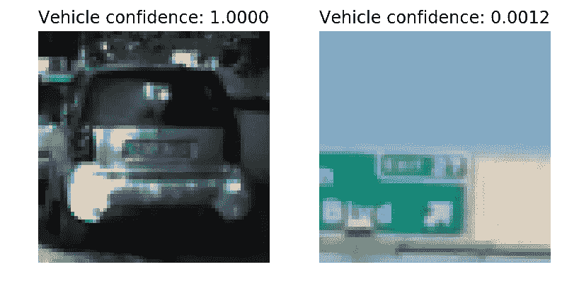****

## ****使用训练好的模型进行车辆检测****

****视频流中的原始帧如下所示:****

****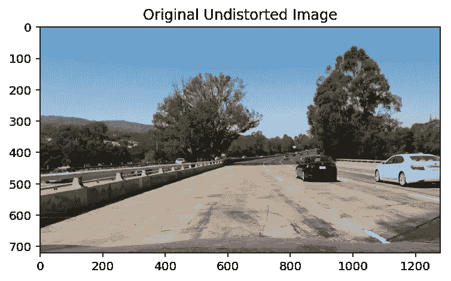****

****严格来说，它不是原创的，因为它已经受到了不失真的影响，但这值得一个属于它自己的故事。对于手头的任务，这是要由车辆检测管道处理的图像。****

****车辆检测的感兴趣区域从顶部起大约第**400**个像素开始，垂直跨越大约 **260** 个像素。因此，我们有一个尺寸为**260×1280**的感兴趣区域，从垂直方向的第**400 个**像素开始。****

****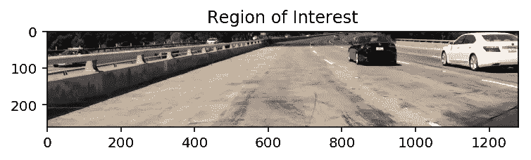****

****这就把顶层卷积层的维度从**(？，1，1，1)** 到**(？，25，153，1)** ，其中 **25** 和 **153** 是预测的微型**图**的**高度**和**宽度**尺寸，反过来，最终将投影到原始高分辨率图像上。****

******车辆扫描流水线包括以下步骤:******

1.  ****获取感兴趣的区域(见上文)****

******2。**使用训练好的 CNN 模型生成**检测图**:****

****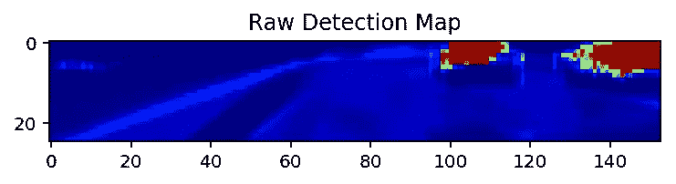****

******3。**应用置信度阈值生成二值图:****

****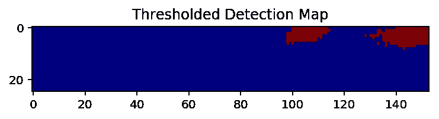****

****预测**非常**两极化，即对于车辆和非车辆点大多坚持**一**和**零**。因此，即使是置信度阈值的中点 **0.5** 也可能是一个可靠的选择。为了安全起见，我坚持使用 0 **.7******

******4。用`scipy.ndimage.measurements`包的`label()`功能标记**获得的检测区域。这一步可以勾勒出标注的边界，从而有助于在构建热点图时将每个检测到的“孤岛”保持在其要素标注的边界内。****

> *******这也是被检测车辆*** *的第一近似值。*****

******5。**将检测点的特征标签投影到原始图像的坐标空间，将每个点转换成 64x64 的正方形，并将这些正方形保持在特征的区域边界内。****

****为了说明这种点到平方的转换投射到原始图像上的结果:****

****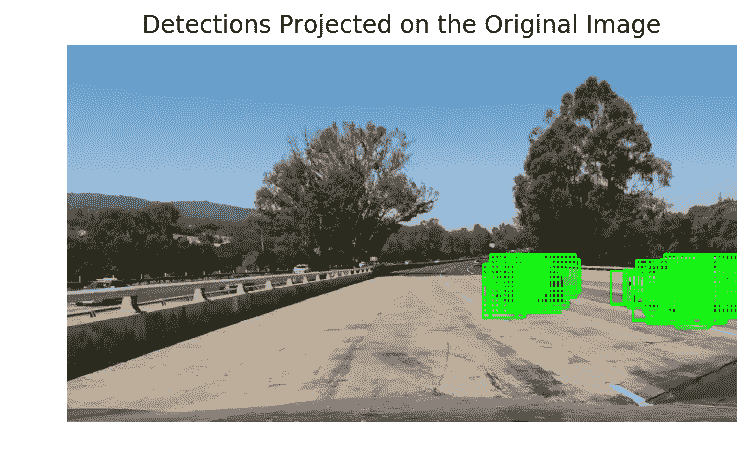****

****6。创建**热图**。上图中重叠的方块实际上是在积聚“热量”。****

****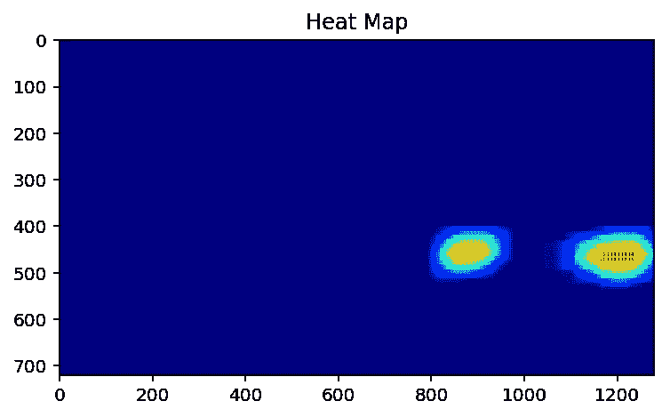****

****7。再次标记**热图**，为实际车辆的边界框生成最终的“岛”。这个特定热图的标记创建了 **2** 个检测“孤岛”。很明显。****

******8。**将**热图**的标记特征保存到标记列表中，这些特征将被保存一定数量的后续帧。****

******9。**最后一步是获得车辆的实际边界框。`[**OpenCV**](http://opencv.org)`提供了便捷的功能`cv2.groupRectangles()`。正如在[文档](http://docs.opencv.org/3.0-beta/modules/objdetect/doc/cascade_classification.html?highlight=cv2.grouprectangles#cv2.groupRectangles)中所说:“它使用矩形等价标准将所有的输入矩形聚类，该标准将具有相似大小和相似位置的矩形组合在一起。”正是需要的。该函数有一个`groupThreshold`参数，负责“*最小可能矩形数减 1* ”。也就是说，它不会产生任何结果，直到历史积累了至少该数量的帧的边界框。****

****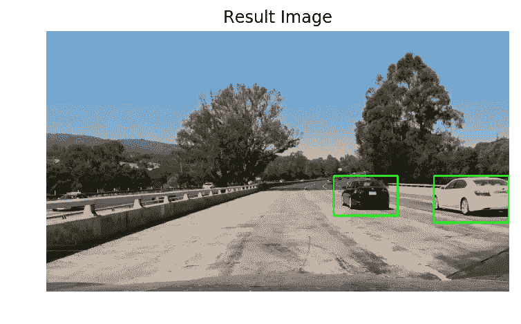****

## ****视频实现****

****我已经将**车辆**和[车道检测 合并到一个单独的管道中，生成一个包含车道投影和车辆边界框的组合镜头。](https://github.com/antevis/CarND-Project4-Advanced_Lane_Finding)****

## ****反光****

****我彻底研究了将 **SVM** 分类器应用于 **HOG** 特征的方法，该方法涵盖了项目课程，但我仍然非常自信地认为深度学习方法更适合车辆检测任务。在我开始提到的一个讲座中，猪只只从历史的角度来看。此外，还有一篇 [**论文**](https://arxiv.org/abs/1409.5403) 认为 **DPMs** (那些基于 **HOGs** )可能被认为是某种类型的卷积神经网络。****

****花了一些时间来弄清楚如何导出一个模型，当扩展它以接受全尺寸感兴趣区域的输入图像时，该模型将产生可靠分辨率的检测图。****

****即使是我最终选择的微型模型，也需要大约 0.75 秒才能在 2014 年中期的 3GHz 四核 i7 MacBook Pro 上生成 260x1280 输入图像的检测图。也就是每秒 1.33 帧。****

## ******致谢******

****我想亲自感谢 [David Silver](https://medium.com/u/8190c86ea791?source=post_page-----44b851d70508--------------------------------) 和 [Oliver Cameron](https://medium.com/u/fd8bc37755d8?source=post_page-----44b851d70508--------------------------------) 为 Udacity 的自动驾驶汽车 Nanodegree 项目开发的精彩内容，以及所有 Udacity 团队提供的非凡学习体验。****