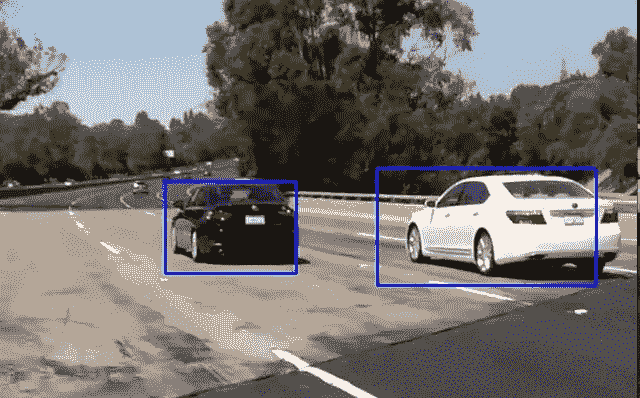
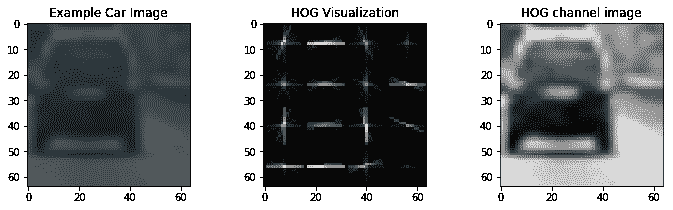
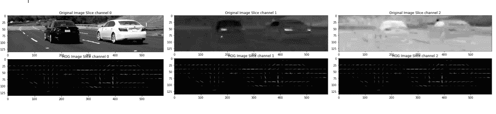
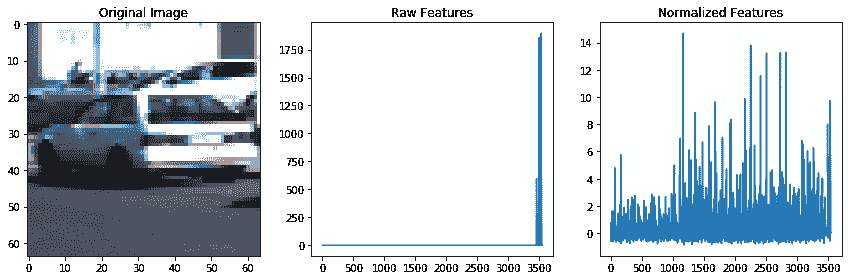
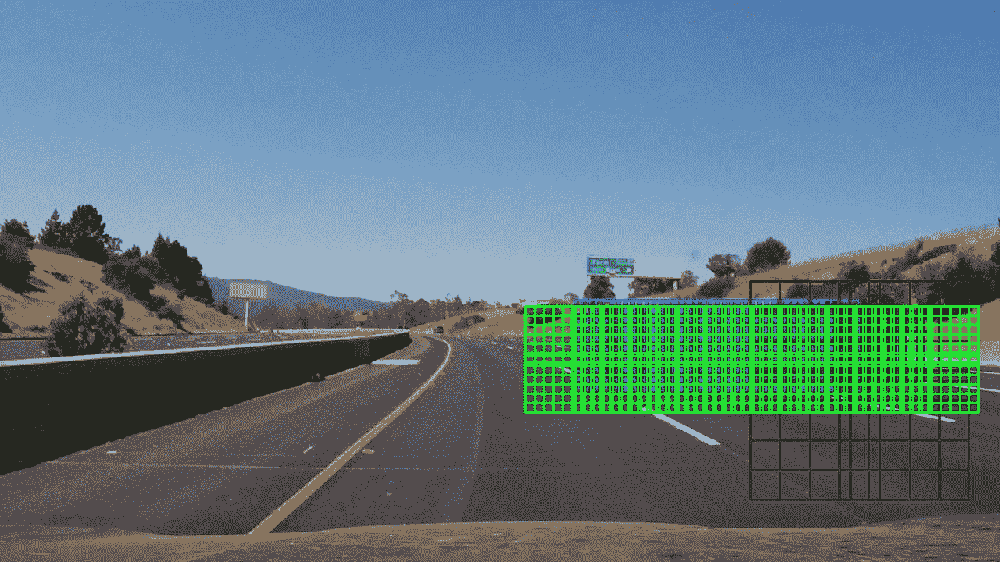
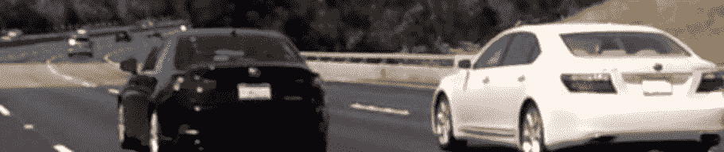
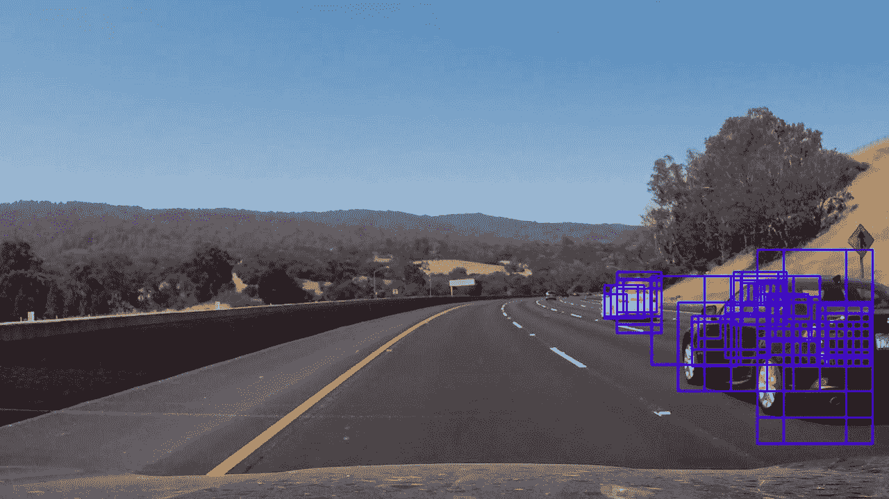
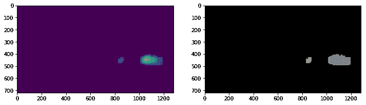

# 车辆检测和跟踪

> 原文：<https://towardsdatascience.com/vehicle-detection-and-tracking-6665d6e1089b?source=collection_archive---------0----------------------->

在这个车辆检测和跟踪项目中，我们通过滑动窗口在视频管道中检测可能包含车辆的潜在盒子，使用支持向量机分类器进行预测以创建热图。然后，热图历史被用于在识别车辆之前过滤掉误报，方法是在它周围画一个边界框。



Vehicle Detection Sample

**车辆检测项目**

该项目的目标/步骤如下:

*   对图像的标记训练集执行定向梯度直方图(HOG)特征提取，并训练分类器线性 SVM 分类器
*   或者，您还可以应用颜色变换，并将入库的颜色特征以及颜色直方图添加到 HOG 特征向量中。
*   注意:对于前两步，不要忘记规格化你的特征和随机选择用于训练和测试。
*   实施滑动窗口技术，并使用您训练的分类器在图像中搜索车辆。
*   在视频流上运行管道(从 test_video.mp4 开始，然后在完整的 project_video.mp4 上实施),并逐帧创建重复检测的热图，以剔除异常值并跟踪检测到的车辆。
*   估计检测到的车辆的边界框。

使用了 jupyter/iPython 数据科学笔记本，可在 github [完整项目报告](https://github.com/hortovanyi/udacity-vehicle-detection-project) — [车辆检测项目笔记本](https://github.com/hortovanyi/udacity-vehicle-detection-project/blob/master/Vehicle%20Detection%20Project.ipynb)上找到(注意交互式 ipywidgets 在 github 上不起作用)。由于笔记本变得相当大，我将一些代码提取到 python 文件 utils.py(提取函数，加载助手)，features.py(特征提取和类)，images.py(图像和窗口切片处理)，search.py(保存搜索参数类)，boxes.py(窗口和框类)和 detection.py(协调图像处理的主车辆检测类)。该项目是用 python 编写的，使用了 [numpy](http://www.numpy.org/) 、 [OpenCV](http://opencv.org/) 、 [scikit learn](http://scikit-learn.org/) 和 [MoviePy](http://zulko.github.io/moviepy/) 。

## 方向梯度直方图(HOG)

通过一点试错，我找到了一组[猪](https://en.wikipedia.org/wiki/Histogram_of_oriented_gradients)参数。

## HOG 特征提取和参数

创建了一个函数 [extract_hog_features](https://github.com/hortovanyi/udacity-vehicle-detection-project/blob/master/utils.py#L151) ,它采用 64x64x3 的图像数组并返回一组特征。这些是并行提取的，它依次使用 [HogImageFeatures](https://github.com/hortovanyi/udacity-vehicle-detection-project/blob/master/features.py#L49) 类。

由于 hog 算法主要集中在灰度图像上，我最初使用 Y 通道的 YCrCB 颜色空间(用于表示灰度图像)。然而，我发现它在检测阶段的选择性不够。因此，我使用了所有 3 个颜色通道。为了减少特征的数量，我增加了每个单元格的 HOG 像素的数量。我在我的笔记本中使用了一个交互功能，找到了一个 32 的方向设置，它显示了车辆的独特特征。样本如下。



Training Vehicle HOG Sample

最终的参数设置使用了`color_space = 'YCrCb'`、`orient = 32`、`pix_per_cell = 16`和`hog_channel = 'ALL'`。使用颜色直方图特征进行了实验，但是它减慢了特征提取，并且后来增加了检测到的假阳性的数量。根据下面的可视化图形，您可以看到 Cr 和 Cb 色彩空间具有可检测的 hog 特征



Sample HOG Channel Output form a video window slice

## 分类器训练

一旦从 car ( [GTI 车辆图像数据库](http://www.gti.ssr.upm.es/data/Vehicle_database.html)和 Udacity Extras)和 not _ car([GTI](http://www.cvlibs.net/datasets/kitti/))图像集中提取出 HOG 特征(无彩色 Hist 或 Bin 空间)。然后，它们被堆叠并转换为浮动在车辆检测笔记本中。

然后使用 Sklearn 鲁棒定标器对特征进行定标，结果如下。



实验发生在[分类器实验笔记本](https://github.com/hortovanyi/udacity-vehicle-detection-project/blob/master/Classifier%20Experimentation.ipynb)中的 LinearSVC ( [支持向量机分类器](http://scikit-learn.org/stable/modules/svm.html))、RandomForest 和 ExtraTrees 分类器之间。选择 LinearSVC 是因为 10 个标签的预测时间为 0.00228 秒，而其他两个标签的预测时间约为 0.10 秒。

## 滑动窗口搜索

## 构建推拉窗

在这个项目中，选择了四种尺寸的窗户——32x 32、48x48、64x64 和 128x128，并以不同的深度透视放置在图像的右下方，以覆盖道路。较大的窗户靠近驾驶员，较小的窗户靠近地平线。x，y 的重叠设置在 0.5 和 0.8 之间，以平衡更好的覆盖需求和生成的盒子数量——目前为 937 个。滑动窗口的方框越多，每个视频图像的计算就越多。



## 分类器示例和优化

使用 Python 异步方法和 VehicleDetection 类中的 asyncio.gather 在搜索的并行化上花费了一些时间。在对每个窗口进行特征提取和预测之前，该搜索提取每个大小的搜索窗口的有界框图像并将其缩放到 64×64。



搜索`hot_box_search`返回分类器预测包含车辆的热盒阵列。

这些方框重叠在一起，用于创建一个 255 的二维热点图。为了消除初始误报，保持计数> 4。在应用另一个阈值之前，热图被标准化

```
heatmap = apply_threshold(heatmap, 4)
heatmap_std = heatmap.std(ddof=1)
if heatmap_std != 0.0:
    heatmap = (heatmap-heatmap.mean())/heatmap_std
heatmap = apply_threshold(heatmap, np.max([heatmap.std(), 1]))
```

将这个阶段重新绘制到图像上



热图有一个历史记录


然后作为输入输入到 [Scipy 标签](https://docs.scipy.org/doc/scipy-0.13.0/reference/generated/scipy.ndimage.measurements.label.html)中，该标签具有链接维度的模糊二进制结构，给出



最后，在每个框上应用方差过滤器，如果对于一个检测到的标签框，方差< 0.1 (its just a few close points0 or if multiple with a variance < 1.5 (more noise).

## Video Implementation

## Vehicle Detection Video

The [忽略 GitHub](https://github.com/hortovanyi/udacity-vehicle-detection-project/blob/master/project_video_detection.mp4?raw=true) 上的项目 VehicleDetection mp4，包含结果( [YouTube Copy](https://www.youtube.com/watch?v=xO0UJk0V7xk) )


## 跟踪车辆检测

[scipy . ndimage . measurements . label](https://docs.scipy.org/doc/scipy-0.13.0/reference/generated/scipy.ndimage.measurements.label.html)函数的一个很好的特性是，它可以处理 3d 数组，给出 x，y，z 空间中的标签。因此，当使用热图历史的数组作为输入时，它在 x、y、z 中标记连接。如果返回的标记框没有在至少 3 个(热图历史最大值-2)z 平面中表示，则它被拒绝为假阳性。结果是，车辆在保存的热图历史中被跟踪。

## 讨论

当构建这个管道的时候，我花了一些时间来并行化窗口搜索。我发现这样做很可能不会提高整体性能。图像必须连续处理，在生成视频时，我的 cpu 没有得到充分利用。

事后看来，我应该用一个大范围的搜索来探测车辆，然后用一个更小范围的搜索来探测最后已知的位置。可以以更大的间隔或者当车辆检测丢失时运行大重量搜索。

如果车辆在汽车的左侧或中间，我的管道将立即失效。我怀疑卡车、摩托车、骑自行车的人和行人不会被检测到(因为他们不在训练数据中)。