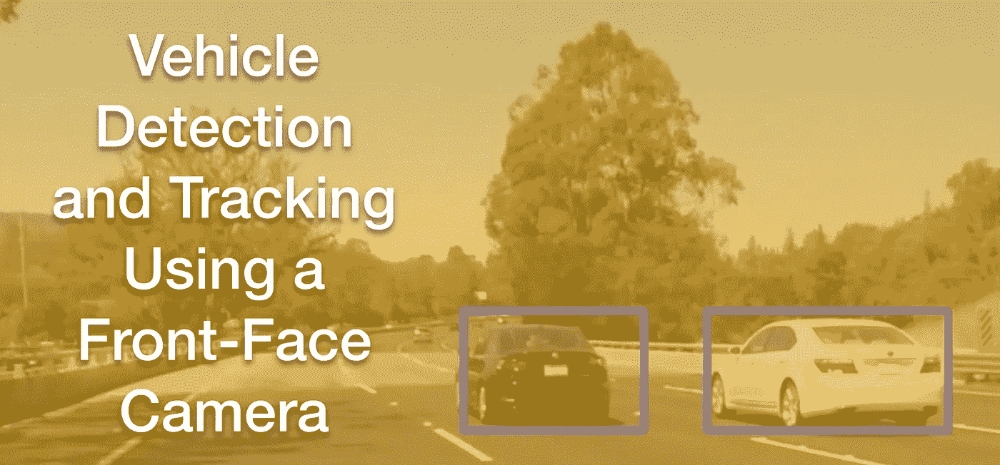
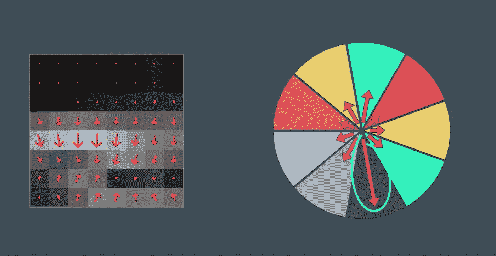
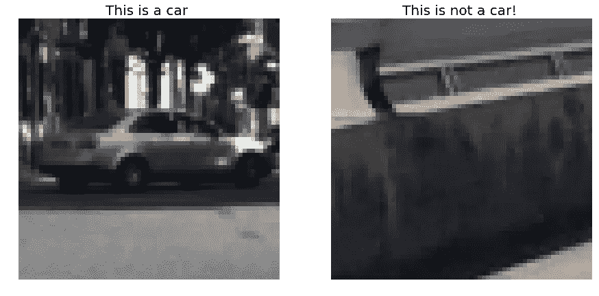
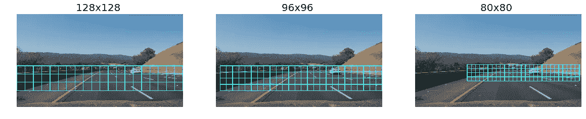
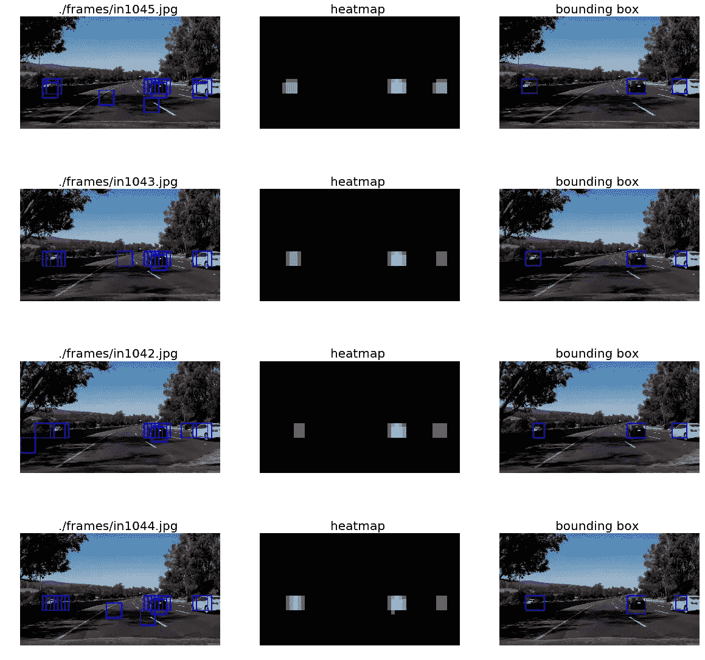

# 基于前置摄像头的车辆检测和跟踪

> 原文：<https://towardsdatascience.com/vehicle-detection-and-tracking-from-a-front-face-camera-a9b83c842f58?source=collection_archive---------3----------------------->

Udacity 自动驾驶工程师 Nanodegree —学期 1，作业 5。



# 目标

这是为 Udacity 自动驾驶汽车工程师 Nanodegree 第一学期的第五次也是最后一次任务创建的报告。挑战在于创建一种算法，利用前置摄像头获取的视频来检测道路上的其他车辆。

这是 [Github 库](https://github.com/cacheop/CARND-AllTerms-projects/tree/master/CARND-Term1-projects/P5_CarND-Vehicle-Detection)。

# 特征抽出

为了检测车辆或任何其他物体，我们需要知道它们与相机拍摄的其他图像有何不同。颜色和渐变是很好的区分因素，但最重要的特征将取决于对象的外观。

颜色单独作为一个特征可能是有问题的。依赖于颜色值(或颜色直方图)的分布可能最终在图像的不需要的区域中找到匹配。渐变可以提供更强大的演示。它们在围绕中心的特定方向上的存在可以解释为形状的概念。然而，使用梯度的一个问题是，它们使签名过于敏感

## HOG 方向梯度直方图

HOG 是一种计算图像局部梯度方向出现次数的计算机视觉技术。如果我们计算每个像素的梯度
大小和方向，然后将它们分组为小单元，我们可以使用这个“星形”直方图来建立该单元的主要梯度方向。



“Star” histogram of gradient directions

这样，即使很小的形状变化也会保持签名的唯一性。各种参数，如方向箱的数量、网格(单元)的大小、单元的大小、单元之间的重叠，对于微调算法非常重要。

## HOG、色彩空间、空间和彩色宁滨参数

在最终的特征提取函数中，我们对 YCrCb 应用了颜色变换。然后，我们将装箱的颜色特征向量、颜色向量的直方图与 HOG 特征向量连接起来。对所有颜色通道进行 HOG 计算。

```
color_space = ‘YCrCb’ 
spatial_size = (16, 16)               # Spatial binning dimensions
hist_bins = 32                        # Number of histogram bins
orient = 9                            # HOG orientations
pix_per_cell = 8                      # HOG pixels per cell
cell_per_block = 2                    # HOG cells per block
hog_channel = “ALL”                   # Can be 0, 1, 2, or “ALL”
```

# 训练分类器

一旦提取了特征，就该建立和训练分类器了。课程中介绍的方法是建立一个分类器，可以区分汽车和非汽车图像。然后，这个分类器通过对小块进行采样而在整个图片上运行。每个补丁然后被分类为汽车或非汽车。

## 数据集

为了训练分类器，我使用了[车辆](https://s3.amazonaws.com/udacity-sdc/Vehicle_Tracking/vehicles.zip)和[非车辆](https://s3.amazonaws.com/udacity-sdc/Vehicle_Tracking/non-vehicles.zip)示例的标记数据。这些示例图像来自 GTI 车辆图像数据库、KITTI vision 基准套件和从项目视频本身提取的示例的组合。



数据被随机打乱后分成训练集和测试集，以避免数据中可能出现的排序效应
。

训练基本上是为训练集中的每幅图像提取特征向量。这些向量和它们各自的标签(*汽车*或*非汽车*)提供给训练算法，该算法迭代地改变模型，直到预测和实际标签之间的误差足够小。(或者在多次迭代后误差停止减小。)

## 归一化特征向量的大小

在开始训练分类器之前，我们将特征向量归一化为零均值和单位方差。这是必要的，因为基于颜色的特征和基于渐变的特征之间存在大小差异，这可能会导致问题。

```
# Fit a per-column scaler
X_scaler = StandardScaler().fit(X)# Apply the scaler to X
scaled_X = X_scaler.transform(X)
```

## 支持向量机分类器

正如课程中所建议的，我们使用支持向量机对数据进行分类。我们也实现了一个决策树分类器，但是准确性看起来不太好，所以我们决定继续微调 SVM。

```
3.26 Seconds to train SVC...
Test Accuracy of SVC =  0.9926
```

# 滑动窗口方法

既然我们已经训练了分类器，我们将不得不在帧中搜索汽车。前提是我们在图像中定义小块，然后对每个小块运行分类器。然后，分类器将决定该小块是否“是”汽车。

在滑动窗口技术中，我们在图像上定义一个网格，并在其上移动以提取训练的特征。分类器将在每一步给出预测，并判断网格元素是否包含汽车特征。

鉴于图像的视角，远离汽车摄像头的物体会显得较小，而靠近的汽车会显得较大。因此，网格细分根据图像上的位置考虑不同的大小是有意义的。我们也不考虑地平线以上的任何区域，忽略有天空、山脉和树木的区域。



## 跟踪问题

不足为奇的是，分类器将返回大量的假阳性。这些区域没有汽车，但是图像中的照明或纹理会欺骗分类器称其为汽车。对于自动驾驶汽车应用程序来说，这显然是一个大问题。假阳性可能导致汽车改变方向或启动刹车，这是事故的潜在原因。

为了过滤掉误报，我们记录每一帧的所有检测的位置，并与在后续帧中发现的检测进行比较。检测的群集很可能是一辆真实的汽车。另一方面，在一帧中出现而在下一帧中没有再次出现的检测将是误报。

## 热图和边界框

搜索`find_cars`返回分类器预测包含车辆的热盒阵列。我们创建了一个热图来识别重叠盒子的集群。使用`apply_threshold`,我们可以移除假设的误报。

```
import collections
**heatmaps** = collections.deque(maxlen=10) 

def process_frame(source_img): out_img, boxes = find_cars(source_img, ystart, 
                           ystop, scale, svc, 
                           X_scaler, orient, pix_per_cell, 
                           cell_per_block, spatial_size, 
                           hist_bins, False) current_heatmap =   
                 np.zeros_like(source_img[:,:,0]).astype(np.float)
    current_heatmap = **add_heat**(current_heatmap, boxes)
    **heatmaps.append**(current_heatmap)
    heatmap_sum = sum(heatmaps)

    heat_map = **apply_threshold**(heatmap_sum, 2)
    heatmap = np.clip(heat_map, 0, 255)
    labels = label(heatmap)  
    labeled_box_img = draw_labeled_bboxes(source_img, labels)return labeled_box_img
```



上面的例子是针对单个帧的。如前所述，我们要考虑时间顺序，以避免一次性考虑。我们使用了一个`deque`数据结构来保存最后 10 帧的盒子。

# 管道和视频

总结我们的整体跟踪渠道:

*   处理带标签的数据集以**定义训练和测试集**。
*   **从数据集图像中提取特征**。
*   **训练**分类器。
*   对于每个视频帧:使用**滑动窗口**技术运行搜索，并过滤掉**误报**。

Generated video

# 考虑

值得注意的是，一些检测到的是高速公路对面的汽车。虽然这不是一件坏事，但我们可以通过缩小考虑范围来避免它们。

当汽车进入视频帧时，检测会有一点延迟，这种情况可以通过调整平均框计算中考虑的帧数来解决。

最近使用深度神经网络的技术可以通过提高准确性、减少假阳性的发生和提高性能来改善特征检测。微小的 YOLO 似乎是一种常见的方法。

[Janai 等人(2017)](https://arxiv.org/abs/1704.05519) 发表了一份关于技术如何改进以及仍需解决的挑战的评估。

这是一个总结第一学期的伟大项目。我可以看到我从使用 OpenCV 寻找车道的第一个任务[中学到了多少，我期待着在第二学期学到更多。感谢出色的 Udacity 团队让这一切成为可能。](https://github.com/cacheop/CARND-AllTerms-projects/tree/master/CARND-Term1-projects/P1_CarND-LaneLines)