# 基于机器学习和 HOG 的车辆检测和跟踪

> 原文：<https://towardsdatascience.com/vehicle-detection-and-tracking-using-machine-learning-and-hog-f4a8995fc30a?source=collection_archive---------5----------------------->

我进入了 Udacity 自动驾驶汽车 Nanodegree 的第一个学期，我想分享我关于第一学期最终项目的经验，即车辆检测和跟踪。完整的代码可以在[这里](https://github.com/harveenchadha/Udacity-CarND-Vehicle-Detection-and-Tracking)找到。

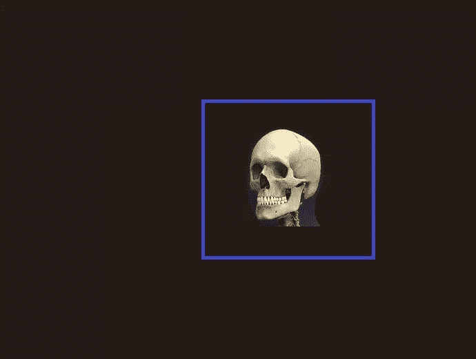

# 介绍

这个项目的基本目标是应用 HOG 和机器学习的概念从仪表板视频中检测车辆。等一下？机器学习和 2018 年的物体检测？听起来过时了，不是吗？当然，利用卷积神经网络的深度学习实现，如 YOLO 和 SSD，在这方面表现突出，但如果你是这一领域的初学者，最好从经典方法开始。所以让我们开始吧！！

# 收集数据

对于任何机器学习问题来说，最重要的是带标签的数据集，这里我们需要两组数据:车辆和非车辆图像。这些图像取自一些已经可用的数据集，如 [GTI](http://www.gti.ssr.upm.es/data/Vehicle_database.html) 和 [KITTI Vision](http://www.cvlibs.net/datasets/kitti/) 。图像大小为 64x64，看起来有点像这样:

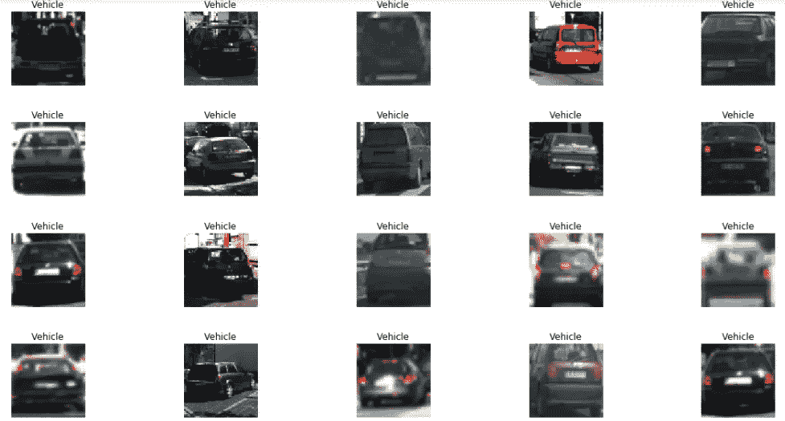

Figure 1\. Vehicle Images

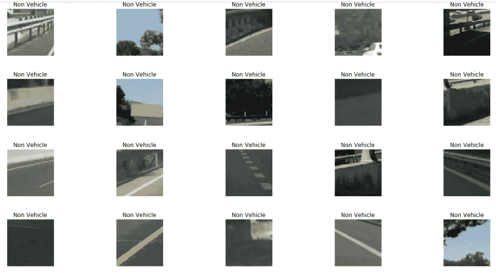

Figure 2\. Non Vehicle Images

# 提取特征

一旦我们得到了数据集，下一个明显的步骤就是从图像中提取特征。但是为什么呢？为什么不能把图像原样喂给机器学习分类器？我的朋友，如果我们这样做，将需要很长时间来处理图像，只是提醒一下，我们不是在这里向 CNN 提供图像，这毕竟不是一个深度学习问题！

明白了，但是如何提取特征呢？如果你想从图像中提取特征，有三种好方法。

1.  **颜色直方图-** 最简单直观的方法就是从图像的各个颜色通道中提取特征。这可以通过绘制各种颜色通道的直方图，然后从直方图的箱中收集数据来完成。这些箱给了我们关于图像的有用信息，并且在提取好的特征方面非常有帮助。

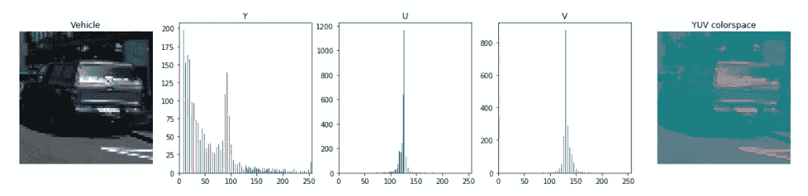

Figure 3\. Color Histograms for Vehicle Image

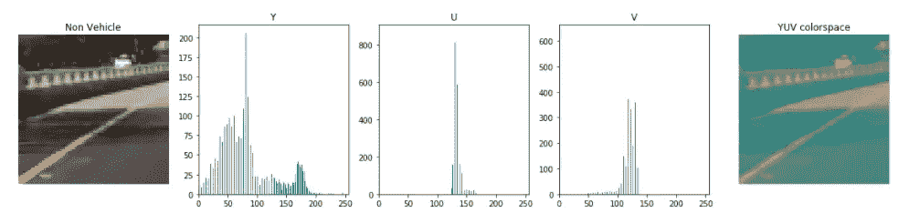

Figure 4\. Color Histograms for Non Vehicle Image

2.空间宁滨- 彩色直方图确实很酷，但是如果图像的特征如此重要，那么为什么我们不能使用某种 numpy 函数来提取所有的特征呢？在这一点上你肯定是正确的。我们可以通过使用 numpy.ravel()展平图像来提取图像中的所有信息。但是等一下，让我们做一些计算，图像大小是 64x64，它是一个 3 通道图像，所以提取的特征总数是 12，288！！单个图像中接近 12k 的特征不是一个好主意！所以这里空间宁滨来图片！如果我说，一个 64x64 的图像提供的信息和 16x16 的图像提供的信息是一样的呢？当然有一些信息丢失，但我们仍然能够从图像中提取出好的特征！因此，如果我将 numpy.ravel()应用于 16x16 的图像，我将只能获得 768 个特征！

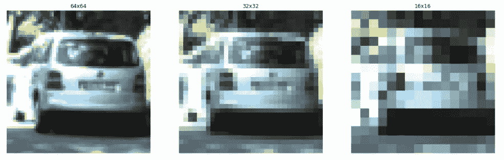

Figure 5\. Spatial Binning Intuition

3. **HOG(梯度方向直方图)——**上面讨论的特征提取技术很酷，但肯定比不上 HOG。HOG 实际上拍摄了一幅图像，把它分成不同的块，在块中我们有细胞，在细胞中我们观察像素并从中提取特征向量。单元内的像素被分类到不同的方向，并且块内特定单元的结果向量由最强向量的幅度决定。注意——这里我们不计算某个像素在某个特定方向上的出现次数，而是对该像素在该特定方向上的大小感兴趣。阅读更多关于猪这是一个很好的[链接](https://www.learnopencv.com/histogram-of-oriented-gradients/)。

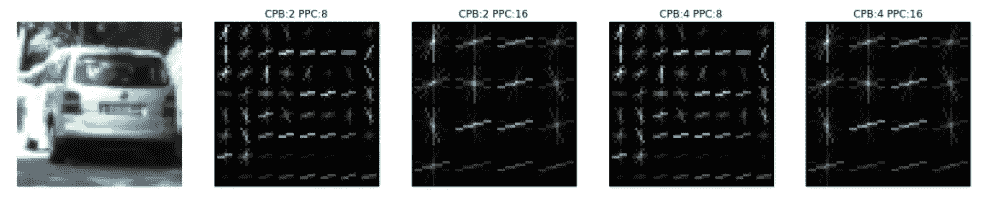

Figure 6\. HOG with 9 orientations. CPB(Cells Per Block) PPC (Pixels Per Cell)

这里只需要注意一点。OpenCV HOG 返回 HOG 图像和特征向量，但是 image.ravel()的长度不等于特征向量长度。这是因为 HOG 在内部执行一些计算，减少数据中的冗余，并返回优化的特征向量。此外，您在图像中看到的行数越多，意味着它将返回更多的特征。

# 生成数据集和数据预处理

好了，酷，现在我们知道如何提取特征，所以我们将处理所有图像的这些步骤？是的，你是对的，但是没有必要使用上述所有方法的所有功能。让我们暂时只使用 HOG，忽略颜色直方图和空间宁滨。

让我们决定提取特征的 HOG 参数。经过多次尝试，我决定采用以下方法:

*   方向- 9
*   每块电池- 2
*   每个单元格的像素- 16
*   色彩空间- YUV

酷，用这些参数通过 HOG 函数运行图像后，最终的参数大小是 972，非常酷！

**数据预处理** 现在我们的特性已经准备好了，下一步是预处理数据。不要担心，sklearn library 总是在那里帮助完成这些任务。我们可以执行以下预处理:

I)混洗数据
ii)将数据集分成训练集和测试集
iii)数据的标准化和缩放(数据集的拟合和变换)

这里要注意的非常重要的一点是，在步骤(ii)之后，我们必须拟合和转换数据，但是我们不应该拟合测试集中的数据，因为我们不希望我们的分类器将峰值偷偷带入我们的数据中。

# 训练分类器

嗯，特征提取，数据预处理！接下来呢？是的，现在轮到我们的分类器了。你可以选择分类器，但是有很多分类器可供选择:

*   支持向量机
*   朴素贝叶斯
*   决策图表

我决定用支持向量机，因为它们和 HOG 有很好的兼容性。现在在 SVM，我们有 SVC(支持向量分类器),在这里，我们也可以选择不同的核和不同的 C 和γ值。

我在线性核和 rbf 核上训练我的分类器。线性核花费大约 1.8 秒来训练，测试精度为 98.7%，而 rbf 核花费大约 25 分钟来训练，测试精度为 98.3%。我决定使用带有默认参数的 LinearSVC，仅仅是因为它运行时间更短，而且比 rbf 内核更精确。

# **推拉窗**

酷我们的分类器现在训练有素，它将有 99%的时间能够正确预测车辆和非车辆。那么下一步是什么？好吧，下一步是将分类器应用到你的图像中，以便找到汽车在图像中的确切位置！

但是首先你需要决定各种重要的参数。第一件事是从哪里开始搜索汽车，显然你不应该在天空中搜索汽车，因此你可以忽略图像的上半部分，所以基本上确定一个地平线，在这个地平线下你将搜索你的汽车。第二件重要的事情是你要找的窗口大小是多少，两个窗口应该重叠多少？这取决于你的输入图像长度，因为这里是 64x64，所以我们将只从 64x64 的基本窗口大小开始。下一件重要的事情，也是这里要注意的非常重要的一点是**，你在地平线附近搜索较小的汽车，当你走向仪表板摄像头时，你搜索较大的汽车**。这是因为如果汽车靠近地平线，它们就越小，因为它们远离你的汽车，而靠近的汽车则相反。

但是我应该增加多少窗口大小和多少重叠？那要看你的眼光了。我决定使用 4 种不同尺寸的窗户。在下面的图片中，我将尝试用相应的窗口大小来说明我的搜索区域。

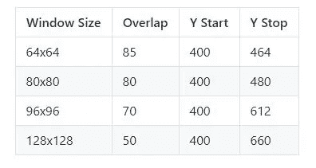

Figure 7\. My Choice of Window Sizes with Overlap and Y coordinates

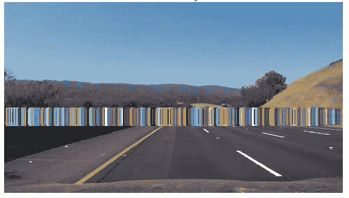

Figure 8\. Window Size 64x64 Coverage

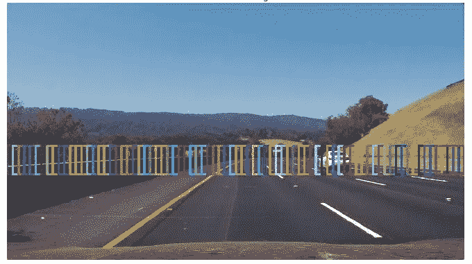

Figure 9\. Window Size 80x80 Coverage

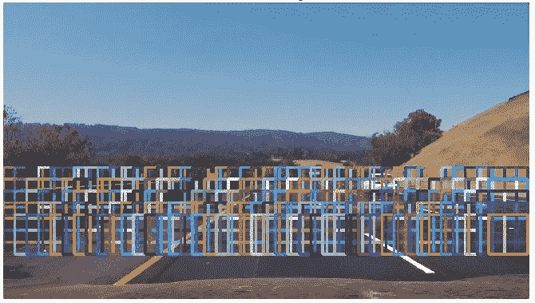

Figure 10\. Window Size 96x96 Coverage

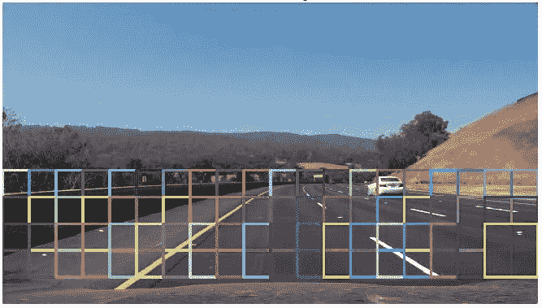

Figure 11\. Window Size 128x128 coverage

我的总窗口大小为 470！因此，一旦我们定义了我们将搜索的所有滑动窗口，下一步就是逐个窗口提取所有补丁的特征，并运行我们的分类器来预测找到的窗口是否是汽车。请记住，我们在从 64x64 图像提取的特征上训练我们的模型，因此对于大小不同的窗口，我们需要首先将它们的大小调整为 64x64，以保持特征相同。让我们看看我们的分类器是如何工作的。

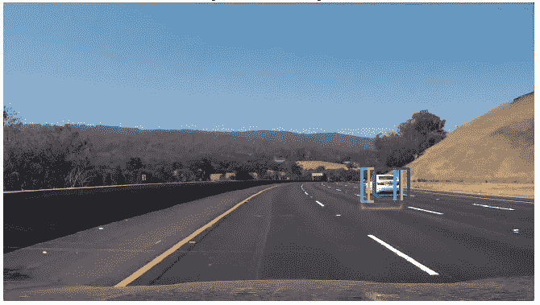

Figure 12\. Refined Windows after running the classifier.

# 热图

因此，我们能够检测滑动窗口，但有一个问题。这么多窗口相互重叠，如何画出最终的包围盒？答案是热图。我们将创建一个与原始图像大小相同的空白黑色图像，对于所有已识别的优化窗口，我们将为优化窗口的整个区域增加一个像素值。这样，我们将得到具有不同强度的区域，其中公共区域是最强的。然后，我们可以应用一个阈值来裁剪最终的图像，并获得最终盒子的坐标。

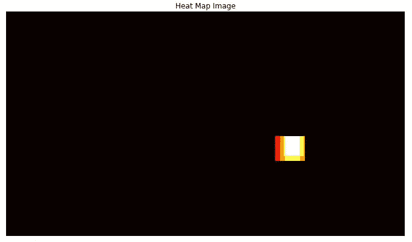

Figure 13\. Heatmap drawn after increasing the pixel intensities of refined windows

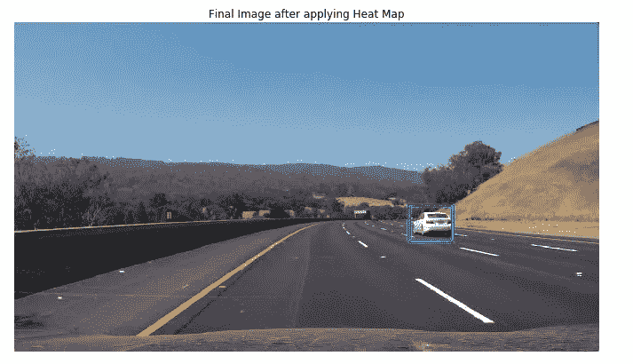

Figure 14\. Final Image After applying the threshold

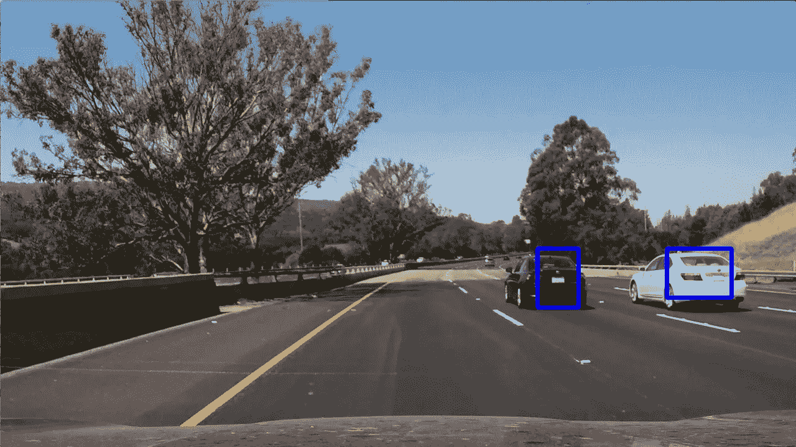

Figure 15\. Testing Pipeline On a New Image

好吧，太酷了，就这样？嗯，是也不是！当您在更多的测试图像上运行代码时，还有一个问题。

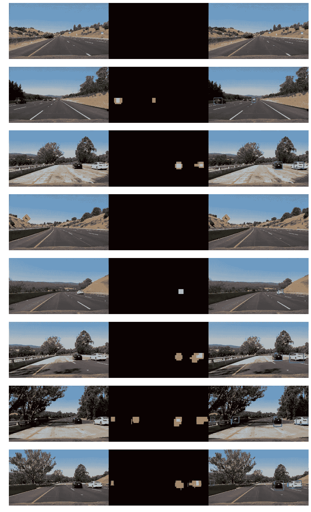

Figure 16\. Applying Heatmap on some more Images

正如你所观察到的，在我们的图像中检测到了一些误报，从左车道驶来的车辆也被检测到，那么我们如何解决这个问题呢？首先我们需要观察这个问题是如何出现的？我们的分类器有 98.7%的准确率。我们总共有 470 扇窗户。因此，在生成的窗口中，我们将有大约 6 个窗口是误报的。如果最终热图图像中的阈值较低，这些窗口可以出现在任何地方。因此，要解决汽车驶入另一条车道的问题，一些误报可以通过提高阈值来解决。在我的例子中，我将阈值设置为值 4，但是阈值设置还是取决于许多因素，使用的色彩空间，SVM 精度等等。

# 求平均值

我们现在差不多完成了！管道处理图像的效果非常好，但是如果你要对来自视频流的图像运行管道，还是有一个问题。最终检测到的框将变得非常不稳定，无法提供流畅的体验，在某些帧中框可能会消失。那么解决办法是什么呢？解决方案非常直观，存储所有从前 15 帧检测到的细化窗口，并平均当前帧中的矩形。此外，你需要调整阈值到一个更高的水平。通过这样做，最终的边界框看起来不那么抖动，并提供一个平滑的流程。我在项目视频上尝试了我的管道，结果有点像[这个](https://github.com/harveenchadha/Udacity-CarND-Vehicle-Detection-and-Tracking/blob/master/project_video_output.mp4)。

# 一些提示和技巧

1.  如果您在视频上运行管道时处理时间过长，请先尝试缩小窗口。
2.  如果处理时间仍然很长，请尝试减少提取的要素数量。
3.  如果你有一个包含 10，000 张图片的测试集，你的特征大小是 8000，即使测试集的准确率超过 95%，SVM 也不会达到标准。使用具有“rbf”内核或 reduce 特征的 SVM。
4.  如果管道运行仍然需要很长时间，请尝试跳过一半或三分之二的帧。它会加速。记住，我所说的跳过帧是指跳过对帧的处理，并将该帧的细化窗口设置为从存储在某个数据结构中的前 15 帧中收集的矩形。

> 你可以在这里观察最终的视频输出[。](https://github.com/harveenchadha/Udacity-CarND-Vehicle-Detection-and-Tracking/blob/master/project_video_output.mp4)

当然，视频并不完美，但我很高兴最终的输出。有较少的滞后，也没有检测到来自其他方向的汽车。还有。我正在研究 YOLO 和 SSD 方法，并将很快写下从中得到的经验。万岁！！第一学期结束了，是时候自我反省了，也为第二学期感到非常兴奋。