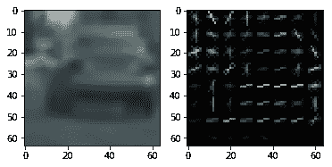
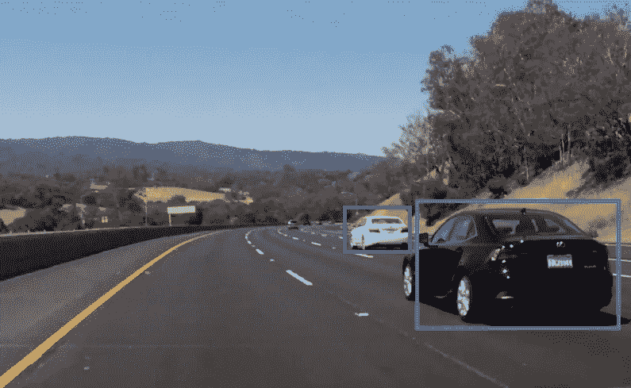
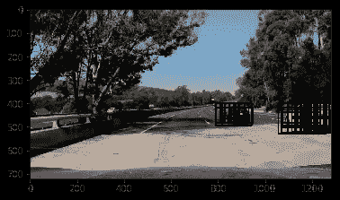
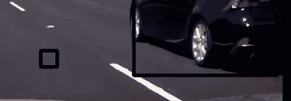
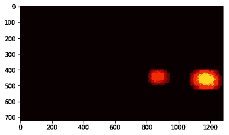

# 基于支持向量机(SVM)的车辆检测

> 原文：<https://towardsdatascience.com/vehicle-detection-using-support-vector-machine-svm-19e073b61d16?source=collection_archive---------1----------------------->

下面是从视频中成功检测到汽车的输出视频:

**分析:**

我已经完成了 Udacity 自动驾驶汽车项目的车辆检测项目。在这里，我试图提供使用支持向量机(SVM)检测车辆的详细分析。

在此之前，为了理解使用 SVM 实现车辆检测，我们需要知道一些术语:

# **图像特征提取:**

我做的第一件也是最重要的事情是从图像中提取特征。图像中有许多可以提取的特征，这些特征可以帮助训练我们的分类器。通过仅从称为特征描述符的图像中提取有用的信息来表示图像。我用于车辆检测的一个重要的 T4 特征描述符是猪:

**梯度方向直方图(HOG):**

形状是表征任何物体的重要参数之一。HOG 是一种特征描述符，用于根据对象的形状来表征对象。该技术计算图像提及部分中每个**梯度方向**的直方图(出现次数)。但是等等，到底什么是**渐变定向**？？？正如我们所知，每张图像都有颜色和亮度。这些性质的方向变化可以称为梯度取向。以下是特征提取的逐步过程，其中也包括 HOG:

1.  **提取图像的空间特征:**

调整图像大小后，我们仍然保留了图像的所有特征。因此，我们调整了图像的大小，有了它的帮助，我们的代码会运行得更快，而不会丢失任何信息。这可以在打开 cv 函数 cv2.resize()的帮助下完成。

**2。图像色彩空间转换:**

将图像转换到特定的**色彩空间**以从所选色彩通道中提取信息:

我们可以将图像转换为以下任何色彩空间:

RGB、HSV、YCrCb、YUV、LUV、HLS

例如，如果你想识别一个物体在阴影下的图像，我们可以使用它们的一些属性，如图像的亮度或饱和度，来更有效地对一些阴影下的车辆进行分类。这可以通过使用 HLS 色彩空间通道来完成。

**3。颜色直方图提取:**

我们借助函数 numpy.histogram()获取图像的颜色直方图。这在存储图像的不同特征时非常重要。

**4。猪:**

如上所述，HOG 是我在特征提取过程中使用的最后一步。我为 hog 使用的函数是 HOG()。下面是图像的 hog 特征的可视化:

Hog feature of a car

特征提取完成后，现在开始训练我们的分类器。我用过 rbf SVM(支持向量机中的径向基函数)。早些时候，我尝试使用线性 SVM 模型，但由于准确性较低，我的代码在许多地方无法检测到车辆。使用 rbg SVM 将我的准确率提高到 99.13 %。

# **使用滑动窗口检测汽车:**

既然分类器被训练，我们使用滑动窗口概念。对于车窗的每个区域，我们应用图像分类器来检查是否在该区域检测到车辆。请注意，汽车的大小将根据汽车离我们的汽车有多远而有所不同。下面是一个这样的例子，由于汽车与中央摄像机的距离不同，汽车尺寸也不同:

因此，我使用了 3 个不同大小的矩形窗口，它们将贯穿整个图像并检测汽车，如果有的话。我选择的窗口尺寸是 64x64、96x96 和 128x128。如果有汽车出现在窗口，我们将窗口位置保存到一个变量中。实施之后，我仍然面临两个问题:

1.  **单个汽车图像的窗口太多:**

虽然在图像的某些部分检测到了汽车，但是还有许多窗口在检测汽车。下面是我为图片中的两辆车准备的窗户:

Multiple windows

我的目标是只有一个窗口，而不是这么多的窗口。

**2。误车检测(误报)**

False positive

现在是项目的最后一部分，**热图。**我创建了所有汽车检测的热图，对于每个检测，我将热图[window_img]增加 1。现在，在热图的帮助下，我将只保留一个窗口，而不是一辆车的多个窗口。此外，我将拒绝一些窗口的基础上，一些阈值。这是我的热图中具有多个(重叠)窗口的图像的外观:

以下是应用热图后的结果图像:

Detected cars from an image

虽然汽车被正确地检测到，但我仍然觉得这个视频有一些局限性。处理这段视频花了大约 30 分钟。此外，这在我们有其他物体(如行人)的其他场景中可能并不完美。在接下来的日子里，我一定会尝试 YOLO 来提高准确性！！