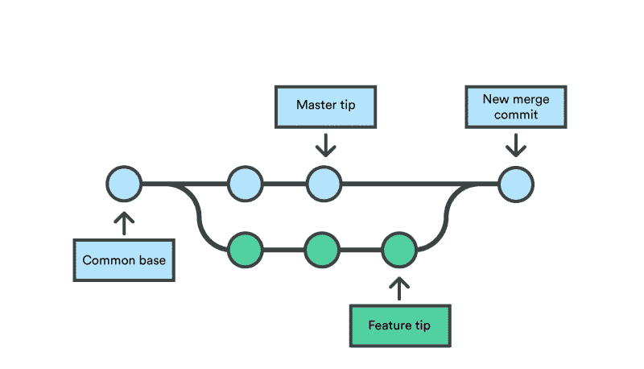

# Jupyter 笔记本的 Git 版本控制

> 原文：<https://towardsdatascience.com/version-control-with-jupyter-notebooks-f096f4d7035a?source=collection_archive---------4----------------------->



Don’t loose your version control history.

版本控制是数据科学工作流的重要组成部分。在多个实验之间，了解哪个团队成员做了哪些更改和哪些更新是非常重要的。不幸的是，默认的 jupyter 设置在这方面严重不足。

Jupyter 笔记本是以`Json`格式存储的，因此很难看出笔记本上的差异，也很难在团队层面上进行代码审查。为了解决这个问题，我们将以`.ipynb`和`.Rmd` (r-markdown 格式)存储笔记本。这将使我们能够做差异以及合并，因为`.Rmd`只是一个文本文件。

## 介绍 R-Markdown 及其优于普通 Markdown 的优势

R-Markdown 与 Markdown 格式相同，但有一个额外的优势，即您可以从它制作值得发布的 pdf/word-doc(和其他格式)。因此，如果你的笔记本存储为`.Rmd`格式，你不仅可以控制它，还可以将其转换为纸质出版格式。

更多关于 R-Markdown 的信息可以在[这里](https://bookdown.org/yihui/rmarkdown/)找到。此外，如果您打算使用 R-Markdown 编写一本书，请检查 R [bookdown](https://bookdown.org/yihui/bookdown/) 包。它允许你用 markdown+code+outputs 写一本书。

## 以多种格式保存的方法

*   [小钩](/version-control-for-jupyter-notebook-3e6cef13392d)和[大钩](https://gist.github.com/pbugnion/ea2797393033b54674af)
*   Jupytext 并另存为`.Rmd`

*尽管第一种方法更容易设置，为什么我们选择 Jupytext？*

第一种方法只是将它保存为代码，而 Jupytext 将其保存为 readme，因此它在 github 中可以很好地呈现，并保持文档完整。

# 安装和设置 Jupytext

您需要在将 git repo 用于笔记本的所有系统上执行此操作。这意味着你所有的队友都必须配置 jupytext。

我们使用 Jupytext 库([https://github.com/mwouts/jupytext](https://github.com/mwouts/jupytext))

```
pip install jupytext --upgrade
```

*   接下来用`jupyter notebook --generate-config`生成一个 Jupyter 配置，如果你还没有的话
*   编辑`.jupyter/jupyter_notebook_config.py`并添加以下内容:

```
c.NotebookApp.contents_manager_class="jupytext.TextFileContentsManager"
c.ContentsManager.default_jupytext_formats = ".ipynb,.Rmd"
```

*   并重启 Jupyter，即运行

```
jupyter notebook
```

**注** : `.jupyter`大多出现在你的主目录里。

*   打开现有笔记本或创建新笔记本。
*   禁用 Jupyter 的自动保存以进行往返编辑，只需在顶部单元格中添加以下内容并执行。

```
%autosave 0
```

*   您可以在 Jupyter 和文本编辑器中编辑`.Rmd`文件，这可以用于检查版本控制更改。

# 可能的 Git 工作流(2 种方式)

## 1.仅保存 Rmd 文件

我们将删除`.ipynb`文件并对`.Rmd`文件做一个小的修改。

`ipynb`文件的所有输出都在它们的 json 源中，因此当这些输出存储在源代码管理中时，即使实际变化很小，也会在 diff 中增加巨大的变化。此外，他们有所有的图像/情节编码为字符串，所以它是沉重的源代码控制。因此，您只需要将 Rmd 文件签入源代码控制中。

要在你的`.gitignore`文件中做到这一点，在新的一行中添加下面一行。

```
*.ipynb
```

*注意:*你的所有队友也需要这样做，这样他们才不会将`ipynb`文件提交到 git 中。

如果您已经签入了`ipynb`文件，那么在签入`.Rmd`文件后，从源代码管理中删除它们。从 gitrepo 而不是本地目录中删除文件([请参阅此处的](https://stackoverflow.com/questions/2047465/how-can-i-delete-a-file-from-git-repo))

```
git rm --cached file1.ipynb
git commit -m "remove file1.ipynb"
```

接下来我们对`.Rmd`文件做一个小的修改。

*   打开`vi`中的`.Rmd`文件
*   在以`jupytext_formats: ...`开头的行，修改为:

```
jupytext_formats: ipynb,Rmd:rmarkdown
```

*   保存文件并退出`vi`

*注意:*第一次创建`.Rmd`文件并推送至 git remote 时，对该文件的修改只需要一次。

**克隆回购并创建笔记本**

一旦您删除了`ipynb`笔记本，当您克隆回购时，您就要创建笔记本。让我们看看怎么做。

*   从文件浏览器打开 jupyter 中的`.Rmd`文件。
*   您可以直接使用`.Rmd`文件，但是它不会在会话之间保持输出，所以我们将创建一个 jupyter 笔记本。
*   点击`File->Save` (Cmd/Ctrl+S)。
*   关闭`.Rmd`文件(`*File->Close and Halt*`)
*   现在打开 Jupyter 的`ipynb`。
*   开始编辑和保存。您的`.Rmd`文件将不断更新。

## 2.保存 Rmd 和 Ipynb 文件

不要将`.ipynb`添加到您的`.gitignore`中。

对`.Rmd`文件做一个小改动。

*   在`vi`中打开`.Rmd`文件
*   在以`jupytext_formats: ...`开头的行上，将其改为:

```
jupytext_formats: ipynb,Rmd:rmarkdown
```

*   保存文件并退出`vi`

*注意:*对`.Rmd`文件的更改只需要在您创建它并第一次将其推送到 git remote 时进行一次。

在此工作流程中，由于您保存了这两个文件，因此在克隆时不需要做任何额外的工作，因此`.ipynb`已经可用，因此只需在克隆回购后开始使用它。

记得将 `%autosave 0`放入笔记本的第一个单元格，并一直运行它。因为你已经禁用了自动保存，所以记得经常保存你的笔记本。

# 更新

*   也可以只使用`.Rmd`格式。基本上不用`.ipynb`用`.Rmd`。将`.Rmd`签入 git 进行版本控制。这样做的缺点是，当你登录 git 时，你的图/结果等将被删除，因为`.Rmd`是纯文本格式。任何下载你的笔记本的人都必须运行代码才能看到图形/结果。

# 参考

[](https://github.com/mwouts/jupytext) [## mwouts/jupytext

### Jupyter 笔记本作为 Markdown 文档，Julia，Python 或 R 脚本

github.com](https://github.com/mwouts/jupytext)  [## Jupyter 笔记本的版本控制

### Jonathan Whitmore 撰写的 Jupyter 笔记本数据科学最佳实践非常有用，我一直…

towardsdatascience.com](/version-control-for-jupyter-notebook-3e6cef13392d)