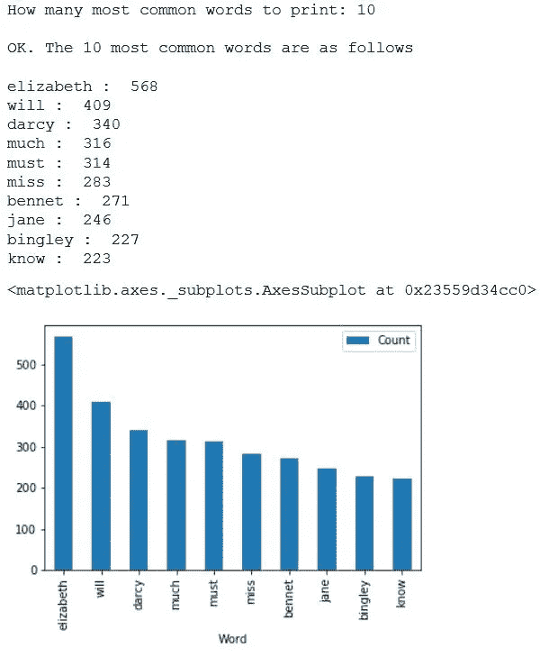

# 非常简单的 Python 脚本，用于从故事中提取最常见的单词

> 原文：<https://towardsdatascience.com/very-simple-python-script-for-extracting-most-common-words-from-a-story-1e3570d0b9d0?source=collection_archive---------1----------------------->

## 简单的 Python 脚本，不使用繁重的文本处理库，从语料库中提取最常见的单词。


莎士比亚戏剧中使用最多的词是什么？“king”比“Lord”用得多，还是反之亦然？

为了回答这类有趣的问题，人们通常需要快速检查和绘制文本文件中最常见的单词(通常从开源门户网站下载，如[古腾堡项目](http://www.gutenberg.org))。然而，如果你在网上或 Stackoverflow 上搜索，你很可能会看到***【nltk】***和 ***计数矢量器*** 的使用的例子。虽然它们非常强大，使用起来也很有趣，但事实是，如果您只想提取单个文本语料库中出现的最常见的单词，就不需要它们。

下面，我将展示一个非常简单的 Python 3 代码片段来实现这一点——只使用了一个字典和简单的字符串操作方法。

请随意复制代码，并使用您自己的停用词来使它变得更好！

```
import collections
import pandas as pd
import matplotlib.pyplot as plt
%matplotlib inline# Read input file, note the encoding is specified here 
# It may be different in your text file
file = open('PrideandPrejudice.txt', encoding="utf8")
a= file.read()# Stopwords
stopwords = set(line.strip() for line in open('stopwords.txt'))
stopwords = stopwords.union(set(['mr','mrs','one','two','said']))# Instantiate a dictionary, and for every word in the file, 
# Add to the dictionary if it doesn't exist. If it does, increase the count.
wordcount = {}# To eliminate duplicates, remember to split by punctuation, and use case demiliters.
for word in a.lower().split():
    word = word.replace(".","")
    word = word.replace(",","")
    word = word.replace(":","")
    word = word.replace("\"","")
    word = word.replace("!","")
    word = word.replace("“","")
    word = word.replace("‘","")
    word = word.replace("*","")
    if word not in stopwords:
        if word not in wordcount:
            wordcount[word] = 1
        else:
            wordcount[word] += 1# Print most common word
n_print = int(input("How many most common words to print: "))
print("\nOK. The {} most common words are as follows\n".format(n_print))
word_counter = collections.Counter(wordcount)
for word, count in word_counter.most_common(n_print):
    print(word, ": ", count)# Close the file
file.close()# Create a data frame of the most common words 
# Draw a bar chart
lst = word_counter.most_common(n_print)
df = pd.DataFrame(lst, columns = ['Word', 'Count'])
df.plot.bar(x='Word',y='Count')
```

语料库中 10 个最常用单词的代码输出和绘图示例。正文是' ***《傲慢与偏见》*** '而且可以看到大家熟悉的伊丽莎白和达西先生的名字！:)



*喜欢这篇文章吗？成为* [***中等会员***](https://medium.com/@tirthajyoti/membership) *继续* ***无限制学习*** *。如果您使用下面的链接，* ***，我将收取您的一部分会员费，而无需您支付额外费用*** *。*

[](https://medium.com/@tirthajyoti/membership) [## 通过我的推荐链接加入 Medium—Tirthajyoti Sarkar

### 作为一个媒体会员，你的会员费的一部分会给你阅读的作家，你可以完全接触到每一个故事…

medium.com](https://medium.com/@tirthajyoti/membership)