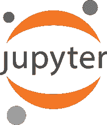
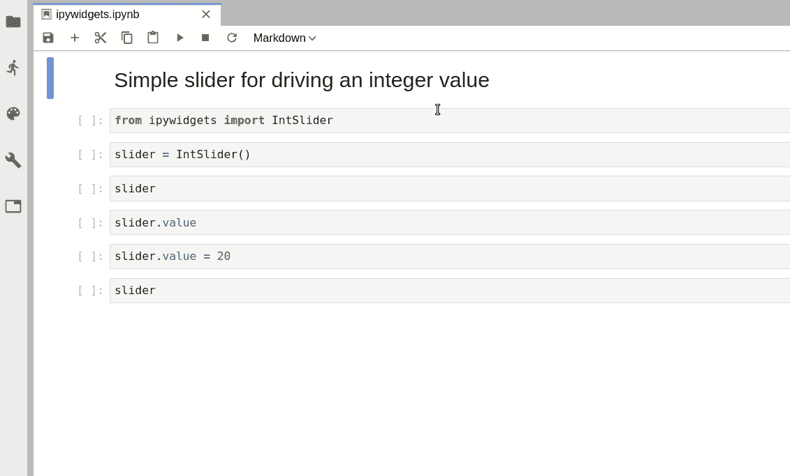
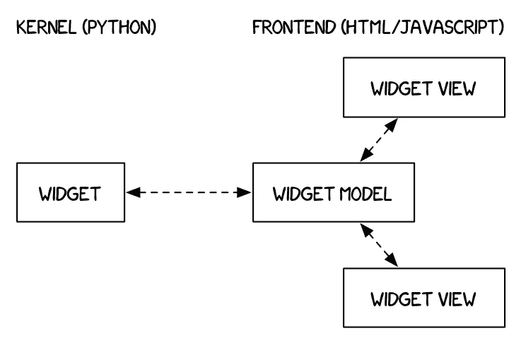
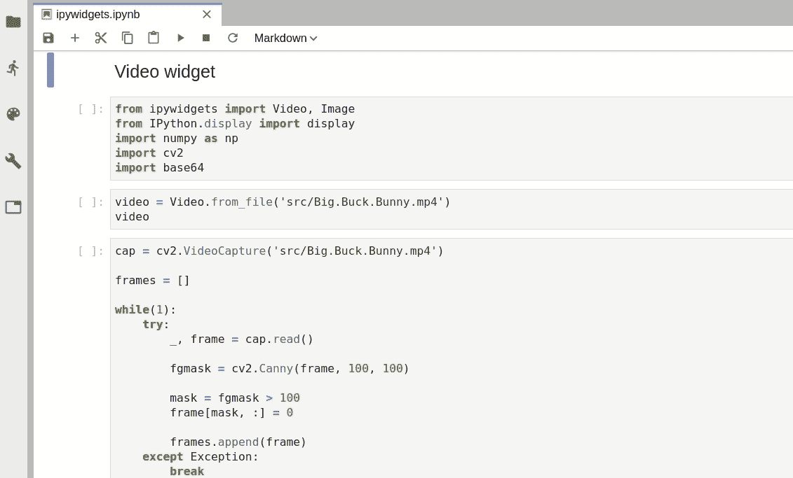
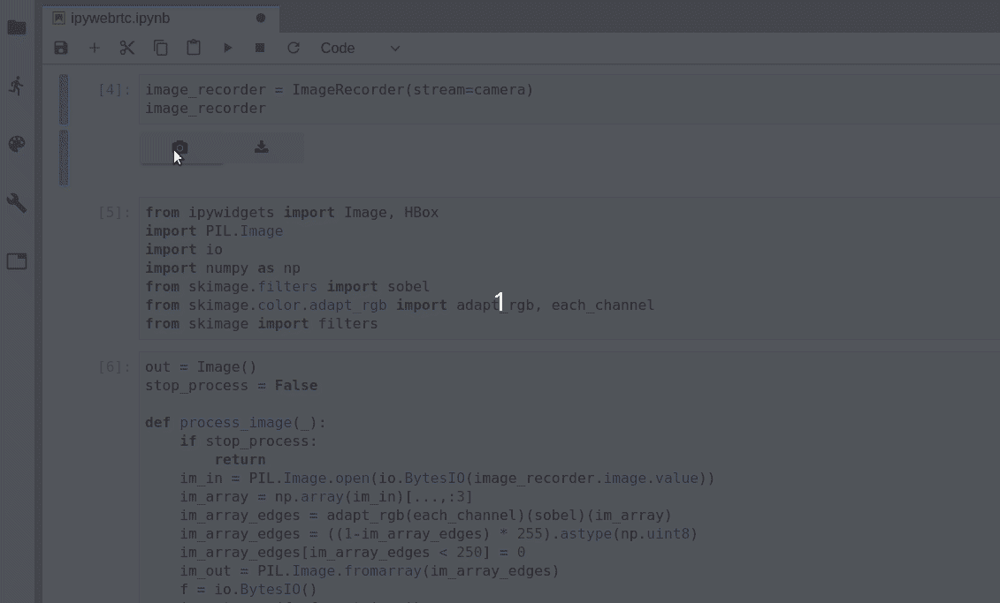
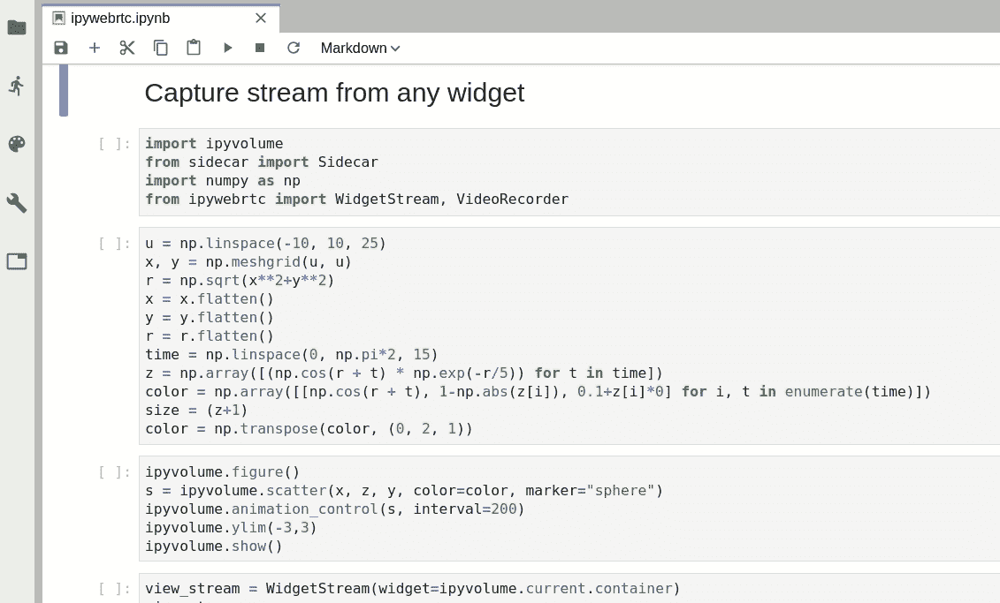
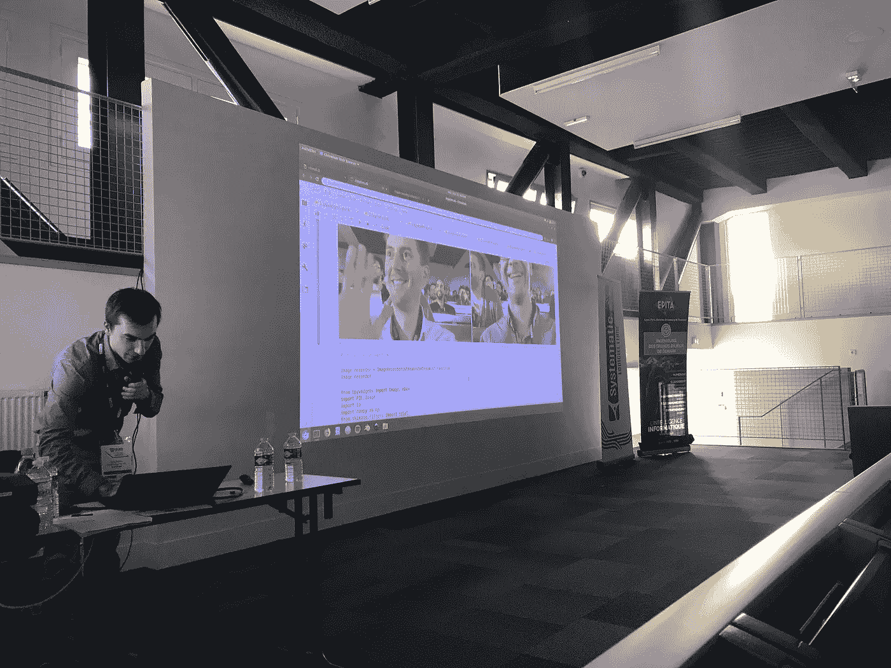

# Jupyter 笔记本中的视频流

> 原文：<https://towardsdatascience.com/video-streaming-in-the-jupyter-notebook-635bc5809e85?source=collection_archive---------6----------------------->

[**ipywidgets**](https://github.com/jupyter-widgets/ipywidgets) 在 Jupyter 生态系统中起着至关重要的作用；它带来了用户和数据之间的交互性。

小部件是多事件的 Python 对象，通常在 Jupyter 记事本或 JupyterLab 中有一个可视化的表示:一个按钮、一个滑块、一个文本输入、一个复选框…

The user can get access and set the value of the slider writing Python code, and of course, interact with it using the mouse

表示小部件的 Python 对象在服务器端(后端)是活动的，在 Python 内核(负责执行 Jupyter 笔记本中的代码的部分)内部。Python 对象包含关于微件状态的所有信息。在 ***滑块*** 小部件的情况下，Python 对象包含滑块的最小值、最大值和当前值。这个 Python 对象(在后端，服务器端)与小部件的 Javascript 模型(在前端，客户端)同步，后者包含关于小部件的相同信息。每次用户在笔记本中显示小部件时，它都会创建一个与 Javascript 模型保持同步的视图。在 ***滑块*** 示例上，可以看到两个视图是同步的。

不仅仅是一个交互式小部件库，[**ipywidgets**](https://github.com/jupyter-widgets/ipywidgets)**是一个强大的框架，基于它可以直接创建新的定制小部件。开发人员可以使用[**widget-cookiecutter**](https://github.com/jupyter-widgets/widget-cookiecutter/)**项目，用代码结构和打包的最佳实践快速启动他们的 widget 库。****

****已经创建了许多不同的小部件库。您可以使用 [**mybinder**](https://mybinder.org/) 在线试用它们，无需安装任何东西！：****

*   ****[**bq plot**](https://github.com/bloomberg/bqplot)**:**二维交互数据( [**绑定链接**](https://mybinder.org/v2/gh/bloomberg/bqplot/stable?filepath=examples/Index.ipynb) )****
*   ****[**ipyleaflet:**](https://github.com/jupyter-widgets/ipyleaflet) 互动地图( [**活页夹链接**](https://mybinder.org/v2/gh/jupyter-widgets/ipyleaflet/stable?filepath=examples) )****
*   ****[**python reejs:**](https://github.com/jupyter-widgets/pythreejs)交互式三维场景( [**活页夹链接**](https://mybinder.org/v2/gh/jupyter-widgets/pythreejs/master?filepath=examples) )****
*   ****[**ipyvolume:**](https://github.com/maartenbreddels/ipyvolume) 三维交互式数据可视化和多体绘制( [**binder link**](https://beta.mybinder.org/v2/gh/maartenbreddels/ipyvolume/master?filepath=notebooks/simple.ipynb) )****
*   ****[**nglview:**](https://github.com/arose/nglview) 三维交互式分子可视化( [**binder link**](http://mybinder.org/repo/hainm/nglview-notebooks) )****
*   ****[**gmaps**](https://github.com/pbugnion/gmaps)**:**Google-maps 上的数据可视化****
*   ****[**itk-jupyter-widgets:**](https://github.com/InsightSoftwareConsortium/itk-jupyter-widgets)交互式二维和三维数据可视化( [**活页夹链接**](https://mybinder.org/v2/gh/InsightSoftwareConsortium/itk-jupyter-widgets/master?filepath=examples%2F3DImage.ipynb) )****
*   ****…****

****自从[**ipywidgets**](https://github.com/jupyter-widgets/ipywidgets)7.4 以来，我们有了两个新的小部件:音频*和视频*小部件，这使得在 Jupyter 笔记本和 Jupyterlab 中进行图像/音频处理变得很容易。******

******像 ***图片*** 小部件一样，新的 ***音频*** 和 ***视频*** 小部件在后端和前端之间同步二进制数据。您可以使用自己喜欢的库(OpenCV、sci kit-image……)轻松操作这些数据，并动态更新小部件值。******

************

******Edge detection using OpenCV on a **Video** widget******

******这两个小部件是创建 [**ipywebrtc**](https://github.com/maartenbreddels/ipywebrtc) 库的很好的构件。 [**ipywebrtc**](https://github.com/maartenbreddels/ipywebrtc) 已由 [**马腾**](https://www.maartenbreddels.com/) 创作(马腾是牛逼库 [**vaex**](https://github.com/maartenbreddels/vaex) 和 [**ipyvolume**](https://github.com/maartenbreddels/ipyvolume) 的作者)。它使用 [**WebRTC**](https://webrtc.org/) 浏览器 API 的强大功能来允许 Jupyter 笔记本内部的视频流。******

******[**ipywebrtc**](https://github.com/maartenbreddels/ipywebrtc)**的 API 非常简单:首先，用户会创建一个我们称之为 ***MediaStream*** 的小部件。一个 ***媒体流*** 小部件可以是:********

*   ******一个 ***WidgetStream*** 小部件，给定任何输入小部件******
*   ******一个 ***VideoStream*** 小部件，给定一个 ***Video*** 小部件作为输入******
*   ******一个 ***ImageStream*** 小部件，给定一个 ***Image*** 小部件作为输入******
*   ******一个 ***音频流*** 小部件，给定一个 ***音频*** 小部件作为输入******
*   ******一个 ***CameraStream*** 小部件，它根据用户的网络摄像头创建视频/音频流******

******使用 ***MediaStream*** 小部件，您可以:******

*   ******使用 ***录像机*** 小工具录制电影******
*   ******使用***image recorder***小工具拍摄快照******
*   ******使用 ***录音机*** 小工具录制音频******
*   ******使用简单的 ***聊天*** 功能将其传输给同伴******

************

******至于其他的 widget 库，现在只要点击 [**这个链接**](https://mybinder.org/v2/gh/maartenbreddels/ipywebrtc/master?filepath=docs/source) **就可以现场试用了。**你将能够尝试所有这些工作流程。******

******比方说，你想使用连接到电脑的摄像头动态执行图像处理，并运行人脸识别、边缘检测或任何其他复杂的算法。使用 [**ipywebrtc**](https://github.com/maartenbreddels/ipywebrtc) 真的很容易实现。您需要做的就是创建一个 ***CameraStream*** 小部件的实例，创建一个***image recorder***给定相机视频流作为输入，并实现处理图像的回调(例如使用 scikit-image)。******

************

******Creation of an **ImageRecorder** taking snapshots of the **CameraStream**, and process images on the fly using scikit-image******

******[**ipywebrtc**](https://github.com/maartenbreddels/ipywebrtc)**的另一个很好的特性是能够从任何小部件创建 ***MediaStream*** 小部件。这意味着您可以轻松地从您喜欢的小部件库中记录图像和视频，以进行二维或三维数据可视化(此处为 [**ipyvolume**](https://github.com/maartenbreddels/ipyvolume) )。********

************

******Create a **WidgetStream** with an ipyvolume widget as input and record a video using the **VideoRecorder********

******一旦你使用了库的这些好特性，你就可以下载你创建的视频/图片了。或者，您可以使用 ***聊天*** 功能直接分享。该功能将聊天室名称和您想要共享的流(默认为 ***CameraStream*** )作为输入，并允许您将您的 Jupyter 笔记本变成会议室！******

************

******Chatroom created live with **ipywebrtc** during a presentation at **PyParis********

******你可以在 Github 上找到用来制作那些图片的例子:[https://Github . com/quant stack/quant stack-talks/tree/master/2018-11-14-py Paris-widgets/notebooks](https://github.com/QuantStack/quantstack-talks/tree/master/2018-11-14-PyParis-widgets/notebooks)******

# ******关于作者******

******我叫[马丁·雷诺](https://twitter.com/martinRenou)，我是 [QuantStack](http://quantstack.net/) 的科学软件工程师。在加入 [QuantStack](http://quantstack.net/) 之前，我就读于 [SUPAERO](https://www.isae-supaero.fr/en) 。我还在巴黎的 Logilab 和剑桥的 Enthought 工作过。作为 QuantStack 的开源开发人员，我参与了各种项目，从 C++的 [xsimd](https://github.com/QuantStack/xsimd) 和 [xtensor](https://github.com/QuantStack/xtensor) 到 Python 和 Javascript 的 [ipyleaflet](https://github.com/jupyter-widgets/ipyleaflet) 和 [ipywebrtc](https://github.com/maartenbreddels/ipywebrtc) 。******