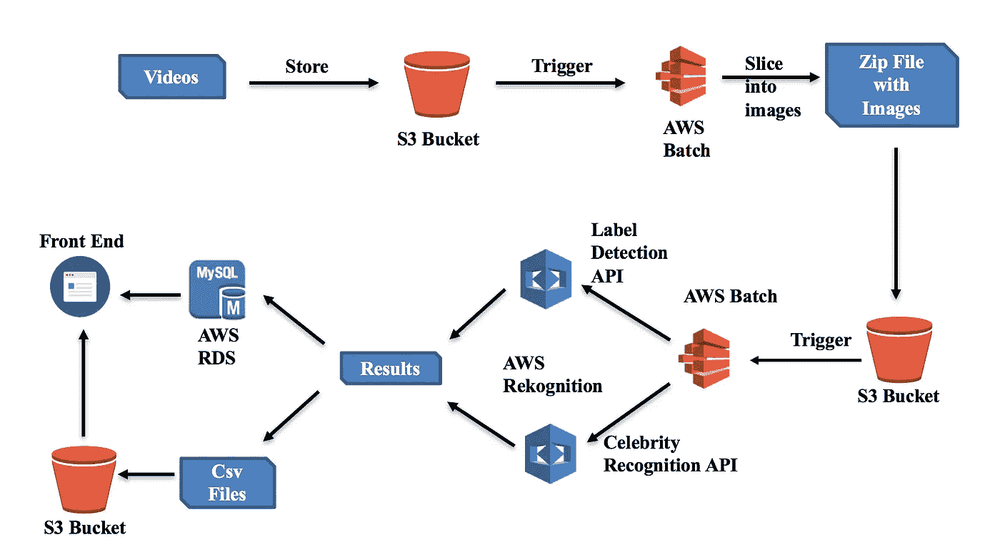
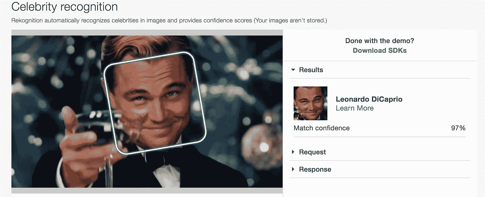
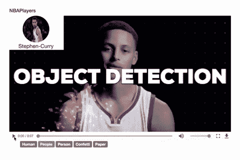

# VideoFi —简化视频注释和见解查找

> 原文：<https://towardsdatascience.com/videofi-annotating-videos-and-finding-insights-simplified-6c939c83b74c?source=collection_archive---------6----------------------->

看视频很好玩，但是尝试手动分析视频，就没那么好玩了！你可能会错过重要的细节，这是非常耗时的。如果这个过程可以自动化呢？它肯定能让少数人的生活更轻松。

能够在传媒公司工作，一切都围绕着视频。这就像宝藏一样，当我们试图涉足最新的流行词——人工智能时，分析视频是我和我的团队想到的最有用的用例之一。


# **先决条件**

为了分析视频，我们必须采取的第一步是**将视频转换成一系列图像**。我们用 python 写了代码，用了一个叫做 [**ffmpeg**](https://www.ffmpeg.org/) 的工具。在为 python 安装了 ffmpeg 库之后，我们以每秒 10 帧的速度从视频中提取图像。图像的名称反映了图像帧出现在视频中的时间。有了这个，我们就知道图像在视频中的位置。

可以在 github [这里](https://github.com/turnerlabs/video-slicer/blob/batch/video_to_image.py)找到将视频转换为一系列图像的代码。

# **我们想找的东西**

当时，我们一直在使用 AWS API 构建 ML 模型，并认为尝试他们最近的人工智能服务( [Amazon Rekognition](https://aws.amazon.com/rekognition/?sc_channel=PS&sc_campaign=pac_ps_q4&sc_publisher=google&sc_medium=rekognition_b_pac_q42017&sc_content=aws_recognition_software_exact&sc_detail=aws%20rekognition&sc_category=rekognition&sc_segment=webp&sc_matchtype=e&sc_country=US&sc_geo=namer&sc_outcome=pac&s_kwcid=AL!4422!3!231564872550!e!!g!!aws%20rekognition&ef_id=V57PWQAAACdeGRVo:20171117195804:s) )—对象检测 API *(现在，对象和场景检测)*和名人识别 API 是一个好主意。

所以实际上，我们的目的是通过找到视频中的物品和名人的标签来发现视频中正在发生的事情。

# **拼接零件**

这是我们用来完成使命的架构图:



VideoFi Architecture

我们将提取的图像上传到 AWS s3 存储桶中。我们通过 Rekognition APIs 发送对每个图像的请求，并收到对每个图像的响应。然后我们过滤数据并使用我们需要的参数。让我进一步解释一下。

名人识别一个图像的请求看起来像这样，其中每个图像被下载到本地机器上并被转换成字节:

```
client.recognize_celebrities(Image={'Bytes': imgBytes,})
```

对象检测 API 也有类似的请求。

API 以下列格式返回响应:

```
{
    "CelebrityFaces": [
        {
            "Face": {
                "BoundingBox": {
                    "Height": 0.6766666769981384,
                    "Left": 0.273333340883255,
                    "Top": 0.09833333641290665,
                    "Width": 0.4511111080646515
                },
                "Confidence": 99.9476089477539,
                "Landmarks": [
                ],
                "Pose": {
                },
                "Quality": {
                    "Brightness": 56.59690475463867,
                    "Sharpness": 99.9945297241211
                }
            },
            "Id": "1SK7cR8M",
            **"MatchConfidence": 100**,
            **"Name": "Jeff Bezos"**,
            "Urls": [
                "[www.imdb.com/name/nm1757263](http://www.imdb.com/name/nm1757263)"
            ]
        }
    ],
    "UnrecognizedFaces": []
}
```

我们用来构建数据库的参数以**粗体** *(匹配置信度和名称)*突出显示。另一个重要的参数是*边框*，它可以用来在名人的脸周围画框，但是我们没有画那么多。

来自标签检测 API 的响应更简单:

```
{
    "Labels": [
        {
            "Confidence": 99.25341796875,
            "Name": "Skateboard"
        },
        {
            "Confidence": 99.25341796875,
            "Name": "Sport"
        },
        {
            "Confidence": 99.24723052978516,
            "Name": "People"
        },
],
}
```

我们在这里使用了两个参数(*置信度和名称*)。



For all you DiCaprio fans — AWS Celebrity Recognition found him!

## 构建数据库

得到响应后，我们构建了两个独立的表——一个用于名人，另一个用于物品。我们将每个图像的标签和置信度与图像名称、视频名称以及它们在视频中出现的时间戳粘贴在一起。随着我们收到更多的响应，我们不断地向表中添加行。为此，我们使用了 AWS 提供的 RDS DB。

上面讨论的过程的代码可以在[这里](https://github.com/turnerlabs/batch-rekognizer/blob/batch/rekognizer.py)找到。

我们使用 AWS batch 进行伸缩，以便可以同时运行多个流程。

带有完整管道的 github repo 可以在[这里](https://github.com/turnerlabs/batch-rekognizer/tree/batch)找到。

# **结果**

事实证明，AWS 的对象检测和名人识别 API 的工作相当不错。它非常擅长探测物体，虽然它不能识别每个名人，但它能识别很多名人！

我们在这里学到的一点是，每秒的帧数很重要——每秒 2 或 3 帧无法捕捉到 10 帧所能捕捉到的信息。这是一个完美的数字——既不太高也不太低，给出了我们想要的结果。但是，作为一个起点，使用更少的帧数将是一件好事，因为调用 API 的次数会很少，并且可能会低于 AWS 提供的免费 API 调用限制。

此外，API 返回结果的可信度也起着重要作用——它检测到了许多对象和名人，但它对此并不十分有信心，因此我们以 80%的可信度过滤结果，在应用该过滤器后，结果非常准确。

这是我们项目最终结果的一个简短演示——名人的名字在左上角，物品和标签在视频的正下方。尽情享受吧！



VideoFi in Action

# 限制

没有什么是完美的，我们的项目和结果也是如此。虽然我们使用的 API 训练有素，但我们缺少的一项能力是——能够用我们想要预测的数据类型(例如 NBA 球员)来训练 API。希望 AWS 在听！:)

# 结论

这个原型的目的是展示人工智能和机器学习是如何变得如此容易，以至于任何想要解决其用例的人都可以用更少的复杂性和少量代码来完成。不仅仅是 AWS，还有其他云平台，比如 Google Cloud，Azure，IBM 等等。提供类似的服务。

我希望你喜欢这篇文章，并用它来解决至少一个你的 AI 用例。

最后但同样重要的是，我要感谢我的团队成员[乔希·库尔茨](http://joshkurz.net/)和[瓦伦·沃赫拉](https://medium.com/u/91de7c5e0e98?source=post_page-----6c939c83b74c--------------------------------)，他们是这个项目不可或缺的一部分。

如果您有任何问题或建议，请随时通过 LinkedIn 联系我们，地址是 [Shivangi Shroff](https://www.linkedin.com/in/shivangishroff/) 和 [Varun Vohra](https://www.linkedin.com/in/varunvohra94/) 。我们非常乐意与您联系并获得反馈。