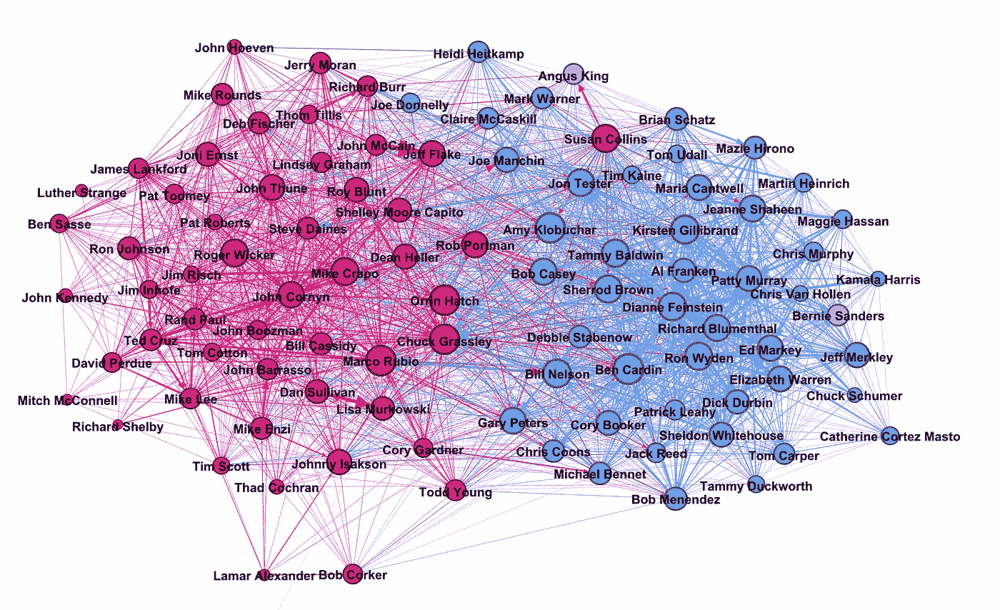
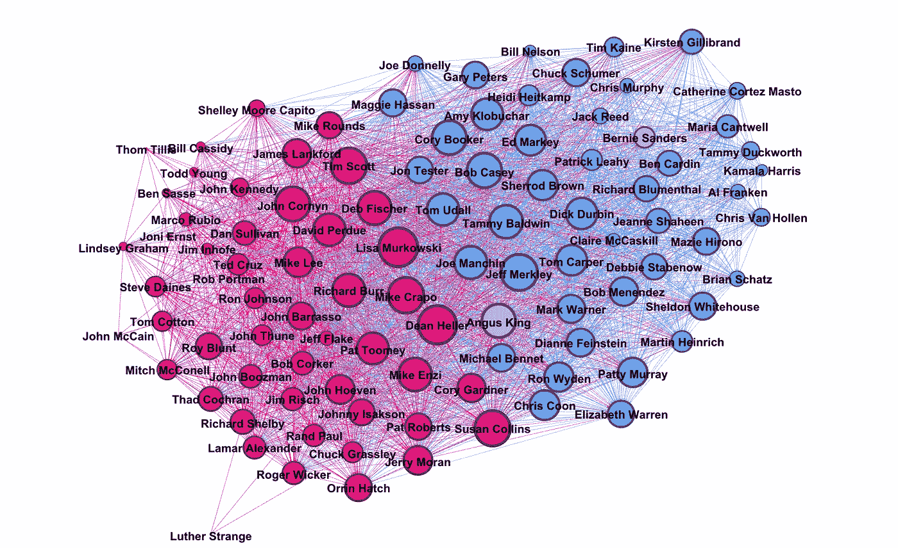
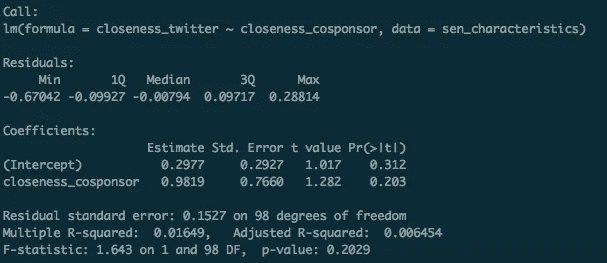

# 美德信号还是新闻阅读？参议员在推特上相互追随的原因探究

> 原文：<https://towardsdatascience.com/virtue-signals-or-news-reading-an-exploration-on-why-senators-follow-each-others-on-twitter-f9805ab381c2?source=collection_archive---------5----------------------->

当你上唐纳德·特朗普的推特时，你首先注意到的一件事是他关注的账户很少。截至 2017 年 6 月 13 日，这一数字为 45。[新闻](https://www.aol.com/article/news/2017/04/12/every-account-president-donald-trump-follows-on-twitter/22037246/) [文章](http://mashable.com/2016/11/22/donald-trump-twitter-follows/)的一个[号](http://edition.cnn.com/2017/03/06/politics/trump-twitter-list-trnd/index.html)对他关注的账号进行了报道。

所以我就纳闷了，为什么会这样呢？为什么他只关注少数几个 Twitter 账户？但我很快意识到，我真的无法回答这个问题——我不认识唐纳德·特朗普，也不知道他脑子里在想什么。相反，我决定解决一个稍微简单一点的问题:为什么美国参议员在 Twitter 上互相关注？

在 Twitter 上关注某人是一个相对来说没有成本的行为。因此，有人可能会认为这里没有任何有趣的事情发生。然而，当一名参议员(比如说伯尼·桑德斯)追随另一名参议员(比如说苏珊·科林斯)时，两件事情发生了变化。首先，每个人现在都可以观察到一个参议员跟着另一个参议员的事实。也许这可以被认为是这两位参议员喜欢合作的信号。其次，桑德斯参议员的新闻订阅现在将包括柯林斯参议员的活动。这让桑德斯参议员获得了关于柯林斯参议员的有价值的信息

这篇文章探讨的问题是:平均而言，哪种效应占主导地位？参议员们互相跟踪是为了获取信息，还是为了表示合作？请注意，如果参议员相互关注以获取信息，twitter 关注作为合作信号的价值会大幅下降，因为接收的参议员希望他们收到关注，因为其他参议员希望监控他们的 Twitter 内容。

# **推特网**

为了找到这个问题的答案，我需要构建一个数据集，描绘出参议员们在 Twitter 上是如何联系的。我使用 Python 和 Twitter API 来收集这些信息。我稍微清理了一下，然后用 Gephi 绘制出来。由此产生的网络可以在下面看到:

Senate Twitter network: Who follows who in US Senate

我用原力图谱算法创建了这个图像。直观上，彼此连接的节点被拉在一起，而彼此不连接的节点被推开。然后，我把每个参议员的政党作为每个节点的颜色:红色代表共和党，蓝色代表民主党，灰色代表无党派人士。一条蓝线意味着连接来自一个民主党节点。共和党人和无党派人士的红线和灰线相似。最后，节点大小表明他们关注多少参议院账户。

你可以看到民主党人和共和党人在 Twitter 关注方面的明显分歧——大多数人倾向于关注自己党内的人。没有一个参议员会过多地关注另一个政党的 twitter 账户，而不关注自己政党的账户。

此外，两位独立人士:安格斯·金和伯尼·桑德斯的行为相对不同。在这张图表中，桑德斯看起来更像民主党人，而金看起来像中间派。众所周知的两党参议员，如参议员柯林斯，也在中间位置有代表。

乍一看，这看起来很棒。Twitter 网络确实根据党派划分得很好，我们知道两党参议员也位于中心位置。

但是这普遍适用吗？为了检验这个问题，我们需要衡量参议员们是如何合作的。核心假设是这样的:如果平均而言，参议员们相互跟随以表示合作，那么 Twitter 中的网络结构将类似于合作的度量。如果参议员们相互追随以获取新闻，那么 twitter 中的网络结构就不像是合作的尺度。我们对因果关系不感兴趣。

# 共同赞助法案

合作的好尺度是什么？参议员可以给出的最廉价的合作信号之一是共同提案。法案联合提案只需要你在法案上签字，并没有明确承诺他们会投赞成票，甚至支持该法案。

我使用 python(和 scrapy)访问了国会的网站，收集到目前为止参议院已经审议的所有法案(超过 1200 个法案)的赞助数据。然后我用 Gephi 绘制了这个网络，使用了与 Twitter 网络相同的逻辑:

Senate Co-sponsorship network: Who co-sponsor with who in Senate

关于我是如何生成这个图的，还需要一个额外的说明。你可能会注意到有些箭头比其他的粗。这是因为共同赞助数据的结构方式。用专业术语来说，我们面对的是一个双向网络。两名参议员可能共同发起了多项立法，每个关联的权重就是这些参议员共同发起的立法的总和。

我们注意到一些我们之前看到的相同趋势:我们可以看到共和党和民主党之间的某种分离。伯尼·桑德斯表现得像一个民主党人，安格斯·金是一个中间派，苏珊·科林斯也似乎超越了党派界限(甚至看起来更像一个民主党人而不是共和党人)。)

你还会看到其他动态。麦卡斯基尔在推特上被定位在民主党的中间，但现在是共同赞助网络的中心。我们需要能够更普遍地量化这两种网络结构。

# 把它们放在一起

我提议的是比较每个网络中特定节点的中心性。图论中的中心性是衡量一个节点有多中心的指标——当你只使用现有的连接时，你可以多容易地到达任何其他节点。有许多中心性度量标准，但是今天，我将集中讨论两个度量标准:中间性和紧密性。

紧密中心性衡量一个节点与其他节点的紧密程度。直观地说，当您可以使用较短的路径到达其他节点时，您的亲密度中心性得分较高。

介数中心性衡量一个节点连接其他节点的位置。直观地说，当你位于大量连接其他节点的路径上时，中间中心性得分就高。

我计算两个网络的接近度和介数，并进行比较。如果它们彼此相关，这将支持我们的假设，即 twitter 关注更多地被用作合作的信号。否则，人们更有可能通过关注 twitter 来获取信息。

我在这里做了一个简单的回归。请注意，我并不特别关心内生性(在某种程度上被解释为“因果关系”，尽管这种解释有点问题)，因为我真的只关心 twitter 是否有一些战略方面，我们也可以在参议员如何共同提案法案中看到。此回归的结果如下所示:

重点关注亲密度 _ 共同赞助线。“估计”一栏大致告诉了我 twitter 网络中的亲密度如何跟随共同赞助者网络中的亲密度。这并不重要。让我们来看看中间中心性的结果:

也差远了。从这两张表中我们可以看出，两个网络之间的中心性平均来说并不相似。一般来说，参议员倾向于使用 twitter 作为一种收集信息的方式，而不是信号合作。这是非常整洁的。

# 警告

不幸的是，这还不是故事的全部。需要讨论一些重要的假设和警告。

**假设 1:** 共同赞助是没有成本的。我们可以把 twitter 的关注和比尔的共同赞助放在一起的主要原因之一是，我们认为这两者都是免费的。例如，如果共同发起一项法案引入了一笔可观的成本，那么围绕你如何共同发起法案的决定可能与你使用 twitter 表示合作的方式不同。这意味着在 Twitter 上表示的合作可能并不总是转化为这种更昂贵的合作形式。

**假设二:**党派路线无关紧要。这里的另一个重要假设是，参议员不分党派，都以同样的方式对待彼此。这可能是本分析中使用的最不现实的假设。跟随和你在同一个政党的人的决定和跟随和你在不同政党的人的决定可能看起来不同。例如，两个民主党人之间的 twitter 关注的价值可能非常低，因为由于他们在同一个政党中，他们已经有了强烈的合作信号。另一方面，民主党决定追随共和党可能是一个更强烈的信号。在以后的帖子中，我希望探索这个想法。

**假设 3:** 议案协办“完成”。本届国会刚刚成立 6 个月。也许以共同提案法案为代表的合作还未能充分展现出来。这可以通过在将来使用一套更全面的立法再次查看这一分析来相对容易地解决。