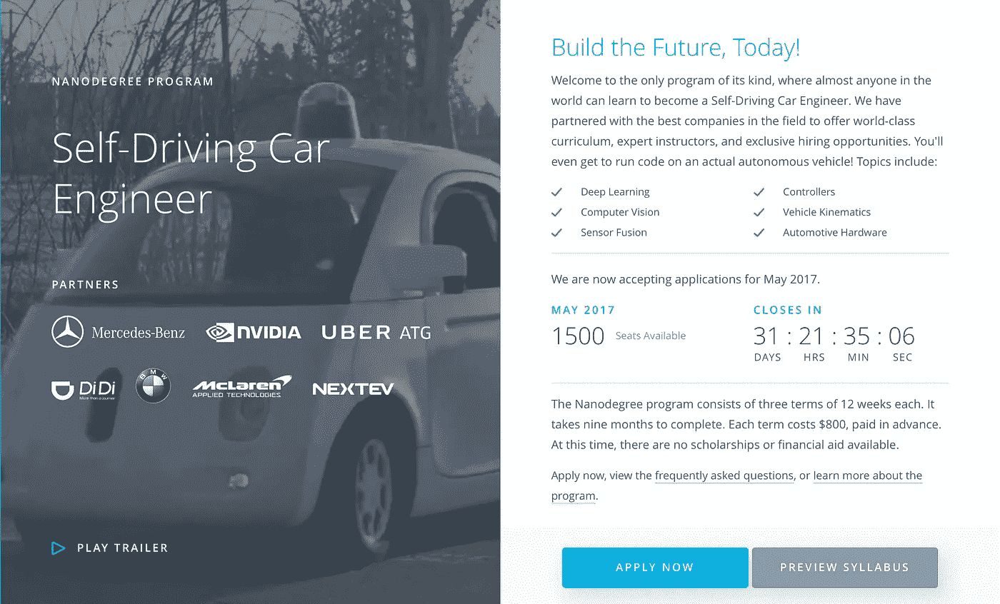
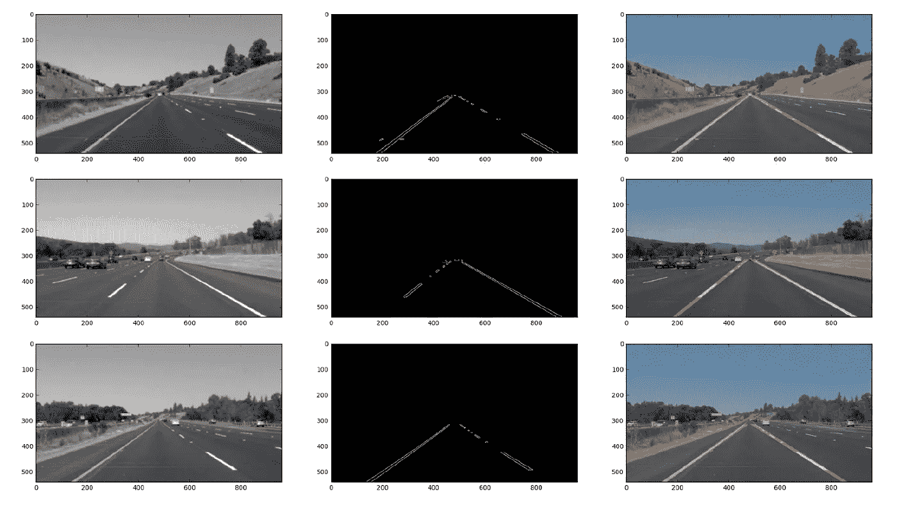
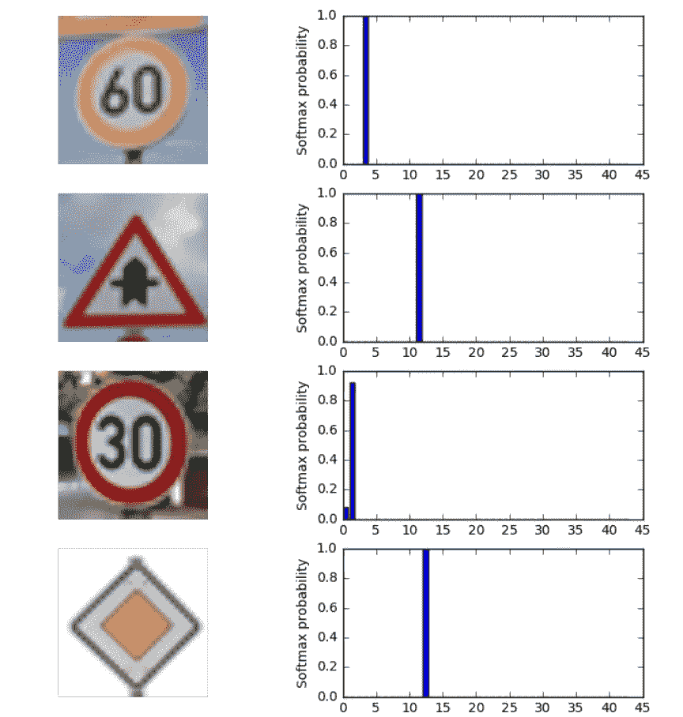
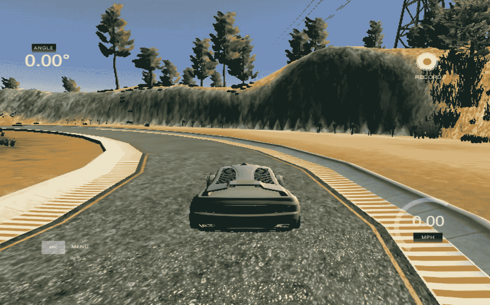
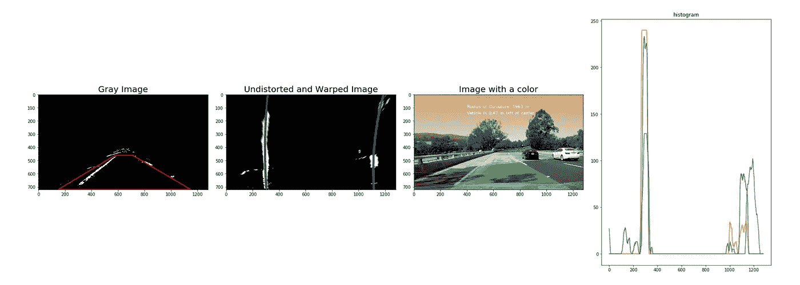
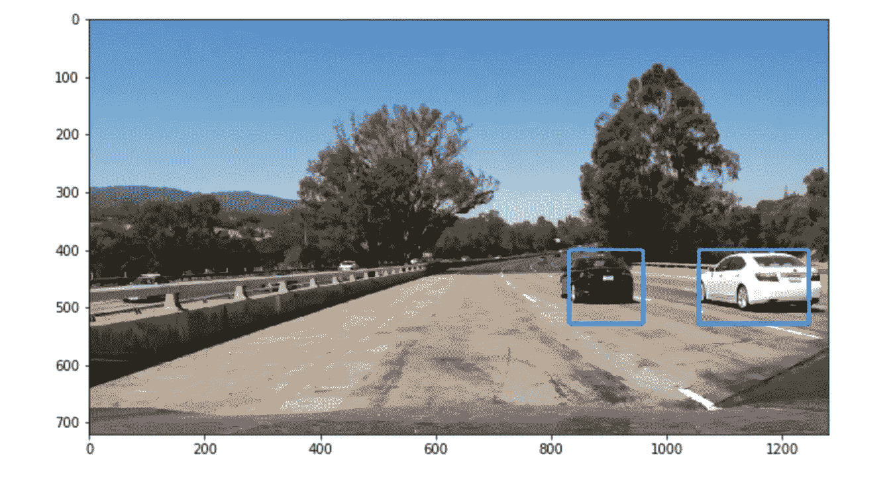

# 需要远见

> 原文：<https://towardsdatascience.com/vision-needed-d2b0c7fd2387?source=collection_archive---------1----------------------->

> 我成功地让一辆汽车自动跟踪了一条轨迹，但是我想不出一个更好的标题来写这篇文章。所以，这里引用一句话来代替！

> “那些疯狂到认为自己可以改变世界的人，才是真正改变世界的人。”
> 
> ―史蒂夫·乔布斯

“Think Different” Original Apple Ad Campaign

嗯，我做到了！我终于完成了 Udacity 自动驾驶汽车 Nanodegree 的第一学期。至少可以说，过去的三个月是一段坎坷的旅程，我已经成功地克服了这段时间所面临的障碍，无论是实际上还是象征性的！

在此期间，我花了很多个通宵，大口大口地喝着红牛和咖啡，试图摄入足够的咖啡因来坚持下去，并通过课程抛给你的各种障碍。我曾多次花数天时间研究一个想法，结果却对结果和进展如此失望，以至于完全放弃了它。后来才意识到我一直都是对的，只是在执行过程中犯了一个小小的错误！

事后看来(*剧透警告)，这一切麻烦都是值得的！

以下是我对这门课程的想法…

*** ***免责声明*** *:我希望这篇文章能帮助任何人辩论是否要参加这样的课程！我曾计划在完成每个项目后提供一个深入的回顾，但我的时间管理技能又一次让我失望了。因此，我不会对这些项目进行深入的回顾(我的同行已经广泛地讨论过了)，而是描述我到目前为止的经历……*

# 我为什么选择这门课程？

去年毕业后，我完全不知道自己下一步想做什么。我在大学的最后一个学期看着周围的每个人都在找工作或者已经申请了一个特定的硕士项目。我知道我想继续深造，但是我不知道该主修哪个领域，我也不想在一家专门招聘工程毕业生的 IT 公司工作。

所以，我决定休息一下，想清楚自己下一步想追求什么。我一直对数学很有兴趣，这也是我完成工程的原因。在大学期间，我还通过使用 Arduino、Raspberry Pi 和 Lego Mindstorms 等原型平台参与许多迷你项目，对机器人技术有所了解。

因此，我把我的重点放在了机器人技术和人工智能领域。在加入 SDCND 之前，我在 Coursera 上完成了 Magnus Egerstedt 博士的“移动机器人的控制”课程，在 Udacity 上完成了巴斯蒂安·特龙本人的“机器人的人工智能”课程。这两门课都很棒，我建议任何想进入机器人领域的人都去上。

我的本科和移动机器人课程让我对机器人的传统控制系统方法有了深入的了解，但我仍然需要获得人工智能方面的知识，以学习其认知应用。

因此，我报名参加 SDCND 并不是为了进入 ADAS( [高级驾驶辅助系统](https://en.wikipedia.org/wiki/Advanced_driver_assistance_systems))行业本身，而是为了参加一个主要涉及人工智能和机器人领域的应用特定课程。

## 我过去在线学习的经历

我过去参加过在线课程，但从未真正完成过任何课程。起初，兴奋和兴趣总是显而易见的，但很快课程就变得像一个单调的例行公事，从而失去了它的魅力。一旦发生这种情况，这门课程被搁置只是时间问题，会被你的日常活动所掩盖。

这是****进行在线学习的最大弊端**。大学教育提供的同龄人和老师之间日常互动的缺乏仍然是激励学生完成手头任务的最大激励因素之一。与同龄人互动产生的恐惧因素是在线课程无法复制的。**

**我发现 Udacity 最接近于复制这些特征而没有缺点。它肯定还不完美，但它肯定是下一个最好的选择。我将尽我所能在下面阐述我的观点…**

# **无与伦比的学习方式**

****

**[www.udacity.com/drive](http://www.udacity.com/drive)**

****“明天的工作从这里开始”，**这是 Udacity 的使命宣言。他们的目标是通过为每个人提供一个在最受欢迎和要求最高的领域获取知识的机会来实现教育的民主化。**

**他们的工作直到现在都是不可否认的。在很短的时间内(成立于 2012 年)，它们已经成为当今最好的 MOOC 之一，我想就我认为它们与竞争对手的区别提供一点见解。**

# **第一学期概述:**

**特别是 SDCND，每学期花费 800 美元(卢比。53，000)和三个任期的跨度。术语划分如下:**

*   ****学期一:计算机视觉和深度学习****
*   **术语 2:传感器融合、定位和控制**
*   **学期 3:路径规划、浓度和系统**

**每个学期预定为三个月，可以在更短的时间内完成。学期 1 跨越 5 个核心项目，唯一的重点是在计算机视觉、神经网络和深度学习领域建立一个强大的基础和基础。**

**以下是关于第一学期核心项目的细节，并附有我尝试的一个片段:**

1.  ****车道线检测**使用传统的计算机视觉技术(颜色渐变、canny 边缘检测和 hough 变换)**

****

**Pipeline Visual**

**P1 Output Video**

****2。**基于卷积神经网络模型，使用 Tensorflow 构建一个**交通标志分类器**，该分类器可以基于使用德国交通标志检测基准(GTSRB)数据集设置的 43 个类别，最终预测交通标志。**

****

**P2- Traffic Sign Classifier**

****3。**自动驾驶汽车(当然是在模拟器上！)使用**行为克隆**(在馈入我驾驶机器人绕赛道行驶的数据后学习驾驶赛道)和深度学习。**

****

**The Simulator**

**P3 Output Video**

****4。高级车道寻找**使用高级计算机视觉技术，如梯度和颜色阈值、透视变换和使用直方图的车道寻找。**

****

**Pipeline Visualization**

**P4 Output Video**

****5。使用 HOG 技术和监督分类算法(我使用支持向量机)在道路上检测车辆****

****

**Pipeline Visualization**

**P5 Output Video**

**你可以在这里查看所有这些项目的代码[。](https://github.com/harish3110)**

**这些项目需要调整和进一步的修改，重新审视这些项目，没有一个期限悬在你的头上，将有望使世界变得不同。**

# **优势**

**很明显，读完这些资料后，我非常喜欢 Udacity 和他们的纳米学位学习方式，尤其是他们的 SDCND 项目。因此，总结一下 Udacity 优于大多数竞争对手以及脱颖而出的主要原因:**

*   ****课程材料:** Udacity 投入了大量资源为他们的课程开发高质量的内容，并根据学生的反馈定期更新。为了进一步加强这一点，他们与业内最优秀的人合作，开发获得理想工作所必需的课程材料。提供的课程材料对于完成指定的项目是绰绰有余的。然后提供资源对其进行改进。这提供了一种自由，可以随意摆弄和深入学习刚刚学到的概念。**
*   ****导师项目:**课程中的每个学生都有一名导师。导师的角色是帮助和指导学生克服他们在学习过程中遇到的任何障碍。导师是学生的直接联系点，每周提供有关他们的进展和面临的困难的最新情况。虽然，导师的表现无疑会因人而异，但与他人分享你的目标和进展的行为会让人感到更有责任感，从而推动他们完成这些目标。**
*   ****项目:**课程设置中的核心项目确实令人惊叹。它们很实用，有助于简洁地形象化所学的概念，这使得学习困难的话题变得更容易。这些项目组合起来就像一个拼图游戏，每个项目都是为了教授一个特定的方面，所有在第一学期学到的概念在最终项目中完美地结合在一起。**
*   ****社区:**除此之外，学习这门课程的学生最大的财富是有机会与世界各地志同道合的人交流。Udacity 开发了一个平台，让人们聚集在一起，讨论当今技术世界中最具智慧的话题。由于思维过程因人而异，看到别人对一个概念的理解和他们实现这个概念的想法是令人惊讶的。同样，看到[你的同事的工作](https://medium.com/self-driving-cars/udacity-students-build-tools-for-computer-vision-deep-learning-and-the-didi-challenge-db6eb14f27c7)就像一种催化剂，激励你产生类似的结果，同时也教会你新的概念。**

****同样值得一提的是…****

**# **Udacity 职业支持:**除了课程材料，Udacity 还通过提供课程来帮助学生建立个人档案，从而帮助他们改善职业前景。我必须承认，我没有太注意这些，因为我参加课程的主要目的是进一步学习，而不是特别找工作。乍看之下，它看起来确实很棒，而且我有充分的理由相信它非常有帮助。无论如何，更多信息点击[这里](https://career-resource-center.udacity.com)。**

# **缺点**

**虽然到目前为止，我对这门课程给予了高度赞扬，但它也不是没有缺点。**

*   ****留学生招聘:**这是很多学生心中的一大问号。Udacity 已经与世界上一些最好的公司合作，如 Mercedez、优步、福特、宝马、英伟达等等。很自然，任何想在自动驾驶汽车行业发展的人都不会介意与他们合作。但是作为一个来自次大陆的人，我知道很多在这里参加课程的人对如何进行这种雇佣缺乏透明度感到特别不安，因为涉及到各种麻烦，如签证审批等。**
*   **小组项目:我认为 Udacity 应该在他们的纳米学位课程中实施这个项目(至少作为选修项目)。将学生分成小组来完成一个项目将有助于进一步丰富学习体验。小组项目类似于现实生活中很少单独完成的项目。更重要的是，这将有助于培养团队合作、授权、沟通等重要技能。也有助于汇集他们的知识，从而帮助提高。**
*   ****请停止填鸭式的喂养**:在过去的几年里，自动驾驶汽车行业的受欢迎程度大幅上升。因此，像 SDCND 这样的课程有很大的需求，因为人们希望转向未来有前途的职业道路。这对于整个领域来说是很好的，但是对球场产生了负面影响。预备组的学生被提供了最低限度的必要资料，包括基本概念和完成项目所需的额外阅读材料。但是，随着时间的推移，为了帮助参加课程的学生清除项目，至少可以说这些项目并不简单，Udacity 提供了越来越多的补充材料来帮助学生清除他们面临的障碍。这严重阻碍了学习过程。在这些涉及大量研究的领域，学会学习是至关重要的，因为一切都还没有弄清楚，需要更多的创新和工作。**

# **你认为呢？**

**在当今资源有限的世界，没有技术创新的全球化是不可持续的。人工智能是未来之路。一个人能叫进来一个妖孽的那一天(也就是如果它能枯萎当前的风暴！)无人驾驶汽车将到达你的住处，带你到达目的地，这并不遥远，希望不会太遥远。**

**当然，在这一切成为现实之前，有很多事情(至少可以说是轻描淡写)需要解决。但就我个人而言，我已经对这个领域产生了足够的热情，可以继续努力，展望未来。**

**以下是马丁·福特的畅销书《机器人的崛起:技术和失业未来的威胁》中关于人工智能现状的摘录:**

> **“特别是，像谷歌、脸书和亚马逊这样的公司的崛起推动了巨大的进步。从未有过如此财力雄厚的公司将人工智能视为其商业模式的绝对核心——也从未有过人工智能研究如此接近如此强大的实体之间的竞争关系。类似的竞争态势正在各国间展开。在威权国家，人工智能对军队、情报机构和监控机构来说正变得不可或缺。*事实上，一场全面的人工智能军备竞赛很可能在不久的将来迫在眉睫。”
> ― **马丁·福特****

**硅谷所有领先的科技巨头都对人工智能进行了深入投资，希望实现突破，从而发挥主导作用，创造垄断。**

**特别看看自动驾驶汽车，深度学习的概念，如神经网络和 ConvNets，已经建立了一段时间，但在该领域没有取得重大进展。这些年来技术的进步，特别是 GPU 的引入，使得硬件最终能够赶上并处理如此大量的数据。**

**因此，SDC 所谓的领导人都拥有相同的硬件(在某些情况下，不像最近的[指控](https://www.wired.com/2017/02/googles-waymo-just-dropped-explosive-lawsuit-uber-stealing-self-driving-tech/)那样同时发生),只是由于他们的软件实现而完全脱颖而出。**

**由于这一领域的急剧出现和炒作，与人工智能研究携手合作的自动驾驶汽车行业似乎即将取得重大突破！**

***对于无人驾驶汽车领域的任何人来说，希望未来是令人兴奋的时代，并最终改变好莱坞对该领域的看法……***

**Total Recall — Johnny Cab!**

# **为什么选择这样的课程？**

> **“数以千计的高技能信息技术岗位的消失，很可能是对知识型就业产生更广泛影响的前兆。”
> ― **马丁·福特**，**机器人的崛起:技术和失业未来的威胁****

**我只想说明一点，这不是一门容易的课程，也不适合所有人。它需要对学习的高度承诺以及灵活的时间安排。Udacity 表示，每周 10 小时左右足以完成课程，但这与我花在这上面的时间相差甚远。大多数概念虽然解释得很好，但本质上是非直观的，因此需要更多的研究。**

**也就是说，随着人工智能和机器学习的接受度越来越高，越来越多的工作岗位招聘不足，并有被自动化的风险。卡尔·纽波特(Cal Newport)在其畅销书《深度工作:分散世界中专注成功的规则》(Deep Work:Rules for Focused Success in a Distracted World)中创造的“新经济”即将出现。这是他的书的节选，内容大致相同…**

> **“在新经济中繁荣有两个核心能力:**
> 
> **1.快速掌握硬东西的能力。**
> 
> **2.就质量和速度而言，有能力以精英水平进行生产。"
> ――卡尔·纽波特**

**像 SDCND 这样的课程为世界各地的学生提供了一个在这些领域工作的完美平台，专注于未来最苛刻领域的实践和应用学习。**

**虽然，它可能还没有一个标准学位的可信度，但在这样的课程上工作证明了个人有努力工作的毅力，更重要的是愿意学习。在这个时代，终身学习是成功的关键。**

**作为一个非计算机科学背景的人，这门课程是我迄今为止面临的最大的智力挑战。作为回报，它给人工智能领域注入了非常强烈的吸引力，我希望能在其中工作。我们这一代人面临着创造和想象新技术的艰巨挑战，以确保一个更加和平和繁荣的未来。**

> **"教育是点燃火焰，而不是填满容器."
> ― **苏格拉底****

# **该表扬就表扬**

**我要感谢乌达城提供了一个机会，让我了解目前世界上最令人垂涎的领域之一。我特别感谢[奥利弗·卡梅伦](https://medium.com/u/fd8bc37755d8?source=post_page-----d2b0c7fd2387--------------------------------)、[瑞安·基南](https://medium.com/u/a878b47f7040?source=post_page-----d2b0c7fd2387--------------------------------)和[大卫·西尔弗](https://medium.com/u/8190c86ea791?source=post_page-----d2b0c7fd2387--------------------------------)以及 Udacity 的其他工作人员，他们确保了课程的体验是一流的。**

**我还想感谢在课程中我有幸与之互动的许多人，我期待着见到更多的人。**

**现在我们来看几天后开始的第二学期。超级兴奋开始自动驾驶的机器人方面！**

# **参考**

****神经网络揭秘**:[http://www . Welch Labs . com/blog/2015/1/16/Neural-Networks-demystalized-part-1-data-and-architecture](http://www.welchlabs.com/blog/2015/1/16/neural-networks-demystified-part-1-data-and-architecture)(所有 [Welch Labs](https://www.youtube.com/user/Taylorns34) 的视频都值得观看)**

****P2 深度评论** by [**杰伦**](https://medium.com/u/716549009cc4?source=post_page-----d2b0c7fd2387--------------------------------) (你的文章太神奇了 btw！):[https://medium . com/@ jeremyeshannon/uda city-自驾-汽车-纳米度-项目-2-交通-标志-分类器-f52d33d4be9f](https://medium.com/@jeremyeshannon/udacity-self-driving-car-nanodegree-project-2-traffic-sign-classifier-f52d33d4be9f)**

****卷积神经网络如何工作**作者布兰登·罗尔:【https://www.youtube.com/watch?v=FmpDIaiMIeA】T2&t = 311s**

****P3 深度回顾**by[**Vivek Yadav**](https://medium.com/u/b783495cc56b?source=post_page-----d2b0c7fd2387--------------------------------):[https://chatbotslife . com/learning-human-driving-behavior-using-nvidias-neural-network-model-and-image-augmentation-80399360 efee](https://chatbotslife.com/learning-human-driving-behavior-using-nvidias-neural-network-model-and-image-augmentation-80399360efee)**

****试图通过**[**Param Aggarwal**](https://medium.com/u/945cef1c6658?source=post_page-----d2b0c7fd2387--------------------------------)**:**[https://medium . com/computer-car/试图实时可视化卷积神经网络-1edd1f3d6c13](https://medium.com/computer-car/attempting-to-visualize-a-convolutional-neural-network-in-realtime-1edd1f3d6c13)**

****克隆汽车模仿人类驾驶**by**[**Mohan kart hik**](https://medium.com/u/355915c47610?source=post_page-----d2b0c7fd2387--------------------------------)**:**[https://medium . com/@ mohankarthik/Cloning-a-car-to-mimic-human-driving-5 C2 f 7 e 8d 8 aff](https://medium.com/@mohankarthik/cloning-a-car-to-mimic-human-driving-5c2f7e8d8aff)****

********深度回顾**由[**阿莱士**](https://medium.com/u/50ae8a83b7ec?source=post_page-----d2b0c7fd2387--------------------------------)**:**[http://navoshta.com/detecting-road-features/](http://navoshta.com/detecting-road-features/)******

******P5 深度回顾**作者 [**阿纳尔多·冈兹**](https://medium.com/u/3356e7867afb?source=post_page-----d2b0c7fd2387--------------------------------):[https://chatbotslife . com/vehicle-detection-and-tracking-using-computer-vision-baea 4 df 65906](https://chatbotslife.com/vehicle-detection-and-tracking-using-computer-vision-baea4df65906)****

******查看** [**聊天机器人生活**](https://medium.com/u/e8ae66bb69c3?source=post_page-----d2b0c7fd2387--------------------------------) 更多精彩文章！****

******麻省理工学院的 SDC 公开课**:[http://selfdrivingcars.mit.edu](http://selfdrivingcars.mit.edu)****

******Fast.ai，一个致力于教授深度学习和神经网络的令人惊叹的博客:**[http://www . fast . ai](http://www.fast.ai)****

****你毕业后做什么比你在哪里上学重要得多****

****如果你喜欢这篇文章，请分享并推荐给任何想参加这类课程的人。谢谢！:)****