# 深度学习中的视觉注意模型

> 原文：<https://towardsdatascience.com/visual-attention-model-in-deep-learning-708813c2912c?source=collection_archive---------1----------------------->

# 摘要

本练习的主要目的是研究视觉注意模型的发展现状和主要工作。研究了两个数据集:扩展 MNIST 和支持向量回归机。前一个数据集侧重于规范问题——手写数字识别，但具有杂乱和翻译，后一个数据集侧重于现实世界的问题——街景门牌号码(SVHN)转录。在本练习中，我们以培养良好直觉的方式研究了以下论文，以选择合适的模型来应对上述挑战。

对于扩充的 MNIST 数据集:

*   基线模型基于经典的 2 层 CNN
*   参考文献[2]，目标模型是具有 LSTM 循环注意模型(RAM)

对于 SVHN 数据集:

*   基线模型基于 11 层 CNN:用卷积网络提取图像特征，然后用多个独立的密集层预测有序序列，参考文献[1]
*   参考文献[3]，目标模型是具有 LSTM 和卷积网络深度循环注意模型(DRAM)

此外:

*   空间变换网络也作为视觉注意机制的最新发展进行了研究，参见论文[5]

上述两个数据集挑战都集中在数字识别上。在本练习中，MNIST 用于演示一位数识别的解决方案，而 SVHN 用于显示多位数序列识别的结果。

# 扩充 MNIST 数据集

## 数据扩充

由于原始 MNIST 数据集是用于说明深度学习的规范数据集，其中简单的多层感知器可以获得非常高的精度，因此原始 MNIST 被增加了额外的噪声和失真，以便使问题更具挑战性，并导致诸如 SVHN 的真实世界问题。

增强后的 MNIST 数据集示例如下所示:

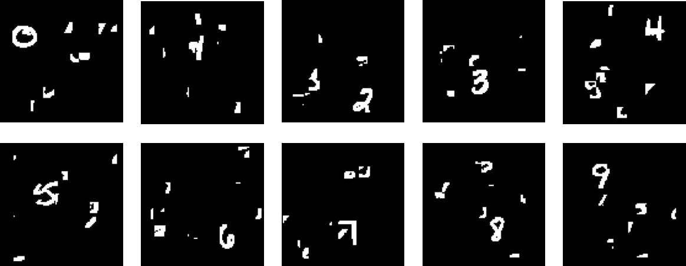

上面的增强 MNIST 数据集杂乱无章，没有中心。增强过程如下:
(1)在 100x100 的画布中随机选择一个位置对原始的 28x28 图像进行平移，生成平移。
(2)通过随机选择一个训练/验证 28x28 图像，然后随机裁剪 8 次 9x9 补丁，然后将所有 8 个裁剪的图像拼接成增强的 100x100 图像，来产生失真噪声

对于经典方法来说，扩充的 MNIST 数据集似乎很难，让我们首先尝试一下。

## 数据预处理

除了数据扩充之外，每个图像像素值在[0，1]的范围内被归一化。

MNIST 数据集非常平衡。没有应用额外的数据预处理。

## 基线方法:仅 CNN

基线方法是使用经典卷积模型架构，该架构适用于原始 MNIST 数据集。MLP 没有被用作基线模型，因为它没有表现出经典模型的最佳效果。卷积模型架构取自 [keras 示例](https://github.com/fchollet/keras/blob/master/examples/mnist_cnn.py)，该示例声称在原始 MNIST 数据集上达到 99.25%的准确率。

模型架构如下所示:

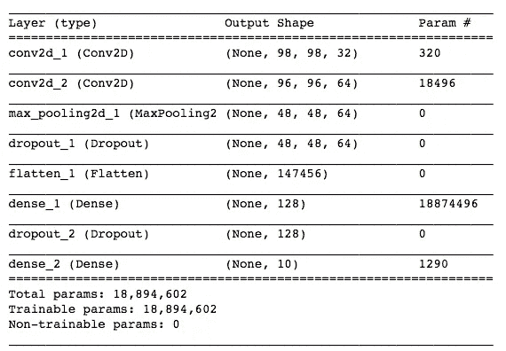

由于 MNIST 手写数字相对简单，因此只有 2 个卷积层和最大池用于特征减少和空间不变性。退学用于转正。平坦/密集图层用于要素交互。

有 60k MNIST 图像数据，其中 54k 用于训练，6k 用于验证，10k 用于测试。测试数据在最后一步只使用一次。

验证动态如下所示。我们可以看到，验证准确度稳定在大约 50%的准确度。并且最终的一次性测试准确率在 100 个历元时为 **50.87%** (由于每个训练图像为 100x100，所以在 Tesla K80 GPU 服务器中的总训练时间需要几个小时)。

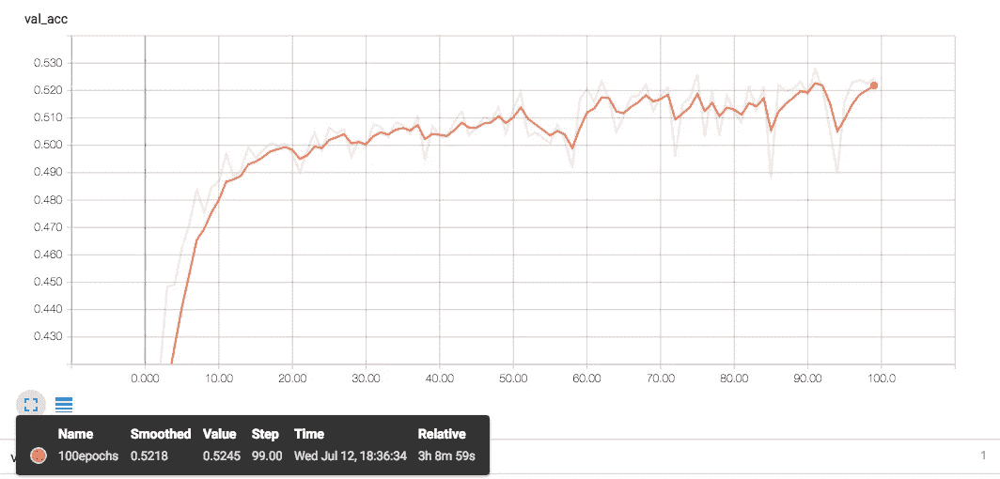

## 目标方法:重复注意模型(RAM)

为了更好地解决上述问题，谷歌在 2014 年发布了一个非常简洁和酷的想法，请参考论文[2]。

I ***灵感*** 大意是从人眼的工作原理，即视网膜中获取灵感，如下图所示。我们的眼睛可以捕捉到一个非常广阔的世界，然而，我们倾向于“扫视”全景，只关注视图的特定区域，而其他部分则有点“模糊不清”。

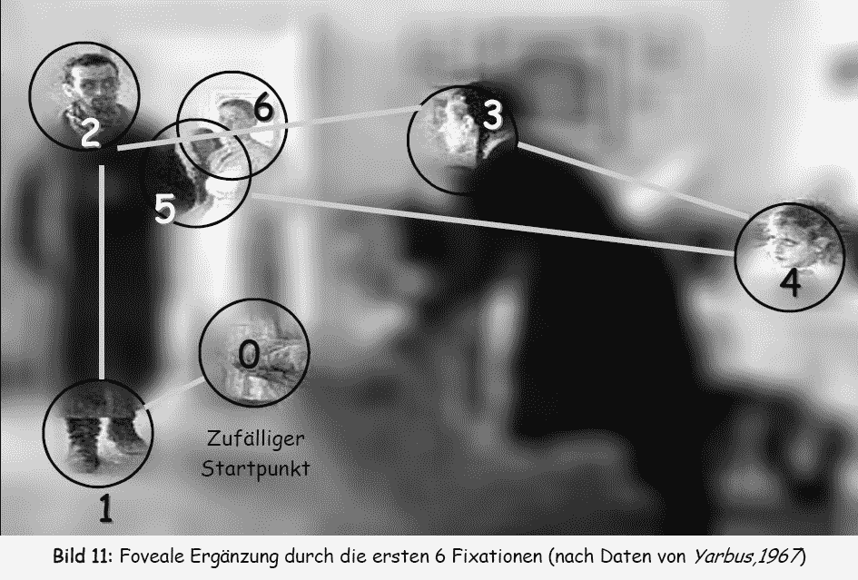

source: [https://en.wikipedia.org/wiki/Visual_perception](https://en.wikipedia.org/wiki/Visual_perception)

视觉注意力模型试图利用这一想法，让神经网络能够将其“注意力”集中在图像的有趣部分，在那里它可以获得大部分信息，而在其他地方给予较少的“注意”。

这种方法的优点是:
(1)模型可以更多地关注图像的相关区域
(2)因此降低了所需的图像处理能力
(3)“离焦”模糊区域仍然捕捉到正在发生的事情的一般概念

这种直觉可能有助于我们的增强 MNIST 数据集挑战，其中只有手指周围的图像区域需要更多的关注。

A ***架构*** 整体架构中组件很少。

***惊鸿传感器*** 惊鸿传感器是视网膜的实现，如下图所示:

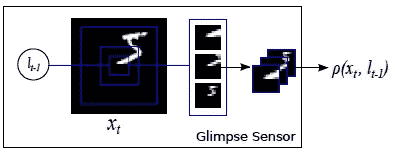

这个想法是让我们的网络“看一眼”给定位置周围的图像，称为一瞥，然后提取这一瞥并将其调整为不同比例的图像作物，但每个比例都使用相同的分辨率。例如，上述示例中的 glimpse 包含 3 个不同的刻度，每个刻度具有相同的分辨率(也称为传感器带宽)，例如 12x12。因此，中间最小比例的作物最清晰，而外环最大的作物最模糊。总之，Glimpse 传感器拍摄全尺寸图像和位置，输出给定位置周围图像的“类似视网膜”的表示。

***Glimpse Network***
一旦我们定义了 glimpse sensor，Glimpse Network 就是一个简单的环绕 Glimpse Sensor，拍摄全尺寸图像和位置，通过 Glimpse Sensor 提取图像的视网膜表示，展平，然后使用隐藏层和 ReLU 将提取的视网膜表示与 Glimpse 位置组合，发出单个矢量 g。该矢量包含“什么”(我们的视网膜表示)和“哪里”(图像内的聚焦位置)的信息。

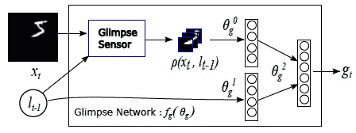

***递归网络***
递归网络从 Glimpse 网络获取特征向量输入，通过其隐藏状态(和记忆单元)记忆有用信息。

***位置网络***
位置网络将递归网络中的隐藏状态作为输入，并尝试预测下一个要查看的位置。该位置预测将在展开的递归网络中的下一个时间步中成为 Glimpse 网络的输入。位置网络是整个想法中的关键组成部分，因为它直接决定了在下一个时间步骤中要注意的地方。为了最大化这个位置网络的性能，本文引入了一个随机过程(即高斯分布)来产生下一个位置，并使用强化学习技术进行学习。它也被称为“硬”注意，因为这个随机过程是不可微的(与“软”注意相比)。随机性背后的直觉是平衡开发(利用历史预测未来)和探索(尝试前所未有的东西)。请注意，这种随机性使得组件不可微，这将在反向传播期间引发问题。并采用强化梯度策略算法来解决这一问题，具体在强化学习部分讨论。

***激活网络***
激活网络将递归网络中的隐藏状态作为输入，并尝试预测位数。此外，预测结果用于生成奖励点，奖励点用于训练位置网络(因为随机性使其不可微)。

***架构组合***
结合以上所述的所有元素，我们就有了下面的网络架构。f_g 是瞥见网络，f_h 是循环网络，f_l 是位置网络，f_a 是激活网络。下图是为说明目的而展开的 2 个时间步长的递归。特别是，时间步数=每张图片的扫视次数

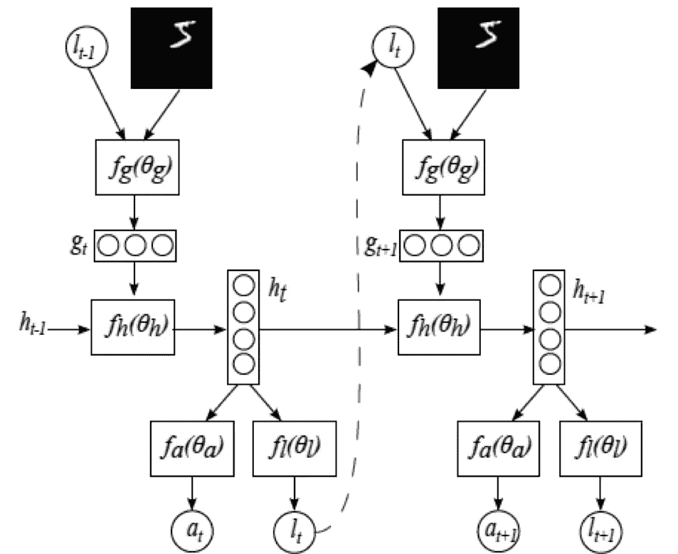

R 强化学习
由于位置网络是不可微的，所以采用强化学习，具体来说就是策略梯度法来训练网络的这一特殊部分。首先让我们看一下强化学习的概述。

***概述*** 强化学习就是试错。强化学习的概述如下图所示。我们有以下组件:

*   代理人:大脑，也就是我们正在建模的神经网络。
*   环境:地球，是我们可以与之互动的未知世界。默认情况下，我们对环境一无所知。
*   相互作用:红色箭头，是代理和环境之间的相互作用。它可以是行动(将改变环境的代理输出)、观察(作为代理行动的结果的环境变化的结果)和奖励(代表代理行动“有多好”的一些标量值)。代理的目标是最大化它收集的报酬。

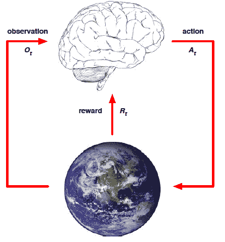

source: [http://www0.cs.ucl.ac.uk/staff/d.silver/web/Teaching.html](http://www0.cs.ucl.ac.uk/staff/d.silver/web/Teaching.html)

强化学习的各种方法取决于我们试图优化的目标，分类如下:

*   政策:从状态到行动的映射。给定我们所处的位置(即状态)，执行哪个操作

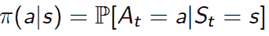

*   价值:评价一个状态有多好。处于某个状态有多好

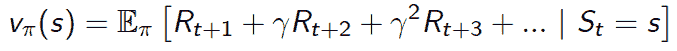

*   模型:预测环境会怎样。了解敌人有助于赢得战争。

关于 RL 的更详细和全面的解释可以在这里找到。本文选择政策梯度作为 RL 方法，属于上述第一类。

***应用到我们的问题*** 回到我们的问题，既然我们在用政策梯度来解决我们的问题，那我们就来谈谈“政策”本身。在我们的问题中,“政策”决定了我们如何选择下一个瞥见的地点。我们的答案(即策略)是，通过从参数为μ和σ的高斯分布中抽样，其中μ是均值，σ是标准差。这个高斯分布就是我们的随机过程。在这个实现中，我们将σ固定为网络超参数，只尝试学习μ。

为了说明随机网络的训练过程，下图显示了一个高级概念。蓝色箭头代表向前传球，红色箭头代表向后传球。我们的过程从将输入图像传入我们的网络开始。可微分网络将正常工作(例如 XW + b)，表示为机器人头部。然后，随机网络(在我们的情况下是位置网络)将应用随机过程(在我们的情况下是高斯分布)来生成结果(在我们的情况下是下一次扫视位置的预测)。它被表示为抛硬币，以表示一个随机过程。然后由环境评估位置预测(以及使用 glance 的分类结果),现在我们有了开始反向传播的奖励。从概念上讲，通过随机网络的反向传播可以被认为是我们使我们的硬币更偏向于未来会给我们带来更多回报的方向，换句话说，我们学习高斯分布参数。这一步被描绘成一把锤子砸在一枚硬币上，来表示我们想要“锻造”对我们有利的硬币。

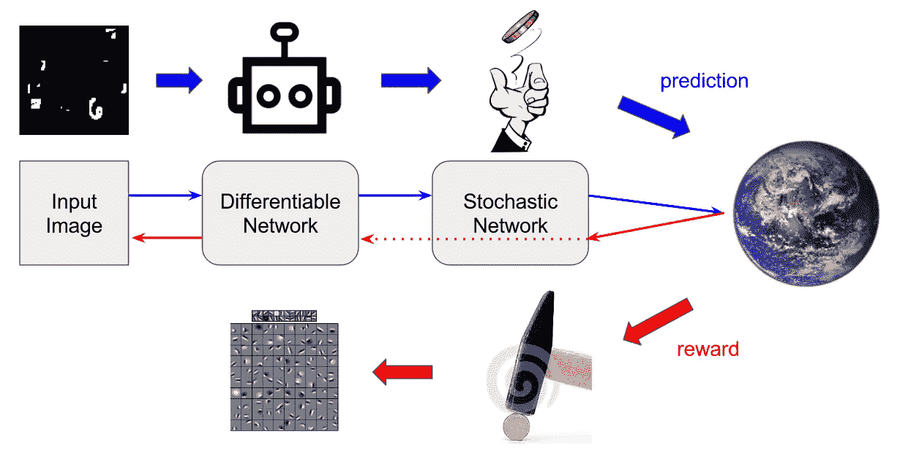

那么如何锤我们的硬币呢？我们来看看政策梯度的推导。假设我们有一个函数 f(x ),它可以告诉我们，如果我们有一个样本点 x，我们会得到多少回报，也就是一个得分/回报函数

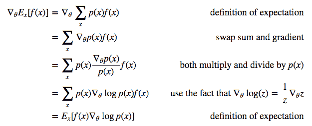

Source: [http://karpathy.github.io/2016/05/31/rl/](http://karpathy.github.io/2016/05/31/rl/)

上面告诉我们，如果我们有一个样本点 x，为了在下一轮有更高的得分，我们应该“锻造”我们硬币的方式是得分函数的梯度方向(方程的左手边)，这与样本点 x 的对数似然最大化的方向相同，具有 f(x)本身的振幅(方程的右手边)。

正式地说，我们“敲打”硬币的方式是增强算法，它代表**RE**ward**I**ncrement =**N**on negative**F**actor times**O**ffset**R**E enforcement times**C**character istic**E**ligility(有人非常努力地拼出“增强”…)。原文参见[6]

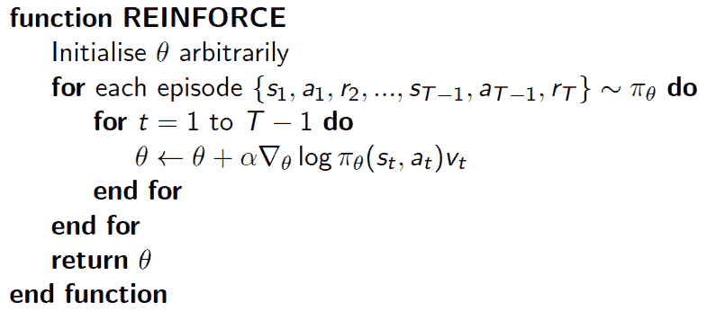

Source: [http://www0.cs.ucl.ac.uk/staff/d.silver/web/Teaching.html](http://www0.cs.ucl.ac.uk/staff/d.silver/web/Teaching.html)

安德烈·卡帕西的博客有一个更好的解释:

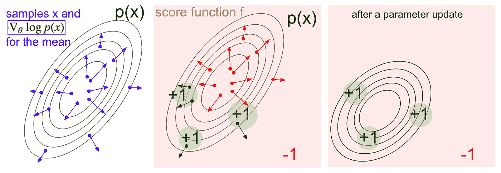

A visualization of the score function gradient estimator. **Left**: A gaussian distribution and a few samples from it (blue dots). On each blue dot we also plot the gradient of the log probability with respect to the gaussian’s mean parameter. The arrow indicates the direction in which the mean of the distribution should be nudged to increase the probability of that sample. **Middle**: Overlay of some score function giving -1 everywhere except +1 in some small regions (note this can be an arbitrary and not necessarily differentiable scalar-valued function). The arrows are now color coded because due to the multiplication in the update we are going to average up all the green arrows, and the *negative* of the red arrows. **Right**: after parameter update, the green arrows and the reversed red arrows nudge us to left and towards the bottom. Samples from this distribution will now have a higher expected score, as desired.

现在我们知道如何计算随机网络的梯度。然而，在实践中，tensorflow 计算图将默认自动计算梯度。因此，为了实现如 REINFORCE 所述的定制梯度更新，有两种方法可以做到:
(1)设置`tf.stop_gradient`将梯度直接传递到可微分网络，然后使用混合损失函数仅训练可微分网络作为近似。这里的论点是，由于我们固定了高斯分布的 std，并且仅试图“学习”均值作为分布参数，所以锤打硬币本身将大致等同于锤打我们的可微分网络参数，以便从可微分网络发出我们期望的均值。参考[本回购](https://github.com/zhongwen/RAM)和[本回购](https://github.com/jlindsey15/RAM)
(2)用优化器构建一个单独的计算图，并使用`tf.gradients`具体计算所需的梯度 w.r.t 相关参数，然后使用`optimizer.apply_gradients`仅更新这些参数。参考[本回购](https://github.com/yanji84/deep-recurrent-attention-model)

T***raining Methodology***
作为上面讨论的实现细节，在本练习中，在实现中使用了混合损耗，方法(1)如上。

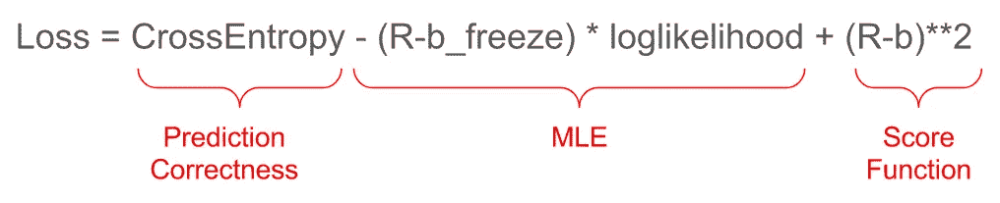

R = actual reward, b = score function, b_freeze = tf.stop_gradients(b)

由于 plus gate 在反向传播过程中充当梯度分配器，因此我们仅使用以下 3 个具有相同权重的目标来有效地优化我们的可微分网络:(1)用于预测正确性的交叉熵(2)用于回归最优μ作为随机网络的参数输入的 MLE)用于将分数函数回归到实际回报的分数函数(因此分数函数更准确)。

另一个技巧是蒙特卡罗抽样。由于我们在网络中有随机过程，我们可以复制相同的图像 10 次(由于随机性，这将产生 10 个略有不同的结果)，然后将它们平均作为我们对训练和测试的预测。

训练参数如下所示。只比较了两种情况。

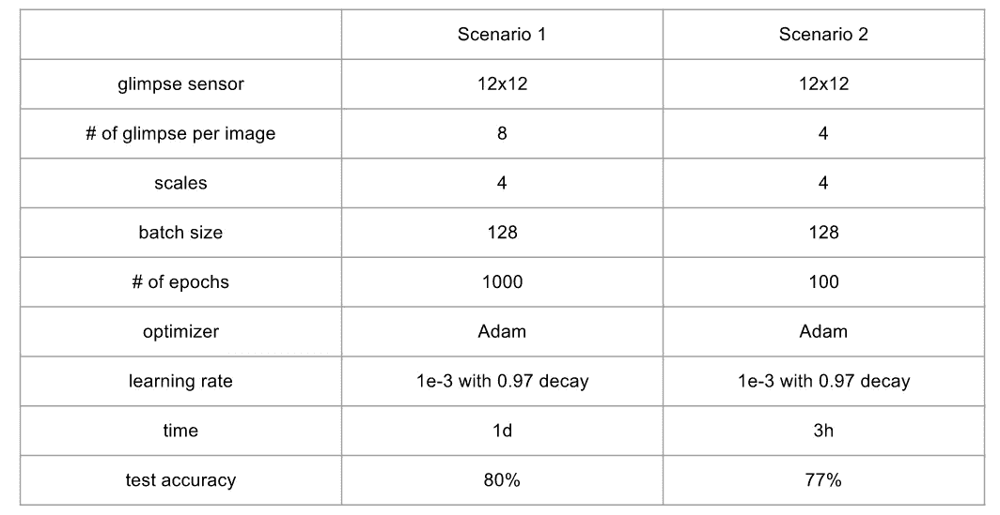

培训动态如下所示。上表中的训练时间是使用 Tesla K80 GPU 服务器进行基准测试的。训练准确率(每批平均)稳定在 80%，最终一次测试准确率为 **79.68%** ，与基准方法 **50%** 相比有显著提高。

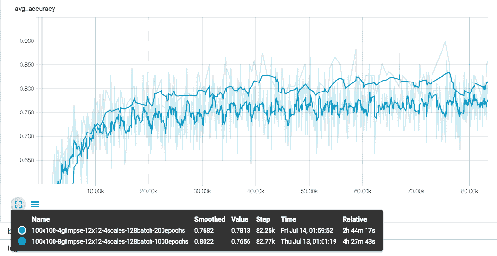

L ***仿*** 本节讨论的 RAM 方法的局限性包括:

(1) Glimpse 传感器使用扁平化+致密层。对于 MNIST 特征可能是足够的，然而，为了适合真实世界的图像，可以使用卷积层

(2)递归网络使用单层 RNN 单元。这个 RNN 细胞应该学习图像特征(为了预测数字标签)和位置特征(为了预测下一个扫视位置)。这种责任混合可能会导致一些内部问题。

(3)在展开 RNN 的初始步骤，位置网络随机选择一个位置聚焦其扫视作为起点。这可以改进为具有“更少的随机”开始。

谷歌在参考文献[3]中发表的后续论文解决了上述所有限制。本文将在下一节中作为处理 SVHN 数据集的目标架构进行讨论。

# SVHN 数据集

SVHN 数据集是真实世界的街景门牌号数据集。如下图所示:

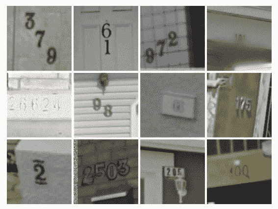

source: reference [1] paper

在 SVHN 数据集中，提供了以下信息:
(1)位数的长度
(2)每个位数
(3)位数的最大长度是 5

SVHN 数据集是我们的增强 MNIST 数据集挑战的扩展，从某种意义上说:
(1)图像中有噪声和模糊效果
(2)有数字的转换
(3)在我们的增强 MNIST 数据集中，它是有序的数字序列，而不是单个数字

## ***数据预处理***

对于图像，进行以下预处理:

*   从训练(和测试)数据中获取边界框位置
*   裁剪边界框的联合，以便将图像缩小到最大
*   调整到 32x32
*   转换为灰度
*   在[0，1]之间归一化

下图显示了一个示例图像:

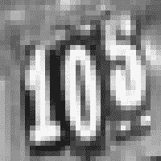

对于标签，进行以下预处理:

*   0–9 代表数字，10 代表结束标记(或空标记，如果有多个)
*   将最大序列长度设置为 5
*   使用结束/空标记 10 填充
*   丢弃长度超过 5 位数的数据

例如，上面的图像标签将是:`[1, 0, 5, 10, 10]`

## ***简介***

研究了以下两种方法。

**(1)一种“仅 CNN”的方法**。主要思想是同时查看多个数字，并且如果该数字丢失，目标是以固定长度的数字顺序用空白填充来“分类”数字序列。这一思想借用了文献[1]中发表的论文。然而，为了快速建立比较基准，实现在一定程度上不同于本文。

**(2)一种“RNN + CNN”的深度循环注意模式方法**。其主要思想是引入深度视觉注意模型(DRAM ),参考文献[3]以扩展他们先前工作[2]中的循环注意模型(RAM)。其中提出了两层 LSTM 来分离扫视位置预测和图像特征处理。

## 基线方法:仅 CNN

***问题描述*** 门牌号转写问题有以下几个因素需要我们注意:

1.  存在多个数字(我们需要识别所有数字)
2.  所有的数字都是有序的(我们需要识别序列)
3.  有一个特定长度的数字序列(序列的长度不同)

设 P 表示概率，S 表示输出数字序列，L 表示数字序列的长度，X 表示输入图像数据。我们的目标可以解释为最大化以下内容:

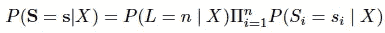

在测试时，我们的预测是上述模型的 argmax:

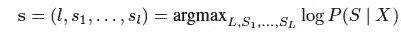

这个模型包含了上面提到的所有 3 个因素。在本练习中，为了快速形成基线，实施了上述模型的一个小变化，但仍保留了以下 3 个因素:

1.  长度大于 5 的门牌号将被丢弃
2.  该模型将 5 个数字按顺序分类，每个数字的范围从 0 到 10。0–9 代表数字，10 代表空白填充。例如，门牌号“258”将导致正确的标签序列`[2,5,8,10,10]`
3.  没有使用长度，因为空白填充意味着长度信息

***方法*** 本练习采用的总体思路是在架构上有两个网络:卷积网络和分类网络。

卷积网络用于从馈送图像中提取门牌号数字的特征，然后是分类网络，该分类网络使用 5 个独立的密集层来共同分类 5 个数字的有序序列，其中 0–9 表示数字，10 表示空白填充。

我们期望分类网络通过反向传播来学习数字布局的空间信息，使得每个密集层分别只拾取序列中的一个数字。

***网络架构*** 原论文采用 8 卷积层的网络架构。在本练习中，为了快速形成基线，使用了一个更简单的网络(同时仍保留图层类型)，如下所示:

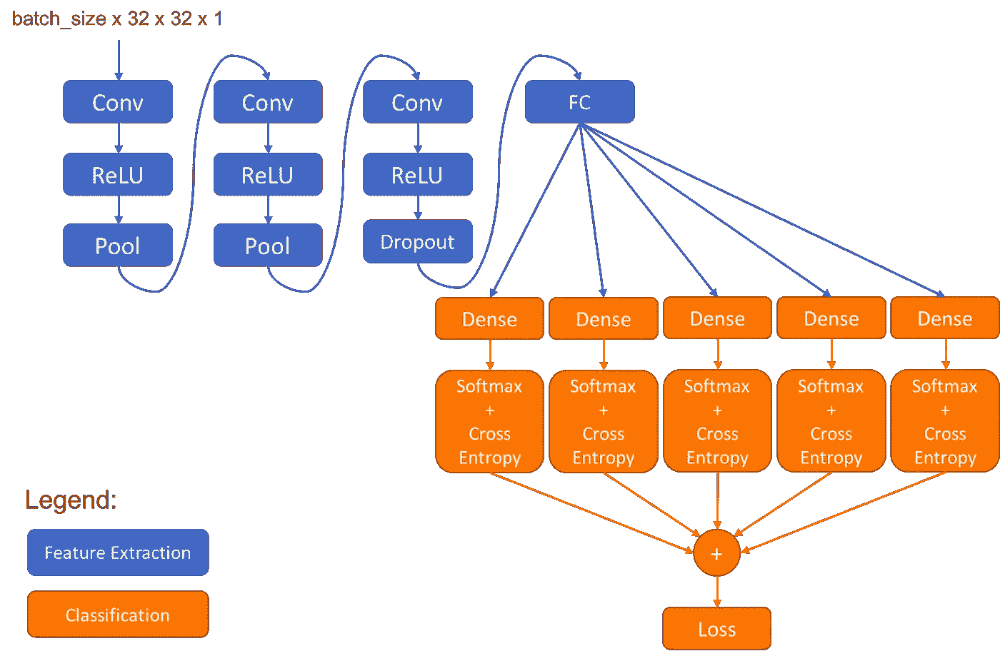

请注意，在分类网络中，5 个独立的密集层负责将现有要素分类为 0-10 类标签，其中 0-9 表示数字标签，10 表示空白填充。

***训练方法*** 本文在 SVHN 数据集上取得了 96.03%的转录准确率，模型性能最好。在本练习中，随着模型、图像预处理和网络架构的变化，准确率达到了 87.64%，参见[本文](https://github.com/ritchieng/NumNum/blob/master/NumNum/report/report.pdf)

***限制*** 理想情况下，图像预处理步骤应仅适用于训练数据(例如，裁剪掉边界框的并集)，其中保持验证/测试数据不变。然而，在实施中，参考[本报告](https://github.com/ritchieng/NumNum/)，验证/测试数据也在边界框周围裁剪。原始论文提到在图像预处理阶段首先定位数字周围的包围盒矩形。然而，它没有提到执行这种定位的确切方法。

**TODO** :或者，仅使用裁剪训练数据执行另一个基准

## 目标方法:深度循环注意模型(DRAM)

除了以前在循环注意模型(RAM)中的工作，让我们扩展以修复限制并应用于 SVHN 数据集。这个想法被称为深度循环注意模型(DRAM)。

***架构*** DRAM 的架构与 RAM 类似，除了:

*   位置网络→发射网络
*   提出了两层 RNN 单元:专用于预测下一个扫视位置位置 RNN(表示为 r 上标 2)，以及专用于预测数字标签的分类 RNN(表示为 r 上标 1)。
*   引入上下文网络，利用下采样的粗糙图像设置位置 RNN 的隐藏状态。想法是将图像的一般上下文馈送到位置 RNN，以便它生成对聚焦扫视的第一位置的良好猜测(与 RAM 方法中开始的随机位置相比)。

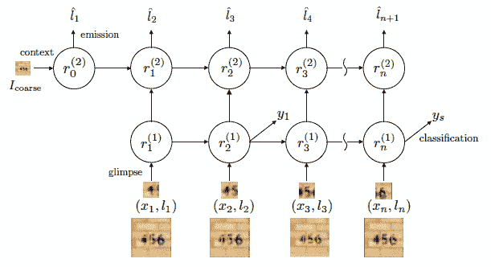

***顺序分类*** 为了扩展 RAM 的思想并申请顺序分类，提出了以下工作。

M ***onte Carlo 采样*** 它与 RAM 的想法相同，通过多次复制相同的图像，然后取平均值作为预测(文中提到的取对数平均值给出最佳性能)

C 通过这种方式，网络将更专注于对具有迫近误差的有序序列进行分类。

A ***累积奖励*** 为了简化多对象分类，使用累积奖励，即与正确预测的标签成比例的奖励。

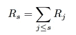

S ***序列对数似然*** 序列对数似然呈现在以下目标函数中:

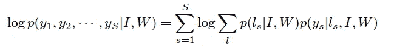

该目标函数是 MLE，其合并了来自发射网络(与 RAM 中的位置网络相同)的位置概率和来自分类网络(与 RAM 中的动作网络相同)的分类概率。

F 这里的解决方案是采用相同的训练数据，但让网络预测数字的反向序列，然后取平均值作为最终预测。这种方法提高了准确性。

***结果*** DRAM 在这个练习中没有实现(至少没有成功)。

A***ccuracy*** 参考论文，下表报告了 DRAM 在 SVHN 数据集上的准确率:

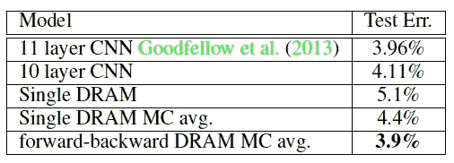

相对于我们的 11 层 CNN 的基线方法(3.96%的错误率)，这不是一个显著的改进(3.9%的错误率)。然而，这种改进更多的是在计算开销上。

C ***计算成本*** 计算成本如下图所示:

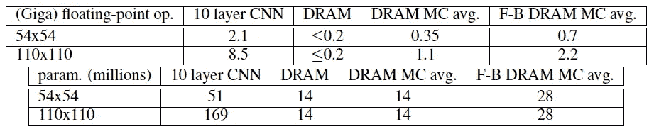

正如所观察到的，就所使用的参数数量和浮点操作数量而言，DRAM 明显更好，这是因为它采用了用于视觉注意力的一瞥的想法。

# 还有一件事:空间变压器网络

我觉得有义务提一下这篇论文(太受欢迎就不提了)。它以一种全新的不同方式解决这个问题。这个想法不是使用“硬”注意力，远离强化学习，而是建立一个完全可区分的“软”注意力模型。详情请参考文献[5]。

直觉是，既然注意力都是关于选择性地裁剪图像的一部分作为“注意力”，为什么不使用仿射变换，它以完全可微分的方式处理裁剪、平移、旋转、(各向同性)缩放和倾斜。神经网络需要做的唯一事情是学习这些仿射变换参数。因此，下图展示了一个很酷的想法。

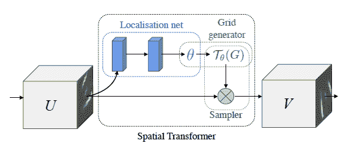

u 是我们的原始输入图像。它首先被传递到定位网络，定位网络是具有可学习参数θ的仿射变换，例如如下所示。

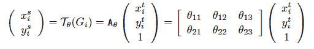

然后，采样器将对变换图像的输出进行采样，以提供原始输入图像的“校正和调整大小”版本。通常，采样过程是双线性插值，这也是一个可微分的过程，如下所示。

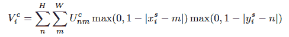

这样，原始图像将被仿射变换(或处理)成校正后的输出图像，如下所示:

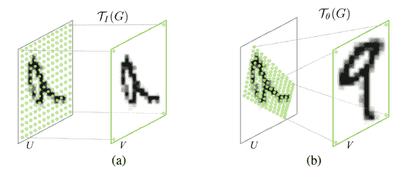

[这个视频](https://goo.gl/qdEhUu)展示了空间转换器的效果，令人印象深刻。

# 结论

总之，我们已经讨论了以下方法来解决增广的 MNIST 和 SVHN 问题:

对于 MNIST:
(1)使用经典的 2 层 CNN，参考 keras 例子
(2)使用“硬”注意力模型 RAM，参考论文【2】

对于 SVHN:
(1)使用 11 层 CNN，参考文献[1]
(2)使用 DRAM 作为 RAM 的扩展，参考文献[3]

最后但同样重要的是，空间转换网络，作为“软”注意力解决方案

# 关于数据集

## MNIST

原始的 MNIST 数据集可以从这里获得:[http://yann.lecun.com/exdb/mnist/](http://yann.lecun.com/exdb/mnist/)

## SVHN

谷歌街景门牌号图片(SVHN)，可从这里获得:[http://ufldl.stanford.edu/housenumbers/](http://ufldl.stanford.edu/housenumbers/)

*   10 类，每个数字一类。数字“1”的标签为 1，“9”的标签为 9，“0”的标签为 10。
*   73257 位用于训练，26032 位用于测试，以及 531131 个额外的、难度稍低的样本，用作额外的训练数据

# 参考

[1]使用深度卷积神经网络从街景图像中识别多位数。Ian J. Goodfellow、Yaroslav Bulatov、Julian Ibarz、Sacha Arnoud 和 Vinay Shet (2013 年)。[https://arxiv.org/abs/1312.6082](https://arxiv.org/abs/1312.6082)

[2]视觉注意的循环模型，沃洛季米尔·姆尼，尼古拉斯·赫斯，亚历克斯·格雷夫斯，科雷·卡武克库奥卢，[https://arxiv.org/abs/1406.6247](https://arxiv.org/abs/1406.6247)

[3]视觉注意下的多物体识别，吉米·巴，沃洛季米尔·姆尼，柯雷·卡武克库奥格鲁，

[4]用无监督的特征学习读取自然图像中的数字，尤瓦尔·内策尔、王涛、亚当·科茨、亚历山德罗·比萨科、吴波、安德鲁·y·Ng 在 2011 年 NIPS 深度学习和无监督的特征学习研讨会上发表。[http://ufldl . Stanford . edu/house numbers/nips 2011 _ house numbers . pdf](http://ufldl.stanford.edu/housenumbers/nips2011_housenumbers.pdf)

[5]空间变换网络，[马克斯·贾德伯格](https://arxiv.org/find/cs/1/au:+Jaderberg_M/0/1/0/all/0/1)，[卡伦·西蒙扬](https://arxiv.org/find/cs/1/au:+Simonyan_K/0/1/0/all/0/1)，[安德鲁·齐塞曼](https://arxiv.org/find/cs/1/au:+Zisserman_A/0/1/0/all/0/1)，[科雷·卡武科库格卢](https://arxiv.org/find/cs/1/au:+Kavukcuoglu_K/0/1/0/all/0/1)，[https://arxiv.org/abs/1506.02025](https://arxiv.org/abs/1506.02025)

[6]联结主义强化学习的简单统计梯度跟踪算法，Williams 等，[http://www-anw . cs . umass . edu/~ barto/courses/cs 687/Williams 92 Simple . pdf](http://www-anw.cs.umass.edu/~barto/courses/cs687/williams92simple.pdf)

[7] [Github 回购](https://github.com/tianyu-tristan/Visual-Attention-Model)