# 可视通信

> 原文：<https://towardsdatascience.com/visual-communication-4f674699cb69?source=collection_archive---------26----------------------->


视觉传达是一个可以在不同领域听到的术语。这也是我们理解数据世界的主要技能。但是它实际上是如何工作的呢？我们生活在信息时代，被成堆的数据所包围，但我们需要翻译这些数据的能力，以便每个人都能理解。当您开始进行更详细的分析时，探索您的数据可以为您节省大量时间。通过图形可视化数据是快速探索和产生未来分析想法的好方法。

探索数据应该是任何分析的第一步，它包括汇总、可视化和对数据集中记录级细节的评估。为此，我将使用开源工具: *python* 、 *Numpy* (科学计算)、 *pandas* (数据操作)使 python 可用于数据分析、*matplotlib*/*seaborn*(制作图形)。

**我们来探究一些实际数据。**

[https://www . ka ggle . com/Megan risdal/la-county-restaurant-inspections-and-violations/home](https://www.kaggle.com/meganrisdal/la-county-restaurant-inspections-and-violations/home)

这是来自 kaggle 的洛杉矶县餐馆检查和违规数据集。

**背景:**洛杉矶县的餐馆和市场定期接受卫生法规违规检查。根据卫生部的说法，严重的违规行为会导致食物污染或疾病。一些严重的违规行为，如厨房里的啮齿动物，往往会引起公众的警觉，而一些违规行为，如错误的食物温度或未标记的清洁化学品，最容易开始传播食源性疾病。

在开始之前，最好在头脑中有一些问题和假设。

所以我们有两个文件:inspections.csv 和 violations.csv。

**违规:**该数据集包含洛杉矶县餐馆和市场的环境卫生违规。洛杉矶县环境卫生部门负责检查所有未合并地区和该县 88 个城市中的 85 个城市的食品违规行为。

**检查:**该数据集包含洛杉矶县餐馆和市场的环境健康检查结果。

我希望找到最有可能出现严重违规的食品机构，以便首先检查它们，并让关心的人避开它们。为此，我们需要计算完整检查的数量，并探索风险水平。

**设置图书馆:**

```
import numpy as np 
import pandas as pd 
import seaborn as sns
import plotly.plotly  as py
import matplotlib.pyplot as plt
```

要获得数据集的第一个视图，我们可以使用以下 pandas 命令:

*   df.describe()
*   df.head() #显示了几行
*   df.shape()
*   df.columns() #列名
*   df.info() #数据类型

**inspections.info()** 的输出应该是这样的:

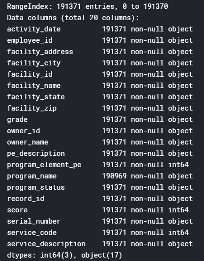

在这里，我们可以看到数据集中有多少行，具有给定的 20 列数据类型的名称，以及关于空值的信息。Inspections.csv 不包含任何空值，这在现实生活中很少见。通常情况下，数据需要一些清理和转换。

正如所定义的，让我们按检验日期探究食品检验的次数。使用来自 **inspections.info()** 的信息，我们可以看到 *activity_date* 列的数据类型为“object ”,但是由于我们想要查看时间序列数据，我们需要将其更改为 dateTime。因此，下一步是创建一个数据框架，我们可以在其中计算每天的检查量，并创建一个时间序列数据图。

```
# groupby activity_day to create new column with the name count
count_ins = inspections.groupby(['activity_date']).size().reset_index(name='count')
x = pd.DataFrame(count_ins['activity_date'])
y = pd.DataFrame(count_ins['count'])# create separate df 
timePlot = pd.concat([x,y], axis=1)# change data type 'object' to 'dateTime'
timePlot.activity_date = pd.to_datetime(timePlot.activity_date)
timePlot.set_index('activity_date', inplace=True)# show the first 10 raws, what we get
timePlot.head(10)
```

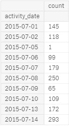

确保在设置数据帧`timePlot`的索引时包含`inplace`参数，以便实际修改原始索引并将其设置为`'activity_date'`列

我们还可以找到最小/最大日期，因此我们可以定义执行检查的确切时间段。

```
inspections.activity_date.max()
'2017-12-29'
inspections.activity_date.min()
'2015-07-01'
```

现在我们有了一切可以在图中形象化的东西:

```
timePlot.plot.area(figsize=(20,6), linewidth=5, fontsize=15, stacked=False)
plt.xlabel('Activity Date', fontsize=15)
```

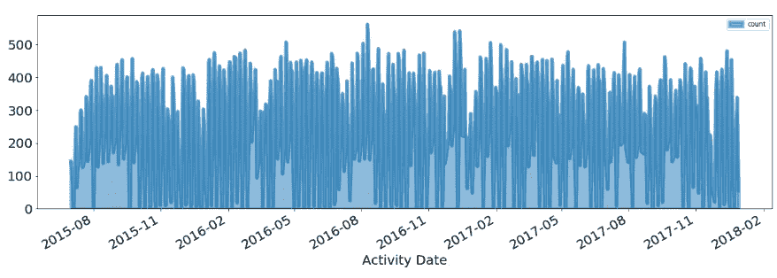

**Number of Food Inspections by Inspection Date**

鉴于检查员必须完成大量的检查，发现严重违规行为所花费的时间和精力可能意味着在一些食品企业长期暴露在潜在的疾病和不卫生的条件下。

从这张图表中，你可以立即开始思考一些问题，以便进一步分析:

每个检验员执行多少次检验？一个月中是否有增加或减少检查的时间？

现在只看检查员检查平均值就足够了:

```
count_id = inspections.groupby(['employee_id']).size().reset_index(name='count')
x = pd.DataFrame(count_id['employee_id'])
y = pd.DataFrame(count_id['count'])
count_id = pd.concat([x,y], axis=1)
count_id['count'].describe()
```

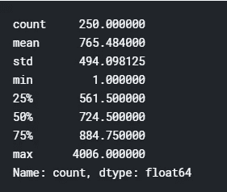

我们在这里可以看到，有 250 个不同的检查员，他们的“雇员 id”和平均值是:在给定的时间内，每个检查员大约检查 765 次。

我们调查的下一步是找到最严重违规的食品企业，这些企业需要长期特别关注。我们有 18 种不同的风险等级。从下面的柱状图可以看出，最大的群体是餐馆高风险等级。

```
*# Number of Food Inspections by Risk*sns.set(rc={'figure.figsize':(14.7,8.27)}) # set size for a chartg = sns.countplot(x="pe_description", data=inspections, order = inspections['pe_description'].value_counts().index, palette="Blues_d")
g.set_xticklabels(g.get_xticklabels(),rotation=90)
g.tick_params(labelsize=10)
```

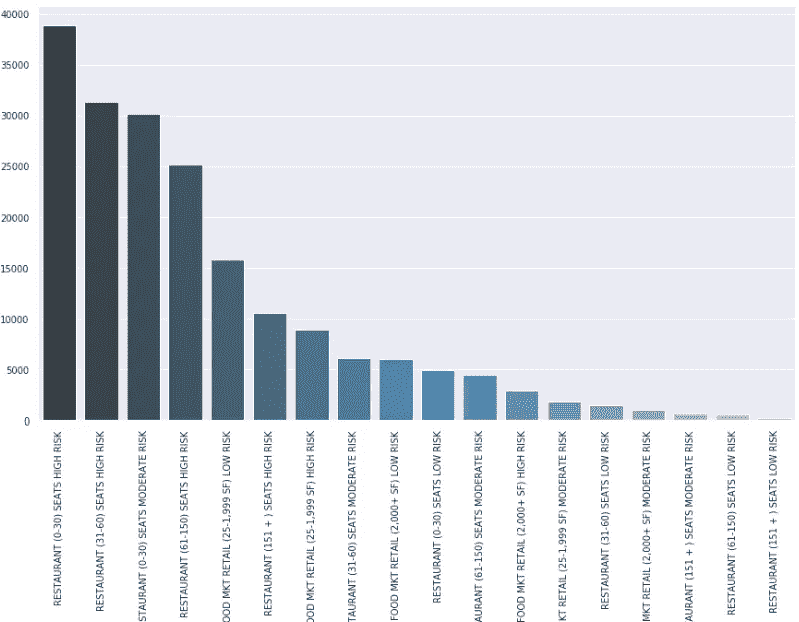

**Number of Food Inspections by Risk (sorted by count):**

让我们来定义餐厅(0-30)座位风险高的前 20 家餐厅。

```
rsk = inspections.loc[inspections['pe_description'] == "RESTAURANT (0-30) SEATS HIGH RISK"]
pd.crosstab(index=rsk['facility_name'], columns='count').sort_values(by=['count'],ascending=False).head(20)
```

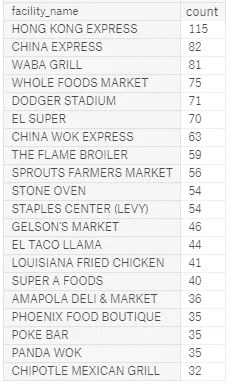

要查看整个高级别风险组，我们需要创建一个新要素，该要素仅包含餐馆和食品市场的风险级别。我们有三组级别:高、中、低。

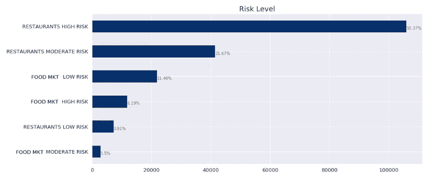

**55.37%**的检查是针对高风险餐厅的。

为了得到这个图表，我做了以下工作:

```
# new feature: risk_level
inspections['risk_level'] = inspections['pe_description'].apply(lambda x: x.split(")")[1])
```

制作图表:

```
# replace SEATS with RESTAURANT to make it clearinspections['risk_level'] = inspections['risk_level'].str.replace('SEATS', 'RESTAURANTS')

ax = inspections['risk_level'].value_counts().plot(kind='barh',colormap='Blues_r', figsize=(15,7), fontsize=13);
ax.set_alpha(0.5)
ax.set_title("Risk Level", fontsize=18)
totals = []

*# find the values and append to list*
for i **in** ax.patches:
    totals.append(i.get_width())

*# set individual bar lables using above list*
total = sum(totals)

*# set individual bar lables using above list*
for i **in** ax.patches:
    *# get_width pulls left or right; get_y pushes up or down*
    ax.text(i.get_width()+.3, i.get_y()+.38, \
            str(round((i.get_width()/total)*100, 2))+'%', fontsize=10, color='dimgrey')

*# invert for largest on top* 
ax.invert_yaxis()
```

在下一个条形图中，我们可以看到检查数量最高的食品企业:

```
inspections['facility_name'].value_counts().nlargest(20).plot(kind="bar", figsize=(15, 6), fontsize=12, colormap='Blues_r')
```

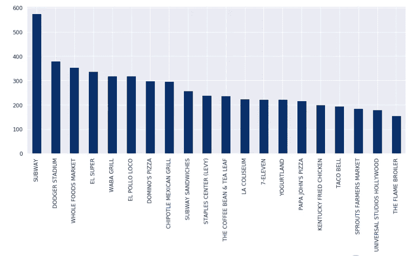

The top 20 Food Establishments (sorted by count of inspections)

地铁检查量最高。让我们调查一下风险水平。

```
subway = inspections.loc[inspections['facility_name'] == 'SUBWAY']
pd.crosstab(index=subway['risk_level'], columns='count').sort_values(by=['count'],ascending=False)
```

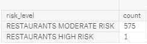

Risk Level for Subway

正如我们所看到的，赛百味只有中度风险。

现在，如何可视化风险级别组和食品机构检查已经足够清楚了。让我们继续讨论健康法规。

我想看到十大违反卫生法规的描述。我们可以在水平视图中使用条形图来查看前 10 个代码描述。为此，我们需要合并两个数据集。

```
df_merge = inspections.merge(right=violations.reset_index(), how='left', on='serial_number', suffixes=('', '_codes_'))# create a plot using seaborn
sns.set(rc={'figure.figsize':(14.7,10.27)})
top10 = sns.countplot(y="violation_description", data=df_merge, order = df_merge['violation_description'].value_counts().nlargest(10).index, palette="Blues_d")
top10.tick_params(labelsize=20)
```

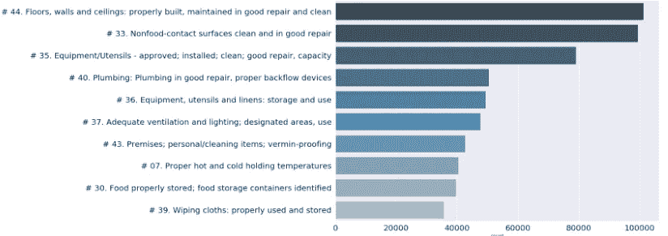

排名第一的健康准则是№44 层楼、墙和天花板:正确建造，保持良好的维修和清洁。我想说，这是意料之中的事。

在这篇文章中，我最不想看到的是按邮政编码排列的食品检验数量。

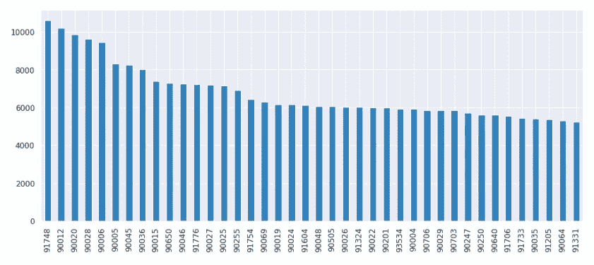

Number of Food Inspections by Zip

**结论:**

我完成了第一阶段的探索。在对数据集进行简要分析后。我们发现，在洛杉矶县有持续的检查，检查食品企业是否违反卫生法规。不同的违法行为反映了对公众健康和安全的不同程度的风险。从 2015 年 7 月 1 日到 2017 年 12 月 29 日，共进行了 191371 次检查，其中 55.37%为高风险级别。我们还创建了一份清单，列出了检查次数和检查风险水平最高的食品企业。除此之外，我们还有 10 大代码描述和今天遇到它们的概率。

对于探索性数据分析、数据收集和处理，需要记住以下几点:

*   这可能会占用数据科学家 80%的时间
*   这是从数据语言到人类语言的转换
*   这是一种分析数据集以总结其主要特征的方法
*   它应该为您提供一个新问题列表，以探索您的数据集。

祝你胃口好。:)