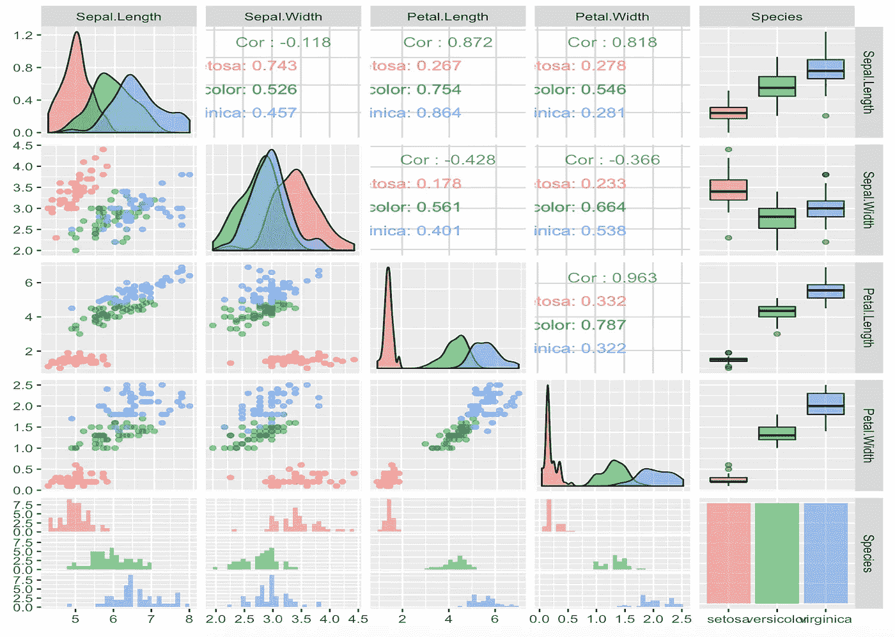
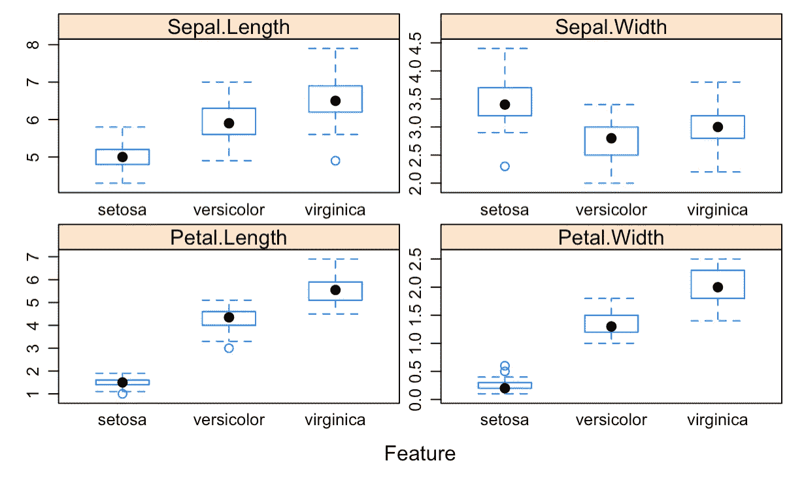

# 数据框可视化概述入门

> 原文：<https://towardsdatascience.com/visual-overview-of-the-data-frame-4c6186a69697?source=collection_archive---------5----------------------->

数据可视化不仅是在清理数据后分析数据和交流结果的一种方式，也是在初始阶段理解整个数据框架的一种方式。在这里，我举例说明了 3 个简单的方法(每个方法 2 行代码),用于可视化地探索整个数据帧的组成、相关性和分布。

**ggpairs**

ggpairs 将绘制变量矩阵，并根据它们是分类的还是数字的来使用合适的视觉类型。

```
library(GGally)
ggpairs(iris, aes(colour = Species, alpha = 0.4))
```



**特色剧情**

插入符号中的特征图可以在方框/密度图中单独绘制每个变量的网格，或者在散点图矩阵中成对绘制。

```
library(caret)
featurePlot(x=iris[,1:4], y=iris[,5], plot="box", scales=list(x=list(relation="free"), y=list(relation="free")), auto.key=list(columns=3))
```



**表格图**

Tableplot 将绘制每个变量的表格。对于范畴来说，这是探索其构成的好方法。如果存在缺失值，它也会显示出来。

```
library(tabplot)
tableplot(iris)
```


这些方法更适用于少于 10 维的数据帧，其中的列主要不是自由文本，因为它们可以相对容易地可视化数字和分类变量。探索更多适合不同类型的数据框架(重文本、高维)的方法。

这是我第 100 天项目的第 6 天。