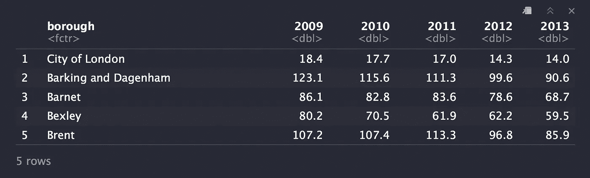
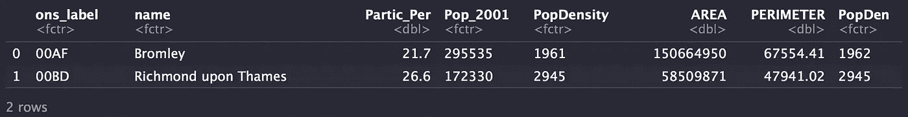
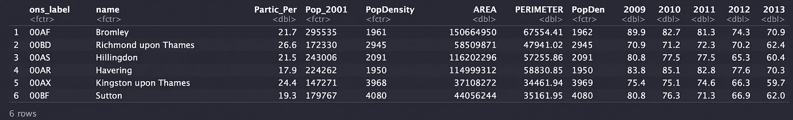
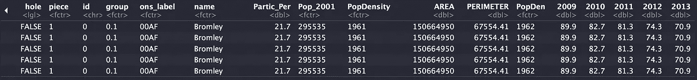
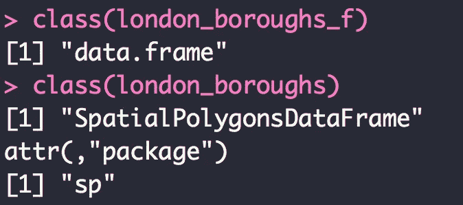
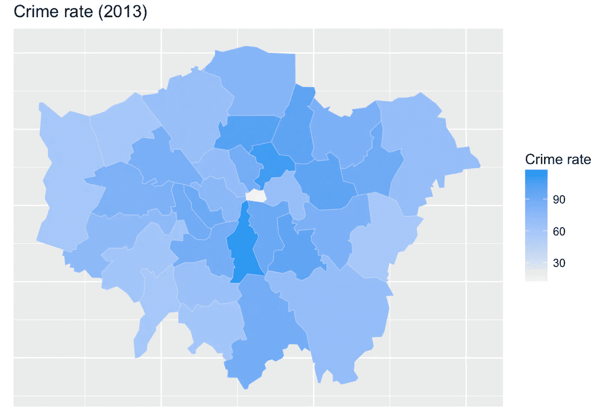
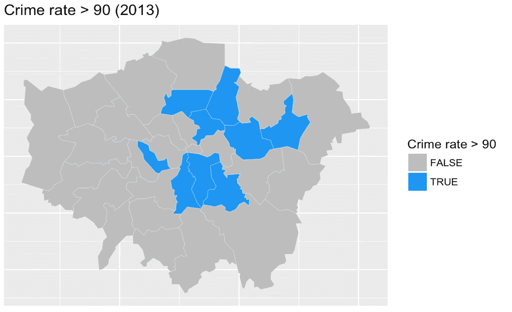

# 用 R 视觉化伦敦的犯罪(上)

> 原文：<https://towardsdatascience.com/visualising-crime-in-london-using-r-part-i-de7853c92ba8?source=collection_archive---------3----------------------->

我最近在使用 r 可视化伦敦犯罪的时间序列数据。我忍不住创建了地图，让我可以更好地分析数据。

我创建本教程是为了:

1.  有一个用 R 绘制地图的简单例子
2.  展示在地图中可视化数据的优势，以便更容易地识别模式和趋势。

在本教程中，您将学习如何使用`SpatialPolygonsDataFrame`访问绘制行政区所需的数据，以及如何使用`ggplot2`创建相应的地图。

本教程的代码和数据可以在 github 链接[上找到。](https://github.com/valeria-io/crime_london_map)

# 访问数据

## 犯罪数据

本教程中使用的数据集来自[伦敦数据存储库](https://data.london.gov.uk/dataset/london-ward-well-being-scores)，这是一个开放的数据共享平台，其统计数据由伦敦市长办公室提供。为了使教程简单，我只包含了一个名为`crime_data.csv`的 CSV 文件，其中只包含绘制犯罪率所需的数据。

上面的代码加载犯罪数据并更改标题的名称。它将显示以下内容:



## 行政区的空间数据

你现在需要使用`readOGR`来加载`LondonBoroughs.shp`。

`LondonBoroughs.shp`是项目的‘Map _ data’文件夹中的 shapefile。您会注意到几个名为“LondonBoroughs”的文件具有不同的文件扩展名。你需要它们，因为 shapefile 是由许多不同的文件组成的。prj，。dbf 和. shp。

`readOGR`将简单地提取 shapefile 中的信息。

上面的代码将显示以下数据:



## 将犯罪数据与空间数据联系起来

既然您已经有了两个数据集，那么您需要将它们链接在一起。为此，您只需使用`left_join`并将`name`和`bourough`用作 id。

运行代码后，您会注意到两个数据集现在已经链接在一起:



## 将空间数据转换为数据帧

准备好数据的最后一步是使用`fortify`将其转换成数据帧。这是必需的，因为`ggplot`需要一个数据帧来创建地图。

如果您运行上面的代码，您会看到数据看起来是一样的。唯一的区别是它现在是一个数据帧(注意，您不再需要使用`@data`来查看信息):



*如果你不信任我，就在你的控制台上运行下面的代码，仔细检查你使用的数据类型*:)



Just a test!

# 可视化地图

现在，您已经有了绘制第一批图表的数据。

如下图所示，你需要的只是`ggplot`。使用`fill=`2013``根据列“2013”中的数据创建颜色渐变，这是相应年份每个区的犯罪率。

假设您不需要`long`和`lat`出现在图形中，那么您需要删除轴和记号。

通过运行上面的代码，您应该能够看到您的第一个图表:



如果您想创建一个 GIF 来显示一段时间内的变化，您需要首先以下列方式之一将每年的图表保存为图片:

*   通过使用`ggsave()`(例如:`ggsave("plot_2013.png")`)，或者
*   通过右键单击图表并导出

确保所有图表的图例值保持相同(如果图例发生变化，可能会影响地图的大小)。为此，只需将`limits(0, max_value)`添加到`scale_fill_gradient2`中。在这种情况下，max_value 可以是 140。`scale_fill_gradient2`的最终结果如下所示:

```
scale_fill_gradient2(low = "#BDBDBD",high = "#2196F3", # colors
                        name = "Crime rate", limits = c(0, 140))
```

然后你需要做的就是把这些图片添加到 gif 创建工具中，就像从 [Giphy](https://giphy.com/create/gifmaker) 中得到的一样。最终结果将如下所示:

从上面的图表中，你可以注意到随着时间的推移，所有行政区的犯罪率都下降了。远离市中心的行政区似乎犯罪率最低，而靠近市中心的行政区似乎犯罪率最高。

# 犯罪率最高的行政区

如果您只想给犯罪率高于特定水平(例如 90)的行政区着色，那么您需要做的就是将填充中的值更改为`fill=`2013`>90`。

该图的完整代码如下所示:

结果如下图所示:



Boroughs with crime rates above 90 in 2013

从上面可以看到，2013 年犯罪率在 90 以上的行政区有兰贝斯、哈克尼、哈林盖、纽汉等。

# 下一个教程

在下一个教程中，我将展示如何在一个图表中绘制每年的地图。这真的很容易。

> 我希望你喜欢这个教程❤.
> 
> 如果您有任何问题，请使用下面的评论部分。
> 
> 谢谢！

# 关于作者

我是 Valeria，我热衷于通过美丽的可视化和分析进行数据发现。我希望你喜欢这篇文章！

你可以在 [Twitter](https://twitter.com/ValeriaCortezVD) 和 [Instagram](https://www.instagram.com/valeria.ioo/) 上找到我，或者访问我在 [valeria.io](http://www.valeria.io/) 的页面。