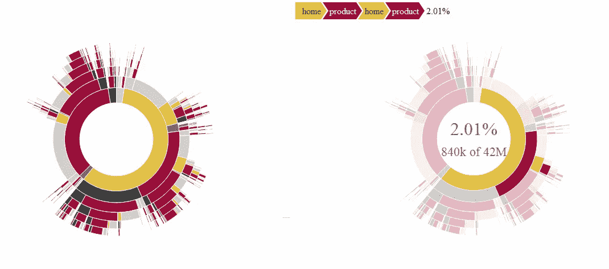
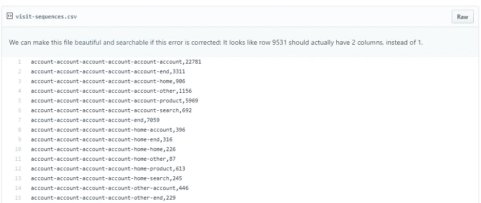
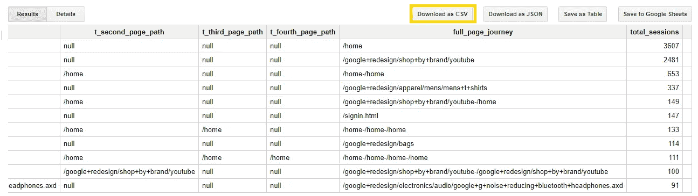
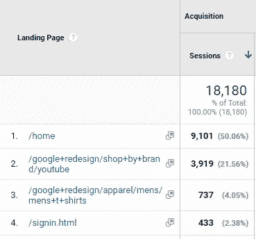
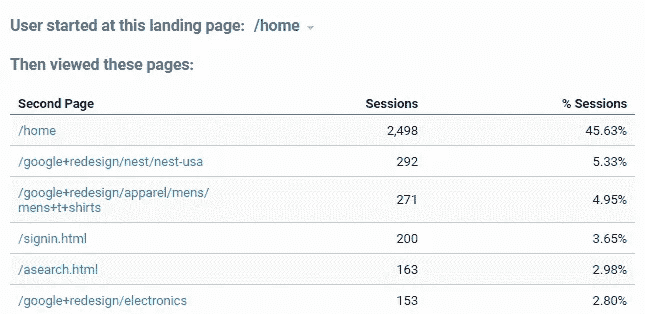
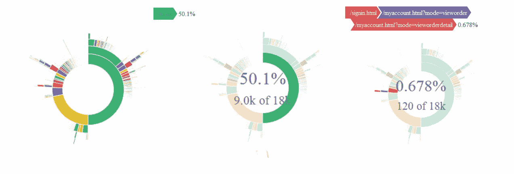
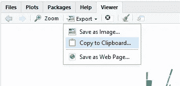

# 用 GA、BigQuery 和 R 可视化用户如何开始他们的网站之旅

> 原文：<https://towardsdatascience.com/visualising-how-users-start-their-journey-on-your-website-with-ga-bigquery-and-r-aa56fa39e386?source=collection_archive---------5----------------------->

帮助你的业务人员了解你的网站或应用程序的用户如何开始他们的旅程是为他们设计最佳体验的关键；从关注哪些登录页面最重要，到在用户初次体验后吸引他们。

数据可视化是向利益相关者传达这一点的有力方式，在这篇文章中，我们将看看如何使用 sunburst d3.js R 包装器来可视化用户在你的网站上浏览的前 4 个页面。要查看 sunburst 的 d3.js 版本，请查看交互式数据可视化[这里](https://bl.ocks.org/kerryrodden/7090426)。

# 第一步——启动并运行 SunburstR

首先，您将使用下面的脚本来获得一个在 r 中运行的示例，它使用了 CRAN 上可用的 sunburstR 包和来自 Kerry Rodden 的 github repo(该包的创建者)的数据集。

**在 2 分钟内创造出这个令人敬畏的互动视觉化…**

**在 R 中运行这段代码…**

**哇塞！**在您继续用自己的数据(更难的部分)尝试之前，看到一些东西与现有的数据集一起工作总是很好的

注意:任何人都可以复制下面的教程，因为它将使用 Bigquery 的公共演示 GA 数据，但是要用您自己的 Google Analytics 数据复制它，您需要有 Google analytics 360(付费版本)来访问 BigQuery 中收集的原始数据和查询数据的权限。

# 步骤 2 —您的数据需要什么格式？

因此，您首先需要了解的是，您的数据需要是什么格式，以便轻松地使用这个包中的 **sunburst()** 函数。

让我们看一看。你会在例子**中看到。csv 下面有两列:**一列是旅程中每页的**，用连字符“-”**分隔，第二列是****导航通过此旅程的会话总数**。**

**例如，在这个样本数据集中，22，781 个访问者在他们的帐户中开始了他们的旅程，并且随后的 5 次页面访问也在帐户页面上。**然后，sunburst 函数将使用这些整数值自动计算每次旅行的用户百分比。****

****

***图片来自【https://gist.github.com/kerryrodden/7090426】***

# ***第 3 步—从 BigQuery 获得这种格式的数据***

***Google 友好地提供了一个 GA Bigquery 数据集样本，完全用于学习和测试目的。了解如何按照本文档[‘Google Analytics Sample dataset for big query’](https://support.google.com/analytics/answer/7586738?hl=en)中的说明设置运行查询，并在 google.bigquery.com 上创建一个帐户***

*****等等……这个样本数据来自哪里？*****

***它来自一个名为[谷歌商品商店](https://shop.googlemerchandisestore.com/?utm_source=Partners&utm_medium=affiliate&utm_campaign=Data%20Share%20Promo)的网站。***

***下面的代码将把你的数据转换成第二步中所有访问你的网站的相同格式。***

*   *****子查询**为会话中的每次命中创建一个带有**行的表。此表包含会话 ID、点击数(点击数是一个页面视图或事件)、点击数、点击数页面路径(即 url)以及点击数之后的 3 个页面路径。它获得了 x7 天的数据(每一天的数据都在它自己的表中)。它只过滤页面浏览量的点击，所以我们忽略所有其他点击类型。*****
*   *****当您对自己的数据集运行下面的查询时，您只需替换子查询中列出的表名。*****
*   *****外部查询**然后从每个会话中选择一行，其中第一次点击是登录页面，然后统计有多少会话在此开始了它们的旅程以及它们的 3 次后续页面查看。**如果有下一页，则 Concact 函数会在该页和下一页之间添加一个连字符。这最后一个专栏“全页之旅”是你将插入到 sunburst 的专栏。*****
*   ***我在多个步骤中构建了这个查询，所以我鼓励您删除外部查询，以了解它是如何工作的。***

*****在 BigQuery 中运行此查询…*****

*****你会得到这样的输出……*****

******

# ***步骤 3 —对您的数据进行质量评估***

***好的，你想知道你的数据是正确的。你可以通过在谷歌分析中查看 2 份报告来回答这个问题。你可以在这里添加谷歌分析账户[，这也是谷歌商品商店的账户。](https://support.google.com/analytics/answer/6367342?hl=en)***

1.  ***登陆页面报告—来自[行为>站点内容>登陆页面](https://analytics.google.com/analytics/web/#/report/content-landing-pages/a54516992w87479473p92320289/_u.date00=20170717&_u.date01=20170723&explorer-table.plotKeys=%5B%5D&_r.drilldown=analytics.landingPagePath:~2Fhome&_r.tabId=explorer/)***

*****通过登录页面匹配检查会话** —要使用登录页面报告对您的数据进行 QA，请删除第 2–8 行和第 34–38 行，这将删除按多条路径分组，以便您只按登录页面分组。运行查询，您的总数应该与这些页面上的会话总数相匹配。***

******

***2.“下一页”报告—在同一页的“入口路径”选项卡下***

*****检查特定页面的“下一页”会话** —在这里，您可以检查特定登录页面移至下一页的会话数是否与 GA UI 和您的查询相匹配。例如，将下面的行添加到您的外部查询中，以查看在登录到“/home”页面后移动到特定页面的会话数。***

***其中 t.page_path = '/home '***

******

*****你的任务完成了！**确保它们匹配或匹配误差很小(在 Bigquery 中采样和定义会话会使其与 GA UI 完全匹配变得很困难)**然后就可以开始了。*****

# ***步骤 4 —以. csv 格式下载***

***这是容易的部分。将表格下载为. csv 格式，并将其保存在合适的地方。“下载”为。csv 按钮在步骤 2 的图像中高亮显示。***

# ***步骤 5-更新您的 R 脚本，从您的。csv 文件并运行***

***调整步骤 1 中的 R 脚本，使其指向您计算机上的新位置(要实现这一点，您可以右键单击您的。csv 文件，然后选择“属性”以获取文件的路径)***

***您根据自己的选择更新配色方案，这就是您将从样本 GA 数据中获得的**输出。*****

******

# ***第六步——分析你的发现***

***所以，你并没有做所有这些艰苦的工作，只是为了创造一个令人惊叹的互动数据，即，在这一点上挑选出你从与你的创作互动中发现的任何有趣的学习。你可以回答一些问题，比如:***

*   ***最重要的登录页面是什么***
*   ***这些页面中第二受欢迎的页面是什么***
*   ***最流行的整页路径是什么(5 步？)***
*   ***大多数离开你网站的用户来自哪里？***

***对所有这些问题的回答将产生讨论点，并引发进一步的探索性分析***

# ***第七步——将你的惊人创造导出为. html 文件，与世界分享***

***很好，您已经有了数据可视化，R 为您提供了一种很好的方式**将您的作品导出为. html 文件**。这意味着你现在不必担心把它托管在一个闪亮的服务器上或一个仪表板上，你的用户仍然可以很容易地与它交互。***

******

***下一步做什么的一些想法:***

*   *****把它放在屏幕上，让你的同事与它互动*****
*   ***通过电子邮件发送给同事***
*   ***如果你有一个闪亮的服务器，你可以把你的小部件添加到一个仪表板上(这篇文章没有涉及)。***

# ***第八步——祝贺自己***

***您已经使用了 BigQuery，R 并接触到了 d3.js 数据可视化的交互性！关于所有这些工具，还有很多需要学习的地方，但一些关键要点是:***

*   ***对于 Google 360 用户来说，在 BigQuery 中访问底层数据允许您以 GA 用户界面中不可能的方式提取和可视化数据。你能回答的问题是无穷无尽的。***
*   ***d3.js 的 R 中的包装器真的很有帮助，因为你不必深入到定制 javascript、html 和 json 的世界来创建可视化；一些友好的灵魂已经为你做了艰苦的工作(如果你遇到任何其他伟大的灵魂，请分享)。然而，为了获得一些关于 d3 的其他可能性的灵感。看这里[https://d3js.org/](https://d3js.org/)***
*   ***如果你认为它看起来像一个饼状图，你很担心——我也有同样的想法。我想说的是，这种可视化的主要目的不是让用户能够在一瞬间理解指标，而是让他们与 it 的互动激发他们的兴趣，以了解更多关于用户如何与你的网站互动的信息，并在你的分析团队中推广可能性的乐趣。***