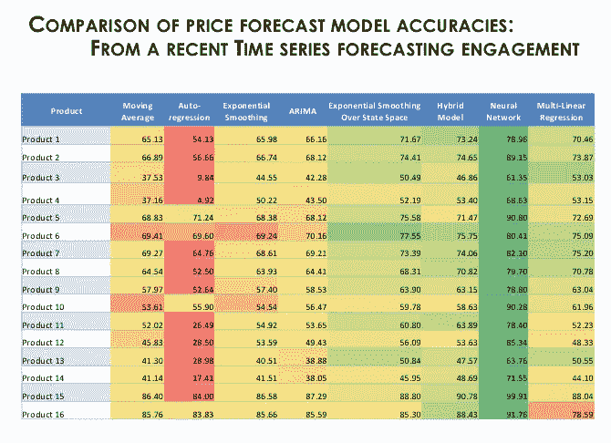
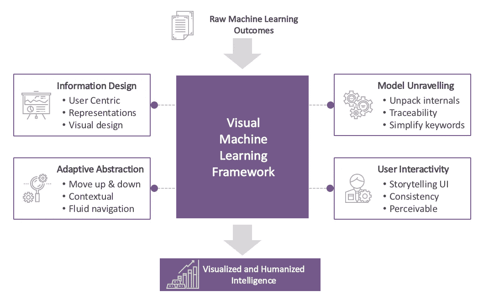
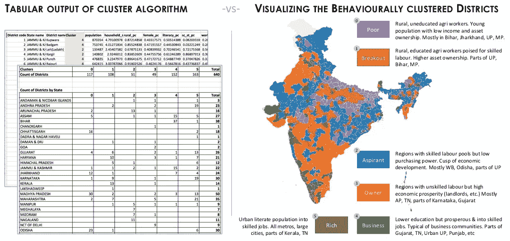
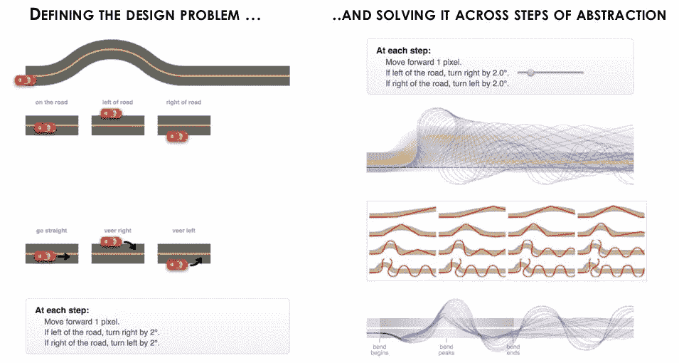
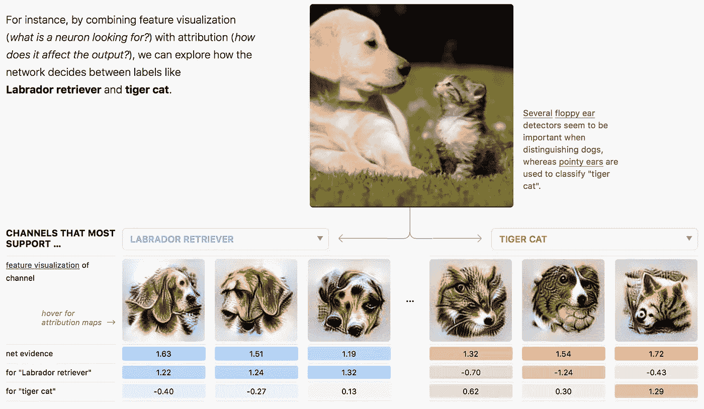
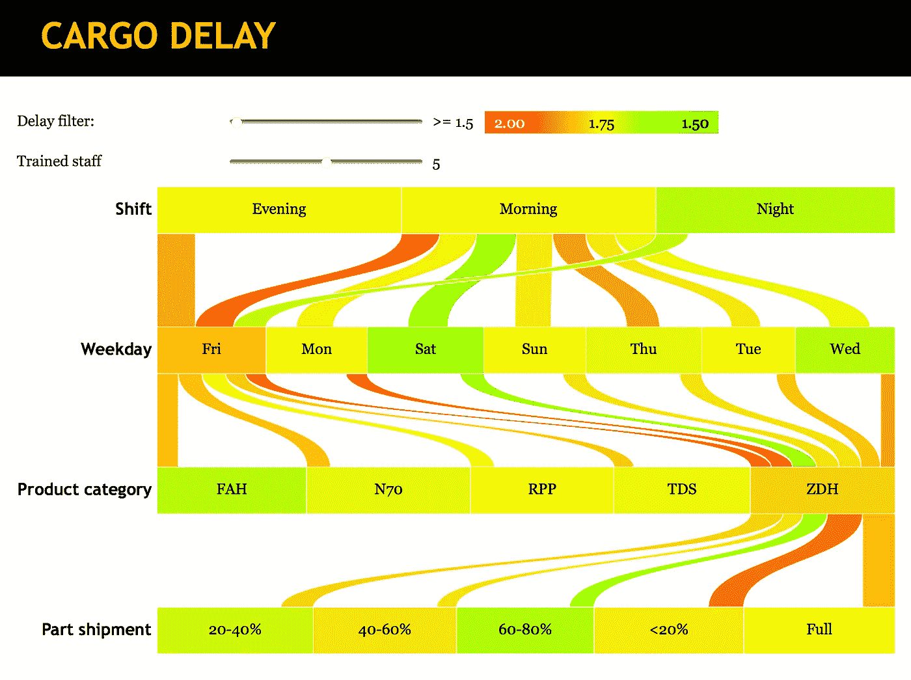

# 可视化机器学习:我们如何使智能人性化？

> 原文：<https://towardsdatascience.com/visualising-machine-learning-how-do-we-humanise-the-intelligence-e62658f1f6df?source=collection_archive---------12----------------------->

Photo by [Jamison McAndie](https://unsplash.com/photos/uf4oyaimWwg?utm_source=unsplash&utm_medium=referral&utm_content=creditCopyText) on [Unsplash](https://unsplash.com/?utm_source=unsplash&utm_medium=referral&utm_content=creditCopyText)

对于数据科学专业人士来说，这是激动人心的时刻。随着分析技术的快速发展，特别是在机器学习、深度学习和人工智能方面，世界各地的研究人员和从业人员已经开始将这些技术应用于影响人类的深度应用。

## 高级分析时代

社交谈话充斥着各种对话，这些对话已经从自动驾驶汽车转变为飞行汽车，从智能机器转变为已经在我们家中安静协作的机器人，从聊天机器人转变为对话式人工智能，这种人工智能正变得无处不在，与环境相关，与人类的反应无法区分。

许多人引以为豪的事实是，作为一个人类，我们已经设法创造了实时智能，一种没有自然进化的智能。随着各学科的进步，我们终于攻克了模拟人类智力的几个难题，并开始在某些领域超越它。

Video synthesis to re-enact politicians using Recurrent neural networks: [University of Washington](http://grail.cs.washington.edu/projects/AudioToObama/siggraph17_obama.pdf)

## 伟大的分析分歧:救赎还是巫术？

有趣的是，在这一点上，世界各地的公众意见也开始出现明显的分歧。在这个光谱的另一端，有人质疑人工智能的存在和意图，不仅就高级分析的可信度，而且就其实用性进行了深入的辩论。

在某种程度上，大多数消费者都有一种恐惧感。对潜在应用领域的乐观描述存在一种诡异的不确定性，人们对其可行性、规模和影响提出了质疑。

> 技术的进步和人们对它产生的原始恐惧感之间有一种联系。—唐·德里罗

在过去的几十年里，技术的快速进步总是伴随着恐惧的升级。虽然早期的技术很复杂，但它是完全理性的。有了深度学习和人工智能，我们再也不能声称这一点，因为它们现在超越了人类逻辑和理解的领域。

## 分析消费的挑战

缺乏基本意识是当今分析学科面临的最大挑战，这比围绕其采用的道德困境排名更高。随着用户对新技术的理解越来越失去控制，围绕其感知效用和采用问题的噪音变得越来越大。

虽然终端消费者对高级分析的大规模采用仍在逐步进行，但这已经是企业面临的一个明确而现实的挑战。尽管他们在数据科学上投入了数百万美元来收集智能见解，但企业面临着来自内部的巨大阻力。

企业项目中最大的挑战不是模型工程或准确性，而是分析应用的实地采用和这些*智能*模型提供的建议的实施。更有甚者，当他们最终违背行业直觉时&直觉。

Model accuracies from a forecasting project, where neural networks outshines other models

## 高精度低接受度的模型

在实施高级分析项目的这些年里，[我们](https://gramener.com)遇到了太多的例子，其中杰出的复杂模型(黑盒)以非凡的准确性满足了项目目标，但未能满足人类接受标准。

虽然像神经网络这样的黑盒模型带来了准确性的显著提升，但这通常是以失去可解释性和人类理解力为代价的。相比之下，用直观的 if-then-else 条件和简单的阈值来解释决策树模型就容易多了。

然而，在项目中，复杂的黑盒模型可能带来的商业利益的改善太诱人了，不容忽视。作为数据科学从业者，我们的责任是弥合这一鸿沟，实现机器学习见解的消费，并温和地推动规范的行动。

> 如果不能简单的解释，说明你理解的不够好。——阿尔伯特·爱因斯坦

## **机器学习的可视化框架**

虽然图表在传达信息方面更强大，并且可以证明远远优于数字表，但视觉框架在将机器学习的智能人性化方面可能特别有效。

让我们看看这个可视化框架的 4 个关键元素，它们可以促进简单理解，并有助于揭开高级分析模型的神秘面纱。

A visual framework for humanizing Machine learning

## 1.信息设计:

数据的视觉故事讲述是最重要的方法，它不仅呈现数字表，而且重要的是呈现统计结果和算法结果的解释，以达到规定的行动。

一个[标准化的方法](https://www.amazon.com/Storytelling-Data-Visualization-Business-Professionals/dp/1119002257)以用户为中心的信息设计方法，通过设计正确的导航工作流程，相关的表现和相关的视觉设计是开始这个旅程的正确地方。

Demonstration of how a static visual presentation can encapsulate & illustrate model results well

## 2.适应性抽象:

洞察一个系统最有效的方法是通过*跨越抽象层次。*数据科学家和设计师本能地在不同层面上上下移动，以收集见解&为用户设计解决方案。

当务之急是让用户拥有一定的流动性，这样他们就可以鸟瞰全局(抽象的摘要)，消化底层细节，并根据上下文和用户的专业知识进行动态导航。

Bret Victor 的 [*抽象阶梯*](http://worrydream.com/LadderOfAbstraction/) 是一个有用的参考，其中他演示了通过抽象时间、算法和数据来绕开问题。以一种上下文相关的、领域驱动的方式应用它，可以通过揭示底层的设计方法来揭开分析解决方案的神秘面纱。

Bret Victor’s [*ladder of abstraction*](http://worrydream.com/LadderOfAbstraction/) *with a toy car example as a walk-through*

## 3.模型分解

在用户的入门之旅中，同样重要的是向他们提供对模型内部的窥探，尽管不是以压倒性的方式。虽然像神经网络这样的算法如何学习或将数据映射到期望的输出仍然令人类困惑，[研究](https://distill.pub/about/)在这一领域进展迅速。

有几个早期的 [尝试](http://scs.ryerson.ca/~aharley/vis/conv/flat.html)来解开深度学习的内部步骤序列，特别是在分类和图像识别等领域。让用户免受*有毒* *统计术语*的危害，如果我们能够解压缩模型并实现对输出的简单可追溯性，这将大大有助于让人们欣赏这些黑盒模型的美丽。

A [powerful methodology](https://distill.pub/2018/building-blocks/) for classification models; Distill has setup a [prize](https://distill.pub/prize/) for outstanding work in this area

## 4.用户交互性:

用户交互性是将这个框架的各种元素粘在一起的强有力的粘合剂。它实现了一个可视化的讲故事界面，促进了跨抽象级别的有意义的用户旅程，以理解机器学习模型的显著性和操作。

通过使所有的用户交互一致、可感知、可学习和可预测，整个体验可以从一个令人怀疑的事物转变为有意义和令人敬畏的事物。

[Case study](https://gramener.com/cargo/delay): What-if modelling (move the sliders) for prescriptive action, enabled in a Visual causal analysis

## 摘要

虽然数据科学和人工智能学科经历了令人兴奋和振奋的进步，但保持用户的期望和体验是重要的。这一点非常关键，因为相当一部分目标人工智能用户正随着日益加深的脱节和不信任而迅速疏远。

弥合这一差距不需要太多的想象力。我们的工具包中已经有了许多建立用户信任和促进理解所需的使能因素，该领域的研究正在迅速解开其余的难题。

我们需要的是承认这种差异，并在实施机器学习解决方案时，通过调整上述视觉框架以及组成的 4 个关键方面，有意识地努力解决这一问题。

*对数据科学充满热情？随意在* [*LinkedIn*](https://www.linkedin.com/in/ganes-kesari/) *或者*[*Twitter*](http://twitter.com/kesaritweets)*上加我。*

 [## Ganes Kesari | LinkedIn

### 在其他网站上包含此 LinkedIn 个人资料

www.linkedin.com](https://www.linkedin.com/in/ganes-kesari/)