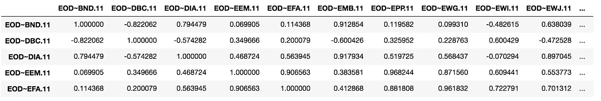
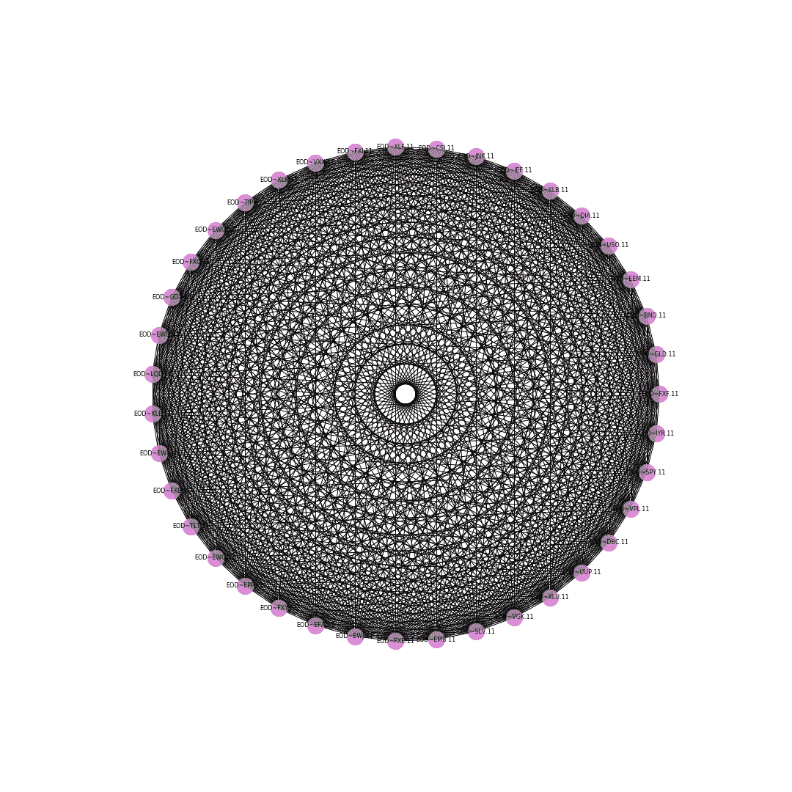
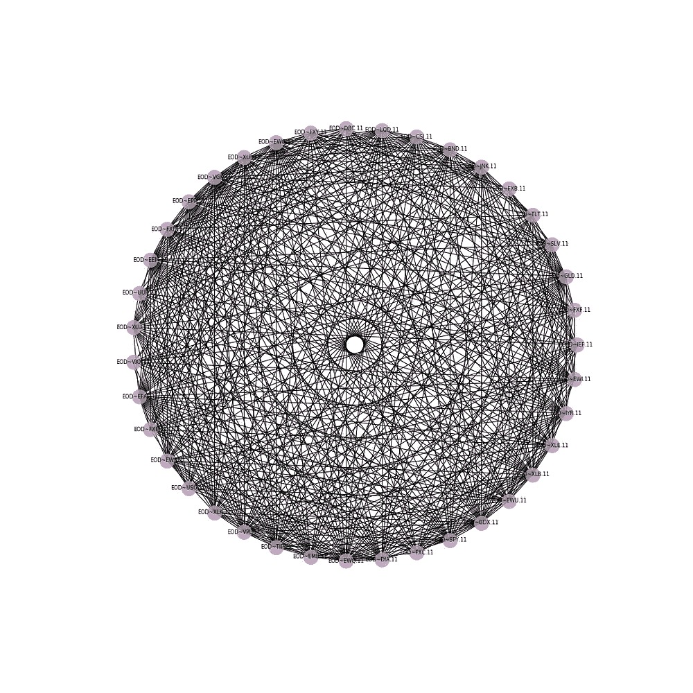
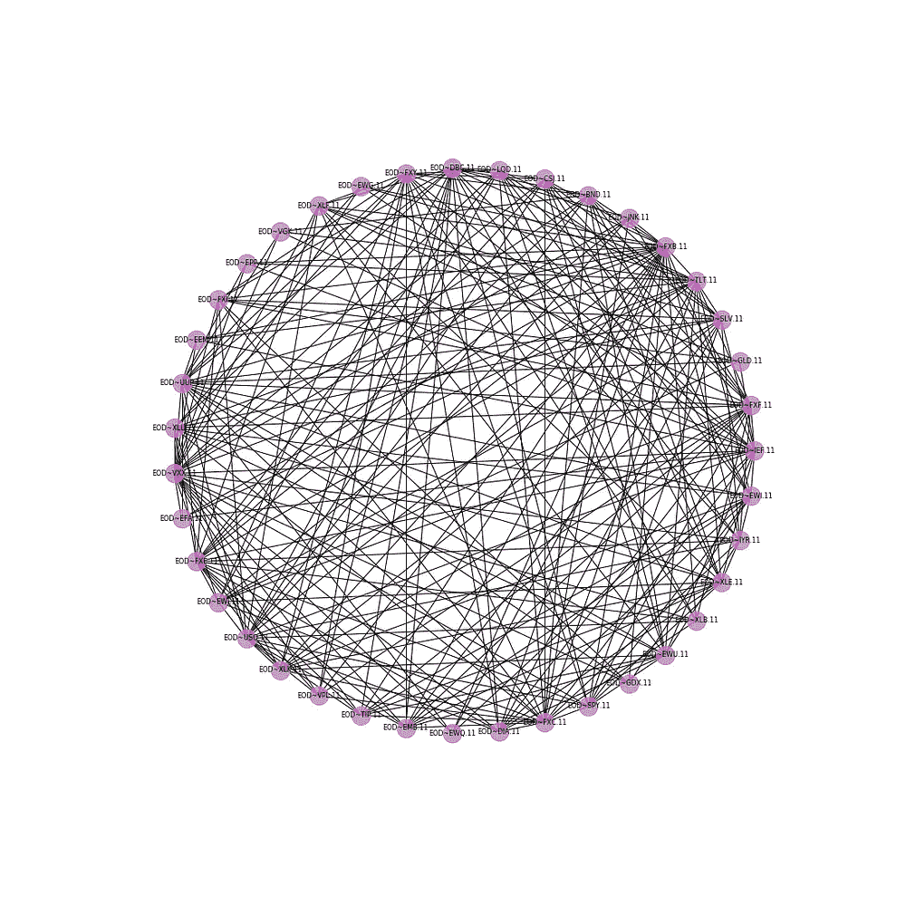
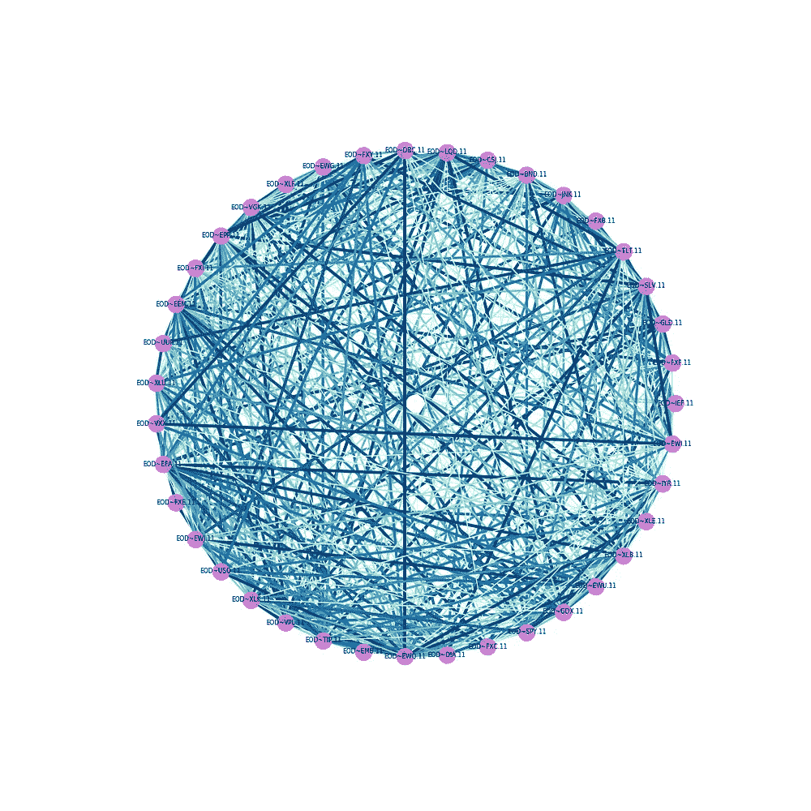
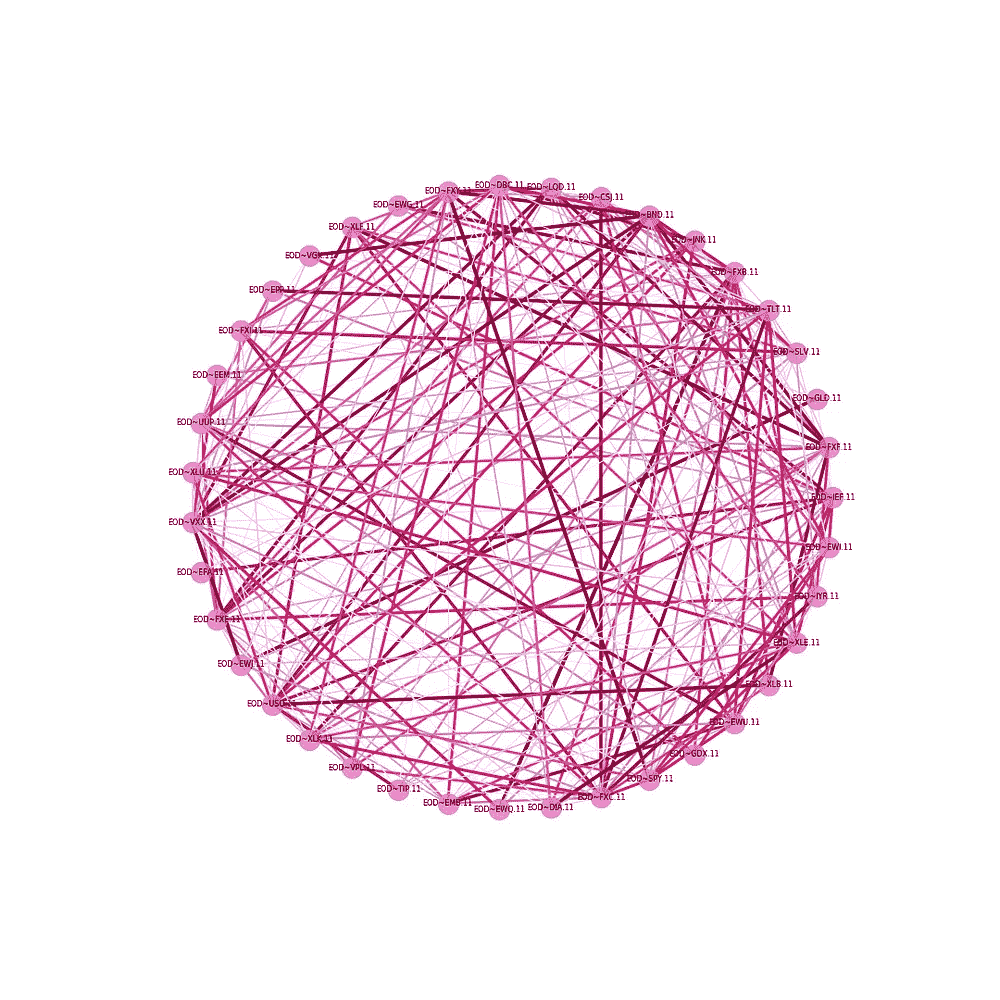
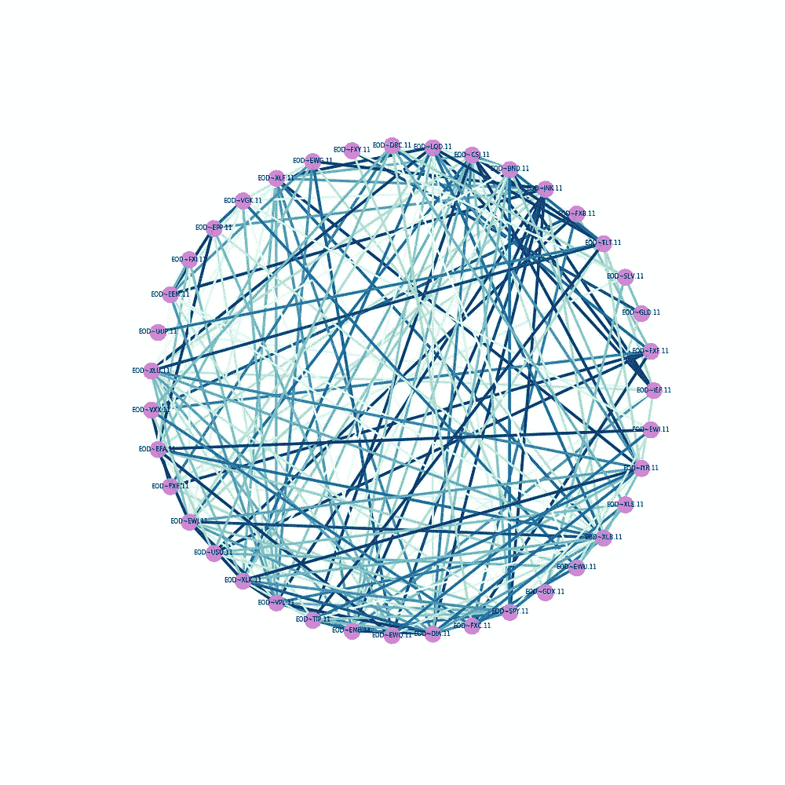
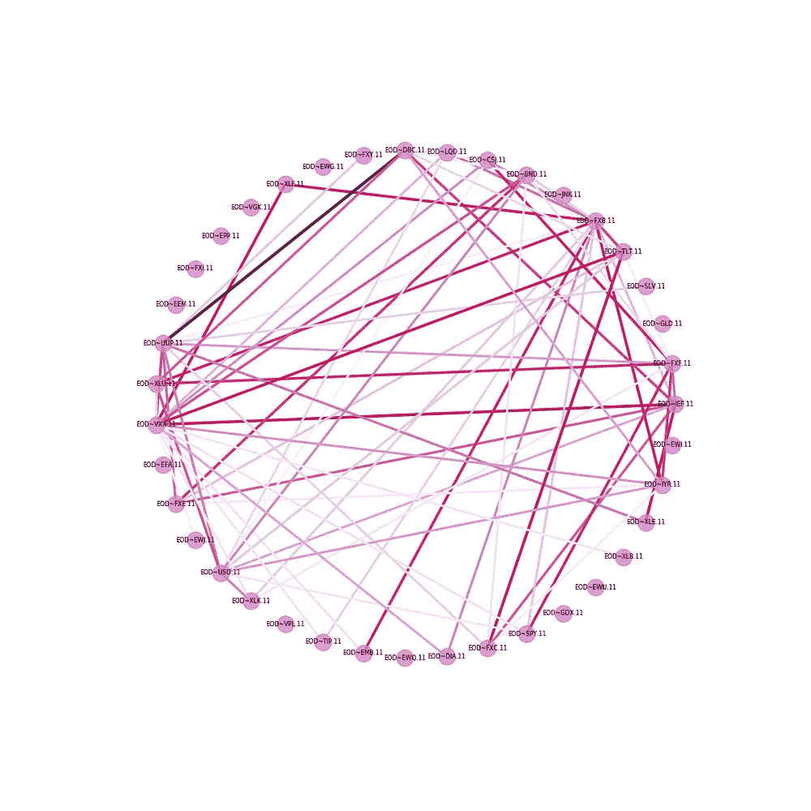
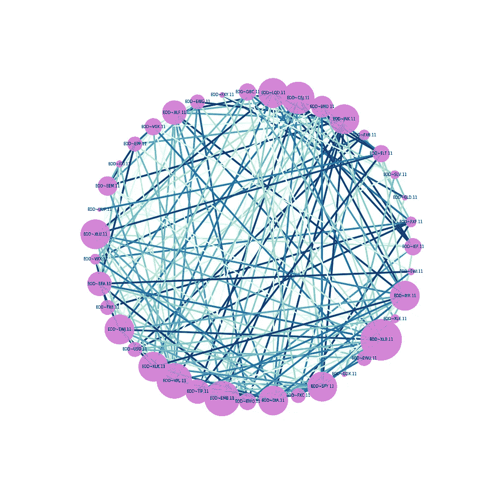
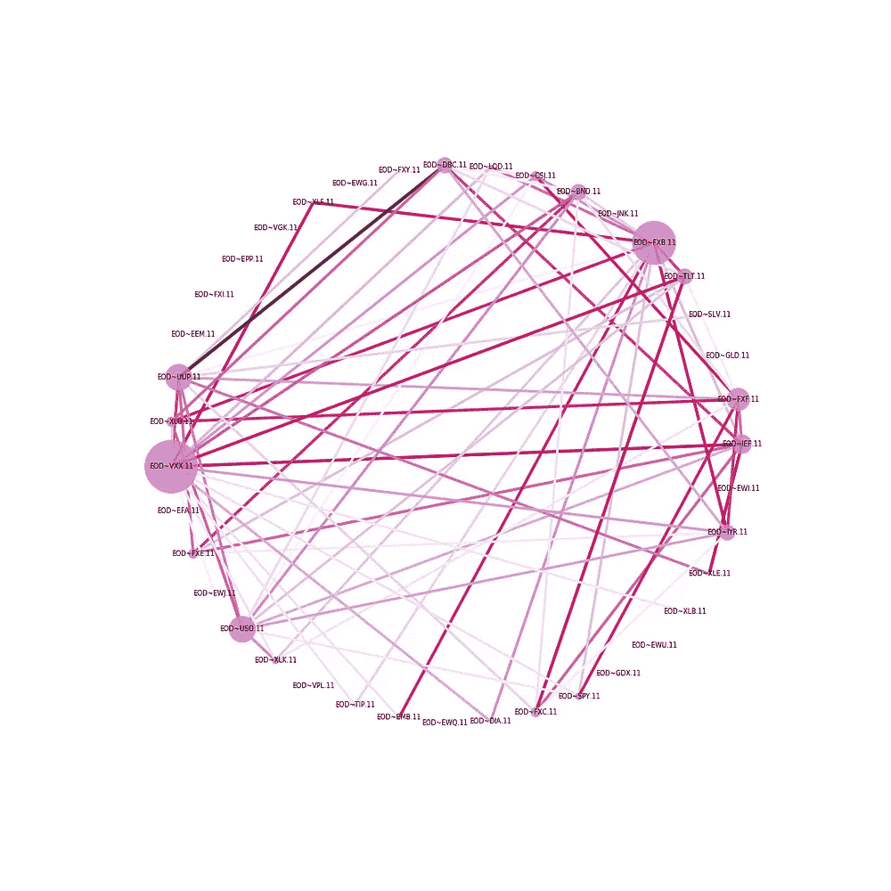

# 用 Networkx 可视化股票相关性

> 原文：<https://towardsdatascience.com/visualising-stocks-correlations-with-networkx-88f2ee25362e?source=collection_archive---------0----------------------->

在最近的一堂网络分析课上，我们被要求可视化股票之间的相关性。作为投资者，你对通过选择不同类型的投资来分散风险感兴趣。因此，你可能希望看到哪些股票表现相似(正相关)或非常不同(负相关)。

使用一个包含所选股票随时间变化的价格的数据集，我们将创建一个关联矩阵，并通过 Networkx 可视化。

Github 上的 Jupyter 笔记本(也可以在 HTML 文件中看到)[的完整代码。](https://github.com/valeria-io/visualising_stocks_correlations/blob/master/README.md)

## 图书馆

# a.计算相关矩阵

我们首先加载数据集，并用`.corr()`创建相应的相关矩阵。

下图显示了数据帧的快照。

然后我们存储股票名称，这样我们就可以命名图形中的节点，并将数据帧转换为矩阵，这样在 networkx 中创建图形就更容易了。

# b.创建图表

我们现在将基于相关矩阵创建一个图表。`G.edges(data=True)`将显示所有的边及其相应的权重。

# c.(英)可视化(= visualization)

## 第 1 部分:基本图表

你会得到这样的东西:

Graph — Part 1

## 第 2 部分:区分负相关和正相关

现在，我们将从图 G 创建一个名为 H 的副本。在 H 中，如果我们想要可视化所有正相关，我们将删除所有负的边，反之亦然。

这样做之后，我们需要更新代码，将“G”改为“H”。

下面我们可以看到负相关和正相关的图表。我们可以注意到，可用的负相关性更少(右图)。

**Left:** create_corr_network_2(G,corr_direction=”positive”) | **Right:** create_corr_network_2(G,corr_direction=”negative”)

## 第 3 部分:根据权重设置边的样式

我们现在需要提取边的权重，以便它们作为图中边的宽度。鉴于相关性非常小，我们将使用函数`1+abs(x))**2`来修改每一个，这样它们在图中就不会看起来太薄。

如果相关性为正，我们将使用标度颜色`plt.cm.GnBu`，否则使用`plt.cmPuRd`。

然后，我们需要将所有这些值添加到`nx.draw_networkx_edges`中。

我们的图表现在看起来像这样:

**Left:** create_corr_network(G,corr_direction=”positive”) | **Right**: create_corr_network(G,corr_direction=”negative”)

## 第 4 部分:用最小相关性过滤边缘

上面的图表看起来太密集了，所以我们现在将添加一个最小相关性，这样我们只能看到更强的相关性。

对于前面的代码，我们只需要添加正相关的`or weight["weight"] < min_correlation`和负相关的`or weight["weight"] > min_correlation`。如果一条边不符合这个标准，那么它将被删除。

使用最小值。相关性为 0.7 和-0.7，我们得到下图:

**Left:** create_corr_network(G, corr_direction=”positive”, min_correlation = 0.7) | **Right:** create_corr_network(G, corr_direction=”positive”, min_correlation = -0.7)

## 第 5 部分:根据链接边的数量(度数)设置节点样式

最后一步是根据节点链接到多少条边(也称为节点的度数)来设置节点的样式。为此，我们在 node_sizes 中解包所有节点，并将其缩放到`x**3`，以便它们看起来更大。

最终的图表如下所示:

**Left:** create_corr_network(G, corr_direction=”positive”, min_correlation = 0.7) | **Right:** create_corr_network(G, corr_direction=”positive”, min_correlation = -0.7)

创建上述图表的最终代码如下: