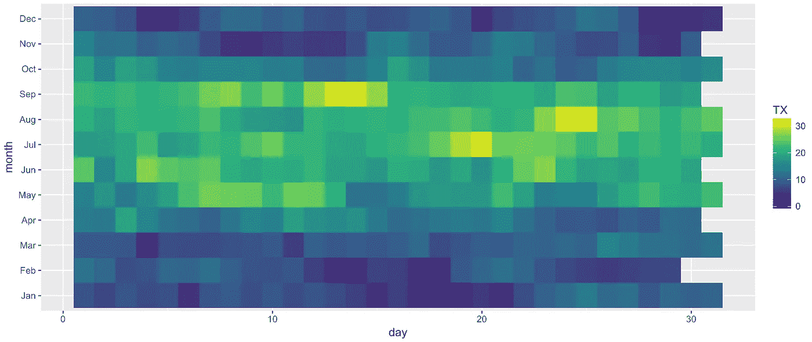
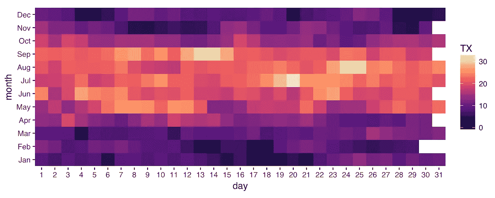

# 将阿姆斯特丹的温度可视化为 R 中的热图—第一部分

> 原文：<https://towardsdatascience.com/visualising-temperatures-in-amsterdam-as-a-heatmap-in-r-part-i-7e1be1e251c0?source=collection_archive---------5----------------------->

我最近在玩热图，决定用它来可视化阿姆斯特丹的温度数据。

**获取数据:**

荷兰皇家气象研究所(Koninklijk Nedarlands Meteorologisch Instituut in Dutch，或简称为 [KNMI](https://knmi.nl) )免费提供追溯到 20 世纪 50 年代的历史天气数据。你可以从他们的[测量和观察页面](http://www.knmi.nl/nederland-nu/klimatologie-metingen-en-waarnemingen)获得你选择的气象站的数据(荷兰语)。他们给出每小时和每天的读数。我从本页的[中获得了史基浦机场(气象站编号 240)的每日数据。](http://www.knmi.nl/nederland-nu/klimatologie/daggegevens)

**阅读和理解数据:**

数据被格式化为 CSV 文件。前几行有用荷兰语和英语描述每个字段的解释。这些行没有任何注释字符(通常是#)作为前缀，所以我们在读取文件时会跳过它们。我们感兴趣的内容从第 48 行开始，即标题行。

```
t <- read.csv('~/Downloads/etmgeg_240.txt', skip=47)
str(t)'data.frame': 24311 obs. of  41 variables:
 $ X..STN  : int  240 240 240 240 240 240 240 240 240 240 ...
 $ YYYYMMDD: int  19510101 19510102 19510103 19510104 19510105 19510106 19510107 19510108 19510109 19510110 ...
 $ DDVEC   : int  188 153 203 193 207 185 240 203 246 176 ...
 $ FHVEC   : int  77 41 15 77 82 57 134 77 67 51 ...
 $ FG      : int  87 41 21 77 87 62 144 82 72 62 ...
 $ FHX     : int  195 82 51 103 144 123 180 103 129 103 ...
 $ FHXH    : int  18 4 24 15 21 22 13 20 12 21 ...
 $ FHN     : int  41 10 0 51 36 0 62 51 21 26 ...
 $ FHNH    : int  24 21 3 1 24 3 24 1 24 3 ...
 $ FXX     : int  NA NA NA NA NA NA NA NA NA NA ...
 $ FXXH    : int  NA NA NA NA NA NA NA NA NA NA ...
 $ TG      : int  12 13 3 12 48 64 67 61 41 26 ...
 $ TN      : int  -13 7 -20 -7 18 46 58 36 6 -8 ...
 $ TNH     : int  1 4 9 6 1 4 24 2 24 5 ...
 $ TX      : int  26 18 16 19 84 86 86 70 63 61 ...
 $ TXH     : int  20 19 23 16 21 24 1 14 1 24 ...
 $ T10N    : int  NA NA NA NA NA NA NA NA NA NA ...
 $ T10NH   : int  NA NA NA NA NA NA NA NA NA NA ...
 $ SQ      : int  NA NA NA NA NA NA NA NA NA NA ...
 $ SP      : int  NA NA NA NA NA NA NA NA NA NA ...
 $ Q       : int  NA NA NA NA NA NA NA NA NA NA ...
 $ DR      : int  NA NA NA NA NA NA NA NA NA NA ...
 $ RH      : int  NA NA NA NA NA NA NA NA NA NA ...
 $ RHX     : int  NA NA NA NA NA NA NA NA NA NA ...
 $ RHXH    : int  NA NA NA NA NA NA NA NA NA NA ...
 $ PG      : int  9891 9876 10019 10098 10059 10043 10026 10084 10089 10090 ...
 $ PX      : int  9957 9923 10097 10114 10094 10087 10105 10115 10151 10148 ...
 $ PXH     : int  NA NA NA NA NA NA NA NA NA NA ...
 $ PN      : int  9837 9853 9931 10084 10030 9980 9957 10040 10034 10016 ...
 $ PNH     : int  NA NA NA NA NA NA NA NA NA NA ...
 $ VVN     : int  NA NA NA NA NA NA NA NA NA NA ...
 $ VVNH    : int  NA NA NA NA NA NA NA NA NA NA ...
 $ VVX     : int  NA NA NA NA NA NA NA NA NA NA ...
 $ VVXH    : int  NA NA NA NA NA NA NA NA NA NA ...
 $ NG      : int  7 8 6 7 8 8 8 7 5 5 ...
 $ UG      : int  90 93 94 94 95 89 82 93 89 89 ...
 $ UX      : int  98 98 100 97 100 100 94 97 96 95 ...
 $ UXH     : int  6 9 21 12 5 3 4 8 1 2 ...
 $ UN      : int  73 88 83 89 89 72 76 88 76 78 ...
 $ UNH     : int  20 1 12 8 14 23 16 17 14 12 ...
 $ EV24    : int  NA NA NA NA NA NA NA NA NA NA ...
```

因此，我们有各种各样的天气观测——尽管有些指标的读数不是每年都有的。越往过去走，数据越粗略。在我们的练习中，让我们从 2016 年的每日气温数据开始。`YYYYMMDD`是日期栏，而`TX`和`TN`栏分别包含最高和最低温度。温度以 0.1°C 为单位(例如，10°C 在本文件中显示为 100 ),因此我们将它们除以 10。

**过滤和修改数据:**

我们将使用`dplyr`包中的`filter`函数来过滤 2016 年的数据。然后我们将使用`select`函数来挑选我们需要的字段，并将这个子集分配给一个新的数据帧。

```
library(dplyr)
t %>% filter(YYYYMMDD >= 20160101 & YYYYMMDD <= 20161231) %>% select(YYYYMMDD, TN, TX) -> t.2016
```

接下来，我们将对此数据进行一些更改。每次观察的日期(`YYYYMMDD`列)存储为整数。我们将把它转换成一个适当的日期对象，然后把它分解成方便的单位——年、月、周、工作日和日——供以后使用。同时，我们也将温度除以 10。我们将使用`lubridate`包来处理日期。

```
library(lubridate)
t.2016 %>% mutate(
    date = as.Date(as.character(YYYYMMDD), format="%Y%m%d"),
    year = year(date),
    month = month(date, label=T, abbr=T),
    week = strftime(date,"%W"), 
    wday = substring(wday(date, label=T, abbr=T),1,2),
    day = day(date),
    TN = TN / 10,
    TX = TX / 10
) -> t.2016
head(t.2016) YYYYMMDD  TN  TX       date year month week wday day
1 20160101 1.1 8.0 2016-01-01 2016   Jan   00   Fr   1
2 20160102 4.6 6.5 2016-01-02 2016   Jan   00   Sa   2
3 20160103 5.3 8.5 2016-01-03 2016   Jan   00   Su   3
4 20160104 4.3 7.2 2016-01-04 2016   Jan   01   Mo   4
5 20160105 4.4 7.7 2016-01-05 2016   Jan   01   Tu   5
6 20160106 1.8 4.4 2016-01-06 2016   Jan   01   We   6
```

**可视化数据:**

让我们首先尝试将最高温度可视化为热图。我们将使用[绿色](https://cran.r-project.org/web/packages/viridis/vignettes/intro-to-viridis.html)调色板来绘制热图。

```
library(ggplot2)
library(viridis)
ggplot(data = t.2016, aes(x=day,y=month)) + geom_tile(aes(fill=TX)) + scale_fill_viridis()
```



我们可以清楚地看到阿姆斯特丹夏季从 5 月到 9 月的延伸，7 月是一年中最热的一天，1 月和 12 月有几天非常冷。

我们现在将做一些更小的调整:

1.  我们将在 x 轴上标记所有的日子，而不是让 ggplot 为我们选择一些东西。毕竟我们知道一个月不会超过 31 天。此时，我们将确保日期(x 轴)从 1 开始，而不是从 0 开始。我们还会将 y 轴向热图靠近一点。
2.  因为这是最高温度，我想选择一个能唤起温暖的调色板。Viridis 有 3 个以上的调色板-岩浆，等离子和地狱，我们将选择岩浆主题来完成这项工作。
3.  在上面的截图中，平铺看起来很漂亮，但是根据你的绘图窗口的大小，它们可能看起来被压扁了。我们将锁定图块，使其始终保持 1:1 的比例，而不考虑绘图窗口的宽度和高度。
4.  最后，我们将使用不同的主题隐藏背景中的灰色网格。我是来自 [ggthemes](https://cran.r-project.org/web/packages/ggthemes/vignettes/ggthemes.html) 套装的塔夫特主题的粉丝。

```
**library(ggthemes)**
ggplot(data = t.2016, aes(x = day,y = month)) + 
geom_tile(aes(fill = TX)) + 
**scale_x_continuous(breaks=c(1:31), expand=c(0,0))** + **coord_equal(ratio = 1) +** scale_fill_viridis(**option="magma"**) + **theme_tufte(base_family="Helvetica")**
```



我个人认为岩浆主题会让夏季更加突出。

**链接:**

1.  如果你喜欢`viridis`库，请务必阅读[插图](https://cran.r-project.org/web/packages/viridis/vignettes/intro-to-viridis.html)。我还发现小插曲中提到的 [SciPy2015 视频](https://www.youtube.com/watch?list=PLYx7XA2nY5Gcpabmu61kKcToLz0FapmHu&v=xAoljeRJ3lU)很有教育意义。
2.  我从 Bob Rudis 的这个帖子中学到了很多我在这里使用的技术。

**接下来:**

虽然我对我们的进展很满意，但我们还可以利用一年的温度数据做更多的事情。在下一篇文章中，我将分享一种让热图看起来像真实日历的方法。

**更新:** [第二部分现已更新](https://medium.com/@deepak.gulati/visualising-temperatures-in-amsterdam-as-a-heatmap-in-r-part-ii-92db6b37a5e1)，两部分的[源代码也已更新](https://github.com/deepakg/heatmap)。