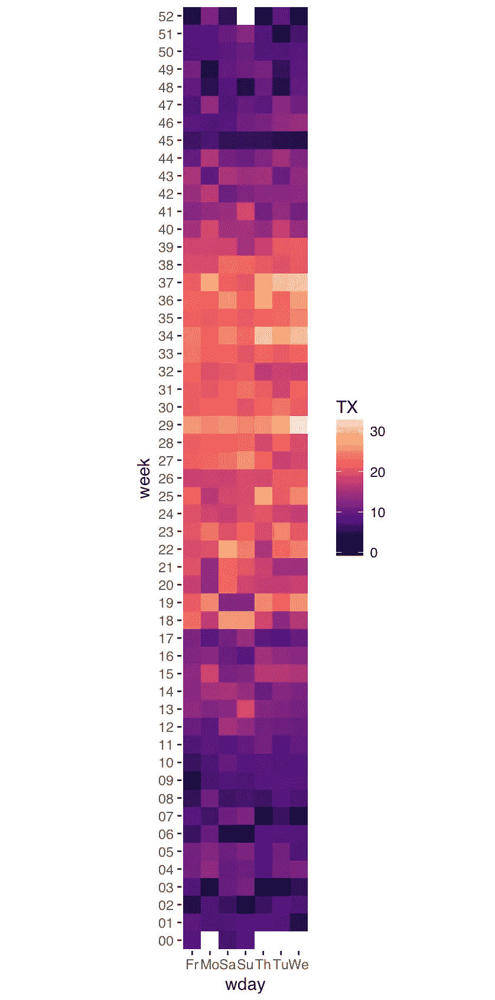
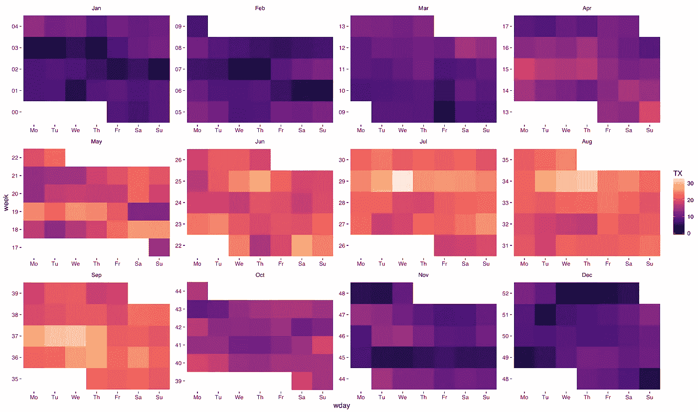
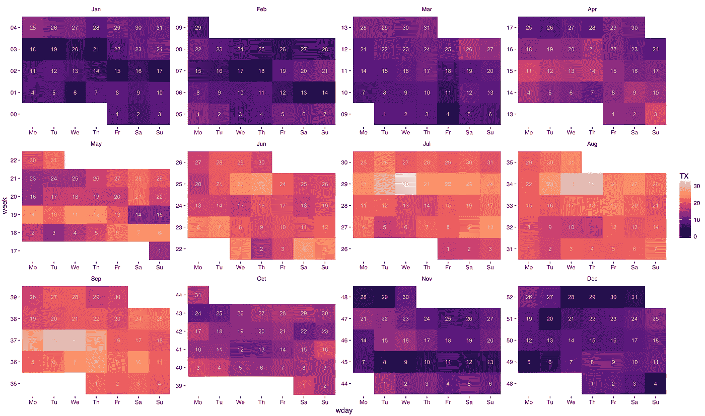
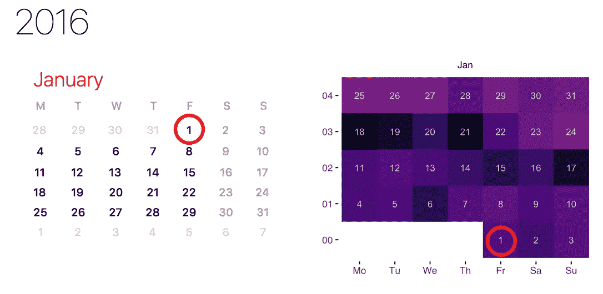
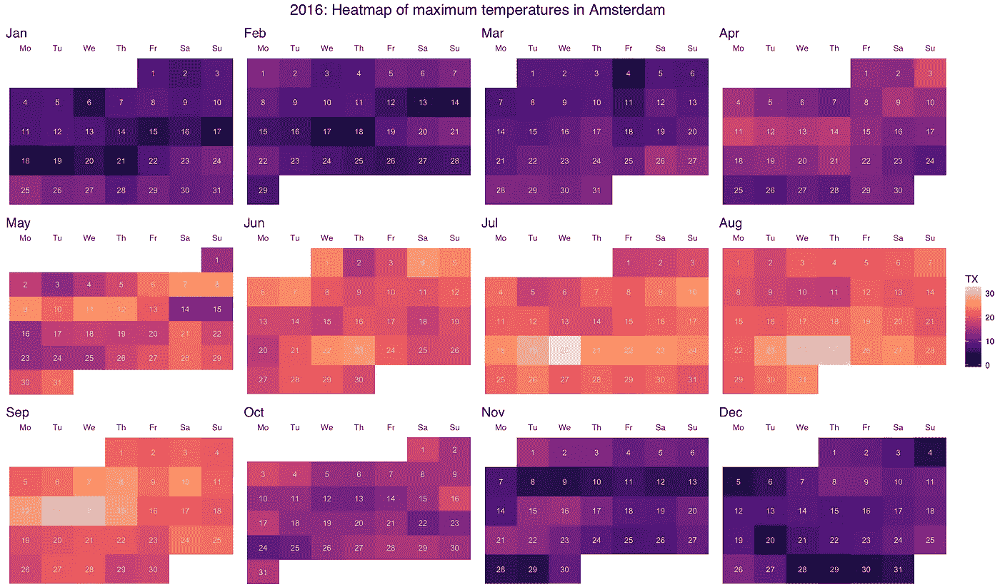

# 将阿姆斯特丹的温度可视化为 R 中的热图—第二部分

> 原文：<https://towardsdatascience.com/visualising-temperatures-in-amsterdam-as-a-heatmap-in-r-part-ii-92db6b37a5e1?source=collection_archive---------4----------------------->

在这个两部分系列的[的最后一部分](https://medium.com/@deepak.gulati/visualising-temperatures-in-amsterdam-as-a-heatmap-in-r-part-i-7e1be1e251c0)中，我们研究了如何获取阿姆斯特丹的天气数据，处理这些数据并创建一个简单的热图。下面是我们的数据在第一部分结束时的样子:

```
 YYYYMMDD  TN  TX       date year month week wday day
1 20160101 1.1 8.0 2016-01-01 2016   Jan   00   Fr   1
2 20160102 4.6 6.5 2016-01-02 2016   Jan   00   Sa   2
3 20160103 5.3 8.5 2016-01-03 2016   Jan   00   Su   3
4 20160104 4.3 7.2 2016-01-04 2016   Jan   01   Mo   4
5 20160105 4.4 7.7 2016-01-05 2016   Jan   01   Tu   5
6 20160106 1.8 4.4 2016-01-06 2016   Jan   01   We   6
```

我们现在将根据这些数据创建另一个热图，并使它看起来像一个日历。让我们首先在 y 轴上绘制星期，在 x 轴上绘制星期几:

```
ggplot(data = t.2016, aes(x = wday, y = week)) + 
geom_tile(aes(fill = TX)) + 
coord_equal(ratio = 1) + 
scale_fill_viridis(option="magma") + theme_tufte(base_family="Helvetica")
```



注意 x 轴上的星期是按字母顺序排列的。我们将把它们转换成与一周中的天数相对应的系数:

```
t.2016$wday <- factor(t.2016$wday, levels=c("Mo", "Tu", "We", "Th", "Fr", "Sa", "Su"))
```

接下来，我们将在`month`上应用一个`facet_wrap`来给每个月分配它自己的面板。注意，我们设置了`scales = "free"`，这样每个月都有自己独立的 x 和 y 轴。

```
ggplot(data = t.2016, aes(x = wday, y = week)) + 
geom_tile(aes(fill = TX)) + 
coord_equal(ratio = 1) + 
scale_fill_viridis(option="magma") + theme_tufte(base_family="Helvetica") +
**facet_wrap(~month, nrow = 3, scales = "free")**
```



我们现在很亲密。让我们使用`geom_text`在每个图块上添加日期:

```
ggplot(data = t.2016, aes(x = wday, y = week)) + 
geom_tile(aes(fill = TX)) + 
coord_equal(ratio = 1) + 
scale_fill_viridis(option="magma") + theme_tufte(base_family="Helvetica") +
facet_wrap(~month, nrow = 3, scales="free") + **geom_text(aes(label=day), color="grey", size=3)**
```



差不多了，但还不完全是。看到问题了吗？我们的约会颠倒了！



基本上，一个月的第一周应该在顶部(即远离 x 轴)，最后一周应该在底部。我们可以通过将周转换为按相反顺序排序的因子来实现这一点:

```
t.2016$week <- 
factor(t.2016$week, levels=rev(sort(unique(t.2016$week))))
```

在此期间，我们还将添加一些收尾工作:

1.  隐藏每个月的 y 轴刻度线和标签。我们还将隐藏主轴的 x 和 y 轴标题。
2.  将 x 轴标签移动到顶部并隐藏其刻度线。
3.  默认情况下，月份标签将放置在面板内部。我们将把它们移到外面，否则 x 轴标签会出现在它们上面。我们还将增加月份标签的字体大小，并将它们左对齐。
4.  向图表添加标题。

```
ggplot(data = t.2016, aes(x = wday, y = week)) + 
geom_tile(aes(fill = TX)) + 
coord_equal(ratio = 1) + 
scale_fill_viridis(option = "magma") + 
theme_tufte(base_family = "Helvetica") +
facet_wrap(~month, nrow = 3, scales="free") + 
geom_text(aes(label = day), color = "grey", size = 3) + **# hide y-axis ticks and labels** theme(axis.ticks.y = element_blank()) +
theme(axis.text.y = element_blank()) +**# hide main x and y-axis titles** theme(axis.title.x = element_blank()) + 
theme(axis.title.y = element_blank()) +**# move x-axis labels (week names) to top, hide ticks** scale_x_discrete(position = "top") +
theme(axis.ticks.x = element_blank()) +**# move panel title (month names) outside (above week names)** theme(strip.placement = "outside") +
theme(strip.text.x = element_text(size = "14", hjust = 0)) +**# center-aligned plot title** ggtitle("2016: Heatmap of maximum temperatures in Amsterdam") + 
theme(plot.title = element_text(size = "16", hjust = 0.5))
```

最终结果:



**更新:** [源代码](https://github.com/deepakg/heatmap)