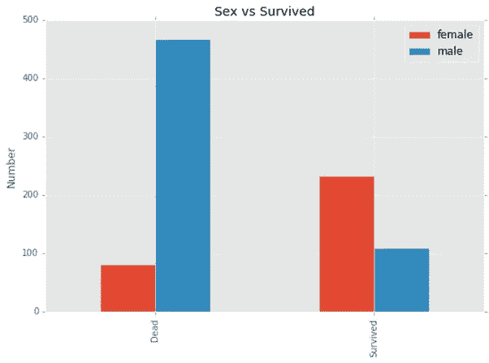
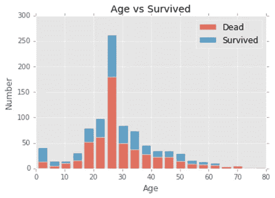
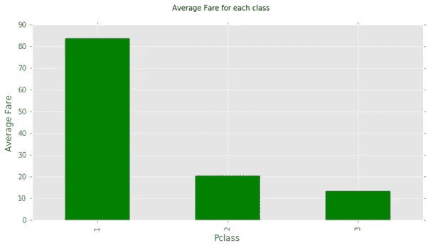
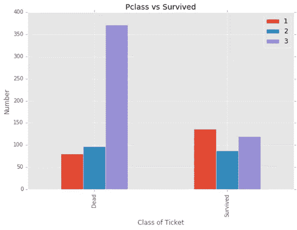
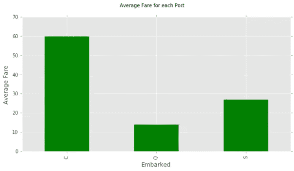
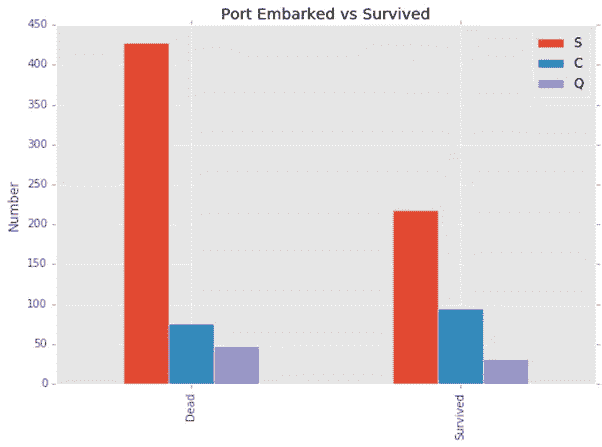
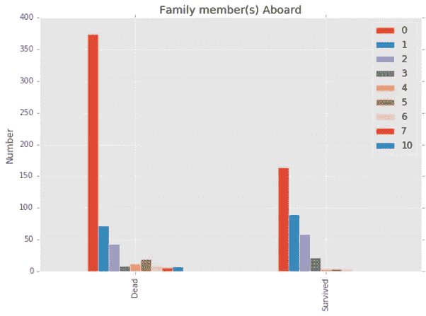

# 可视化——从灾难中学习:泰坦尼克号

> 原文：<https://towardsdatascience.com/visualization-learning-from-disaster-titanic-42eeb99cdbdc?source=collection_archive---------0----------------------->

我最近一直在学习数据分析，我的旅程带我参加了关于“从灾难中学习:泰坦尼克号”的 kaggle 练习。我还受到启发，从我遇到的一些其他资源中对数据集进行了一些可视化分析。

该数据集提供了泰坦尼克号上乘客的详细信息，并有一个关于乘客存活率的专栏。幸存的人被表示为“1”，而未幸存的人被表示为“0”。本练习的目的是确定是否有可能通过乘客的其他特征/信息来确定哪些人可能幸存。

名词（noun 的缩写）b:专栏、专题和信息这三个术语在这里都有相同的含义，可以互换使用。

我会获取一些特征/列，并将其可视化，以深入了解数据集，并确定某些特定特征是否可能决定某个乘客能否生还。

首先，清理数据集以移除或替换丢失的值。数据集中的列有:
**乘客 Id:** *乘客身份*
**生还:** *乘客是否生还*
**乘客类别:** *车票类别*
**姓名:** *乘客姓名*
**性别:** *乘客性别(男或女)*
**年龄:** *乘客年龄*
**SibSp:** *与乘客同行的兄弟姐妹和/或配偶人数*
**Parch:** *与乘客同行的父母和/或子女人数*
**车票:** *票号*
**票价:** *票价*

***乘客性别***

**

*存活下来的雌性比雄性多。*

***年龄***

**

***票的类别(Pclass)***

****

*第一张图显示，平均而言，Pclass 1 更贵，而 Pclass 3 最便宜，第二张图显示，持有 Pclass 1 车票的乘客更有可能幸存，而 Pclass 3 车票的持有者不太可能幸存。*

***港口登船***

****

*第一个图表显示端口 C 的平均成本高于其他端口。第二张图显示，在 C 港上船的人生还的可能性稍大一些。*

*我们上两节已经告诉我们，为旅行支付更多费用的人更有可能幸存下来。*

***家庭成员***

*我已经添加了兄弟姐妹/配偶列和父母/子女列，形成了一个家庭列。我们现在将使用这个家庭栏来想象有家人在船上的乘客是否可能生还。*

**

***概要** : **一名女性，购买了一张 Pclass 1 船票，在 C 港上船，船上有一至三名家庭成员，年龄不到 10 岁，生还的可能性更大。***