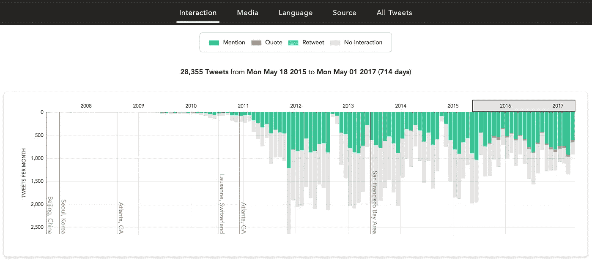
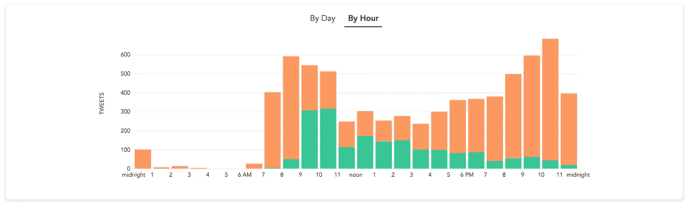
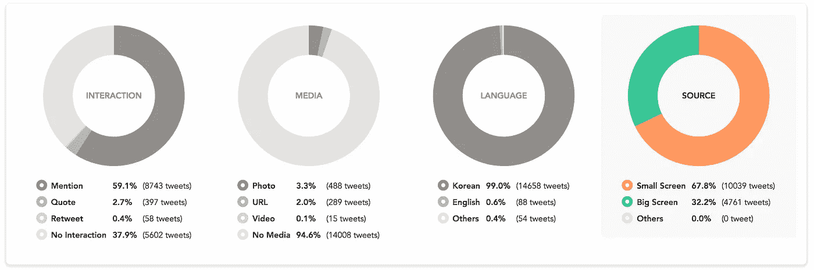
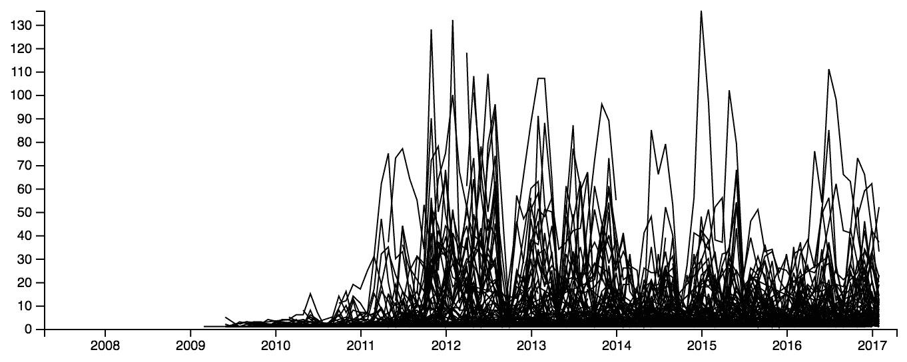
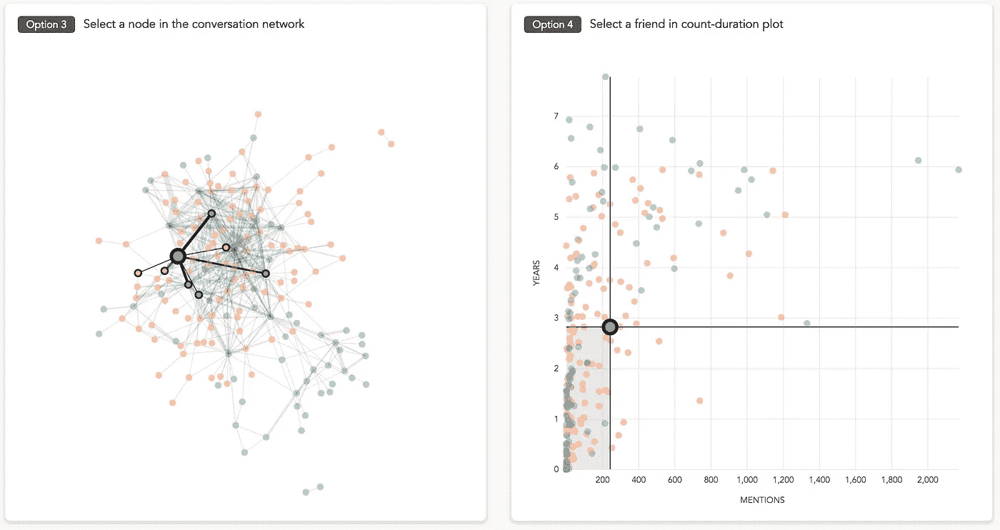
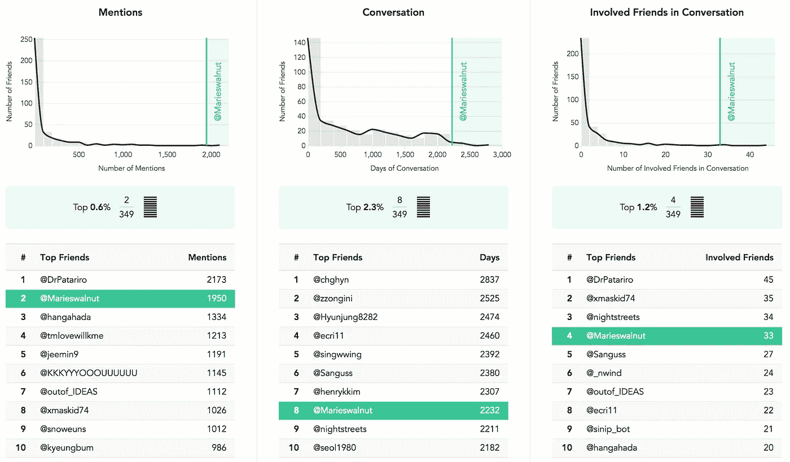

# 十年 Twitter 数据的可视化(第二部分——设计)

> 原文：<https://towardsdatascience.com/visualization-of-10-years-of-twitter-2-design-abbbe121a7d4?source=collection_archive---------7----------------------->

这是关于我的数据可视化项目[http://tany.kim/twitter](http://tany.kim/twitter)。阅读[上一篇关于数据清理和处理的文章。](https://medium.com/@tanykim/side-project-10-years-of-twitter-8fd5724f7b1a)

有了**102 万条推文**和 **349 个好友**的海量数据集，我得出了两个主要观点(推文和好友)。每个视图都有一系列的交互式可视化，其中一些通过在其中一个视图中发生的用户交互来链接和更新。在这里，我描述了决策过程——为什么我选择这些可视化类型和交互。讨论设计过程不可避免地包括可视化的见解。

# 按类别排列的推文堆积条形图

Stacked bar charts of tweets categorized with interaction type during a selected time range

对于推文的分析，我选择了 4 个类别(交互、媒体、语言、来源)。每个类别中的推文属于 2-3 种类型中的一种，并以颜色编码。那些不属于任何类型的推文以浅灰色显示。为了显示推文的时间线，我按月统计推文——一个月的推文用一组堆叠的条形表示。通过这个堆积条形图，我可以看到我很少转发，我从 2015 年末才开始引用。此外，我发现过去一年我提到的次数(即与朋友交谈的次数)比以前多。

同样的技术也用于显示每小时或每天的推文数量。在下图中显示了推文的来源，我可以看到一个清晰的模式，我一醒来就用手机发推文，然后开始工作时用电脑发推文，然后晚上使用手机的比例增加。

Stacked bars to show the source of tweets (green: big screen, orange: small screen)

# 类型比率饼图

Pie charts of four categories. Selected Category is highlighted.

堆积条形图有助于调查推文随时间的变化。除此之外，我想提供一种更简单的方式来显示给定时间内推文类型的比率。这四个饼图/圆环图汇总了所选时间范围内的所有推文。

# 天/小时的矩阵(热图)视图

Number of all tweets (not categorized) by day and hour

我只对“所有推文”使用了矩阵视图，所以我只能将数据集的一个属性(推文的数量)编码成一个可视属性(区域填充颜色的不透明度)。在我过去的项目中，我喜欢在两种颜色中使用数量有限(通常最多 7 步)的热图。这样，每种颜色都可以代表整个系列中的一个独立群体。我喜欢这种与众不同的颜色使用的美学，但是对于这个项目，我想展示 7x24 数据点之间的**细微差异，这也是一种更简单的编码选择。**

不透明度是一种很好的方式来区分与相邻元素的相对差异。但是尽管数据范围的图例显示为梯度，但精确的值很难解码。为了支持这一点，我添加了触发工具提示的鼠标悬停交互。较小的屏幕不支持此功能。

# 用于朋友搜索的所有连接的可视化

与具有常规子菜单类型的内容结构的 Tweets 视图相反，Friends 视图是搜索驱动的单页样式。

四个组件(朋友的搜索/下拉列表、线图、力定向网络图和散点图)用作用户界面，通过该用户界面可以选择朋友。当朋友被选择时，朋友视图中的所有可视化被更新，指定朋友的状态。

# 向朋友提及的折线图

Early prototyping of line graphs for friends

这是我为这个项目做的第一个可视化。该图是早期开发阶段的截图。这可能很有趣，但太混乱了，所以我想对数据集的一个维度进行编码，可能是分类数据，这样就可以使用颜色。我之前解释的将朋友标记为现实世界和/或网上朋友的想法最初来自于这种需求。这是迭代数据可视化设计的一个很好的例子；**数据集在交给设计师之前并不总是完整的。有趣的可视化想法可以触发新数据属性的创建。**

通过颜色编码，我可以清楚地看到我与现实世界中已经认识的人交谈，然后我将我的网络扩展到我从未见过的人。然后，当我有机会访问他们居住的城市时，我见到了他们中的一些人。我见过他们中的一些人很多次，我很感激 Twitter 创造的网络。

# 散点图

对二维数据进行编码的最简单的可视化方法之一是散点图。我用这个来编码提及次数(X 轴)和对话持续时间(Y 轴)。每个点代表一个朋友，并用线形图中使用的匹配类别进行颜色编码。

# 力定向图

通过追踪每条推文中提到的账户，我分析了我的朋友们是如何相互联系的。一种常见的可视化形式是力导向图，我开始用[编写这个例子](https://bl.ocks.org/mbostock/4062045)。每个节点(圆圈)的颜色编码与线图和散点图相同，边(两个圆圈之间的线)的厚度代表在一条推文中一起出现的次数。当选择一个朋友时，相应的节点和边被突出显示。

# 直方图和分布曲线和排名

在制作散点图之前，我制作了两个独立的直方图来显示提及次数的分布和交流持续时间的分布。在我制作这些直方图之前，我预计外观将接近正态分布。但事实非常令人吃惊。我的许多 Twitter 朋友(349 人中的 250 人)收到的总提及次数少于 100 次，而少数人超过了 2000 次。持续时间图不像计数图那样极端，但仍显示类似的模式。事实上，这些螺旋分布导致我制作散点图来显示每一个朋友，并列两个维度-计数和持续时间。此外，在分析了网络图数据后，我认为显示共享好友数量的分布也会很有趣。

我把分布曲线放在直方图上，然后列出每个类别中的前 10 个朋友。直方图本身不具备互动功能，但显示选定的朋友的状态。