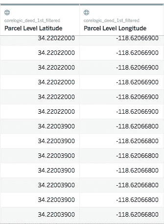
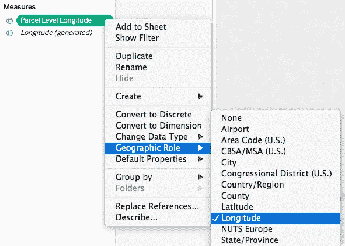
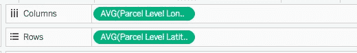
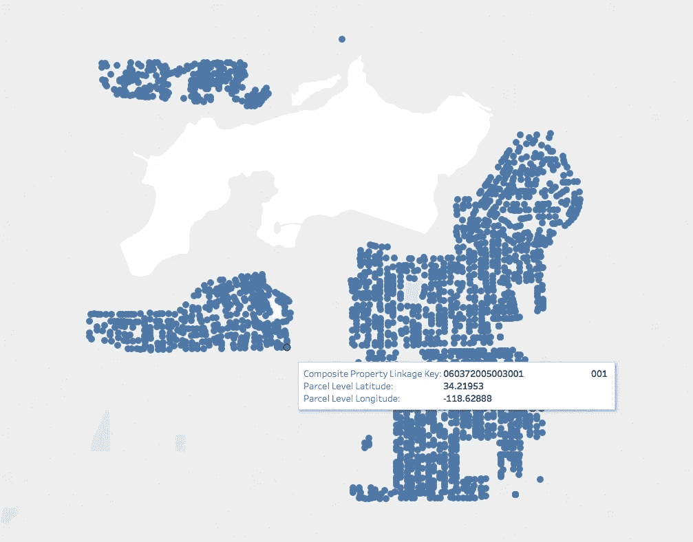
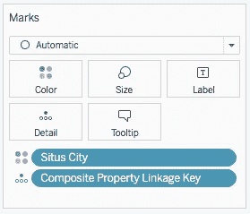
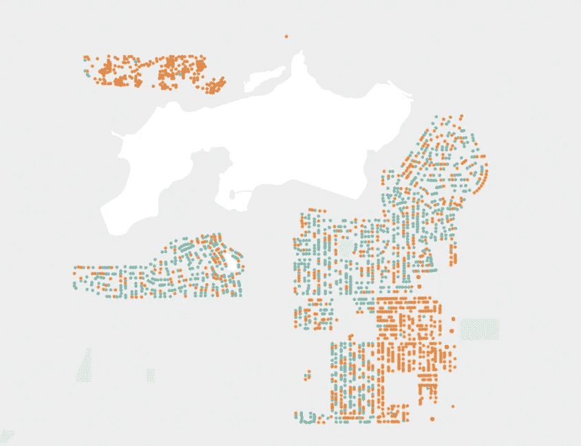
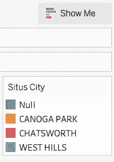

# 使用 Tableau 中的经度和纬度值可视化地理数据

> 原文：<https://towardsdatascience.com/visualize-geographic-data-using-longitude-and-latitude-values-in-tableau-4a90a00fca2b?source=collection_archive---------2----------------------->

如今，人口普查数据集和许多公共数据集都包含经度和纬度值。通过在地图上绘制经度和纬度坐标，可以直观地显示隐藏的地理信息。本文将提供一个分步指南，并举例说明如何在 Tableau 中构建地理可视化工作表。

以下是房地产数据集中经度和纬度值的示例。这些字段是**地块级经度**和**地块级纬度**。

longitude and latitude values

在 Measures of Tableau 中，右键单击**宗地级别经度(数据集中的字段名)**，然后选择**地理角色** > **经度**。然后右键**宗地级别纬度**，选择**地理角色** > **纬度**。

将**包裹级别经度**拖至列架，将**包裹级别纬度**拖至行架。

将**复合属性联动键**即属性唯一键拖动到标识卡上的**明细**处。这就是我们用 Tableau 绘制的地图。

拖动**到**司徒市**上的**色标记牌。如下所示，添加了 **Situs City** 维度来编码关于城市属性位于哪个城市的信息。

Color Encoding

Situs City

可视化地理数据有助于我们发现不同的变量如何与地理位置相关联，方法是将这些变量在地图上分层。本文展示了如何使用 Tableau 中的经度和纬度值构建交互式可视化。

感谢阅读。如果您有任何问题，或者您有任何地理可视化的示例想要分享，请告诉我。

# 报名参加🦞:的 Udemy 课程

## [具有机器学习和统计的推荐系统](https://www.udemy.com/course/recommender-system-with-machine-learning-and-statistics/?referralCode=178D030EF728F966D62D)

[https://www.udemy.com/course/recommender-system-with-machine-learning-and-statistics/?referralCode=178D030EF728F966D62D](https://www.udemy.com/course/recommender-system-with-machine-learning-and-statistics/?referralCode=178D030EF728F966D62D)