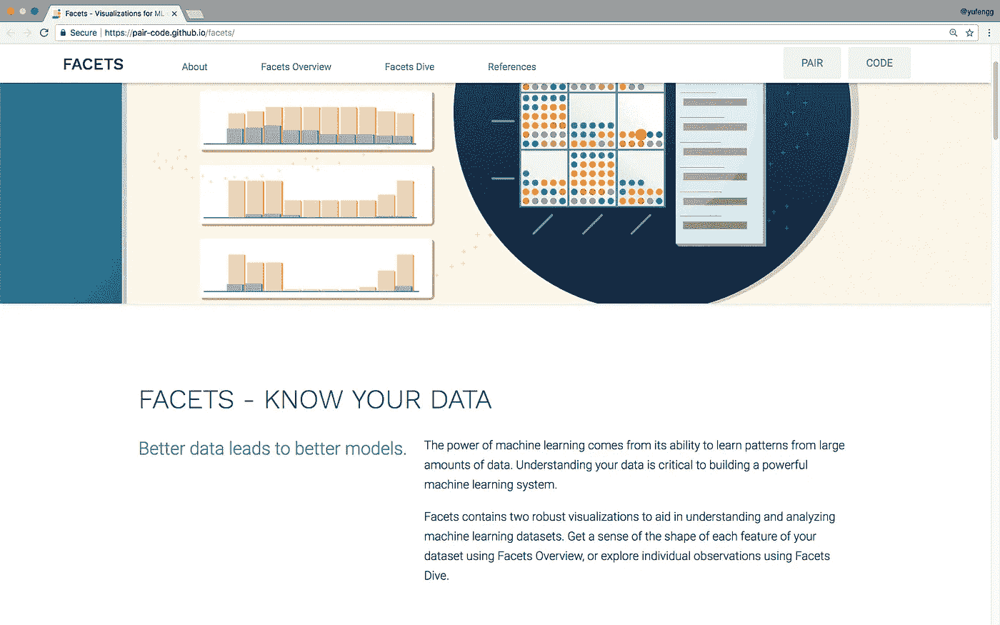
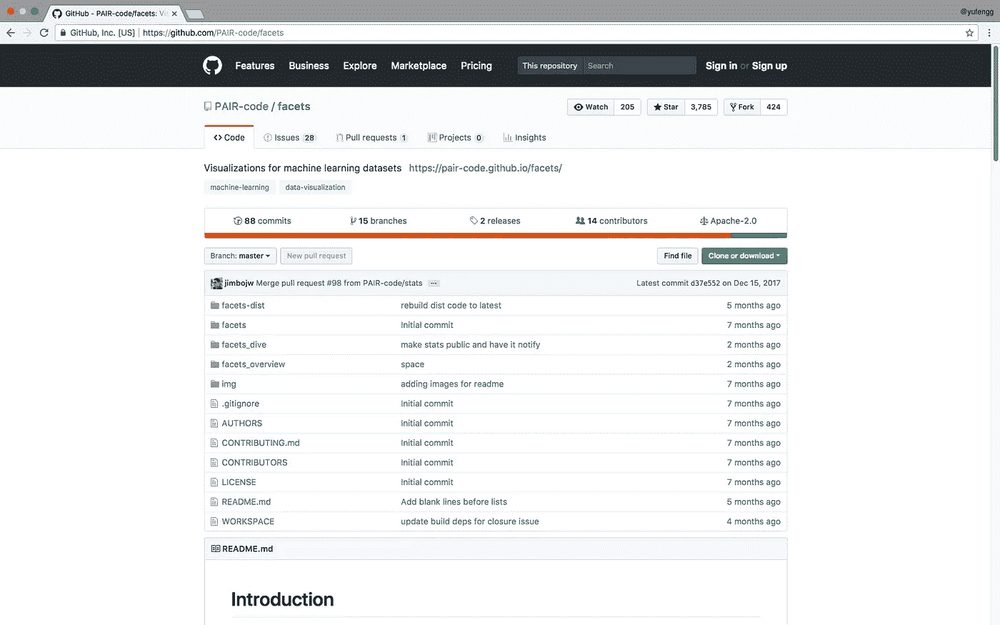
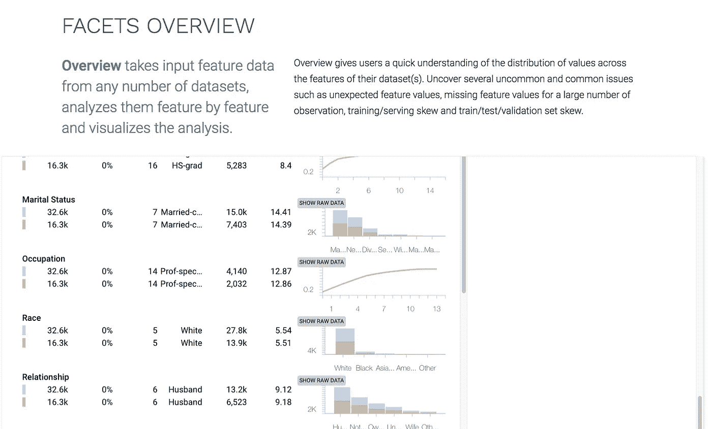
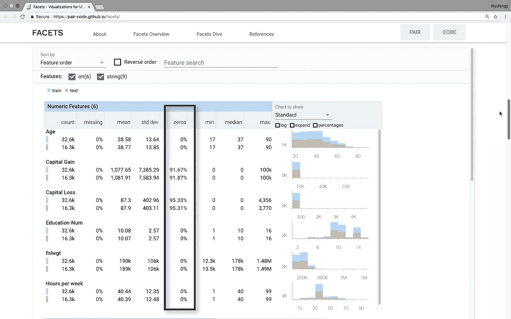
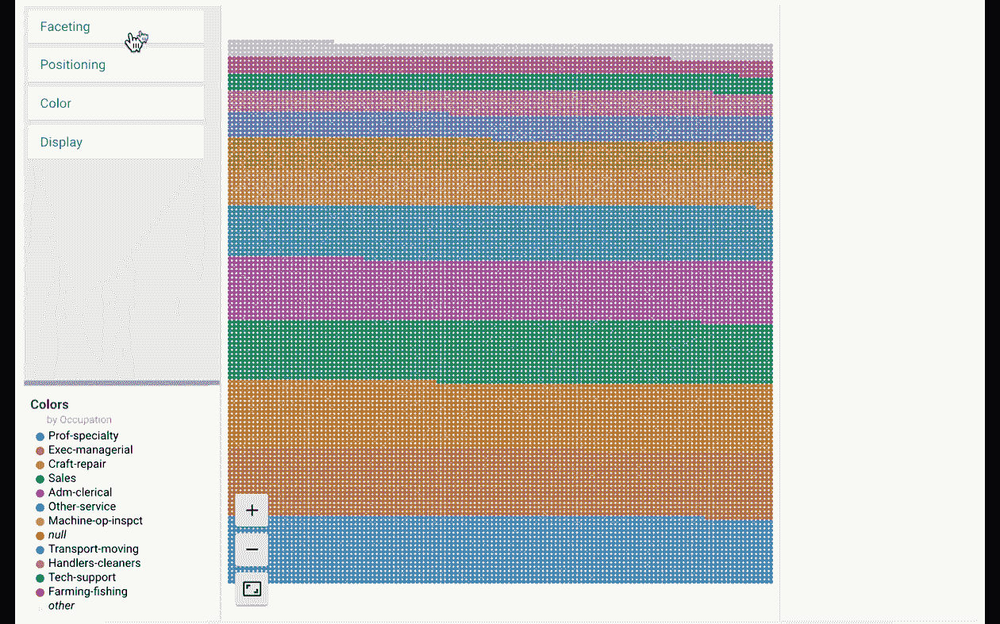
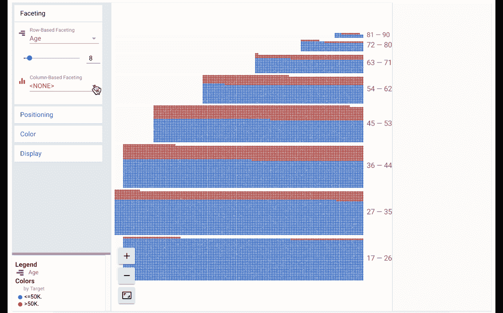
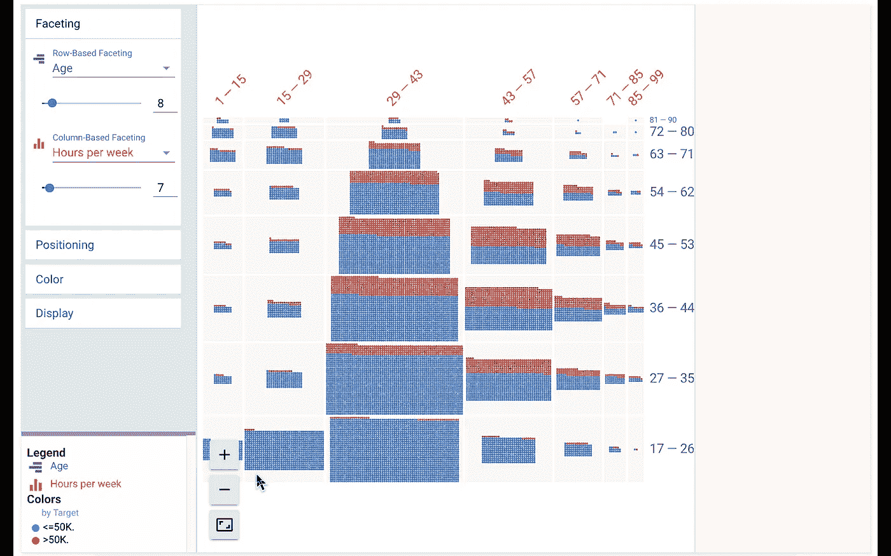
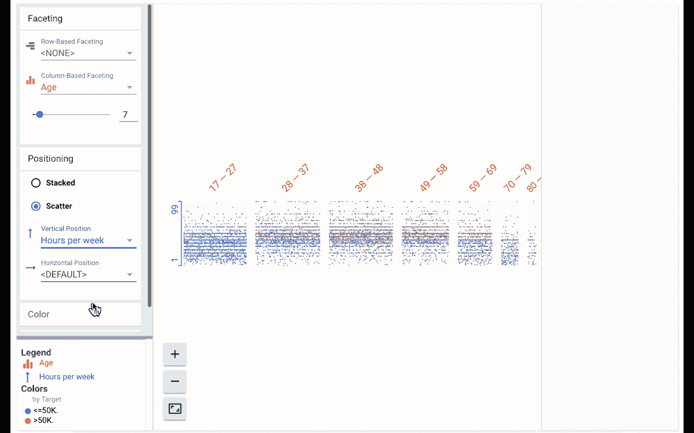
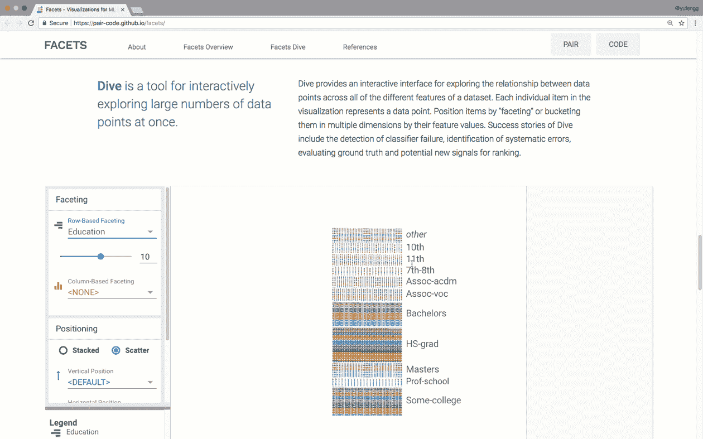

# 用方面可视化您的数据

> 原文：<https://towardsdatascience.com/visualize-your-data-with-facets-d11b085409bc?source=collection_archive---------3----------------------->

数据很乱。它通常是不平衡的，贴错标签的，并散布着古怪的价值观，让你的分析和机器学习训练失去了方向。

清理数据集的第一步是了解需要清理的地方。今天，我找到了合适的工具。

# 可视化您的数据

理解数据是为机器学习清理数据集的第一步。但这可能很难做到，尤其是以任何一种概括的方式。

Google Research 的一个名为 [Facets](https://github.com/PAIR-code/facets) 的开源项目可以帮助我们可视化我们的数据，并以各种方式将其切片，这可以帮助我们开始了解我们的数据集是如何布局的。

通过允许我们找到数据看起来与我们期望的不一样的地方，Facets 有助于减少以后的灾难。

让我们看看 Facets 是什么样子的。该团队在网上有一个[演示页面](https://pair-code.github.io/facets/)，所以你不用安装任何东西就可以从 Chrome 上试用 Facets。此外，Facets 可视化使用由 Typescript 代码支持的聚合物 Web 组件，因此可以很容易地嵌入到 Jupyter 笔记本和网页中。

方面有两个部分:方面概述和方面分析。让我们更详细地看一看每一个。

## 方面概述

刻面概述给出了数据集的概述。在《T4》前几集中，我们看到了像[熊猫](/wrangling-data-with-pandas-27ef828aff01)这样的工具如何帮助我们了解数据集是如何分布的。使用 Facets Overview 工具，我们可以获得这类信息的稍微升级的视图。

它将我们的数据列拆分成显著的信息行，显示缺失百分比、最小值和最大值等信息，以及平均值、中值和标准偏差等统计信息。它还有一个显示零值百分比的列，这完全有助于捕捉大部分值为零的情况。

The tool highlights high percentages of zeros, which is a good gut check for certain columns.

对于数据集的每个要素，您还可以查看数据在训练集和测试集中的分布。这是一种很好的方式，可以再次检查测试集是否与训练数据集具有相似的分布。

## 那又怎样？

是的，的确，从技术上来说，最好的做法是自己独立完成至少这一级别的分析，但是我肯定忘记了检查我的每一列数据的所有这些方面。该工具将有助于确保您不会错过这一关键步骤，并突出任何异常情况。

# 多面跳水

现在我们来看看[刻面跳水](https://pair-code.github.io/facets/index.html#facets-dive)。这就是事情变得真正有趣的地方。它允许您更加清晰地了解您的数据集，甚至可以一直放大以查看单个数据！

您可以通过数据集的任何要素按行和列对数据进行“分面”。这看起来就像你在网上购物，比如说，买鞋子，然后**根据不同的类别比如尺码、品牌和颜色过滤**。让我们来看一个深潜的例子，让它更加具体。

该界面分为 4 个主要部分。中间的主要区域是数据的可缩放显示。在左侧面板中，您可以使用各种下拉选项来更改数据的排列，以控制刻面、定位和颜色。正下方是中间显示的图例。最右边是特定数据行的详细视图。您可以单击中间可视化中的任何一行数据，查看该特定数据点的详细读数。

现在让我们看看这一切是如何组合在一起的。

为此，我们将使用“人口普查数据集”，这是巴里·贝克尔从 1994 年美国人口普查中提取的经典数据集。它的目标是根据各种普查统计数据预测一个家庭的年收入是高于还是低于 5 万美元。

## 逐行刻面

我们将首先按照年龄范围分割数据，并根据目标值给数据点着色。这里蓝色表示小于 50K，红色表示大于 50K。

## 按列分面

现在我们可以按年龄来看数据的另一个特征。在不同的年龄范围内，每周不同的小时数会产生不同的结果吗？让我们通过每周小时数的专栏来找出答案。

我们看到，17-26 岁的人群中有很大一部分每周工作 15-29 小时，这可能是孩子们做暑期工的结果。我们还可以看到，随着年龄的增长，工作 29-43 小时的人越来越少，而 43-57 小时的时间段在图表的中间年份保持相对稳定。

## 配置

但是这仍然没有告诉我们我们在寻找什么。让我们尝试改变剧情的定位，获得更详细的外观。我们将定位切换到“分散”，并且仅按年龄分面。我还将选择“每周小时数”作为垂直排序顺序，以便更容易地查看不同年龄组的工作时间。现在我们可以看到，在图表的中间，每周的工作时间在上升，而在两边，工作时间在下降。

你应该继续探索这些数据，看看你能找到什么趋势和关系。例如，您可以按原产地分面，这将显示数据严重失真。这可能会告诉您，您可能想要收集更多的数据点，以获得更平衡的数据集。

# 加载你的数据

如果这很有趣，您可能想知道如何将数据集加载到 facets 中。在这里，你有两个选择。

你可以使用 web 界面，直接上传数据并在浏览器中播放，或者你可以使用[项目的 GitHub 页面](https://github.com/PAIR-code/facets)上的说明，将该库安装为 Jupyter 笔记本扩展。

Facets 是一个非常有用的工具，可用于查看数据集，查看不同要素之间的关系，以及确保数据集中没有缺失或意外的值。

感谢阅读这一集的[云人工智能冒险](https://goo.gl/UC5usG)。如果你喜欢这个系列，请为这篇文章鼓掌让我知道。如果你想要更多的机器学习动作，一定要关注媒体上的[我](https://medium.com/@yufengg)或[订阅 YouTube 频道](https://goo.gl/S0AS51)以观看未来的剧集。更多剧集即将推出！