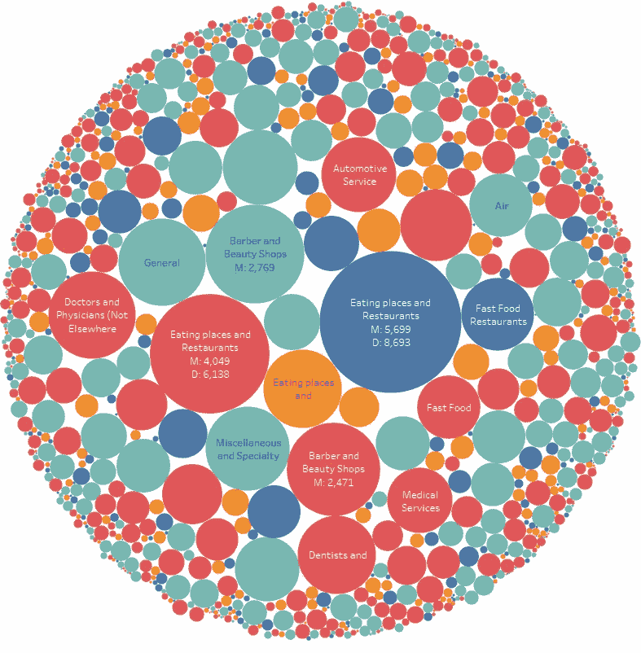
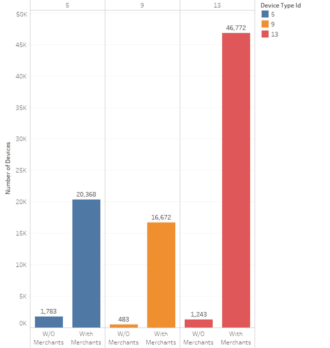

# 使用 Tableau 可视化和发展您的业务

> 原文：<https://towardsdatascience.com/visualizing-and-growing-your-business-with-tableau-2c2fd6c079bb?source=collection_archive---------17----------------------->

# 动机

目标是了解最近开始使用信用卡处理设备进行支付的商家类型，如 Square、Clover 等金融科技公司提供的信用卡处理设备。探讨他们对不同产品可能存在的顾虑类型，并展示调查结果和建议。

# **数据**

**商家**

这个数据集包含一个商家列表和关于他们的业务的信息——一家快餐店、一家牙医诊所、一家杂货店等。

**装置**

该数据集包含设备列表及其与商家的关联历史。例如，一旦设备被“供应”给商家，该商家就使用该设备。同样，当设备与商家“解除关联”时，该设备不再被商家使用，并且可以被重新供应。

**案例**

该数据集包含当商家联系呼叫中心时由客户支持创建的查询/问题列表。如果可能，此数据包括报告的问题列表以及商家和设备信息。

World of merchants

## 有多少商家，什么类型的？

数据集中有 92，985 个商家，其中 57，624 个商家在某个时间点被分配了设备，服务类别中的商家数量最多，航空公司中的商家数量最少。有许多商家类型属于不同的类别，有或没有与它们相关联的设备。使用仪表板中的交互式包装气泡图来了解商家及其相关设备(如果有)。

Merchant-Device Distribution

**商家保留设备多长时间？**

大多数商家倾向于将他们的设备保留大约 200 天。对于体育用品商店，设备与商家关联的最大天数是 269 天，而最小天数少于 0 或 1 天。也有一些设备已经与具有相同序列号的同一商家和设备进行了多次供应和解除关联。这些在交互式仪表板中用负值表示。

**客户支持会收到哪些类型的问题，针对哪些设备？**

商家已经登记了关于硬件/软件故障排除、功能、培训、账户设置以及与订单处理、账户取消和合同条款相关的其他问题的各种问题。

由于公司或公司政策、应用程序和合同条款可能存在各种账户/资金或其他一般性问题，因此即使是目前没有相关设备的商家也会提出问题或疑问。

**我们可以通过哪些方式改善商户体验？**

这是一些可以从数据可视化中推断出来的观察结果-

*   服务类的商户和设备数量最多，其次是零售业和餐饮业
*   有 35，361 个商家没有与其相关联的设备
*   与商户关联的设备类型 9 有 16，672 台，登记的案例/问题数量最少，而设备类型 13 与商户关联的设备数量最多，为 46，672 台，问题数量最多，为 157，615 个
*   最严重的问题似乎与教育/功能有关。故障排除是相辅相成的。
*   在较大的类别中，设备数量最多的服务类别平均每台设备的案例数量最少，为每台设备 3.41 个问题，而餐馆最多
*   商人数量最少的是运输业，航空、汽车和铁路是商人数量最少的几个类别
*   最常见的问题类型似乎与教育/职能有关。从更深层次的原因来看，软件功能性问题很少，请求培训和应用程序教育问题在几乎所有设备中都很突出，商家可能对培训和教育更感兴趣，而不是抱怨功能性问题
*   硬件和仪表板培训/功能和故障排除问题非常重要，而且似乎更重要，这可能会影响商家的整体体验
*   还有许多新的商家/设置案例，其中大多数都有激活码或发送电子邮件的子类型，这可能意味着激活码是通过电子邮件发送的，并且没有被正确验证或超时

**设计**

仪表板旨在通过以下部分回答上述问题

*   顶部的核心指标用于获取商家和设备数量
*   商家-设备云和分销
*   设备历史中的商家
*   问题数量和问题类型

所有图表都根据设备类型进行着色，并且可以交叉过滤，这使得在控制面板上查看特定的商家类型、设备或问题变得非常容易。为了方便起见，仪表板还包括一个针对商家类型和类别的仪表板级过滤器。所有的图表都是彩色的

下面是现场直播的 [**仪表盘**](https://public.tableau.com/views/ProductAnalysisDashboard_4/ProductAnalysisDashboard?:embed=y&:useGuest=true&:display_count=yes) 。

**建议**

*   更好的文档、视频记录或面对面培训，以帮助培训和/或教育
*   激活码可能是一个容易解决的问题
*   将功能/教育分解到自己的桶中，以识别功能问题和与教育相关的案例，这可能有助于确定各种问题
*   修复电子邮件功能，使激活码问题得到解决，这将使商家的设置过程成为一个愉快的体验
*   大多数商家使用这种设备，并在大约 150-200 天后停止使用。识别这些商家，并向这些商家提供奖励(金钱利益或增加订阅时间或企业认为合适的任何东西),并重新联系他们。
*   提供更好的客户支持，确保客户支持主管有更好的装备
*   设备 9 记录的问题相对较少。确定使该设备脱颖而出的功能，并考虑将它们集成到设备 5 和 13 中

**增加市场覆盖面的一些方法**

*   一些商家有一个关联和分离多次的设备，这使我们相信一些商家喜欢所提供的服务/设备，并愿意提供第二/第三次机会来使用它。找出他们疏远的原因，并为这些问题提供更好的解决方案
*   增加在社交媒体(SEO)上的曝光率
*   运输行业中的极少数商家让我们相信这些设备不适合糟糕的移动或蜂窝网络。瞄准航空公司、汽车、铁路等商户类型，扩大商户基础

# 反光

值得注意的是，该数据集是一个更大的真实世界数据集的一小部分，并且是一个封闭的产品分析挑战的一部分，以了解可以从数据的一个小子集中收集什么样的见解。