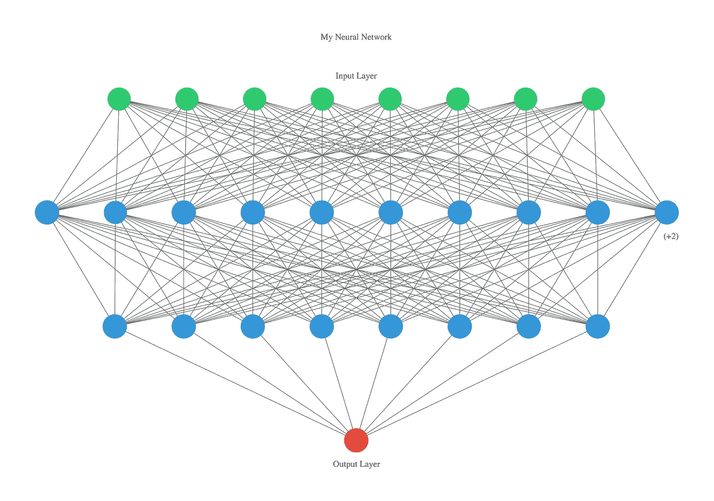

# 仅用一行代码可视化人工神经网络(ann)

> 原文：<https://towardsdatascience.com/visualizing-artificial-neural-networks-anns-with-just-one-line-of-code-b4233607209e?source=collection_archive---------2----------------------->


[ann-visualizer](https://github.com/Prodicode/ann-visualizer)

ANN Visualizer 是一个 python 库，它使我们能够仅使用一行代码来可视化人工神经网络。它用于与 [Keras](https://keras.io/) 一起工作，并利用 python 的 [graphviz](https://www.graphviz.org/) 库来创建您正在构建的神经网络的整洁且可展示的图形。

借助深度学习高级技术，您现在可以可视化整个深度学习过程，或者只是您构建的卷积神经网络。

我们将使用 keras 建立一个简单的神经网络，然后使用 ANNvisualizer 来可视化我们的神经网络。

杰森·布朗利制作了一些关于 http://machinelearningmastery.com/的伟大作品。他的一个例子是使用 Keras 构建简单的神经网络。

# **安装**

这个演示需要 3 个库

*   克拉斯
*   ann 可视化工具
*   graphviz

您可以使用以下命令安装该库:

```
pip3 install keraspip3 install ann_visualizerpip install graphviz
```

创建一个名为 **index.py** 的新文件，将代码复制并粘贴到文件中

要生成可视化，您需要遵循以下命令结构:

## ann_viz(model，view=True，filename="network.gv "，title="MyNeural Network ")

*   `model`–您的 Keras 顺序模型
*   `view`–如果设置为真，则在命令执行后打开图形预览
*   `filename`–保存图表的位置。(它保存在 a '中。gv '文件格式)
*   `title`–可视化人工神经网络的标题

您已经看到了如何在 Keras 中轻松创建您的第一个神经网络模型。

让我们把它结合成这段代码。

使用以下方式运行 **index.py** :

```
python3 index.py
```

以下是最终可视化效果的示例:



很美，不是吗？你可以在这里浏览这个 GitHub 库[，看看一个模型是如何被创建和可视化的演示。](https://github.com/Prodicode/ann-visualizer)

这在很多方面都很有用。当您想用一行代码解释该模型的神经网络时，它可用于教学目的。

链接到完整的代码

[](https://github.com/shah0150/Artificial-Neural-Networks-Visualizer) [## shah 0150/人工神经网络可视化器

### 通过在 GitHub 上创建一个帐户，为人工神经网络可视化开发做出贡献。

github.com](https://github.com/shah0150/Artificial-Neural-Networks-Visualizer) 

# 参考资料:

[](https://github.com/Prodicode/ann-visualizer) [## Prodicode/ann-visualizer

### 一个用于可视化人工神经网络(ann)的 python 库

github.com](https://github.com/Prodicode/ann-visualizer) [](https://machinelearningmastery.com/tutorial-first-neural-network-python-keras/) [## 用 Keras 一步步开发你的第一个神经网络

### Keras 是一个强大易用的 Python 库，用于开发和评估深度学习模型。它包裹着…

machinelearningmastery.com](https://machinelearningmastery.com/tutorial-first-neural-network-python-keras/) 

这是一个值得一看的图书馆。


感谢阅读！😊如果你喜欢它，测试你能击中多少次👏五秒钟后。这对你的手指来说是很好的有氧运动，并且会帮助其他人看到这个故事。