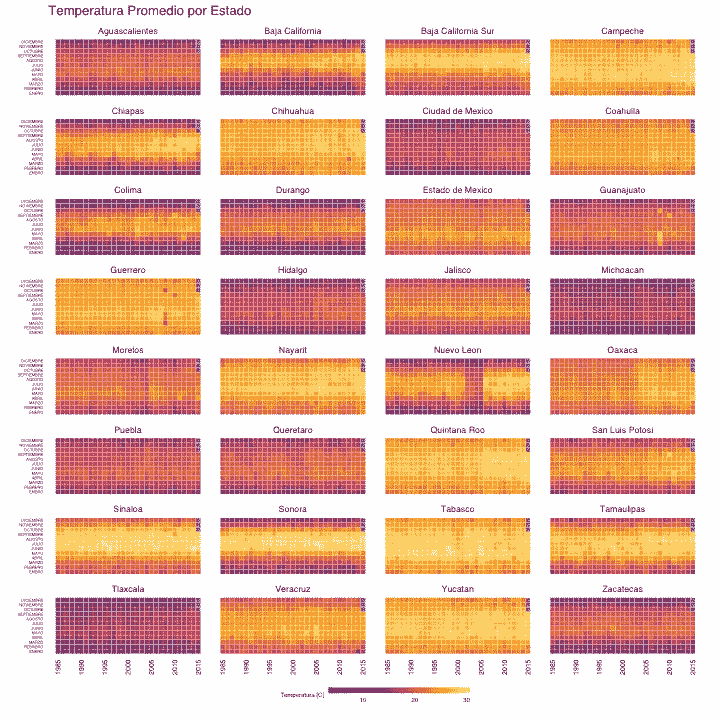
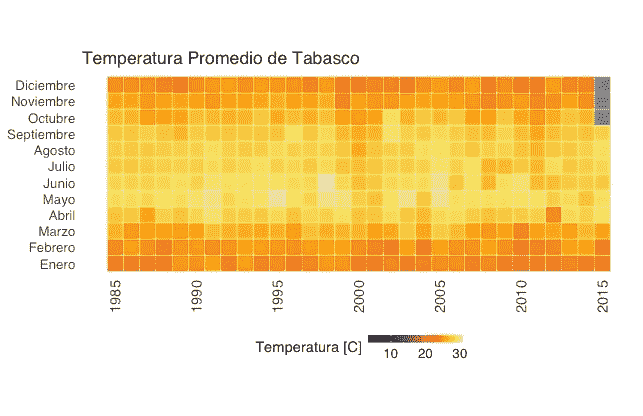
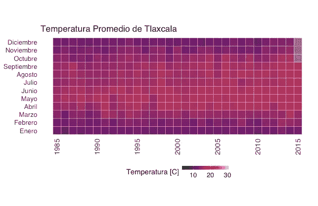
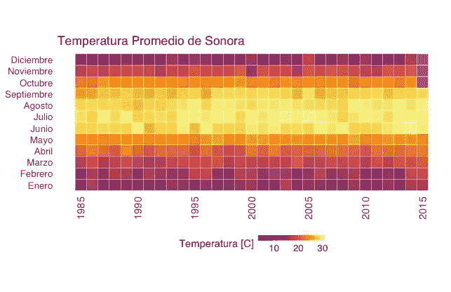
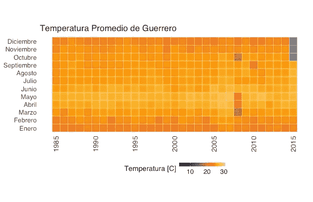
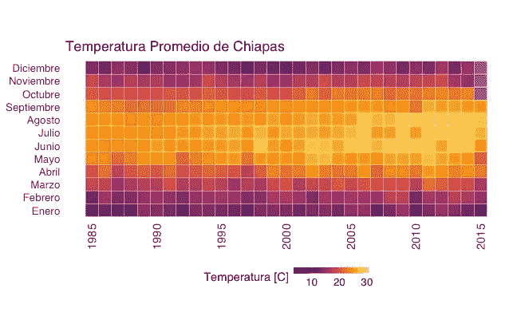
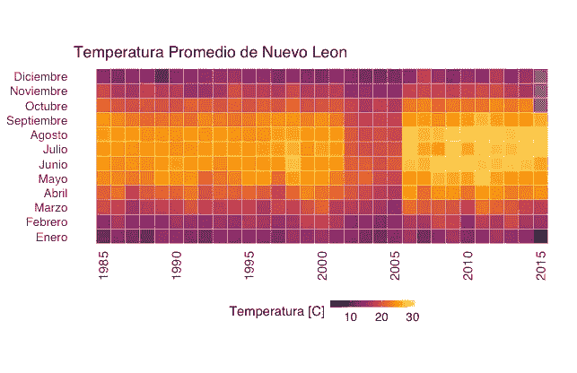

# 可视化墨西哥的平均温度

> 原文：<https://towardsdatascience.com/visualizing-average-temperature-in-mexico-313eef90f4f4?source=collection_archive---------1----------------------->

在这个分析中，我研究了自 1985 年以来墨西哥 32 个州的平均温度。

墨西哥是世界上气候系统最多样化的国家之一。其中一个因素是该国的地理位置，位于北回归线穿过的地区。

> “墨西哥呈现出各种各样的气候；北部干旱，南部/东南部湿热和半湿润，高地理区域气候寒冷或温暖。”
> 
> 国家统计和地理研究所( [INEGI](http://www.inegi.org.mx/geo/contenidos/recnat/clima/)

出于同样的原因，有可能在离热气候几百公里的地方发现冷气候。此外，墨西哥共和国的一些州可能表现出很大的气候可变性。

> 最值得注意的变化是**杜兰戈**州的气候，这里的气温是全国最低的，有时达到零下 26 度，最高的是墨西哥的沙漠**下加利福尼亚州**有时超过 50 度
> 
> 维基百科:[墨西哥](https://es.wikipedia.org/wiki/M%C3%A9xico#Clima)

下面，我对从 1985 年到 2015 年底，通过常规和自动气象站测得的各州月平均气温进行了探索性分析。分析所需的所有代码都是用 R 开发的，可以在这个 GitHub [repo](https://github.com/mexicoendatos/mexicoendatos.github.io) 中通过开源 GNU GPLv3 许可获得。

温度数据由墨西哥国家委员会(CONAGUA)提供，可在墨西哥政府的[公开数据](https://datos.gob.mx/busca/dataset/temperatura-promedio-excel)页面上获得。这些都是直接从网站上阅读，以促进分析的可重复性。随后，对数据进行预处理，以便能够在 r 中正确处理它们。要考虑的变量有:联邦实体、年、月和相应的温度。

首先，我绘制了每个状态的值的热图。我得到的图表显示了州一级的一些有趣的模式。最有趣的总结如下。

Average temperature from 1985 to 2015 in each of the 32 states of Mexico.

# 塔巴斯科:最热的州

最热的州是塔巴斯科州，30 年平均气温 26.84℃。

# 特拉斯卡拉:最冷的州

最冷的州是特拉斯卡拉州，30 年平均气温 14.44℃。

# 索诺拉:最易变的州

气温变化最大的州是索诺拉州，年平均气温变化率为 6.0964 摄氏度。

# 格雷罗州:最稳定的州

温度最稳定的州是格雷罗州，年平均温度变化率为 1.339 摄氏度。

# 荣誉奖 1:恰帕斯州

恰帕斯州是近年来气温上升较为明显的州之一。1985 年，年平均气温为 19.24℃，到 2015 年，年平均气温上升到 21.21℃。

# 荣誉奖 2:新莱昂

新莱昂州从 2002 年到 2005 年呈现出一种有趣的模式，因为该州的温度与前几年相比急剧下降。从 2006 年起，气温有所上升，平均而言，仍高于 2002 年之前的气温。

*原载于 2016 年 8 月 5 日*[*mexicoendatos . github . io*](https://mexicoendatos.github.io/blog/2016/08/05/Temperatura-Promedio-01/)*。*